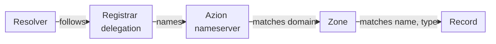

import DocButton from '~/components/webkit/DocButton.vue';
import DocCardGroup from '@aziontech/webkit/doc-card-group'
import DocCard from '@aziontech/webkit/doc-card'

Every domain on the internet relies on an authoritative [DNS](https://www.azion.com/en/learning/dns/what-is-dns/) service: the nameservers that hold the domain's records and give the final answer about them. A browser or a mail server does not ask those nameservers itself. Its resolver, the DNS server that performs lookups for it, follows the domain's delegation from its registry and asks one of them. With a hosted service, you write the records, and the provider runs the nameservers that answer.

**Edge DNS** hosts a zone for each of your domains and answers queries for the zone's records from Azion's distributed infrastructure. Three nameservers, `ns1.aziondns.net`, `ns2.aziondns.com`, and `ns3.aziondns.org`, serve every zone, and a domain reaches them once its registrar delegates it to all three. Edge DNS is authoritative only, not a resolver, so your users keep their own resolvers while you manage records instead of nameserver software. Use Edge DNS to point domains and subdomains at your servers, receive mail, verify ownership, restrict certificate issuers, or share traffic by weight.

<DocButton href="/en/documentation/platform/edge-dns/quickstart/" label="Quickstart" size="medium" />
<DocButton href="/en/documentation/platform/edge-dns/guides/" label="Edge DNS guides" kind="secondary" size="medium" />

---

## Zones and records

A zone holds one domain, such as `example.com`, and every record that Edge DNS answers for it. A record maps one name inside the zone to a type and one or more values. This request body, sent as a `POST` to `/v4/workspace/dns/zones/<zone-id>/records`, adds a record that answers `192.0.2.1` for `www.example.com`:

```json
{
  "name": "www",
  "type": "A",
  "rdata": ["192.0.2.1"],
  "ttl": 3600
}
```

- `name` is written relative to the zone. `www` answers for `www.example.com`, `@` names the apex `example.com`, and a `*` label makes a wildcard.
- `type` is one of the 11 record types Edge DNS hosts. `A` maps the name to an IPv4 address.
- `rdata` carries the answers, which Azion Console calls **Value**. An A record holds up to 10 addresses.
- `ttl` sets how many seconds a resolver may cache the answer. A record that sends no TTL gets `3600`.

The Console's **Create Record** drawer and `azion create dns-record` take the same four fields. A record carries what one line of a standard zone file carries, so if you have edited a zone file, you know the record model. Every field and its default is on [Zones and records](/en/documentation/platform/edge-dns/zones-and-records/), and the section's vocabulary is on the [Glossary](/en/documentation/platform/edge-dns/glossary/). To create a zone in any interface, refer to [Create, edit, or delete a zone](/en/documentation/guides/application-security/dns/edge-dns-configure-main-settings/).

---

## Resolution path

Creating a zone does not make the internet ask Azion about the domain. Queries reach a zone only through the delegation that the domain's registrar publishes.



1. At the registrar, you delegate the domain to all three Edge DNS nameservers. Until the delegation is published, public resolvers find no path to Azion.
2. A resolver that looks up `www.example.com` follows the delegation and sends the query to one of the three nameservers.
3. The nameserver selects the zone whose domain matches the query, then the record whose name and type match.
4. The nameserver returns the record's values as an authoritative answer, and the resolver caches that answer for the record's TTL.

You can build and check a zone before step 1. A query sent straight to `ns1.aziondns.net` returns what the zone answers, while public resolvers still follow the domain's current delegation. To send that query, refer to [Query a zone with dig](/en/documentation/guides/application-security/dns/run-the-dig-command/). For how caching delays a change, how weighted and ANAME records answer, and how DNSSEC signs a zone, refer to [How Edge DNS works](/en/documentation/platform/edge-dns/how-it-works/).

---

## Scope and limits

- **Record types**: a zone holds 11 types: A, AAAA, ANAME, CAA, CNAME, DS, MX, NS, PTR, SRV, and TXT. The API refuses any other type, such as `SOA`. Each type, its value format, and its RFC are on [Record types](/en/documentation/platform/edge-dns/record-types/).
- **Policies**: a *Simple* record answers with all of its values. *Weighted* records share one name and type, and each is answered in proportion to its weight, from 0 to 255. Refer to [Record policies](/en/documentation/platform/edge-dns/how-it-works/#record-policies).
- **Apex**: a CNAME is refused at `@`. An ANAME record points the apex at a hostname under `azioncdn.net`, `azionedge.net`, or `azionedge.com`, with a TTL of `20`. Refer to [Point an apex domain with ANAME](/en/documentation/guides/application-security/dns/access-root-domain/).
- **DNSSEC**: you turn DNSSEC on for a zone yourself, in the Console, the CLI, or the API. Azion signs the zone and generates the DS values you add at your registrar. Refer to [DNSSEC](/en/documentation/platform/edge-dns/dnssec/).
- **Nameservers**: the same three nameservers serve every zone, and they are read-only. Delegate the domain to all three. Refer to [Nameservers and SOA](/en/documentation/platform/edge-dns/zones-and-records/#nameservers-and-soa).
- **Propagation**: a saved record needs no deployment step, and a new name that nobody queried before it existed answers within seconds. A change to an existing record can take a few minutes to reach every nameserver. A name queried before it existed is answered `NXDOMAIN` for up to one hour, the SOA minimum. Refer to [Caching and propagation](/en/documentation/platform/edge-dns/how-it-works/#caching-and-propagation) and [Best practices for Edge DNS](/en/documentation/platform/edge-dns/best-practices/).
- **Interfaces**: you manage zones and records in [Azion Console](https://console.azion.com/), with the [Azion CLI](/en/documentation/devtools/cli/), through the [Azion API](https://api.azion.com/), and with the [Azion Terraform provider](/en/documentation/devtools/terraform/dns/).
- **Observability**: the **Total Queries** chart of the [Real-Time Metrics Edge DNS dashboard](/en/documentation/platform/real-time-metrics/secure-dashboards/#edge-dns) counts the queries your zones receive. [Real-Time Events](/en/documentation/platform/real-time-events/data-sources/#edge-dns) keeps one entry per query, and the [GraphQL API](/en/documentation/devtools/graphql/features/#datasets) returns the data aggregated or raw.
- **Limits**: a zone name takes 1 to 50 characters, and a TXT value up to 1,000. An A, AAAA, or MX record holds up to 10 values. Every bound is on [Edge DNS limits](/en/documentation/platform/edge-dns/limits/).
- **Billing**: Edge DNS is billed on two metrics: Zones, the daily average of active zones in a monthly cycle, and Queries, the DNS queries it processes. The amounts each plan includes are on [Included usage per plan](/en/documentation/platform/edge-dns/limits/#included-usage-per-plan), and the rates on [Pricing](/en/documentation/fundamentals/pricing/#edge-dns).
- **Security**: Azion's [DDoS Protection](/en/documentation/platform/workloads/ddos-protection/ddos-mitigation/) also protects the DNS service, and the attacks it mitigates include DNS floods, even of well-formed queries.
- **Terms**: the domain stays registered at your registrar, where you change its nameservers and renew it, and you keep its zones and records correct. Azion may remove zones that are not in use. Refer to the [Terms of Service](/en/documentation/agreements/tos/).

When a zone does not answer as expected, refer to [Troubleshoot Edge DNS](/en/documentation/platform/edge-dns/troubleshooting/).

---

## Next steps

<DocCardGroup cols={2}>
  <DocCard title="Quickstart" href="/en/documentation/platform/edge-dns/quickstart/" label="Host a zone and query its first record." />
  <DocCard title="How Edge DNS works" href="/en/documentation/platform/edge-dns/how-it-works/" label="Follow a query, and see why a change takes time to answer." />
  <DocCard title="Migrate nameservers to Azion" href="/en/documentation/guides/platform/migration/migrate-ns-to-azion/" label="Move a domain's DNS from another provider." />
  <DocCard title="Edge DNS guides" href="/en/documentation/platform/edge-dns/guides/" label="Complete a task, such as adding MX, TXT, or CAA records." />
</DocCardGroup>
