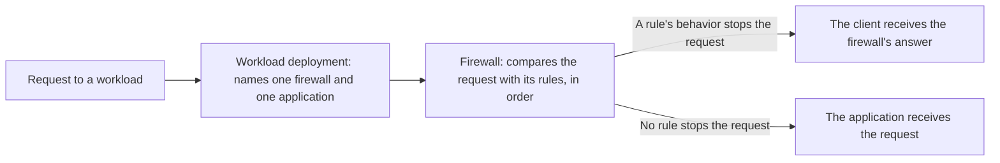

import DocButton from '~/components/webkit/DocButton.vue'
import DocCardGroup from '@aziontech/webkit/doc-card-group'
import DocCard from '@aziontech/webkit/doc-card'

A firewall for web traffic is a checkpoint between the clients on the internet and an application. It reads each request before the application does: the address it comes from, the path it asks for, and the headers it sends. It compares what it reads with conditions you write, and a request that meets one receives the action attached to it, such as a refusal. Every other request reaches the application unchanged, so the application never handles the traffic the checkpoint refuses.

**Firewall** is the Platform Resource that runs that checkpoint on Azion's distributed infrastructure, close to the client, in front of each [workload](/en/documentation/platform/workloads/) that binds it. A firewall holds an ordered list of rules, and a request that a rule stops never reaches your [application](/en/documentation/platform/applications/) or its origin. Use Firewall to deny a path, block addresses or countries, rate-limit a client, refuse requests that carry an attack, or tell scripts from people.

<DocButton href="/en/documentation/platform/firewall/quickstart/" label="Quickstart" size="medium" />
<DocButton href="/en/documentation/platform/firewall/rules-engine/" label="Firewall reference" kind="secondary" size="medium" />

---

## Rule structure

A firewall acts through its rules. Each rule pairs criteria, which select requests, with behaviors, which act on the requests selected. This rule denies every request whose path starts with `/deny-test`, sent as the body of `POST /v4/workspace/firewalls/<firewall-id>/request_rules`:

```json
{
  "name": "Deny the test path",
  "active": true,
  "criteria": [
    [
      {
        "variable": "${request_uri}",
        "conditional": "if",
        "operator": "starts_with",
        "argument": "/deny-test"
      }
    ]
  ],
  "behaviors": [
    { "type": "deny" }
  ]
}
```

- `criteria` holds blocks of conditions. The first criterion of a block opens with `if`, and each next one joins it with `and` or `or`. Here, `${request_uri}` with `starts_with` matches `/deny-test` and every path that begins with it, such as `/deny-test/page`.
- `behaviors` lists what the rule does to a request it matches. `deny` answers `403` with Azion's default error page, and no later rule runs for that request.
- `name` and `active` are the rule's own fields. The API adds `order`, the rule's position in the firewall's list, in the order the rules are created.
- Azion Console builds the same rule in the firewall's **Rules Engine** tab, from _Request Uri_, _starts with_, and _Deny (403 Forbidden)_.

If you have written firewall rules as a condition and an action, the model transfers: criteria are the condition, and behaviors are the action.

---

## Request path

Creating a firewall protects nothing. A firewall carries no domain of its own: it inspects the requests of each workload whose deployment names it, and no request until one does.



1. A workload answers on its domain, and its deployment names one firewall and one application. In Azion Console, the binding is the **Firewall** field of **Deployment Settings**. The API carries it as `strategy.attributes.firewall`, and `azion create workload-deployment` takes it as `--firewall-id`.
2. Each request to the workload reaches the firewall before the application.
3. The firewall compares the criteria of each rule with the request, in order. A rule whose criteria do not match runs nothing.
4. A rule whose criteria match runs its behaviors. A behavior that stops the request, such as a deny, answers the client, and no later rule runs.
5. A request that no rule stops reaches the application, which never sees a request that a rule stopped.

One firewall can serve the deployments of several workloads, and a change to its rules reaches every one of them. No propagation time is guaranteed. A new rule reaches traffic 6 min 29 s to 9 min 18 s after it is saved. A workload newly bound to a firewall can take several minutes to enforce its first rule. Until a change settles, answers alternate between the previous state and the new one, so send the request again until it answers as expected. For the rule order, what each behavior returns, and every propagation time, refer to [How Firewall works](/en/documentation/platform/firewall/how-it-works/).

---

## Resources

A firewall can run three Products, and each one acts only on the requests that a rule hands it.

### WAF

Web Application Firewall (WAF) is the [web application firewall](https://www.azion.com/en/learning/websec/what-is-web-application-firewall/) a firewall runs: at layer 7, the application layer, it scores each request that a _Set WAF_ behavior hands it against eight threat families. Turn it on to refuse requests that carry threats of the [OWASP Top 10](https://www.azion.com/en/learning/websec/what-is-the-owasp-top-10-list-of-web-application-security-threats/) and others, such as SQL injection, cross-site scripting, and remote file inclusion. WAF is off in a new firewall, and you turn it on in **Main Settings** › **Modules**.

For how WAF scores a request and the fields that tune it, refer to [Scoring and modes](/en/documentation/platform/firewall/waf/scoring-and-modes/), [Rule sets](/en/documentation/platform/firewall/waf/rules-set/) and [Exceptions](/en/documentation/platform/firewall/waf/custom-allowed-rules/), and to refuse your first request with WAF, refer to the [WAF quickstart](/en/documentation/platform/firewall/waf/quickstart/).

### Network Shield

Network Shield adds the _Network_ criterion, `${network}` in the API, which matches the client address of a request against a list of IP addresses and CIDR ranges, Autonomous System Numbers (ASNs), or countries. Use it to block known-bad addresses, restrict access by country, allow only your own networks, rate-limit a set of clients, or block Tor exit nodes. Network Shield is on in a new firewall.

For how a list matches a client address and the list types it takes, refer to [List matching](/en/documentation/platform/firewall/network-shield/list-matching/) and [Network Lists](/en/documentation/platform/firewall/network-shield/network-lists/), and to deny your own address on one test path, refer to the [Network Shield quickstart](/en/documentation/platform/firewall/network-shield/quickstart/).

### Bot Manager

Bot Manager scores each request that a firewall rule hands it for signs of automation, and runs the action you configure when the score reaches your threshold. Turn it on when automation such as credential stuffing, vulnerability scanning, inventory scraping, or checkout abuse reaches an application that also serves people. Bot Manager has no switch in **Modules**: it runs as a function instance that a _Run Function_ behavior invokes, so the firewall needs its **Functions** switch on.

For how Bot Manager builds a score, its configuration, and the report log, refer to [Bot scoring](/en/documentation/platform/firewall/bot-manager/bot-scoring/), [Arguments](/en/documentation/platform/firewall/bot-manager/arguments/), [Logs](/en/documentation/platform/firewall/bot-manager/logs/), and [Bot Manager Lite](/en/documentation/platform/firewall/bot-manager/bot-manager-lite/), and to score your first request, refer to the [Bot Manager quickstart](/en/documentation/platform/firewall/bot-manager/quickstart/).

---

## Scope and limits

- **Built-in rules**: with no Product turned on, a rule matches on _Host_, _Request Uri_, _Scheme_, _Ssl Verification Status_, and _Client Certificate Validation_. It can deny, drop, rate-limit, or answer the request with a custom response. For every criterion, operator, and behavior, refer to [Rules Engine for Firewall](/en/documentation/platform/firewall/rules-engine/#criteria).
- **Responses**: _Deny (403 Forbidden)_ answers `403` with Azion's default error page, and _Drop (Close Without Response)_ sends no HTTP response. _Set Rate Limit_ releases requests at its configured rate and answers `429` only to simultaneous requests beyond its burst, and a WAF block answers `400`.
- **Functions**: a firewall runs JavaScript, your own protection logic included, through a [function instance](/en/documentation/platform/firewall/functions-instances/) that a _Run Function_ behavior invokes. The function declares the `firewall` execution environment, and it can deny, drop, or answer the request, or add request and response headers. You write it in [Functions](/en/documentation/platform/functions/) or install it from Azion Marketplace. **Functions** is on in a firewall created through the API, the CLI, or the **Create Firewall** page. For the event and its methods, refer to [Functions for Firewall](/en/documentation/platform/firewall/functions/), and for working code, refer to [Functions on a firewall](/en/documentation/platform/functions/general-firewall-example/).
- **Marketplace**: [Radware Bot Manager](/en/documentation/guides/application-development/integrations/radware-bot-manager/) and [DataDome Bot Protection](/en/documentation/guides/application-development/integrations/datadome-bot-protection/) install from Azion Marketplace as firewall functions, under their own subscriptions.
- **DDoS protection**: [DDoS Protection](/en/documentation/platform/workloads/#ddos-protection) mitigates denial-of-service (DoS) and distributed denial-of-service (DDoS) attacks in every account, with no configuration. The firewall's **DDoS Protection Unmetered** switch carries the tag **Automatically enabled in all accounts** and cannot be turned off.
- **Workloads**: a workload's deployment names one firewall, and one firewall can serve several workloads. A rule belongs to the firewall it was created on. **Clone**, a row action of the **Firewalls** list in Azion Console, starts a firewall as a copy of another, its function instances and rules included. For when to share one firewall, refer to [Firewall best practices](/en/documentation/platform/firewall/best-practices/#share-one-firewall-among-workloads-with-the-same-security-policy).
- **Interfaces**: you create and manage firewalls on the **Firewalls** page of [Azion Console](https://console.azion.com), and through the [Azion API](https://api.azion.com/) at `/v4/workspace/firewalls`. [Azion CLI](/en/documentation/devtools/cli/) manages them with commands such as `azion create firewall` and `azion create firewall-rule`. `azion.config.js` declares a firewall and its rules for the Azion CLI to create, as [Bind a rule set in azion.config.js](/en/documentation/guides/application-security/firewall-and-waf/config-file-binding/) shows. Installing a function from Azion Marketplace runs in Azion Console.
- **Observability**: no response header names the firewall or the rule that decided. Every response carries an `x-azion-request-id` header, which Azion's default error page repeats. With the firewall's **Debug Rules** setting on, [Real-Time Events](/en/documentation/platform/real-time-events/) and [Data Stream](/en/documentation/platform/data-stream/) show the rules a request ran, in the `$traceback` field. The setting is off by default.
- **Limits**: a rule carries 1 to 5 blocks of 1 to 10 criteria each, and a function instance's arguments hold up to 100,000 bytes. For every bound, the answer past it, and the bounds of WAF, Network Shield, and Bot Manager, refer to [Firewall limits](/en/documentation/platform/firewall/limits/).
- **Billing**: Firewall is billed on requests and on rules. Each plan includes an amount of both, such as 10 rules per firewall on Hobby and 20 on Pro, and usage past it is billed. For the rates, refer to [Pricing](/en/documentation/fundamentals/pricing/#firewall).
- **Terms**: the [Firewall glossary](/en/documentation/platform/firewall/glossary/) defines the words the Firewall pages give a specific meaning, such as criterion, behavior, rule set, network list, and threshold.

---

## Next steps

<DocCardGroup cols={2}>
  <DocCard title="Quickstart" href="/en/documentation/platform/firewall/quickstart/" label="Deny your first request on one path." />
  <DocCard title="How it works" href="/en/documentation/platform/firewall/how-it-works/" label="Follow a request through a firewall, and see where each Product acts on it." />
  <DocCard title="Rules Engine for Firewall" href="/en/documentation/platform/firewall/rules-engine/" label="Look up a criterion, an operator, or a behavior." />
  <DocCard title="Guides and tutorials" href="/en/documentation/platform/firewall/guides/" label="Complete a specific task, from a country block to a WAF exception." />
  <DocCard title="Limits" href="/en/documentation/platform/firewall/limits/" label="Look up a bound, the answer past it, or what a plan includes." />
  <DocCard title="Troubleshooting" href="/en/documentation/platform/firewall/troubleshooting/" label="Find the cause when a rule does not act, or refuses a request it should not." />
</DocCardGroup>
