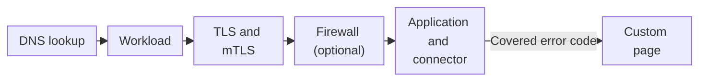

import DocButton from '~/components/webkit/DocButton.vue'
import DocCardGroup from '@aziontech/webkit/doc-card-group'
import DocCard from '@aziontech/webkit/doc-card'

The entry point of a website is the configuration that answers its hostnames, the names such as `www.example.com` that clients ask for. A DNS lookup sends the client to it, and the entry point terminates the Transport Layer Security (TLS) connection, the encrypted channel in which the server proves with a certificate that it holds the hostname. With mutual TLS (mTLS), the client proves its identity with a certificate too. The entry point then decides which code answers the request, so the hostnames and certificates change without any change to that code.

**Workloads** is the Platform Resource that runs that entry point on Azion's distributed infrastructure. A workload holds a workload domain that Azion generates, the domains you add, the TLS and mTLS settings, the ports and HTTP versions it accepts, and the infrastructure it runs on. Its deployment names the [application](/en/documentation/platform/applications/) that answers, and optionally the [firewall](/en/documentation/platform/firewall/) that inspects requests first and the custom page set that replaces error responses. Use Workloads to put an application on your own domain, serve it over HTTPS with your certificate or one Azion requests for you, require client certificates, or try a configuration on staging before production.

<DocButton href="/en/documentation/platform/workloads/quickstart/" label="Quickstart" size="medium" />
<DocButton href="/en/documentation/platform/workloads/settings/" label="Workload settings" kind="secondary" size="medium" />

---

## Workload structure

A workload is one JSON object. `azion describe workload --workload-id <workload-id> --format json` returns a new workload, created with a name and every default, as the API stores it:

```json
{
 "active": true,
 "created_at": "2026-01-01T12:00:00.000000Z",
 "domains": [],
 "id": <workload-id>,
 "infrastructure": 1,
 "last_editor": "<your-email>",
 "last_modified": "2026-01-01T12:00:00.000000Z",
 "mtls": {
  "config": {
   "certificate": null,
   "verification": null
  },
  "enabled": false
 },
 "name": "my-workload",
 "product_version": "1.0",
 "protocols": {
  "http": {
   "http_ports": [
    80
   ],
   "https_ports": [
    443
   ],
   "quic_ports": [
    443
   ],
   "versions": [
    "http1",
    "http2",
    "http3"
   ]
  }
 },
 "tls": {
  "certificate": null,
  "ciphers": 7,
  "minimum_version": "tls_1_3"
 },
 "workload_domain": "<id>.map.azionedge.net",
 "workload_domain_allow_access": true
}
```

- `workload_domain` is the read-only hostname Azion generates at creation. `domains` holds your own hostnames, and `workload_domain_allow_access` decides whether clients still reach the workload domain.
- `infrastructure` is `1` for production and `2` for staging, and it sets the suffix of the workload domain.
- `protocols.http` lists the HTTP versions and the ports the workload accepts. `tls` names the certificate, where `null` selects the Azion SAN certificate, along with the cipher suite and the minimum TLS version.
- `mtls` is off in a new workload. Turned on, it names the Trusted CA certificate that client certificates are checked against, and a verification mode.

The workload holds no application. Its deployment, a sub-object at `/v4/workspace/workloads/{workload_id}/deployments`, names the application, the firewall, and the custom page set in the `strategy.attributes` keys `application`, `firewall`, and `custom_page`. If you know a property from another platform, the workload and its deployment together play that role.

---

## Request path

Creating a workload serves nothing until its deployment names an application. Until the deployment propagates, the workload domain answers `404` with Azion's HTML error page.



1. The client looks up the hostname. A custom domain points at the workload domain with a CNAME record, so DNS returns an address of Azion's distributed infrastructure.
2. The workload that lists the hostname takes the request.
3. The workload completes the TLS handshake with its certificate, its minimum TLS version, and its cipher suite. With mTLS on, it also checks the client certificate.
4. When the deployment names a firewall, the firewall runs its rules on the request before the application does.
5. The application in the deployment handles the request and fetches content through its connector.
6. When the connector answers with an error status code that the deployment's custom page set covers, the client receives the custom page in place of that response.

A workload holds one deployment, so every hostname of the workload reaches the same application, firewall, and custom page set. For each step of the path and what it costs, refer to [How Workloads works](/en/documentation/platform/workloads/how-it-works/). For a domain that answers `404` or a handshake that fails, refer to [Troubleshoot Workloads](/en/documentation/platform/workloads/troubleshooting/).

---

## Resources

Certificate Manager and Custom Pages act on a workload once you bind a certificate to it or assign a custom page set in its deployment. DDoS Protection acts on every workload with nothing to bind.

### Certificate Manager

Certificate Manager stores the certificates a workload uses for TLS: server certificates you upload with their private key, and Trusted CA certificates that verify client certificates for mTLS. It also requests Let's Encrypt certificates for the workload's domains and renews them for you, stores certificate revocation lists (CRLs), and creates certificate signing requests (CSRs). Turn to it when a domain of your own must serve HTTPS, since the Azion SAN certificate covers only the workload domain and the Azion Custom Domain.

For the certificate types, their fields, and their statuses, refer to [Certificates](/en/documentation/platform/workloads/certificate-manager/certificates/), for how Azion issues and renews a Let's Encrypt certificate, refer to [Issuance and renewal](/en/documentation/platform/workloads/certificate-manager/issuance-and-renewal/), and to bind your first certificate to a workload, refer to the [Certificate Manager quickstart](/en/documentation/platform/workloads/certificate-manager/quickstart/).

### Custom Pages

Custom Pages replaces the error response a connector returns with a page of your own, one page per 4xx or 5xx status code. A custom page set groups those pages, and each page fetches its content from a [connector](/en/documentation/platform/connectors/), keeps it in cache for its own time, and answers with the status code you set. The client receives the page in place, with no redirect. Turn it on when visitors must see your own page instead of the origin's error page, and assign the set in the workload's deployment.

For the fields of a set and its pages, and the status codes a page can replace, refer to [Custom page settings](/en/documentation/platform/workloads/custom-pages/settings/), and to replace your first `404`, refer to the [Custom Pages quickstart](/en/documentation/platform/workloads/custom-pages/quickstart/).

### DDoS Protection

A denial-of-service (DoS) attack floods a service with traffic until legitimate requests cannot get through, and a distributed (DDoS) attack sends that traffic from many machines at once. DDoS Protection is a Platform feature, always on: the Platform mitigates DDoS attacks on every workload, at the network, transport, presentation, and application layers, with nothing to create and nothing to configure. For detection and mitigation targeted at a specific attack, you write custom rules on the firewall the deployment names.

For the attack types and the mitigation techniques, refer to [Attack mitigation](/en/documentation/platform/workloads/ddos-protection/ddos-mitigation/), and for its bounds, refer to [Workloads limits](/en/documentation/platform/workloads/limits/#ddos-protection).

---

## Scope and limits

- **Domains**: a workload answers on its workload domain, `<id>.map.azionedge.net` on production and `<id>.preview.azionedge.net` on staging, as soon as its deployment propagates, before you own any domain. You add domains of your own, each a full hostname with no wildcard, and point each one at the workload domain with a CNAME record. A production workload can also answer on one free `azion.app` hostname, which Azion Console calls **Azion Custom Domain**, at no additional cost. The **Workload Domain Allow Access** switch closes the workload domain once your own domains serve traffic. For every rule a hostname follows, refer to [Workload settings](/en/documentation/platform/workloads/settings/#domains), and for the DNS records, refer to [Point a domain to a workload](/en/documentation/guides/platform/migration/point-domain-to-azion/).
- **DNS**: a workload holds no DNS records. A domain's zone stays at your DNS provider, or in [Edge DNS](/en/documentation/platform/edge-dns/), and the workload answers the hostnames it lists wherever their zone is hosted.
- **Infrastructure**: the **Infrastructure** control runs a workload on the Production Network, for global availability, or on the Staging Network, for testing with limited propagation. The choice is fixed at creation, and a staging workload takes no custom domain. For how to try a change on staging first, refer to [Workloads best practices](/en/documentation/platform/workloads/best-practices/).
- **Protocols**: a workload accepts HTTP/1.1, HTTP/2, and HTTP/3 over QUIC, which needs HTTPS on and both earlier versions listed. HTTP runs on up to four ports, from `80`, `8008`, `8080`, and `8880`, with `80` by default, and HTTPS on up to twelve listed ports, with `443` by default. For the ports, refer to [Workload settings](/en/documentation/platform/workloads/settings/#protocols-and-ports).
- **TLS**: the minimum TLS version ranges from TLS 1.0 to TLS 1.3, the default, and TLS 1.0 and 1.1 are deprecated. Eight cipher suites are available, with suite `7` by default. The Azion SAN certificate covers the workload domain and the `azion.app` hostname, and a domain of your own needs a server certificate from [Certificate Manager](/en/documentation/platform/workloads/#certificate-manager). Azion blocks TLS renegotiation and TLS resumption by default. These settings secure the connection from the client to Azion, while the connection to your origin is set on the connector. For the fields and the ciphers of each suite, refer to [Workload settings](/en/documentation/platform/workloads/settings/#tls).
- **mTLS**: a workload checks client certificates against a Trusted CA certificate, with up to 100 CRLs, in `enforce` or `permissive` mode, on HTTPS connections only. Azion activates mTLS per account, so contact the Sales team to turn it on. For both modes and every requirement, refer to [mTLS](/en/documentation/platform/workloads/mtls/).
- **Deployment**: a workload holds one deployment, which names the application, required, and a firewall and a custom page set, both optional. Azion CLI creates a deployment but cannot update or delete one, so change it in Azion Console or with the API. For its fields, refer to [Workload settings](/en/documentation/platform/workloads/settings/#deployment).
- **Propagation**: a saved change to a workload or its deployment takes several minutes to reach all of Azion's distributed infrastructure, with no guaranteed duration. Meanwhile, requests can receive the old or the new configuration. For more information, refer to [Propagation](/en/documentation/platform/workloads/how-it-works/#propagation).
- **Interfaces**: you create and manage workloads on the **Workloads** page of [Azion Console](https://console.azion.com/), through the [Azion API](https://api.azion.com/) at `/v4/workspace/workloads`, with [Azion CLI](/en/documentation/devtools/cli/) commands such as `azion create workload` and `azion create workload-deployment`, and with the `azion_workload` and `azion_workload_deployment` resources of [Terraform](/en/documentation/devtools/terraform/workloads/).
- **API v4**: on API v3, one Domains object carried the role of a workload, and an application's Main Settings held the protocol and TLS settings. On API v4, the workload and its deployment replace them. For the mapping between the two models, refer to [API v4 Migration](/en/documentation/fundamentals/api-v4-migration/), and for an account that still runs API v3, refer to [Domains](/en/documentation/platform/workloads/domains/).
- **Observability**: Azion's error page carries an `x-azion-request-id` header that identifies the request. [Data Stream](/en/documentation/platform/data-stream/) collects the events of the workloads you associate with a stream, as [Associate workloads with a stream](/en/documentation/guides/platform/observability/data-stream-associate-workloads/) shows.
- **Limits**: a workload `name` takes up to 100 characters, and a workload covers up to 50 domains. An account holds 100 workloads on the Developer, Business, and Enterprise support plans, and 1,000 on Mission-Critical. For every bound and the answer past it, refer to [Workloads limits](/en/documentation/platform/workloads/limits/).
- **Billing**: Workloads is billed on workloads, data transfer, and requests. Each plan includes an amount of each, such as 10 workloads on Hobby and 20 on Pro. For the rates, refer to [Pricing](/en/documentation/fundamentals/pricing/#workloads).
- **Terms**: the [Workloads glossary](/en/documentation/platform/workloads/glossary/) defines the words the Workloads pages give a specific meaning, such as workload domain, deployment, Azion custom domain, and Trusted CA certificate.

---

## Next steps

<DocCardGroup cols={2}>
  <DocCard title="Quickstart" href="/en/documentation/platform/workloads/quickstart/" label="Create a workload, bind your application, and send your first request." />
  <DocCard title="How it works" href="/en/documentation/platform/workloads/how-it-works/" label="Follow a request from DNS through TLS and the deployment to your application." />
  <DocCard title="Workload settings" href="/en/documentation/platform/workloads/settings/" label="Look up a field, its default, or the values it accepts." />
  <DocCard title="Guides and tutorials" href="/en/documentation/platform/workloads/guides/" label="Complete a specific task, from a custom domain to a Let's Encrypt certificate." />
</DocCardGroup>
