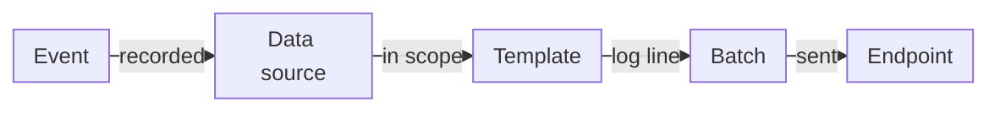
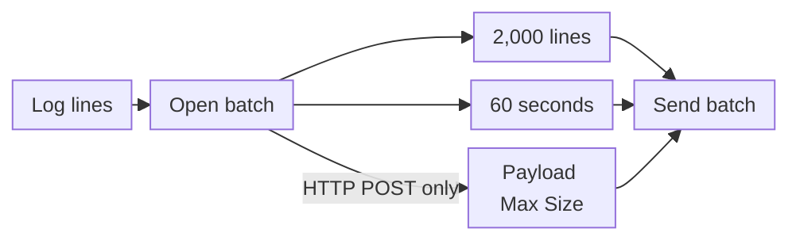
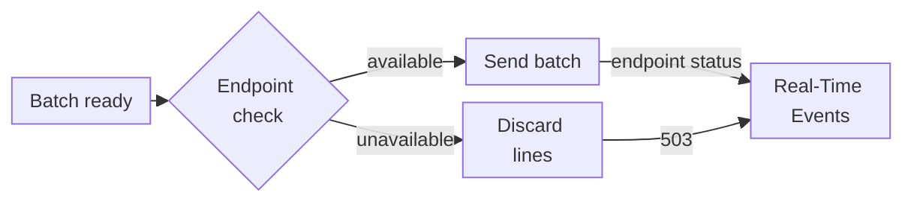

import FrameBox from '@aziontech/webkit/frame-box'
import ItemList from '@aziontech/webkit/item-list'
import DocItem from '@aziontech/webkit/doc-item'

A log stream pushes records to a platform you run instead of waiting for you to ask for them. Each time something happens in your traffic or your account, a record is written, grouped with other records, and delivered in a batch. The records arrive seconds to minutes after the events, and the copy on your platform is only as complete as your platform was reachable.

[Data Stream](/en/documentation/platform/data-stream/) realizes this with a stream. A stream reads the events of one data source and renders each event as a log line with a template. It groups the lines in batches and sends each batch to one endpoint, such as a SIEM, a big-data platform, or a stream-processing platform. The fields of each part are on [Stream settings](/en/documentation/platform/data-stream/stream-settings/). To create your first stream, refer to the [Data Stream quickstart](/en/documentation/platform/data-stream/quickstart/).

The sections follow an event to the endpoint: the pipeline, sampling and workload filters, batching and delivery, endpoint availability and failures, activation and changes, and delivery records and metrics.

---

## The pipeline from an event to an endpoint

A stream is a one-way pipeline: Azion pushes log lines to your endpoint, and every event the stream collects becomes one log line. Each stream has one data source, one template, and one endpoint. Sending the same events to two platforms, or the events of two data sources to one platform, therefore takes two streams.

This diagram follows one event until it reaches the endpoint:



1. Something happens. A request reaches one of your [applications](/en/documentation/platform/applications/), a [function](/en/documentation/platform/functions/) writes a log message, WAF analyzes a request, or a user changes the account in Azion Console.
2. The data source records the event. A stream reads one of four: *Activity History*, *Applications*, *Functions*, or *WAF Events*, and each one offers its own variables, listed in [Data sources and variables](/en/documentation/platform/data-stream/data-sources-and-variables/). The stream keeps only the events inside its scope, set by sampling or by a workload filter.
3. The template renders the event as one log line. Its data set maps each key of the line to a variable, such as `"status": "$status"`. The stream replaces each variable with the value from the event. Data Stream uses ASCII encoding, which avoids parser issues and misread data at the endpoint.
4. The stream adds the log line to a batch, which closes at 2,000 log lines or after 60 seconds, whichever comes first. [Batching and delivery](#batching-and-delivery) gives the exceptions.
5. The stream sends the batch to its endpoint. The Console labels the endpoint field **Connector**, and its 11 types are listed in [Endpoints](/en/documentation/platform/data-stream/endpoints/).

The stream authenticates to the endpoint with the credential that the endpoint type takes. For example, with *Google BigQuery*, you provide a service account key, and Data Stream performs the Google OAuth 2.0 authentication and generates the JSON Web Tokens. For the template format, refer to [Templates and payload](/en/documentation/platform/data-stream/templates-and-payload/).

The alternative to a stream is to read the events where Azion keeps them. [Real-Time Events](/en/documentation/platform/real-time-events/) answers queries on the raw events of your products, and keeps them for 7 days and *Activity History* events for 2 years. A stream copies the events to your own platform, where your tools decide how long they stay and how they are analyzed. The cost is the usage that Data Stream bills, on Requests and Data Transfer, as listed in [Pricing](/en/documentation/fundamentals/pricing/#data-stream).

---

## Sampling and workload filters

An account can produce far more events than one platform needs. The scope of a stream decides which of them it collects. Every stream carries a scope: a sampling rate over all workloads, or a filter of chosen [workloads](/en/documentation/platform/workloads/). A stream with neither is refused when you save it.

In Azion Console, the **Option** of the **Transform** section picks the scope:

- *All Current and Future Workloads* covers every workload on the account, including workloads created later, and shows **Sampling**. With sampling on, Data Stream collects events at random according to the percentage you set. A rate of `100` collects every event. The Console states that the sampling percentage is statistical and not absolutely precise.
- *Filter Workloads* collects the events of the workloads you pick. One stream can collect the events of a single workload or of several.

The two scopes cost different things. Sampling follows every workload you add later with no edit to the stream. Saving an active stream with sampling, at any rate including `100`, deactivates every other stream on the account, and the API returns no error. The Console warns before it saves, and adds this sentence: `When multiple Data Streams have different sampling rates, the system uses the lowest percentage.` A workload filter leaves the other streams active, so several streams can run at once. The cost is upkeep: a workload created later is not collected until you add it to the filter.

For example, *Activity History* events belong to the account rather than to a workload, so an *Activity History* stream uses sampling. Saving that stream active deactivates every other stream on the account, *Applications* streams included.

What the scope leaves out is the events of other workloads, the share that sampling skips, and the events of the other data sources. A request served from cache still produces an *Applications* event, with `$upstream_status` and the upstream timing variables set to `-`. A request that WAF blocked still produces a *WAF Events* event, with `$blocked` set to `1`. For the bounds of the rate and of the filter, refer to [Stream settings](/en/documentation/platform/data-stream/stream-settings/#transform).

---

## Batching and delivery

Sending each log line on its own would cost the endpoint one send per event. Data Stream groups the log lines of a stream in a batch instead, and sends the batch when the first of its triggers fires. A batch closes at 2,000 log lines or after 60 seconds. On a *Standard HTTP/HTTPS POST* endpoint, a batch also closes when it reaches the **Payload Max Size**, in bytes. An *AWS Kinesis Data Firehose* endpoint receives batches of 500 log lines or 60 seconds instead.

This diagram shows the triggers that close a batch:



1. Each log line that the template renders joins the open batch of the stream.
2. When the batch holds 2,000 log lines, the stream sends it.
3. When 60 seconds pass before that, the stream sends the batch with the lines it holds.
4. On a *Standard HTTP/HTTPS POST* endpoint, a batch that reaches the **Payload Max Size** is sent at that size, even when neither of the other triggers has fired.
5. The batch goes to the endpoint in one send. A *Simple Storage Service (S3)* endpoint receives one object per batch.

For example, a busy stream that reaches 2,000 log lines in 13 seconds sends its batch at that moment. A quiet stream sends what it has. One *Activity History* stream that collected a few events sent batches of 1 and 2 log lines, one per minute. Another batch reached its bucket 23 seconds after its last event. The object name joins the **Object Key Prefix**, a `/`, the time as `YYYY/MM/DD/hh/mm/`, and a unique ID, such as `activity/2026/10/02/19/47/55f2bb11-…`.

Batching trades delay for fewer sends. A batch of 2,000 log lines reaches the endpoint as one send. A log line from a quiet stream, however, can wait up to 60 seconds before its batch leaves. A log line does not reach the endpoint at the moment its event happens. No field of a stream changes the 2,000-line count or the 60-second interval. The **Payload Max Size** of a *Standard HTTP/HTTPS POST* endpoint only closes a batch earlier. For the delivery time and the other bounds, refer to [Data Stream limits](/en/documentation/platform/data-stream/limits/#default-limits).

---

## Endpoint availability and failures

A send to an endpoint that cannot take it is costly, so Data Stream checks each endpoint before it sends. The check runs once a minute and marks the endpoint available or unavailable. An endpoint is available only when every Azion server reports it available. One server that reports it unavailable is enough to stop the sends.

This diagram shows what happens to a batch after the check:



1. Once a minute, Data Stream checks each endpoint and keeps the result until the next check.
2. When the endpoint is available, the stream sends the batch, and the endpoint answers with its own HTTP status.
3. When the endpoint is unavailable, Data Stream does not send to it and discards the log lines of that interval.
4. Real-Time Events records every send with the status the endpoint returned, and records a discarded batch with `503`.
5. The next minute, a check runs again. When it marks the endpoint available, the stream sends the batches that form from then on.

Delivery is not guaranteed. Discarded log lines never reach the endpoint, and a send that the endpoint answers with an error is recorded with the endpoint's own status. For example, a URL that did not accept `POST` answered `405` to two batches, and no later send repeated their 3 log lines. When an HTTP POST endpoint passes the check but does not receive the batch within the send timeout, the send ends with `504`. The timeout is listed in [Data Stream limits](/en/documentation/platform/data-stream/limits/#default-limits).

A credential that lacks a permission can make the endpoint unavailable. An Azion [Object Storage](/en/documentation/platform/object-storage/) credential without `listAllBucketNames` and `listBuckets` had every send recorded with `503`, and nothing reached the bucket. Real-Time Events recorded one of those sends as follows:

```json
{"ts":"2026-10-02T19:42:00Z","endpointType":"S3","statusCode":503,"streamedLines":2,"dataStreamed":2797}
```

After the two capabilities were added, the next delivered batch carried only the 2 log lines of the events that followed. The lines of the two `503` batches were not delivered. For the credential, refer to [Endpoints](/en/documentation/platform/data-stream/endpoints/#azion-object-storage).

To limit what an outage costs, keep the endpoint reachable, and watch `statusCode` in Real-Time Events for `503` and for errors from the endpoint. Real-Time Events keeps the raw events of your products for 7 days, and *Activity History* events for 2 years. During that period, you can query the events of a missed interval there, in the fields Real-Time Events records rather than in your template.

---

## Activation and changes

A stream has no deployment step. When you select **Save** in Azion Console, or the API accepts a `POST` or `PATCH`, the stream stores its settings. An active stream then starts to collect once the change takes effect. The **Active** switch and the `active` field turn a stream on or off. An inactive stream keeps its settings and sends nothing.

A change of active state takes effect after one to two minutes, and during that window the previously active stream keeps sending. For example, after a stream with sampling was activated, the other stream of the account sent 3 more log lines over the next two minutes. The API already listed that stream as inactive. Other edits also take a few minutes to propagate. Allow for that window before you judge a change by what the endpoint receives. A stream you turn off can keep sending for a minute or two. Logs also take a short time to show in Real-Time Events after a stream becomes active.

Saving a stream checks the format of its fields, not the endpoint. The API accepts a wrong credential or an unreachable URL, and the problem shows only as failed sends in Real-Time Events. Read the first delivery records after you save, not the save response. To change, stop, or delete a stream, refer to [Edit, stop, or delete a stream](/en/documentation/guides/platform/observability/delete-data-stream/).

---

## Delivery records and metrics

A stream reports on itself in the Observe products. Each send leaves a record in Real-Time Events, and the totals of all sends reach Real-Time Metrics. Use the record to see what happened to one batch, and the totals to watch the volume a stream delivers over time.

[Real-Time Events](/en/documentation/platform/real-time-events/data-sources/#data-stream) records each send in the `dataStreamedEvents` dataset of its GraphQL API. Besides the time in `ts`, a record carries `endpointType`, which names the kind of endpoint, and the HTTP status in `statusCode`. It also carries the log lines in `streamedLines`, the bytes in `dataStreamed`, and the destination in `url`. A rejected or discarded send is recorded like a delivered one, so a send that failed shows as a status other than `200`. For every field, refer to [Real-Time Events GraphQL fields](/en/documentation/devtools/graphql/gql-real-time-events-fields/#datastreamedevents-data-stream).

The **Data Stream** tab of the [Real-Time Metrics Observe dashboards](/en/documentation/platform/real-time-metrics/observe-dashboards/#data-stream) adds up the same sends. **Total Data Streamed** sums the bytes the streams of the account sent, and **Total Requests** sums their log lines. The totals cover longer periods than the raw records, but they do not show the status of a single batch. Both read the `dataStreamedMetrics` dataset, which the [GraphQL API](/en/documentation/devtools/graphql/overview/) also serves.

The usage that Data Stream bills is a third view, read from the consumption data of the account. To query it, refer to [Query Data Stream usage data](/en/documentation/guides/platform/observability/query-data-stream-usage-data-with-graphql/).

---

## Related resources

<FrameBox>
<ItemList>
  <DocItem title="Stream settings" href="/en/documentation/platform/data-stream/stream-settings/">Every field of a stream, from data source to endpoint, with its values and defaults.</DocItem>
  <DocItem title="Data Stream quickstart" href="/en/documentation/platform/data-stream/quickstart/">Create a stream that sends Activity History events to a bucket, and confirm the delivery.</DocItem>
  <DocItem title="Data Stream limits" href="/en/documentation/platform/data-stream/limits/">The batch sizes, the delivery time, the send timeout, and the bounds of each field.</DocItem>
  <DocItem title="Troubleshoot Data Stream" href="/en/documentation/platform/data-stream/troubleshooting/">What to check when a stream sends nothing, or when its endpoint answers with an error.</DocItem>
</ItemList>
</FrameBox>
