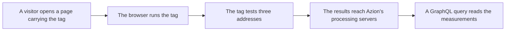

import FrameBox from '@aziontech/webkit/frame-box'
import ItemList from '@aziontech/webkit/item-list'
import DocItem from '@aziontech/webkit/doc-item'

Serving a page says nothing about what loading it felt like. That experience belongs to one device: the browser that resolved the name, opened the connection, and waited for the bytes. The network the visitor sat on, the route the request took, and the time the visitor spent waiting are known there and nowhere else. A measurement taken anywhere along the path describes a different thing.

[Edge Pulse](/en/documentation/platform/edge-pulse/) measures from inside that browser. You add a JavaScript tag to the pages you want to monitor. The tag runs in the browser of a real visitor, performs a test, and sends the result to Azion.

This page follows one measurement rather than describing the tags that produce it. The two tags, the browser settings they respect, and the data they collect are on [Edge Pulse JavaScript tag](/en/documentation/platform/edge-pulse/javascript-tag/). The steps for adding a tag to a page are on [Edge Pulse quickstart](/en/documentation/platform/edge-pulse/quickstart/). A neighboring product counts what Azion itself served, rather than what the visitor's device experienced: that one is [Real-Time Metrics](/en/documentation/platform/real-time-metrics/). The sections below follow the tag running in the visitor's browser, what one test measures, how one visitor is told from another, and where the measurements go.

---

## The tag runs in the visitor's browser

The Edge Pulse tag is a script the page carries and the visitor's browser executes. It is fully asynchronous. It respects the protocol in use, HTTP or HTTPS, so it does not change the scheme the page arrived on. It does not interfere with the loading process or with the internal structure of the delivered content.

Running asynchronously is what makes the measurement worth taking at all. A script that held the page up would change the thing it set out to measure, and the visitor would pay for the measurement in waiting. Edge Pulse measures a page the visitor experiences as though the tag were not on it.

Being tied to the load event also decides what counts as a visit. The tag measures the load it runs on, and it does not watch the page afterward: a route change that does not reload the page produces no second measurement. A single-page application is therefore measured once per full load, however many screens the visitor moves through after that, and its numbers describe the entry into the application rather than the navigation inside it.

That principle decides what happens when the tag cannot do its work: nothing visible. The tag reports no error, because an error would reach the visitor the tag exists to leave alone. So a page collecting nothing looks exactly like a page collecting normally, and the absence of measurements is the only signal you get.

The cost is that a visit has to last long enough. The **Default Tag** waits for the loading event to complete before it downloads and runs the RUM Client. A visitor who leaves before that event completes is therefore never measured by the Default Tag, and its measurements describe the visits that got far enough and no others. The **Pre-loading Tag** runs earlier, before the load event fires. When the browser runs the tag depends on which of the two the page carries. For more information, refer to [Edge Pulse JavaScript tag](/en/documentation/platform/edge-pulse/javascript-tag/).

One measurement travels the same path every time, from the browser that runs the tag to the query that reads the result:

1. A visitor opens a page that carries the Edge Pulse tag.
2. The browser runs the tag, at a moment that depends on which of the two tags the page carries.
3. The tag performs one test against three addresses of Azion's distributed infrastructure.
4. The test measures navigation, availability, latency, and bandwidth, in real time.
5. The browser sends the results to Azion's processing servers, and Edge Pulse does not test again from that browser for 30 minutes.
6. The measurements are read with the Real-Time Events GraphQL API.

## What one test measures

A test is one round of measurements the Edge Pulse tag performs from a visitor's browser. It collects navigation, availability, latency, and bandwidth information, in real time. Each test collects metrics for only three addresses of Azion's distributed infrastructure at a time.

Three addresses at a time is what keeps a single test short. The tests occur in a continuous and diversified way, and together they cover all the possible routes that visitor has to reach the content. One test is a sample of the paths open to that visitor; the series of tests is the shape of them.

The second value is the interval. Edge Pulse runs one test per visitor every 30 minutes. That interval is what keeps repeated testing off the visitor's device: without it, a visitor who stayed on a page would carry the cost of the same test over and over.

The interval costs coverage per visitor. A visitor who leaves inside those 30 minutes contributes one test and nothing more. For example, a visitor who reads three pages of your site in ten minutes is measured once, not three times. The picture Edge Pulse builds is therefore made of many visitors measured a few times, rather than a few visitors measured often.

---

## How one visitor is told from another

Edge Pulse gives each visitor an identifier generated by the UUID4 algorithm, the random variant of the universally unique identifier scheme. It holds that value in the local storage of the browser, the store a browser keeps for one site and does not clear when the page closes.

The identifier is what makes a sequence of tests belong to one visitor. Without it, each test would arrive as an unrelated result, and a success or a failure could not be attributed to the browser that produced it. Edge Pulse uses the identifier to control cases of successes and failures more efficiently, because the results of one visitor are counted together.

Edge Pulse reads the `navigator.doNotTrack` setting of the visitor's browser, and that setting decides how long the identifier lives. With the setting at `1`, the visitor gets a new identifier on each visit, and an identifier stored on an earlier visit is deleted first. With any other value, the same identifier is used for each visit of that visitor.

The measurements arrive either way. What changes is whether they join up. With Do Not Track on, Edge Pulse sees a series of first visits, so it compares the tests inside one visit and not the tests across visits. For both values and what each one does to a stored identifier, refer to [Edge Pulse JavaScript tag](/en/documentation/platform/edge-pulse/javascript-tag/).

The identifier is a random value held in one browser's local storage. Azion does not intend to collect confidential information or directly identifiable personal information through Edge Pulse.

## Where the measurements go

After a test completes, the browser sends the results to Azion's processing servers. The response time when visitors access the applications may be collected, as well as information from the servers used to respond to those requests.

The measurements have two readers from there. Azion may use them to improve performance and reliability in accessing applications, and to improve its delivery algorithms.

You read the same measurements yourself with the Real-Time Events GraphQL API, the endpoint [Real-Time Events](/en/documentation/platform/real-time-events/) serves. They help you make decisions about visitor routing, understand what your clients need and want, improve the visitor experience, and gain transparency about your application. The dataset is `pulseEvents`, and that is what a custom dashboard or an observability platform queries. For how to get a token and send a first query, refer to [GraphQL API first steps](/en/documentation/devtools/graphql/first-steps/).

The measurements last as long as a Real-Time Events record lasts, and no longer: the same store holds them, so the same retention applies. That window is 7 days, after which a measurement is gone whether or not anyone read it. For the retention periods and every other bound on a query, refer to [Real-Time Events limits](/en/documentation/platform/real-time-events/limits/).

Measuring from inside the visitor's browser is what puts the parts of the path Azion does not control inside the measurement. The price is paid on the read side: reading the result is a query you write. Azion Console serves the tag and nothing else, so no screen renders these measurements for you. The REST API carries no Edge Pulse endpoint, at version 4 or version 3, so a client that speaks only REST does not reach these measurements.

---

## Related resources

<FrameBox>
<ItemList>
  <DocItem title="Edge Pulse JavaScript tag" href="/en/documentation/platform/edge-pulse/javascript-tag/">The two tags, where each one goes in the page, and the browser settings each one respects.</DocItem>
  <DocItem title="Edge Pulse quickstart" href="/en/documentation/platform/edge-pulse/quickstart/">Copy the tag from Azion Console and add it to the pages you want to monitor.</DocItem>
  <DocItem title="Edge Pulse" href="/en/documentation/platform/edge-pulse/">What Edge Pulse is, what it measures, and where it is included.</DocItem>
  <DocItem title="Glossary" href="/en/documentation/platform/edge-pulse/glossary/">The terms these pages use for the test, the visitor identifier, and the two tags.</DocItem>
</ItemList>
</FrameBox>
