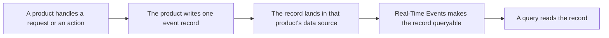
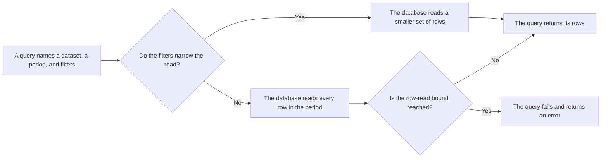

import FrameBox from '@aziontech/webkit/frame-box'
import ItemList from '@aziontech/webkit/item-list'
import DocItem from '@aziontech/webkit/doc-item'

A request that has been served leaves nothing a person can read, unless whatever served it wrote the details down. The system that handled the request records what it saw: the address the request came from, the path it asked for, the status it answered with, and the time it took. That record is kept for a period, and during that period you can search it. Once the period ends the record is removed, and the question it would have answered can no longer be asked.

On Azion, those records are event records, and [Real-Time Events](/en/documentation/platform/real-time-events/) is where you search them. Each product writes its own records into a data source of its own. Each data source carries its own set of preorganized variables, because each product sees a different thing. The records are read in Azion Console, or with the Real-Time Events GraphQL API at `https://api.azion.com/v4/events/graphql`.

This page follows one record rather than listing the fields it carries. The variables of each data source are on [Data sources](/en/documentation/platform/real-time-events/data-sources/), and every bound is on [Limits](/en/documentation/platform/real-time-events/limits/). Two neighboring products read the same traffic and are not covered here: aggregated counters over it are [Real-Time Metrics](/en/documentation/platform/real-time-metrics/), and a continuous feed of the same records to an endpoint you own is [Data Stream](/en/documentation/platform/data-stream/). The sections below follow the path an event travels, the data sources and datasets that hold the records, how a query is bounded, and retention.

---

## The path an event travels

An event record exists because a product wrote it. Real-Time Events observes nothing on its own. An application that serves no request, a function that never runs, and an account nobody touches produce no records at all. A product writes one record for each event it handles, and the event is whatever that product does once: one request, one DNS query, one delivery to a configured endpoint, one action on the account.

This diagram follows a single event, from the work that produces it to the query that reads it:

1. A product handles one unit of work: a request, a DNS query, a delivery, or an action on the account.
2. The product writes one event record for it, holding one value per variable its data source defines.
3. The record is written into the data source of the product that produced it, and into no other.
4. Real-Time Events makes the record queryable a short time after the event, rather than at the instant of it.
5. A query names one data source, a period, and any filters, and reads the records that match.
6. The record is removed at the end of its retention period, whether or not anyone read it.

A variable is not an event of its own. One event produces one record, and the variables are the fields of that record. A request that matched a WAF rule and was served from cache is therefore one record carrying both facts, not two records. A query returns a set of these records, and a single record opened on its own shows every variable its data source defines. To open one and read it, refer to [Read an event record](/en/documentation/guides/platform/observability/understand-logs/).

The gap between the event and the queryable record is the part of this path to design around. A record written moments ago can be missing from a search that runs immediately. An empty result right after a request usually means the search ran too early rather than a request that was never served. Repeat the search before you conclude anything from the first one. For the delay and the other bounds, refer to [Limits](/en/documentation/platform/real-time-events/limits/).

---

## Data sources and datasets

A data source is the Azion product or service that produced the events you query. On a query it is the index the records are read from, so every search selects one before it selects anything else. Real-Time Events exposes eight of them, and each one carries its own variables, because each product writes a different record.

The same records are reached two ways, and the two do not name the fields the same way. The classic view of Azion Console, which is the view Real-Time Events opens on, names each field of a record a variable, written the way a person reads it. The Real-Time Events GraphQL API holds each data source as a dataset and names the same fields in camelCase. The variable `Remote Address` is therefore the field `remoteAddress` in a query. A [Data Stream](/en/documentation/platform/data-stream/) payload writes that same field in snake_case again.

That split costs you a translation step every time you move between the two. A variable name copied out of the interface does not parse in a GraphQL query, and a field name does not appear in the interface. [Data sources](/en/documentation/platform/real-time-events/data-sources/) names the dataset beside the variables of each data source, and the field list of every dataset is on [Real-Time Events GraphQL API fields](/en/documentation/devtools/graphql/gql-real-time-events-fields/). To get a token and send a first query, refer to [GraphQL API first steps](/en/documentation/devtools/graphql/first-steps/). The newer Azion Console view, in Preview, closes that gap by showing the API's field names directly.

Splitting the records by product is what keeps each one readable: an HTTP request and a DNS query have almost no fields in common, and a single shared record would carry a mostly empty row for each. The price is that a question spanning two products takes two queries, one per data source, joined on a value both records carry, such as the host.

---

## How a query is bounded

A query against Real-Time Events names three things: the data source it reads, the period it covers, and the filters that narrow it. Those three decide how many rows the log database reads before it can answer, and reading is the expensive part of the work. The period is usually the largest of the three. A search opens on the last 15 minutes, and one widened to the full retention window draws on far more records.

In the GraphQL API the three choices are written out. The query selects a dataset, bounds the period with `tsRange: { begin, end }`, sorts the result with `orderBy`, and caps the rows it returns with `limit`. A query in Azion Console makes the same three choices through the interface rather than in text.

Reading is also what one of the two billed metrics counts. Data Scan measures the volume a query reads, not the volume it returns. A wide search that answers with ten rows can still scan a large amount. Storage, the other metric, measures the volume of records kept.

The log database bounds how many rows one query may read before it answers anything. This diagram shows which query reaches that bound:

1. A query that carries a filter reads only the rows that can match it, so the period it names costs little by itself.
2. A query that carries no filter beyond the period reads every row in that period.
3. A read that stays inside the bound returns its rows as usual.
4. A read that reaches the bound ends the query with an error instead of a partial result.

The unfiltered search over a broad period is the one case that reaches the bound, and it fails rather than returning the first rows it found. Adding one filter changes that outcome more than shortening the period does: a host, an IP address, an HTTP status code, or another parameter of the search cuts the read down before the period has to.

Real-Time Events bounds a query by what it reads rather than by what it returns, which keeps one wide search from costing every other search its results. The price is that the broadest question is the one the system refuses. Ask it as several narrow questions instead. For the row, field, payload, and rate bounds, and for the message a refused query returns, refer to [Limits](/en/documentation/platform/real-time-events/limits/).

---

## Retention

Retention is how long Real-Time Events keeps an event record queryable. A record is kept for 7 days, which is 168 hours, and is then removed, whether or not anyone read it, and nothing recovers a record once it is gone. Retention is therefore the outer bound of every query: a period reaching further back than retention returns nothing for the part that falls outside, because there is nothing left there to read.

One data source is the exception. [Activity History](/en/documentation/fundamentals/activity-history/) records the actions performed on the account rather than the traffic the account serves. Its records are kept for 2 years, far longer than those of the other seven data sources. Those are the records that answer who changed a configuration, long after the traffic that ran under that configuration has been removed. For both periods alongside every other bound, refer to [Limits](/en/documentation/platform/real-time-events/limits/).

The window is a deliberate middle. It is long enough to investigate an incident after the fact. It is short enough that Real-Time Events is not a store of record, which keeps the Storage metric bounded. The consequence is that a record you need past retention has to leave before it is removed. [Data Stream](/en/documentation/platform/data-stream/) is what sends the same records continuously to an endpoint you own, where your own retention applies instead.

---

## Related resources

<FrameBox>
<ItemList>
  <DocItem title="Data sources" href="/en/documentation/platform/real-time-events/data-sources/">The eight data sources, the variables each one carries, and the dataset that holds it in the GraphQL API.</DocItem>
  <DocItem title="Limits" href="/en/documentation/platform/real-time-events/limits/">The retention periods, the bounds one query carries, and what a query past one receives.</DocItem>
  <DocItem title="Real-Time Events quickstart" href="/en/documentation/platform/real-time-events/quickstart/">Run a first search against a data source and read what it returns.</DocItem>
  <DocItem title="Glossary" href="/en/documentation/platform/real-time-events/glossary/">What event record, data source, dataset, retention, and Data Scan mean on these pages.</DocItem>
</ItemList>
</FrameBox>
