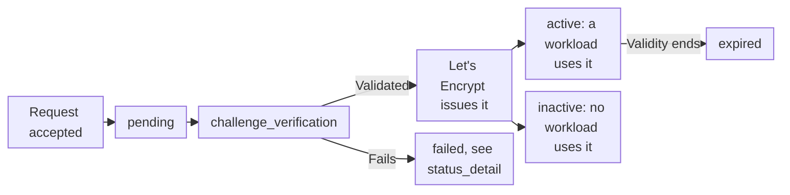

import FrameBox from '@aziontech/webkit/frame-box'
import ItemList from '@aziontech/webkit/item-list'
import DocItem from '@aziontech/webkit/doc-item'

A certificate authority (CA) signs a certificate only after the requester proves control of every name on it. The proof is a challenge: a value the CA checks in the domain's DNS, or a file served on the hostname. Let's Encrypt is a CA that issues certificates valid for 90 days, so a certificate stays useful only while someone renews it.

For a workload's server certificate, [Certificate Manager](/en/documentation/platform/workloads/#certificate-manager) takes that work on. Azion requests the certificate from Let's Encrypt, completes the challenge, and renews the certificate before it expires. For where Certificate Manager acts on a request, refer to [How Workloads works](/en/documentation/platform/workloads/how-it-works/#certificate-manager). A certificate you upload, or obtain from a CA through a certificate signing request (CSR), is described on [Certificates](/en/documentation/platform/workloads/certificate-manager/certificates/).

The sections cover certificate requests, domain validation, wildcard certificates, statuses, issuance time and retries, and renewal.

---

## Certificate requests

A Let's Encrypt request asks Azion to obtain a certificate for a set of hostnames. It carries the main hostname in `common_name` and, optionally, other hostnames in `alternative_names`, which the certificate lists as Subject Alternative Names (SANs). It also names the authority, `lets_encrypt`, and the challenge that proves control of the names: `http` for HTTP-01 or `dns` for DNS-01.

Azion generates the certificate's key. On an API request, `key_algorithm` defaults to `ecc_384`. For the other algorithms and defaults, refer to [Certificate fields](/en/documentation/platform/workloads/certificate-manager/certificates/#certificate-fields).

You request a certificate in Azion Console or through the API. The Console presets _New Let's Encrypt Certificate (HTTP-01)_ and _New Let's Encrypt Certificate (DNS-01)_ appear in Certificate Manager and in the workload's **Digital Certificate** field. Through the API, the request is `POST /v4/workspace/tls/certificates/request`. From the workload form, the Console takes the names from the workload's **Domains**. It names the certificate `Lets Encrypt - <workload name> - <date and time>` and sets `key_algorithm` to `rsa_2048`.

The API answers a request with the certificate's `id` and a `pending` status, which means Azion scheduled the issuance. The certificate is listed in Certificate Manager from then on, and the `id` identifies it when you check its status.

Azion issues Let's Encrypt certificates for domains and subdomains registered in the Domain Name System (DNS). Every name on the request must also belong to a domain the account has permission for. Otherwise, the request is refused with `This account cannot use certain common or alternative names because it does not have permission for their domain names.` An `azion.app` hostname is refused too, even one that a workload of the account holds.

Some older clients cannot validate the chain of a Let's Encrypt certificate. For which clients, and what to do about them, refer to [Certificate chain](/en/documentation/platform/workloads/certificate-manager/certificates/#certificate-chain).

---

## Domain validation

Let's Encrypt validates every name on a request before it issues the certificate, and the request's challenge decides how. Azion supports both challenges, HTTP-01 and DNS-01, for a domain whose DNS is hosted in [Edge DNS](/en/documentation/platform/edge-dns/) or at another DNS provider.

With HTTP-01, Let's Encrypt validates the hostname through a file served for it, and Azion runs the service that answers the challenge. The domain's DNS needs no TXT record, so the challenge asks for no change in the domain's zone. The hostname must already point to Azion when you send the request. When the request carries alternative names, every one of them must point to Azion, or the issuance fails. Azion schedules the issuance even when no workload with the hostname is published and active. Because no DNS change is needed per name, HTTP-01 suits an account that manages many domains and hostnames.

With DNS-01, Let's Encrypt validates the hostname through a TXT record in the domain's DNS, under the hostname's `_acme-challenge` name. Who prepares the DNS depends on where the zone is hosted:

- When the zone is in Edge DNS, Azion generates the TXT record and inserts it into the zone. The challenge completes with no action from you.
- When another DNS provider hosts the zone, you add one CNAME record per hostname at that provider. Its name is `_acme-challenge.<your-domain>`, and its value is `<your-domain>.letsencrypt.azion.com`. For example, `_acme-challenge.www.example.com` points to `www.example.com.letsencrypt.azion.com`.

For the records step by step, refer to [Request a Let's Encrypt certificate](/en/documentation/guides/application-security/tls-and-certificates/how-to-generate-a-lets-encrypt-certificate/). To add an `_acme-challenge` TXT record yourself, refer to [Add the Let's Encrypt TXT record](/en/documentation/guides/application-security/tls-and-certificates/lets-encrypt-record/).

Each challenge fits a different situation:

| Challenge | `challenge` value | Use it when |
| --- | --- | --- |
| HTTP-01 | `http` | You do not control the domain's DNS records, and the domain already points to Azion |
| DNS-01 | `dns` | You control the domain's DNS records, the certificate covers a wildcard name, or you have no direct access to the web server |

The two challenges trade a dependency on traffic for a dependency on DNS. HTTP-01 needs no record, but it cannot validate a hostname that does not point to Azion yet. For example, during a move to Azion, DNS-01 can issue the certificate for `www.example.com` while the hostname still points to the previous provider. HTTP-01 can issue it only after the hostname points to Azion.

---

## Wildcard certificates

A wildcard name, such as `*.example.com`, lets one certificate cover subdomains that you do not list one by one. Azion issues a wildcard certificate through the DNS-01 challenge, and it issues and renews the certificate automatically.

Automatic issuance needs the domain's zone configured and active in Edge DNS, which gives Azion control over the records the validation needs. During issuance, Azion generates the `_acme-challenge` TXT record and inserts it into the zone, with no action from you. When the zone is not active in Edge DNS, Azion cannot automate the validation, and it must be performed manually.

A certificate can carry a wildcard name alone or next to specific names. A subdomain that the wildcard already covers needs no entry of its own: with `*.example.com` on the certificate, `blog.example.com` need not be listed.

A workload, by contrast, lists each hostname in full. Its domains refuse a wildcard entry with `The domain does not conform to the format defined in RFC 1035.` The workload form requests a certificate for the workload's domains, so it cannot request a wildcard name. To request one with the DNS-01 challenge, refer to [Request a Let's Encrypt certificate with the API](/en/documentation/guides/application-security/tls-and-certificates/how-to-generate-a-lets-encrypt-certificate-via-api/).

One wildcard certificate in place of one certificate per subdomain means fewer distinct certificates to issue. That lowers the chance of reaching the issuance limits of the Let's Encrypt service, which [Workloads limits](/en/documentation/platform/workloads/limits/#certificate-manager) links. The cost is a dependency on DNS: automatic issuance needs the zone in Edge DNS, and a zone elsewhere means validating by hand. For when one certificate shared by many subdomains is a risk, refer to [Workloads best practices](/en/documentation/platform/workloads/best-practices/#certificate-manager).

---

## Statuses

A Let's Encrypt certificate reports where its issuance stands in the read-only `status` field. The values follow the certificate from the request to its use on a workload.

This diagram follows a certificate from the accepted request to the states it can end in:

1. The API accepts the request and returns `pending`, which means Azion scheduled the issuance. A certificate also reads `pending` while Azion processes its issuance or renewal, or retries it.
2. `challenge_verification` means the DNS-01 or HTTP-01 challenge is waiting for validation.
3. Once issued, the certificate reads `active` while a workload names it in `tls.certificate`, and `inactive` while no workload does.
4. When validation fails, the certificate reads `failed`. The `status_detail` field carries the reason, such as `An error has occurred while issuing the requested certificate. Please verify the following domains CNAME: www.example.com`.
5. Once its `validity` date passes, the certificate reads `expired` and no longer protects traffic.

Azion Console shows the same states. The certificate list marks a `pending` certificate with a warning icon and a `failed` one with an error icon, with `status_detail` as the explanation. A certificate whose `validity` date has passed carries the tag **Expired**.

A workload can name a certificate that is not issued yet. Its **Digital Certificate** field then warns "This certificate is pending validation and HTTPS may not work until it’s validated", or "This digital certificate failed and HTTPS cannot be used until the issue is resolved". Until the certificate validates, HTTPS on the workload's domains may not work. For the full status table, uploaded certificates included, refer to [Statuses](/en/documentation/platform/workloads/certificate-manager/certificates/#statuses).

---

## Issuance time and retries

Azion makes the first attempt to issue a Let's Encrypt certificate up to 5 minutes after you save the certificate settings. When an attempt fails, Azion retries on a schedule that spaces the attempts further apart the longer the failure lasts. The schedule raises the chance of success while it stays within the limits of the Let's Encrypt service.

The retry schedule runs in four phases:

| Phase | When | Attempts |
| --- | --- | --- |
| Rapid recovery | The first 5 attempts | At increasing intervals of 5, 10, 15, 20, and 30 minutes |
| Stabilization | Days 1 and 2 | Up to 10 a day, 30 minutes apart, up to 20 in the first two days |
| Monitoring | Days 3 to 7, when the failure lasts more than 48 hours | One every 3 hours |
| Maintenance | After 7 days | One a day |

The rapid recovery phase resolves most failures that DNS propagation or a temporarily unavailable service causes. Later phases keep trying, so a fix you make days later can still end in an automatic issuance. The later the fix, the longer it waits. After 48 hours, the next attempt can be up to 3 hours away, and after 7 days, up to a day.

Azion records why an attempt failed in `status_detail`, which the API returns with the certificate and the Console shows with the status icon. For example, a mistyped `_acme-challenge` CNAME at your DNS provider fails the first attempts, and `status_detail` names the hostname whose CNAME to check. Once you correct the record, a later attempt in the schedule can issue the certificate. For symptoms and their fixes, refer to [Troubleshoot Workloads](/en/documentation/platform/workloads/troubleshooting/#certificate-manager).

---

## Renewal

A Let's Encrypt certificate expires 90 days after it is issued, and Azion renews it automatically before that date. Renewal starts 30 days before expiration, when the certificate becomes eligible for renewal. Azion monitors the certificates it issued, runs the validation again as renewal approaches, and updates the certificate. The `renewed_at` field records when Azion last renewed it.

The renewal needs no maintenance window, and the certificate keeps its quotas, billing, and permissions. Wildcard certificates renew the same way.

Renewal depends on the validation passing again, so Azion renews a certificate only while its validation settings stay valid and up to date. For example, a DNS-01 certificate for a zone at another provider fails to renew once its `_acme-challenge` record is deleted. An HTTP-01 certificate needs its hostnames to keep pointing to Azion.

Azion stops renewing a certificate in these cases:

- You bind a certificate you uploaded in its place on the workload.
- You change the domains the certificate was requested for. Azion creates another certificate from the changed set, and the old one is not renewed.
- You delete the certificate, or the domain it was requested for is removed from Azion. Only these two events deactivate a managed certificate.

A certificate unbound from its workload stays in Certificate Manager, and you can bind it again while it remains valid. Automatic renewal removes the expiration date as a task, at the cost of a dependency. The validation path that issued the certificate has to keep working for as long as a workload uses it.

Azion does not renew a certificate you upload. To replace one before it expires, refer to [Workloads best practices](/en/documentation/platform/workloads/best-practices/#certificate-manager).

Let's Encrypt™ is a trademark of the Internet Security Research Group. All rights reserved.

---

## Related resources

<FrameBox>
<ItemList>
  <DocItem title="Certificates" href="/en/documentation/platform/workloads/certificate-manager/certificates/">Every field of a Let's Encrypt request, the full status table, and the key algorithms Azion generates.</DocItem>
  <DocItem title="Request a Let's Encrypt certificate" href="/en/documentation/guides/application-security/tls-and-certificates/how-to-generate-a-lets-encrypt-certificate/">The steps to request a Let's Encrypt certificate and prepare the DNS records its challenge needs.</DocItem>
  <DocItem title="Add the Let's Encrypt TXT record" href="/en/documentation/guides/application-security/tls-and-certificates/lets-encrypt-record/">The steps to add the TXT record that a DNS-01 challenge checks.</DocItem>
  <DocItem title="Troubleshoot Workloads" href="/en/documentation/platform/workloads/troubleshooting/#certificate-manager">Symptoms of a certificate that fails to issue or renew, with their causes and fixes.</DocItem>
</ItemList>
</FrameBox>
