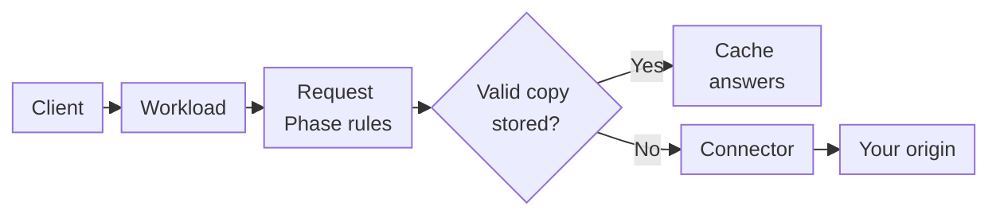
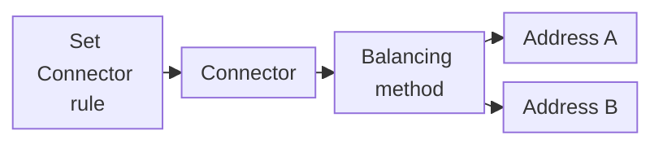
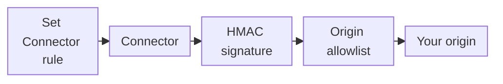
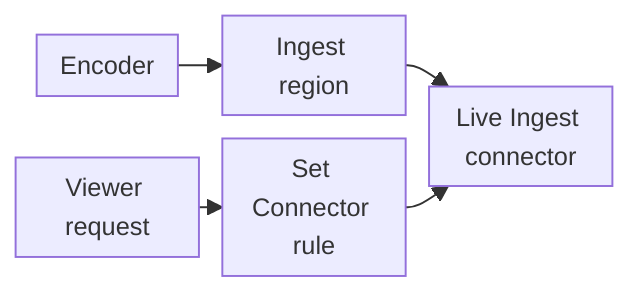

import FrameBox from '@aziontech/webkit/frame-box'
import ItemList from '@aziontech/webkit/item-list'
import DocItem from '@aziontech/webkit/doc-item'

A reverse proxy answers a client on behalf of a server you run. When it cannot answer from what it already holds, it opens its own connection to that server and forwards the request. On the way, it decides how to address the server: which hostname to send in the `Host` header, which path to ask for, and which protocol and port to use. The server answers the proxy, and the proxy answers the client.

On Azion, the [application](/en/documentation/platform/applications/) is the proxy, and a [connector](/en/documentation/platform/connectors/) holds where and how it reaches your origin, the server that holds your content. A rule of the application sends requests to the connector. The connector carries the address of the origin and the settings that shape each request to it. Three Products act on a connector. [Load Balancer](/en/documentation/platform/connectors/#load-balancer) spreads requests across several addresses, and [Origin Shield](/en/documentation/platform/connectors/#origin-shield) protects the origin. [Live Ingest](/en/documentation/platform/connectors/#live-ingest) takes a live stream in through a connector.

This page covers the mechanisms rather than the fields: every field is on [Connector settings](/en/documentation/platform/connectors/settings/), and every bound is on [Connectors limits](/en/documentation/platform/connectors/limits/). The sections follow a request: the request path, the connector types, how the connector addresses the origin, the client address headers, connection reuse and timeouts, and propagation. Load Balancer, Origin Shield, and Live Ingest close the page, in that order.

---

## Request path

Creating a connector sends no traffic to it. An application sends requests to a connector through a rule whose _Set Connector_ behavior names it, and until a rule names a connector, the application has no origin. The application itself serves only the requests of a [workload](/en/documentation/platform/workloads/) whose deployment names it.

This diagram follows one request from the client to the origin:



1. A client sends a request to a hostname of a workload, and the workload's deployment names the application that handles it.
2. The application runs its Request Phase rules, in order. A matching rule with the _Set Connector_ behavior names one connector. When several matching rules carry _Set Connector_, only the last one runs.
3. When a cache setting applies and a valid copy of the object is stored, Cache answers from that copy. The request never reaches the connector or the origin.
4. Otherwise, the connector opens a connection to the origin and sends the request, shaped by the connector's settings.
5. The origin answers the connector. The application runs its Response Phase rules on the response, and the client receives it.

A rule stores the connector's ID, and the connector stores the address. Moving the origin therefore means editing one connector, and every rule that names it follows without a change. For example, when you change the connector's `host` and `path_prefix`, the same rule sends requests to the origin with the new values. The cost is a dependency between the two objects: the API refuses to delete a connector that a rule still names.

On API v3, the origins of an application carried this role. For that model, refer to [Origins](/en/documentation/platform/connectors/origins/). To write the rule that names a connector, refer to [Rules Engine for Applications](/en/documentation/platform/applications/rules-engine/).

---

## Connector types

A connector has one of three types, and the type decides what the connector reaches and which settings it carries. In Azion Console, the **Connector Type** section offers them as _HTTP_, _Object Storage_, and _Live Ingest_. In the API, they are `http`, `storage`, and `live_ingest`.

A connector of type `http` reaches servers you run, by hostname or by IP address. It holds one address, or several when Load Balancer is on. It is the only type with connection options, so the `Host` header, the path prefix, the protocol, and the client address headers apply to it alone. Use it for any origin that answers HTTP: a cloud server, a server in your data center, or an S3-compatible storage endpoint.

A connector of type `storage` reads objects from a bucket of [Object Storage](/en/documentation/platform/object-storage/) in your account. It holds no addresses and no connection options, because the origin is Azion's own storage, and there is no server for you to run. A prefix narrows the connector to the objects under it, such as `images/`.

A connector of type `live_ingest` takes a live stream that Azion ingests in a region you choose. It holds no addresses and no connection options. The Live Ingest section of this page describes how the stream reaches viewers.

For example, one application can send requests for `/images/` to a connector of type `storage` and every other path to a connector of type `http`. Each rule matches its own paths, and each names its own connector. For the fields of each type, refer to [Connector settings](/en/documentation/platform/connectors/settings/#general).

---

## How the connector addresses the origin

A connector of type `http` decides four things about every request it forwards: the `Host` header, the path, the protocol and port, and how it resolves and follows the origin's address. They shape the request the origin receives, not the URL the client requested.

### Host header

The `Host` header tells a server which site a request is for. One server can host several sites, called virtual hosts, and it reads `Host` to pick the site and locate its content. The `host` connection option decides the value the connector sends.

By default, `host` is `${host}`, which sends the host the client requested. For example, a client that requests `www.example.com` makes the connector send `Host: www.example.com`. This suits an origin that serves several virtual hosts and expects each request under its public name.

A literal value is sent as is, for every request. Set one when the origin answers a virtual host under a name other than the one the client used, such as `origin.example.com`. An origin that routes requests by name may not answer the client's host, so it needs its own name here.

### Path prefix

The `path_prefix` connection option goes in front of the path the client requested. With `/anything`, a request for `/get` reaches the origin as `/anything/get`. The prefix never appears in the client's URL: the client asks for `/get` and receives the response to `/anything/get`.

Use a prefix when the content sits under a directory of the origin. An origin can also need a path segment, such as the bucket name on an S3-compatible endpoint. The default is no prefix, and the path reaches the origin unchanged.

### Protocol and ports

The connection from the connector to the origin has its own protocol, independent of the one the client used to reach Azion. The **Transport Protocol Policy** decides it. _Preserve_ keeps the scheme the client used, so an HTTPS request reaches the origin over HTTPS. _Force HTTPS_ and _Force HTTP_ use that protocol for every request, whatever the client used.

Forcing HTTPS protects the leg between Azion and the origin, and it costs a TLS handshake with the origin on every new connection. Forcing HTTP saves the handshake, and it sends the request to the origin unencrypted.

Each address carries its own ports, `http_port` and `https_port`, with defaults `80` and `443`. The address itself never carries a port or a protocol. For how to run an origin on other ports, refer to [Configure HTTP and HTTPS ports](/en/documentation/guides/application-development/getting-started/configure-ports/).

### DNS resolution and redirects

An address can be a hostname, and the connector resolves it before it connects. The **DNS Resolution Policy** decides which addresses the connector uses: _IPv4 and IPv6_ allows both, and _Force IPv4_ keeps the connection on IPv4 even when the hostname also resolves to IPv6.

An origin can answer with an HTTP redirect instead of the content. With **Following Redirect** on, the connector follows the redirect from the origin itself. It is off by default.

For each of these settings and its default, refer to [Connector settings](/en/documentation/platform/connectors/settings/#connection-options).

---

## Client address headers

The origin receives the request over a connection that the connector opens, so the address the origin sees on that connection is Azion's, not the client's. To pass the client's address on, the connector adds two headers to every request of a connector of type `http`.

By default, the origin receives the client IP address in `X-Real-IP` and the client port in `X-Real-PORT`. The `real_ip_header` and `real_port_header` connection options rename them. For example, with `real_ip_header` set to `X-Client-Real-IP`, the origin receives `X-Client-Real-IP` with the client address, and no `X-Real-IP`.

An origin that logs, rate-limits, or authorizes by client address reads it from that header. Some origins drop `X-Real-IP` themselves, before your code sees it. Renaming the header works around such an origin. Alternatively, a rule can add the client IP to a header of your choice. For that approach, refer to [Send the client IP to the origin in a header](/en/documentation/guides/application-development/getting-started/original-ip-header/).

---

## Connection reuse and timeouts

The connection from Azion to the origin follows platform defaults that decide how long Azion waits and how long it keeps an idle connection open. Some come from Azion's global settings and some from the operating system. A connector without Load Balancer exposes none of them as a setting.

This table lists the defaults of the connection to the origin:

| Connection behavior | Default |
| --- | --- |
| Complete TCP Connection | 60 seconds |
| TCP ACK Timeout | About 15 to 30 minutes |
| TCP Keep-Alive Interval | Off |
| Proxy Idle Timeout | 75 seconds |
| Proxy Read Timeout | 120 seconds |
| Proxy Write Timeout | 120 seconds |
| HTTP/2 Pings to Origin | Off |
| HTTP/2 Connection Idle | 75 seconds |

Timeouts and retries become settings only with Load Balancer on the connector. Its **Connection Timeout** limits the wait for a connection to the origin, and its **Read/Write Timeout** limits the wait for data on an open connection. Its **Max Retries** counts the retry attempts on a connection failure. In the API, `max_retries` defaults to `0`, so a request is not retried unless you raise it. For these fields, refer to [Connector settings](/en/documentation/platform/connectors/settings/#load-balancer).

When an HTTPS origin refuses the TLS handshake, the client receives `502` with the page titled `Azion - Default error page`, not a page from the origin:

```text
HTTP/2 502 
server: nginx
…
content-type: text/html
x-azion-request-id: <request-id>
…
    <title>Azion - Default error page</title>
```

---

## Propagation

A connector change needs no new deployment, and it still takes time to reach traffic. Azion's distributed infrastructure receives it over several minutes, and each data center applies it at its own moment. The time is best-effort, with no guaranteed duration.

While a change spreads, a request can meet the old settings or the new ones, depending on the data center that answers. For example, right after you change the connector's `host`, some requests reach the origin with the new `Host` header and others with the previous one. The same holds for a new rule that names a connector.

One request sent right after a change shows only what one data center holds. To confirm a change, send the request several times, until every answer reflects it. Plan each change so that both versions of the settings work while it spreads. For example, keep the old origin answering until every data center sends requests to the new one.

---

## Load Balancer

One server is one point of failure, and it carries all the load. Spreading requests across several servers that hold the same content keeps the site answering when one of them fails, and it shares the load among them. A balancer chooses, for each request, which server receives it.

Enable Load Balancer on the connector, and the connector holds up to 15 addresses instead of one. A balancing method chooses the address for each request, and the weight and the server role of each address shape that choice. Rules still decide which requests reach the connector, so any criterion of [Rules Engine for Applications](/en/documentation/platform/applications/rules-engine/), such as the path, decides which requests are balanced. For the bounds, refer to [Connectors limits](/en/documentation/platform/connectors/limits/#load-balancer).

### Where Load Balancer acts on a request

Load Balancer acts inside the connector, after a rule has named it and before a connection to the origin opens. It changes which address receives the request, not how the request is addressed.

This diagram follows a request from the rule to one of two addresses:



1. A rule's _Set Connector_ behavior names a connector that has Load Balancer on.
2. The balancing method of the connector chooses one of its active addresses, using each address's weight and server role.
3. The connector opens the connection to that address, with the same `Host` header, path prefix, and protocol as for every other address.
4. When the connection fails, the connector retries as many times as **Max Retries** allows.

Each data center balances on its own. The rotation of one data center knows nothing of the requests another one sent. Across all your traffic, round robin is therefore not a strict alternation, and the split is not exact. For example, of 20 requests to a connector with two addresses, one address can receive most of them. An address with **Active** off leaves the rotation once the change reaches each data center, and until then some data centers still send it requests.

For how Round Robin, Least Connections, and IP Hash choose an address, refer to [Balancing methods](/en/documentation/platform/connectors/load-balancer/balancing-methods/).

---

## Origin Shield

An origin on the public internet answers anyone who finds its address, so a client can bypass the proxy and every protection in front of it. Two defenses close that path. The origin accepts connections only from the proxy's addresses. The origin also requires each request to carry a signature made with a secret that only the proxy holds.

Enable Origin Shield on the connector to use either defense. With Origin IP ACL, your origin's firewall allows only the addresses of the `Azion Origin Shield` list in [Network Lists](/en/documentation/platform/firewall/network-shield/network-lists/), and refuses every other source. With HMAC, the connector signs each request with AWS Signature Version 4 credentials, so an S3-compatible origin authenticates it. For example, a private bucket on an S3-compatible endpoint answers the signed request with the object, and answers `401` once HMAC is off.

### Where Origin Shield acts on a request

Origin Shield acts on the leg between the connector and the origin. HMAC adds the signature when the connector sends the request, and Origin IP ACL takes effect at your origin, which checks where the connection comes from.

This diagram follows a request from the rule to a shielded origin:



1. A rule's _Set Connector_ behavior names a connector that has Origin Shield on.
2. With HMAC on, the connector signs the request with the credentials it holds.
3. The connection reaches your origin from an Azion address. With Origin IP ACL, your origin's firewall accepts it because the address is on the `Azion Origin Shield` list.
4. The origin checks the signature, and answers the request.

The two defenses put the work in different places. Origin IP ACL relies on your origin's firewall, which must hold the current list as Azion's addresses change. HMAC relies on credentials stored on the connector, and one set of credentials signs the requests to every address of that connector.

For how Origin IP ACL and HMAC protect the origin, refer to [Origin IP ACL and HMAC](/en/documentation/platform/connectors/origin-shield/origin-ip-acl-and-hmac/).

---

## Live Ingest

A live broadcast starts at an encoder, which pushes the stream to an ingest point as it is produced. Viewers do not connect to the encoder. They fetch the stream over HTTP from servers that received it.

On Azion, the encoder pushes the stream to Live Ingest, and a connector of type `live_ingest` takes it in the region you choose. The application delivers it: a rule whose _Set Connector_ behavior names that connector sends the viewers' requests to the stream.

### Where Live Ingest acts on a request

Live Ingest acts at the connector a viewer's request reaches. When you select a Live Ingest source in a rule, Azion adds the _Enforce HLS cache_ behavior to that Request Phase rule. The behavior bypasses the application's cache rules and applies the cache policy Azion defines for live HLS transmissions.

This diagram follows the stream in from the encoder and a viewer's request to it:



1. The encoder pushes the live stream to Live Ingest in the region of the connector.
2. A viewer requests the stream from a hostname of the workload whose deployment names the application.
3. A rule's _Set Connector_ behavior names the connector of type `live_ingest`, and the _Enforce HLS cache_ behavior applies the live HLS cache policy.
4. The connector serves the stream, and the viewer receives it.

For how Live Ingest takes a stream in and delivers it, refer to [Ingestion and delivery](/en/documentation/platform/connectors/live-ingest/ingestion-and-delivery/).

---

## Related resources

<FrameBox>
<ItemList>
  <DocItem title="Connector settings" href="/en/documentation/platform/connectors/settings/">Every field of a connector by type, with the default and allowed values behind the mechanisms on this page.</DocItem>
  <DocItem title="Connectors quickstart" href="/en/documentation/platform/connectors/quickstart/">Create a connector, point a rule at it, and send your first request through it to your origin.</DocItem>
  <DocItem title="Troubleshoot Connectors" href="/en/documentation/platform/connectors/troubleshooting/">Symptoms along the path from the rule to the origin, with their causes and fixes.</DocItem>
  <DocItem title="How Applications works" href="/en/documentation/platform/applications/how-it-works/">The rules, cache, and phases an application runs before and after a request reaches a connector.</DocItem>
</ItemList>
</FrameBox>
