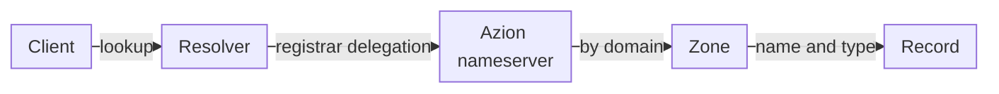
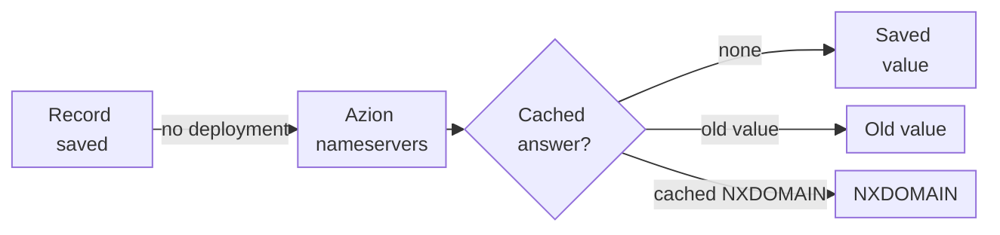
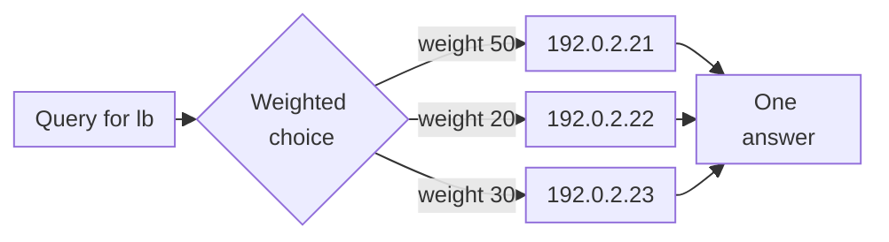
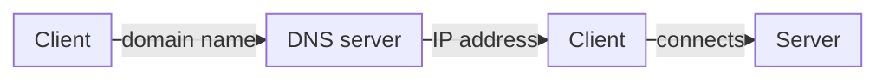
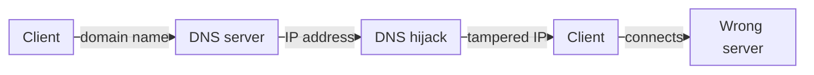
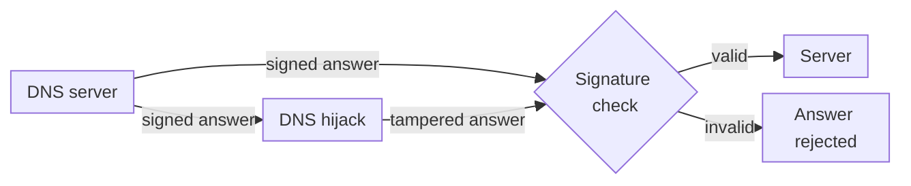

import FrameBox from '@aziontech/webkit/frame-box'
import ItemList from '@aziontech/webkit/item-list'
import DocItem from '@aziontech/webkit/doc-item'

[DNS](https://www.azion.com/en/learning/dns/what-is-dns/) turns domain names into IP addresses through a hierarchy of servers. An authoritative nameserver holds the records of a domain and answers questions about them. A resolver takes a client's lookup, follows the domain's delegation to those nameservers, asks one of them, and caches the answer for as long as its time to live (TTL) allows.

[Edge DNS](/en/documentation/platform/edge-dns/) realizes this with zones and records. A zone hosts one domain and holds its records, and three nameservers on Azion's distributed infrastructure, `ns1.aziondns.net`, `ns2.aziondns.com`, and `ns3.aziondns.org`, answer for every zone. A domain is served by Edge DNS once its registrar delegates it to those nameservers. The fields of a zone and a record are on [Zones and records](/en/documentation/platform/edge-dns/zones-and-records/). To create your first zone, refer to the [Edge DNS quickstart](/en/documentation/platform/edge-dns/quickstart/).

The sections follow a query to its answer: the resolution path, caching and propagation, record policies, ANAME at the apex, and DNSSEC.

---

## The resolution path

Edge DNS is an authoritative service, not a resolver. Azion's nameservers answer for the zones they host and do not perform recursion, so your users keep querying their own resolvers, which reach Azion through the delegation.

This diagram follows a query from a client to the record that answers it:

1. At the domain's registrar, you delegate the domain to all three Edge DNS nameservers. Until the registrar publishes that delegation, public resolvers do not reach Azion. A domain delegated nowhere is answered `NXDOMAIN`, with the SOA of the parent registry rather than Azion's.
2. A client asks its resolver for a name, such as `www.example.com`. The resolver follows the delegation and asks one of the three nameservers.
3. The nameserver finds the zone by its domain, then the record by name and type. Record names are relative to the zone: `www` answers for `www.example.com`, and `@` for `example.com` itself.
4. The nameserver returns the record's values as an authoritative answer, with the record's TTL. The resolver caches the answer for that TTL and passes it to the client.

A name with no record in the zone is answered `NXDOMAIN`, unless a [wildcard record](/en/documentation/platform/edge-dns/record-types/#wildcards) matches it; a name that has its own record always wins over a wildcard. An inactive zone keeps its records, but the nameservers answer its names with `REFUSED`.

The delegation is the only step outside Azion. You can create a zone and its records before the registrar change, and ask `ns1.aziondns.net` directly to see what it answers. Public resolvers reach the zone only after the registrar publishes the delegation. For the nameservers and the SOA values, refer to [Zones and records](/en/documentation/platform/edge-dns/zones-and-records/#nameservers-and-soa).

---

## Caching and propagation

A saved zone or record needs no deployment step. The API stores it when it accepts the request, and the Console when you select **Save**. Azion's nameservers, however, answer from a [cache](https://www.azion.com/en/learning/dns/how-dns-cache-works/) that counts each answer's TTL down. What a nameserver answers after a save depends on what that cache already holds for the name.

This diagram shows what a nameserver answers for a name after you save a record:

1. You save a record in the Console, the CLI, or the API, and the nameservers serve it with no further action.
2. When no answer for the name is cached, a new name that nobody queried before it existed answers within seconds. The first records of a newly created zone can take a few minutes.
3. When the nameservers cached an answer with the old value, they keep serving it until the cache refreshes. A change to an existing record can take a few minutes to reach every nameserver. Deactivating a zone takes effect the same way.
4. When the name was queried before it existed, the nameservers cached that `NXDOMAIN`. A name queried before it existed is answered `NXDOMAIN` for up to one hour, the SOA minimum of 3600 seconds. When a wildcard record in the zone makes the name exist, an early query instead caches an empty `NOERROR` answer, which lasts up to one hour as well.

Behind Azion's nameservers, every resolver keeps its own copy of an answer for the record's TTL, and of a negative answer for up to the SOA minimum. A change is therefore visible to all your users only after Azion's nameservers serve it and each resolver's copy expires. Asking `ns1.aziondns.net` directly skips your resolver's cache, not Azion's.

The cache is what makes answers fast, and it costs you the wait after a change. A long TTL lets resolvers ask less often, and a short TTL lets a change reach them sooner. Lowering the TTL before a planned change shortens the wait, and querying a name only after you create it avoids the cached `NXDOMAIN`. Both practices are on [Best practices for Edge DNS](/en/documentation/platform/edge-dns/best-practices/).

---

## Record policies

A record's policy decides how its values become an answer. Every record has one: *Simple*, the default, or *Weighted*, set in **Policy Type** in the Console and in `policy` in the API.

A *Simple* record answers a query with every value it holds. A name and type hold one simple record, so several answers for one name go in that record's values. A *Weighted* record lets several records share one name and type, each with its own weight from 0 to 255. Each answer carries one record's value, chosen in proportion to the record's weight over the sum of the weights.

This diagram shows three weighted A records on `lb`, with weights 50, 20, and 30 and a TTL of 20 seconds:

1. A resolver asks a nameserver for `lb.example.com`.
2. The nameserver picks one of the three records. The weights add up to 100, so each record's chance is 50, 20, or 30 percent.
3. The answer carries the value of the chosen record only. Like any answer, it is cached and counts its TTL down, so the same address is returned until the TTL expires.
4. The resolver keeps that one answer for the TTL too, so its clients get the same address until then.

A weighted record does not split each client's traffic. The shares even out over many resolvers and many TTL periods, not query by query. A short TTL, such as the 20 seconds above, lets resolvers choose again sooner, but it also makes them ask more often, and Edge DNS counts each query toward the [included usage](/en/documentation/platform/edge-dns/limits/#included-usage-per-plan) of your plan. A record with weight `0` stays in the zone and is never answered, which takes it out of rotation without deleting it. For the record types that accept the weighted policy, refer to [Record types](/en/documentation/platform/edge-dns/record-types/).

---

## ANAME at the apex

A domain's apex, such as `example.com`, already holds records that Azion writes: the zone's SOA and its NS set. A CNAME blocks every other type on its name, so a CNAME cannot sit at the apex, and the API refuses a CNAME named `@` with `19005`. Pointing the apex at another hostname takes another record type.

An ANAME record points a name at an Azion hostname and is answered as an A record. Edge DNS looks up the target and answers the query with addresses, so the apex can serve a domain through other Azion products and keep its SOA, NS, MX, and TXT records. An ANAME target is a name under `azioncdn.net`, `azionedge.net`, or `azionedge.com`, such as `<your-workload>.map.azionedge.net`, and the record's TTL is `20`. An ANAME is not limited to the apex: any name in the zone accepts one. For its rules, refer to [Record types](/en/documentation/platform/edge-dns/record-types/#aname).

A CNAME on another name follows the same idea inside the zone. When a CNAME points to a name in the same zone, Edge DNS returns the CNAME and the target's records in one response, so the resolver needs no second query.

---

## DNSSEC

A DNS answer travels from the nameserver to the client through resolvers and networks the client does not control. Nothing in a plain answer proves that it came from the authoritative nameserver unchanged. [DNSSEC](https://www.azion.com/en/learning/dns/what-is-dnssec/) adds an extra layer of security: digital signatures on the answers, which the recipient verifies.

This diagram shows a normal lookup, with no tampering:

This diagram shows a hijack, where an intermediary tampers with the answer:

This diagram shows the same hijack against a signed answer:

1. In a normal lookup, the client sends the domain name, the DNS server returns the IP address, and the client connects to the server at that address.
2. In a hijack, an intermediary changes the IP address in the answer on its way to the client. The client connects to another destination, which can serve fraud.
3. With DNSSEC, the DNS server signs its answer. The recipient checks the signature: an unchanged answer passes, and the client reaches the right server.
4. A tampered answer no longer matches its signature. It fails the check and is rejected.

Edge DNS signs a zone once you turn DNSSEC on for it. Azion generates two keys for the zone, a key-signing key and a zone-signing key, both with algorithm 13, `ECDSAP256SHA256`. The private keys stay with Azion, and Azion's nameservers publish the public keys as two `DNSKEY` records, with flags `257` for the key-signing key and `256` for the zone-signing key. Each answer carries an `RRSIG` record, the signature of that record. Azion writes these records itself, and you add no DNSSEC record to the zone.

The signatures prove nothing until a resolver trusts the keys. That trust comes from the parent zone, through the delegation signer (DS) record. The DS record holds a hash, the digest, of the zone's key-signing key, and your registrar publishes it for the domain. A validating resolver uses the DS record to verify the `DNSKEY` records, and the keys to verify the `RRSIG` of each answer. A verified signature shows that a record, such as an A, AAAA, CNAME, or PTR record, came from the authoritative nameserver with its content preserved. For the four values of the DS record, refer to [DNSSEC](/en/documentation/platform/edge-dns/dnssec/#ds-record).

The two halves of the chain happen at different times. The DNSSEC status reads `ready` once Azion has signed the zone and generated the DS values, whether or not the registrar holds them. An `RRSIG` in an answer therefore shows that the zone is signed, not that resolvers validate it: validation starts only when the registrar publishes the DS record. Signing reaches answers through the nameservers' cache like any change, so answers cached before DNSSEC was turned on can be served unsigned for a few minutes.

DNSSEC provides cryptographic authentication of data, data integrity, and authenticated denial of existence. For that last guarantee, the DNSSEC standard defines the `NSEC` and `NSEC3` records, which prove that a queried name does not exist. DNSSEC does not encrypt anything. Answers and keys travel in plain text and can be cached, which keeps DNS fast, so DNSSEC does not keep a lookup confidential. To encrypt the traffic between a client and your application, use HTTPS.

---

## Related resources

<FrameBox>
<ItemList>
  <DocItem title="Zones and records" href="/en/documentation/platform/edge-dns/zones-and-records/">Every zone and record field, the nameservers and SOA values, and the API errors.</DocItem>
  <DocItem title="Record types" href="/en/documentation/platform/edge-dns/record-types/">The value format and rules of each record type, including ANAME, CNAME, and wildcards.</DocItem>
  <DocItem title="DNSSEC" href="/en/documentation/platform/edge-dns/dnssec/">The DNSSEC setting of a zone, its status values, and the DS record your registrar needs.</DocItem>
  <DocItem title="Best practices for Edge DNS" href="/en/documentation/platform/edge-dns/best-practices/">How to plan TTLs and changes so that new and changed records answer when you expect.</DocItem>
</ItemList>
</FrameBox>
