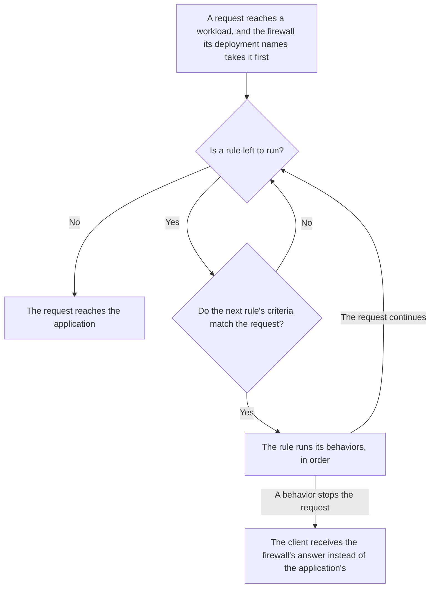
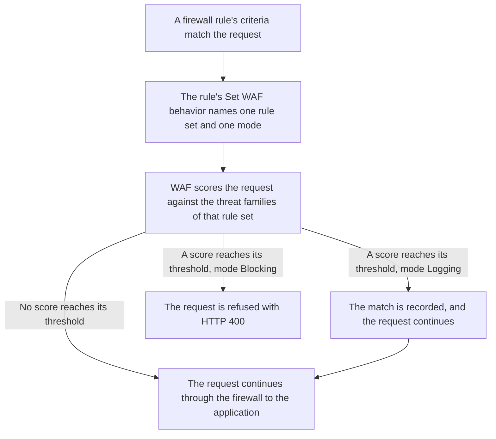
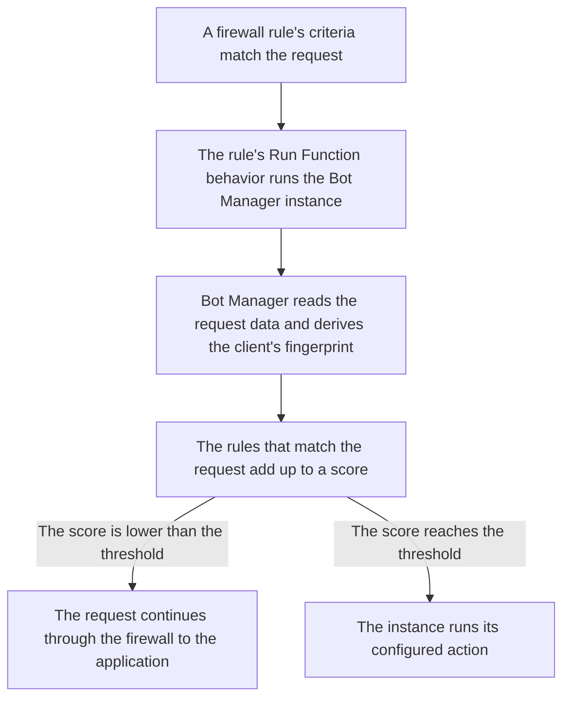

import FrameBox from '@aziontech/webkit/frame-box'
import ItemList from '@aziontech/webkit/item-list'
import DocItem from '@aziontech/webkit/doc-item'

A request to a website or an API can be refused before any of the application's code runs. A checkpoint in front of the application reads what the request carries: the address it comes from, the path it asks for, and the headers it sends. It compares them with conditions you wrote, and a request that meets one receives the action you attached to it. A request that meets none continues to the application unchanged.

On Azion, that checkpoint is a [firewall](/en/documentation/platform/firewall/), an instance of the Firewall Platform Resource. A [workload](/en/documentation/platform/workloads/) binds one firewall through its deployment, so every request to the workload crosses the firewall before the [application](/en/documentation/platform/applications/) behind it. The conditions and actions are the rules of [Rules Engine for Firewall](/en/documentation/platform/firewall/rules-engine/), and each rule pairs criteria with behaviors. Three Products widen what a rule can decide. Web Application Firewall (WAF) scores a request against known attack patterns, and Network Shield compares its client address with a list. Bot Manager weighs whether the client behind the request is a script or a person.

This page covers the mechanisms rather than the fields: every criterion, operator, and behavior is on Rules Engine for Firewall, and every bound is on [Firewall limits](/en/documentation/platform/firewall/limits/). The sections follow the path a request travels, how rules run, and what the client receives. They then cover the Products enabled on a firewall, functions on a firewall, propagation, and observability. WAF, Network Shield, and Bot Manager close the page, in that order.

---

## The path a request travels

A firewall inspects nothing until a workload names it. The binding lives on the workload's deployment, not on the firewall and not on the workload record. In Azion Console it is the **Firewall** field of **Deployment Settings**, and in the API it is the deployment's `strategy.attributes.firewall`. `azion create workload-deployment` takes it as `--firewall-id`. The same deployment names the application, so the firewall and the application always travel together.

A firewall carries no domain of its own. It inspects the requests of every workload whose deployment names it, and a firewall that no deployment names inspects no request.

This diagram follows one request, from the workload it reaches to the answer it receives:



1. A request reaches a workload. The firewall that the workload's deployment names takes the request before the application does.
2. The firewall runs its rules in order, and for each rule it compares the rule's criteria with the request.
3. A rule whose criteria do not match runs nothing, and the firewall moves to the next rule.
4. A rule whose criteria match runs its behaviors, in the order they are arranged.
5. A behavior that stops the request, such as a deny, answers the client, and no later rule runs for that request.
6. A request that no rule stops reaches the application behind the workload.

The refusal happens in the firewall, so the application never receives a request that a rule stops. For example, a rule that denies a list of addresses answers `403` to each of them, and the application sees none of those requests. The price is that order decides. The first rule that stops a request settles it, so where a rule sits matters as much as what it says. One firewall can serve the deployments of several workloads, and a change to its rules then reaches every one of them.

---

## How rules run

A rule pairs criteria, the conditions a request must meet, with behaviors, the actions taken when it meets them. The criteria sit in blocks. Inside a block, the first criterion opens with `if`, and each next one joins it with `and` or `or`. When the criteria match the request, the rule runs its behaviors in the order they are arranged, and when they do not, the rule runs nothing. For every criterion, operator, and behavior, refer to [Rules Engine for Firewall](/en/documentation/platform/firewall/rules-engine/#criteria).

### Rule order

A firewall runs its rules in sequence until one of them blocks or restricts the request, or until every rule has run. Each rule carries an `order`, which the API assigns in creation order starting at `0`, and the **Rules Engine** list in Azion Console can be reordered. A behavior such as _Deny (403 Forbidden)_ finishes the execution of rules: no later behavior and no later rule runs for that request.

Order therefore changes outcomes that the rules alone do not show. For example, a rule that rate-limits a login path never counts the requests an earlier rule denies, because those requests never reach it.

Rule order also sets the order in which the firewall's protections act on a request. [DDoS Protection](/en/documentation/platform/workloads/#ddos-protection) acts first: it assesses each request for a DoS or DDoS attack, and blocks or allows it, before any rule runs. WAF, Network Shield, Bot Manager, and functions have no fixed order of their own, because each acts only through a rule. Network Shield acts through a rule's _Network_ criterion, WAF through _Set WAF_, and Bot Manager and other functions through _Run Function_. They therefore act in the order of the rules that call them, and none of them acts on a request an earlier rule stopped. Inside one rule, _Set WAF_ and _Run Function_ run in the order the rule arranges them.

A rule belongs to the firewall it was created on, and the API keeps it under that firewall's `/v4/workspace/firewalls/<firewall-id>/request_rules`. A rule therefore cannot be shared with another firewall. To start a firewall from the rules of another, clone it: the **Firewalls** list in Azion Console offers **Clone** on each row. The API describes a clone as a deep copy of the firewall, its function instances and its Rules Engine rules included.

### Behaviors that end the list

Most behaviors cannot be followed by another one in the same rule. Only _Run Function_ and _Set WAF_ can be followed by another behavior, and Azion Console offers each of them once per rule. Choosing _Deny (403 Forbidden)_, _Drop (Close Without Response)_, _Set Rate Limit_, or _Set Custom Response_ removes every behavior after it. A rule that runs a function and then denies the request is therefore valid, and a rule that denies and then runs a function is not.

A behavior that sets a response does not add up across rules. When the criteria of several rules that carry _Set Custom Response_ are met, only the one from the last of those rules runs.

### Rate limits

_Set Rate Limit_ counts requests per second or per minute, as its **Rate Limit Type** field sets. Its **Limit By** field counts them per client IP address or across all clients. The count belongs to the rule. A rule whose criteria match more than one URI through `or` shares one rate limit across all of them. A separate limit for each URI therefore takes one rule for each URI. Azion applies the configured rate in each data center, with a leaky bucket algorithm.

A request over the rate is not refused at once. The **Maximum Burst Size** sets how many simultaneous requests are queued and released at the configured rate, and it applies only to a per-second rate. For example, with a rate of one request per second and a burst of one, requests sent one after another are each held about one second and then served. Only requests that arrive at the same time, beyond the burst, receive `429`.

No rate-limit header comes back on any response, whether the request was served or refused. A client therefore has no signal of how long to wait before it retries. For the fields and their ranges, refer to [Set Rate Limit](/en/documentation/platform/firewall/rules-engine/#set-rate-limit).

---

## What the client receives

The behavior that stops a request decides what the client receives, and a request that no rule stops receives the application's response. This table lists what each outcome returns:

| Outcome | API value | What the client receives |
| --- | --- | --- |
| _Deny (403 Forbidden)_ | `deny` | `403` and Azion's default error page, headed **Forbidden**. |
| _Drop (Close Without Response)_ | `drop` | No HTTP response: no status line and no body, at once. Over HTTP/2 the request's stream is reset, and over HTTP/1.1 the connection closes with nothing sent. |
| _Set Rate Limit_, beyond the burst | `set_rate_limit` | `429` and the default error page, headed **Too Many Requests**, with no rate-limit header. |
| _Set Custom Response_ | `set_custom_response` | The status code, content type, and body the behavior sets. The status code ranges from 200 to 499. |
| _Set WAF_ in _Blocking_, with a score at its threshold | `set_waf` | `400` and the default error page, headed **Bad Request**. |
| _Run Function_ | `run_function` | Whatever the function decides. A Bot Manager instance with `action` set to `deny` answers `403`. |
| No rule stops the request | — | The application's response. |

A dropped request reaches `curl` as an error rather than as a status:

```text
$ curl -i https://<your-workload-domain>/
curl: (92) HTTP/2 stream 1 was not closed cleanly: PROTOCOL_ERROR (err 1)

$ curl --http1.1 -i https://<your-workload-domain>/
curl: (52) Empty reply from server
```

A script that reads the status code with `curl` gets `000`, and a browser shows a connection error rather than an Azion page. The firewall closes a dropped request about 0.15 seconds after TLS completes, not on a timeout, so a `000` within a fraction of a second marks a drop rather than a network fault.

Deny and drop differ in what the client learns. A deny tells the client it was refused, and its error page shows a request ID that a person blocked by mistake can report. A drop tells the client nothing. That leaves an automated client no status to react to, and it leaves a person blocked by mistake nothing to report.

---

## Products enabled on a firewall

A firewall decides with the criteria and behaviors its enabled Products make available. In Azion Console, the firewall's **Main Settings** carry the sections **General**, **Modules**, **Debug Rules**, and **Status**. The **Modules** section holds four switches: **DDoS Protection Unmetered**, **Functions**, **Network Shield**, and **Web Application Firewall**. The API carries the same four in the firewall's `modules` object.

A new firewall starts with three of them on. A firewall created through the API with only a `name` returns its `modules` object set to:

```json
{
  "ddos_protection": { "enabled": true },
  "functions": { "enabled": true },
  "network_protection": { "enabled": true },
  "waf": { "enabled": false }
}
```

The **Create Firewall** page in Azion Console starts with the same switches on. A firewall created from a Console drawer instead of that page starts with **Functions** off, so check that switch before you rely on _Run Function_.

[DDoS Protection](/en/documentation/platform/workloads/#ddos-protection) is always on. Its switch carries the tag **Automatically enabled in all accounts** and cannot be turned off, and the API treats `ddos_protection` as read-only.

Each of the other three gates what a rule can use. A gated option stays visible in the Rules Engine form while its Product is off, disabled and relabeled with the Product it needs:

| Product on the firewall | What it adds to a rule | Label while the Product is off |
| --- | --- | --- |
| Web Application Firewall | The criteria _Header Accept_, _Header Accept Encoding_, _Header Accept Language_, _Header Cookie_, _Header Origin_, _Header Referer_, _Header User Agent_, _Request Args_, and _Request Method_, and the behavior _Set WAF_ | _Set WAF - required WAF_, and the same suffix on each criterion |
| Network Shield | The criterion _Network_, `${network}` in the API | _Network - required Network Shield_ |
| Functions | The behavior _Run Function_ | _Run Function - required Functions_ |
| None | The criteria _Host_, _Request Uri_, _Scheme_, _Ssl Verification Status_, and _Client Certificate Validation_, and the behaviors _Deny (403 Forbidden)_, _Drop (Close Without Response)_, _Set Rate Limit_, and _Set Custom Response_ | Always offered |

A firewall needs at least one of [Functions](/en/documentation/platform/functions/), Web Application Firewall, or Network Shield enabled to work. The built-in behaviors need no Product. Azion Console always offers them, and _Deny (403 Forbidden)_, _Drop (Close Without Response)_, and _Set Rate Limit_ are enforced on a firewall with Network Shield off. Azion Console reads the saved firewall, so after you turn a Product on, save **Main Settings** before its options become selectable.

Bot Manager has no switch. It runs as a function instance on the firewall, invoked by a _Run Function_ behavior, so it depends on Functions being on. For that chain, refer to [Bot Manager](/en/documentation/platform/firewall/how-it-works/#bot-manager).

Gating keeps a rule from depending on a Product the firewall does not run. The cost is that rules and settings then depend on each other in both directions. For the two refusals this produces, refer to [What Network Shield adds to a firewall](/en/documentation/platform/firewall/how-it-works/#what-network-shield-adds-to-a-firewall).

---

## Functions on a firewall

A function on a firewall runs in the request phase, the only phase a firewall has: its rules are all request rules. Three objects stand between a function and a request. The function declares the `firewall` execution environment, a function instance on the firewall carries its arguments, and a rule's _Run Function_ behavior names that instance by its ID.

When the rule's criteria match, the behavior hands the request to Azion Runtime, which runs the function and returns an outcome. Rules Engine for Firewall then resumes from the point where the behavior ran, based on that outcome. The function can deny the request, drop it, or answer it itself. For the methods a firewall function calls on the request, refer to [Functions for Firewall](/en/documentation/platform/firewall/functions/#event-methods).

A function carries default arguments, and each instance carries its own. The function's arguments are the basis for every instance, and the instance's arguments override them. The defaults are applied when the function runs, not copied into the instance: an instance created with an empty object stores `{}`. Nothing validates an instance's arguments either, so a misspelled key is stored and ignored while the function runs on its default. For more information, refer to [Function instances for Firewall](/en/documentation/platform/firewall/functions-instances/#arguments).

One function can back several instances on a firewall, each with its own arguments and each run by its own rule. That is how one installed function serves two slices of traffic with two configurations. An instance belongs to the firewall it was created on, and a function written for the application execution environment cannot be instantiated on a firewall. For the bounds on an instance name and its arguments, refer to [Firewall limits](/en/documentation/platform/firewall/limits/#rules-and-function-instances).

---

## Propagation

A saved change does not reach traffic at once. It propagates across Azion's distributed infrastructure, and how long that takes depends on what changed. No duration is guaranteed:

| What changed | Time until requests show it |
| --- | --- |
| A rule added to a firewall that already serves traffic | 6 minutes 29 seconds to 9 minutes 18 seconds |
| A workload newly bound to a firewall, until its first rule is enforced | Several minutes, and no duration is guaranteed |
| The items of a Network List that rules already reference | 46 to 61 seconds for the first changed answer, and about 100 seconds for every answer |
| The arguments of a function instance | About 105 seconds |

Between the first changed answer and the last, requests alternate between the previous result and the changed one. A single request right after a change therefore proves little. For example, after you remove your own address from a blocklist, one request can pass and the next can still be refused.

A new workload answers with Azion's placeholder `404` until its application binding propagates, and the firewall can enter the path much later than the application. A domain that answers therefore does not mean the firewall is in the path yet. Check a change by repeating the request until it answers as expected and the answers agree, never by one request.

---

## Observability

A firewall decision leaves little in the response. No header names the firewall, the rule, or the list that decided. Every response, stopped or not, carries an `x-azion-request-id` header, and Azion's default error page repeats that ID in its Request ID row. Its Your IP row shows the client address, which is the address a _Network_ criterion compares with its list:

```text
$ curl -i https://<your-workload-domain>/
HTTP/2 403
server: nginx
date: Thu, 01 Jan 2026 12:00:00 GMT
content-type: text/html; charset=utf-8
x-content-type-options: nosniff
x-azion-request-id: <request-id>
x-azion-edge-location: <edge-location>
alt-svc: h3=":443"; ma=86400

<title>Azion - Default error page</title>
...
<h1 class="error-header__title">Forbidden</h1>
...
Your IP         <your-ip>
Request ID      <request-id>
Status Code     403
Edge Location   <edge-location>
```

The status tells the outcomes apart: `403` for a deny, `429` for a rate limit, `400` for a WAF block, and no response at all for a drop. A dropped request carries no header, so its client has no request ID to report.

Which rule decided is answered from the logs, and only while the firewall's **Debug Rules** setting is on. The setting sits in **Main Settings**, logs the rules that run, and is off by default. With it on, [Real-Time Events](/en/documentation/platform/real-time-events/) and [Data Stream](/en/documentation/platform/data-stream/) show the rules a request ran in the `$traceback` field. The Real-Time Events GraphQL API shows them in the `$stacktrace` variable.

Keeping the rule out of the response means a client cannot learn which rule blocked it, and the lookup moves to you. A client can report a status and a request ID, and the rule behind them comes from the logs. For the procedure, refer to [Debug rules created with Rules Engine](/en/documentation/guides/application-development/getting-started/debug-rules/).

---

## WAF

A request can carry an attack in its query string, in a header, or in the body it posts. A web application firewall reads those parts before the application does and weighs what it finds against known attack patterns. When the evidence adds up, it refuses the request, and otherwise the request reaches the application unchanged.

On a firewall, WAF acts at one point of the request path: a rule whose _Set WAF_ behavior names one rule set and one mode. The rule set holds what to detect, eight threat families and the sensitivity chosen for each, and the rule decides when it applies. A managed rule set configured elsewhere transfers in the same shape: you choose categories, which are the threat families here, and a strictness for each, which is its sensitivity. The individual rules stay with the platform. WAF must also be enabled on the firewall, and it is the one Product a new firewall carries off: `modules.waf.enabled` reads `false` until you turn it on. A rule set applied on a firewall without WAF never runs. For where that switch is, refer to [Set a firewall's main settings](/en/documentation/guides/application-security/firewall-and-waf/firewall-configure-main-settings/).

The fields of a rule set, its threat families, its five sensitivity levels, and its internal rules are on [WAF rule sets](/en/documentation/platform/firewall/waf/rules-set/). The fields of an exception are on [WAF exceptions](/en/documentation/platform/firewall/waf/custom-allowed-rules/).

### Where WAF acts on a request

Creating a rule set inspects nothing. A rule set is a configuration object that carries no domain, no path, and no method, so it scores exactly the requests a rule's criteria hand it. A rule carries one _Set WAF_ behavior at most, so one rule decides one rule set and one mode for the requests it matches.

This diagram follows a request from the rule that matches it to the WAF decision:



1. A rule on the firewall matches the request, and its _Set WAF_ behavior names one rule set and one mode, `logging` or `blocking`.
2. WAF scores the request against the threat families configured in that rule set.
3. A score that reaches its family's threshold makes the request a match.
4. In _Blocking_, a match is refused with `400`. In _Logging_, a match is recorded and served.
5. A request that reaches no threshold continues through the firewall's rules to the application.

Keeping the rule set apart from the rule is what lets one rule set run two ways. The mode belongs to the behavior, so the same rule set runs in _Logging_ on one rule and in _Blocking_ on another, over paths you choose. It costs an object and a step: a rule set that no rule references inspects nothing, however carefully its families are set.

For how WAF scores a request, what each mode does, and how exceptions and tuning narrow a rule set, refer to [Scoring and modes](/en/documentation/platform/firewall/waf/scoring-and-modes/).

---

## Network Shield

Some traffic is unwanted because of where it comes from rather than what it asks for. The source can be one address that abused a login form, a whole network, or a country your service does not operate in. Blocking by origin compares the client address of each request with a list, and it refuses the request before the application sees it. The list can change as often as the threats do, while the rule that reads it stays the same.

On a firewall, Network Shield acts through one criterion of a rule. The list is a [Network List](/en/documentation/platform/firewall/network-shield/network-lists/), and the comparison is the _Network_ criterion, `${network}` in the API. What happens to a request that matches is the rule's behavior, which Rules Engine for Firewall defines and Network Shield does not change. A Network List decides nothing on its own, and creating one blocks no request. A list matches traffic only once a rule references it, on a firewall that a workload's deployment names.

### What Network Shield adds to a firewall

Network Shield adds one thing to a firewall: the _Network_ criterion. While Network Shield is off, the API refuses a rule that uses `${network}` with `25047 Missing Required Modules`. Azion Console shows the option disabled, as _Network - required Network Shield_. Every behavior a matching rule runs belongs to Firewall: _Deny (403 Forbidden)_, _Drop (Close Without Response)_, and _Set Rate Limit_ are enforced with Network Shield off. A rule can chain the _Network_ criterion with any other criterion the firewall offers.

A new firewall starts with Network Shield on: the Console switch defaults to on, and the API returns `modules.network_protection.enabled` as `true`. The switch sits in **Main Settings**, in the **Modules** section, and the _Network_ option becomes selectable after you save the firewall with it on. Once a rule uses the _Network_ criterion, Network Shield cannot be turned off. The change is refused with `24005`, and its detail lists the IDs of the rules.

Both refusals matter when a rule moves between firewalls. A _Network_ rule recreated on a firewall where Network Shield is off is refused until Network Shield is on there. On the firewall the rule came from, Network Shield turns off only after every _Network_ rule there is deleted or changed. A rule that uses the _Network_ criterion counts toward the firewall's rules like any other rule. For the rules each plan includes, refer to [Firewall limits](/en/documentation/platform/firewall/limits/#included-usage-per-plan).

The price of matching on origin is that the _Network_ criterion reads the client address alone. It says where a request comes from and nothing about what it carries. A rule that also needs the path chains a second criterion, such as _Request Uri_, in the same block. For example, a rule can deny the countries in a list unless the request comes from Googlebot. Its criteria are _Network_ _matches_ the list _and_ _Header User Agent_ _does not match_ `Googlebot`, and its behavior is _Deny (403 Forbidden)_. _Header User Agent_ needs WAF on the firewall, and a client sets its own `User-Agent`, so any client can claim to be Googlebot.

For how a list matches a client address, when its items expire, and the lists Azion maintains, refer to [List matching](/en/documentation/platform/firewall/network-shield/list-matching/).

---

## Bot Manager

A script and a person reach an application the same way, over HTTP, and the request is all there is to tell them apart. Bot management weighs the evidence one request carries: the headers it sends, the address it comes from, and the session it presents. Each check that finds something adds points to one score. When the score reaches a figure you set, the request is acted on, and under that figure the application receives the request unchanged.

On a firewall, Bot Manager acts as a function instance, not as a switch in **Modules**. The installed Bot Manager function is instanced on the firewall with a JSON arguments object, and a rule whose behavior is _Run Function_ runs it. The instance holds the score at which Bot Manager acts and the action it takes, and the rule decides which requests are scored at all.

[Bot Manager Lite](/en/documentation/platform/firewall/bot-manager/bot-manager-lite/) is the self-serve edition, installed from Azion Marketplace. The two editions differ in what they score with rather than in what they do with a score.

### Where Bot Manager acts on a request

An installed Bot Manager function scores nothing on its own. Five objects put a request under inspection, and each one names the next:

- The installed Bot Manager function.
- A firewall with Functions enabled.
- A function instance on that firewall, carrying the arguments.
- A rule on that firewall whose _Run Function_ behavior names the instance.
- A workload bound to the firewall through its deployment.

This diagram follows a request from the rule that matches it to the Bot Manager decision:



1. A rule on the firewall matches the request, and its _Run Function_ behavior runs one Bot Manager instance, with the arguments that instance carries.
2. Bot Manager reads the data the request carries, including its device, browser, and network data, and derives the fingerprint of the client behind it.
3. Bot Manager scores the request against its rules and compares the score with the instance's threshold.
4. A score equal to or higher than the threshold runs the configured action. A lower score lets the request continue to the application.

Keeping the selection in a rule makes the inspection yours to aim: one instance scores the requests its rule matches, not everything the firewall sees. It costs an object and a step. An instance that no rule names is inert, however its arguments are set, and a rule whose criteria never match scores nothing.

For how Bot Manager builds a score and acts on it, and how fingerprints, session cookies, and modes shape it, refer to [Bot scoring](/en/documentation/platform/firewall/bot-manager/bot-scoring/).

---

## Related resources

<FrameBox>
<ItemList>
  <DocItem title="Rules Engine for Firewall" href="/en/documentation/platform/firewall/rules-engine/">Every criterion, operator, and behavior a rule combines, with the fields behind the rule order on this page.</DocItem>
  <DocItem title="Functions for Firewall" href="/en/documentation/platform/firewall/functions/">The firewall event and the methods a function calls to deny, drop, or answer a request.</DocItem>
  <DocItem title="Function instances for Firewall" href="/en/documentation/platform/firewall/functions-instances/">The fields and arguments of an instance, and the Run Function behavior that runs it.</DocItem>
  <DocItem title="Firewall limits" href="/en/documentation/platform/firewall/limits/">The bounds these mechanisms operate within, for the firewall and for WAF, Network Shield, and Bot Manager.</DocItem>
</ItemList>
</FrameBox>
