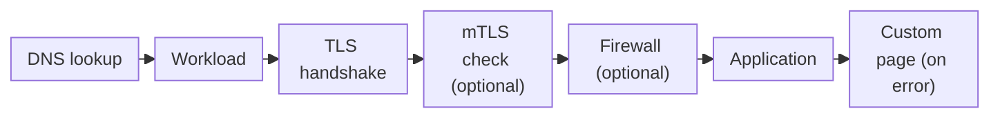
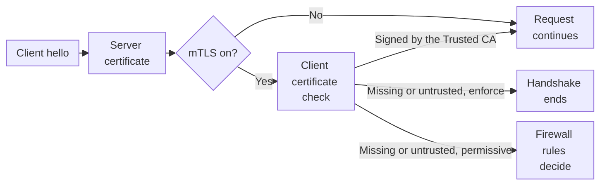
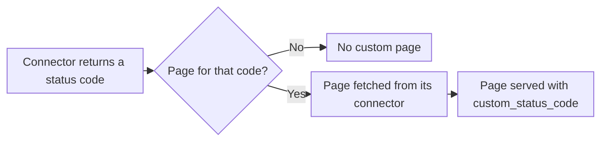
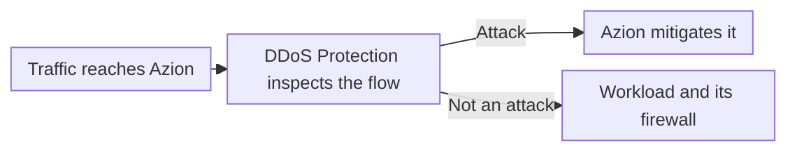

import FrameBox from '@aziontech/webkit/frame-box'
import ItemList from '@aziontech/webkit/item-list'
import DocItem from '@aziontech/webkit/doc-item'

Before a website answers a request, three things happen at the point where traffic enters. A DNS lookup turns the hostname into an address. The client opens a secure connection, in which the server proves it holds a certificate for that name. The platform then picks the configuration that answers the hostname. Only then does any application code run.

On Azion, that entry point is a [workload](/en/documentation/platform/workloads/). It holds the hostnames a request can arrive on, the TLS settings of the connection, and the ports and HTTP versions it accepts. Its deployment names the [application](/en/documentation/platform/applications/) that answers, and optionally the [firewall](/en/documentation/platform/firewall/) that inspects requests first and the custom page set that replaces error responses. On API v3, one domain object carried this role. On API v4, the workload and its deployment replace it, and [API v4 Migration](/en/documentation/fundamentals/api-v4-migration/) maps the two models.

This page covers the mechanisms rather than the fields: every field is on [Workload settings](/en/documentation/platform/workloads/settings/), and every bound is on [Workloads limits](/en/documentation/platform/workloads/limits/). The sections follow the path a request travels, the workload domain and custom domains, the infrastructure, TLS and HTTP versions, the deployment, and propagation. Certificate Manager, Custom Pages, and DDoS Protection close the page, in that order.

---

## The path a request travels

A request reaches a workload by its hostname, and the workload decides everything that happens before the application sees it. The hostname is either the workload domain that Azion generates or a domain of your own listed on the workload. The connection, the client certificate check, and the firewall all belong to the workload and its deployment, so the application receives only requests that passed them.

This diagram follows one request from the DNS lookup to the response:



1. The client looks up the hostname. For a custom domain that points to the workload domain, DNS returns the address of the nearest data center of Azion's distributed infrastructure.
2. The client connects to that data center, and the workload that lists the hostname takes the request.
3. The workload completes the TLS handshake with its certificate, its minimum TLS version, and its cipher suite. With mTLS on, it also checks the client's certificate.
4. When the deployment names a firewall, the firewall runs its rules on the request before the application does.
5. The application in the deployment handles the request and fetches content through its connector.
6. When the connector answers with an error status code that the deployment's custom page set covers, the client receives the custom page in place of that response.

Keeping the entry point apart from the application means the hostnames and TLS settings change without touching application code. The cost is that a request's path depends on two objects. A workload with no propagated deployment has no application to send the request to, and an application serves no traffic until a deployment binds it to a workload.

---

## Workload domain and custom domains

A hostname is the name a client asks for, and a workload answers only the hostnames it lists. Creating a workload generates its workload domain, a read-only hostname in the `azionedge.net` zone. A production workload gets `<id>.map.azionedge.net`, and a staging workload gets `<id>.preview.azionedge.net`. The workload serves traffic on that hostname as soon as its deployment propagates, before you own or point any domain.

Two more kinds of hostname go in the workload's domains. The first is the free hostname under `azion.app`, such as `my-site.azion.app`, which the Console calls **Azion Custom Domain**. A workload holds one at most, and a name that another workload holds is not available. Azion serves it over HTTPS with its own SAN certificate, so it needs no certificate of yours.

The second kind is a custom domain: a hostname of a domain you already own, such as `www.example.com`. You list each one on the workload, then point it at the workload domain with a CNAME record at your DNS provider. [Edge DNS](/en/documentation/platform/edge-dns/) can hold the zone instead and link the domain to Azion. The account must have permission for every domain the workload lists.

For example, a site that runs at `www.example.com` with another provider moves to Azion in two changes. You add `www.example.com` to the workload's domains, and then you replace the DNS record of `www.example.com` with a CNAME to the workload domain. Visitors reach the workload once their resolvers pick up the new record. For the DNS records step by step, refer to [Point a domain to a workload](/en/documentation/guides/platform/migration/point-domain-to-azion/).

The workload domain stays reachable alongside your own hostnames while **Workload Domain Allow Access** is on, which is the default. Turn it off when the workload must answer only on your own hostnames: the workload domain then answers `404`, while your domains keep serving. A workload cannot close its workload domain without another hostname to answer on, so the API refuses that change on a workload whose domains list is empty. The workload domain also sits in a zone that Azion shares with other customers. Serving a domain of your own therefore needs a server certificate for that domain, as TLS and HTTP versions describes. For the rules the API applies to each hostname, refer to [Workload settings](/en/documentation/platform/workloads/settings/#domains).

---

## Infrastructure

A workload runs on one of two networks, chosen once. The **Infrastructure** control picks the Production Network, for global availability, or _Staging Infrastructure_, the Staging Network for testing with limited propagation. The choice also sets the workload domain's suffix: `.map.azionedge.net` on production and `.preview.azionedge.net` on staging.

A staging workload takes no custom domain, so you reach it only through its workload domain. Changes you make to it do not affect a production workload. To open an application on your own hostname before its DNS records change, use a production workload that lists the hostname. Then map that hostname to the workload domain's address in your device's hosts file. Every other visitor still reaches the current provider. For the steps, refer to [Test an application through the hosts file](/en/documentation/guides/application-development/getting-started/stage-applications-through-hosts-file/).

The infrastructure is fixed at creation, and the API refuses an update that changes it. For example, a configuration you tested on a staging workload reaches production as a second workload, created with the production infrastructure, not as an edit of the first. The price of the split is that staging and production are two workloads with two deployments, which you keep in step yourself.

---

## TLS and HTTP versions

TLS encrypts the connection between the client and the workload, and the workload's `tls` settings decide whether a handshake succeeds. The workload presents a certificate for the hostname, and the client and the workload agree on a TLS version and a cipher. These settings secure the leg from the client to Azion. The connection from Azion to your origin is set on the [connector](/en/documentation/platform/connectors/) the application uses.

The certificate comes from one of two places. With `tls.certificate` set to `null`, the workload uses Azion's SAN certificate, which covers the workload domain and the Azion Custom Domain. For a domain of your own, you bind a server certificate from Certificate Manager, and the certificate protects HTTPS traffic once the workload uses it. The API does not compare the certificate's names with the workload's domains, so it accepts a certificate that does not cover them. Check the names before you bind one.

The minimum TLS version and the cipher suite act as the gate on the handshake. The minimum version is the lowest one the workload accepts, so a session can still use a newer version. The client and the workload negotiate one cipher from the suite for each session. A higher floor refuses clients that support only older versions, and a lower one admits them, down to TLS 1.0, which is deprecated. For the ciphers each suite holds, refer to [Cipher suites](/en/documentation/platform/workloads/settings/#cipher-suites).

A client that sends no Server Name Indication (SNI) names no host in the handshake, so it reaches the default configuration, which presents the Azion SAN certificate. On a workload with mTLS in `enforce` mode, Azion closes such a connection before it resolves a route of your application. For the rest of the mTLS requirements, refer to [mTLS](/en/documentation/platform/workloads/mtls/#requirements).

HTTP/3 runs over QUIC, and a client reaches it through an upgrade. On the first request, the handshake and the response use TCP with HTTP/1.1 or HTTP/2. The response carries an `Alt-Svc` header that announces HTTP/3. A browser that supports HTTP/3 then sends later requests over QUIC, until the cached `Alt-Svc` answer is missing or expires. The first request always arrives over TCP, and the API accepts `http3` in a workload's HTTP versions only alongside `http1` and `http2`. In the Console, **HTTP/3 support** also requires **HTTPS support** to be on.

---

## The deployment

A workload carries hostnames and TLS settings, but no application. The deployment binds them: it names the application, which is required, and optionally a firewall and a custom page set. In Azion Console these are the **Application**, **Firewall**, and **Custom Page** fields of **Deployment Settings**. In the API they are `strategy.attributes.application`, `strategy.attributes.firewall`, and `strategy.attributes.custom_page` on `/v4/workspace/workloads/{workload_id}/deployments`.

A firewall has no domain of its own, and the workload record holds no firewall field, so the firewall binding lives on the deployment. Until a deployment names the firewall, the firewall's rules see no request to the workload. The same holds for a custom page set, which takes effect only when the deployment names it.

A workload holds one deployment, and the API refuses a second one. Every hostname of the workload therefore reaches the same application, firewall, and custom page set. Changing any of them means editing that one deployment, in **Deployment Settings** or with `PATCH /v4/workspace/workloads/{workload_id}/deployments/{deployment_id}`, and the edit reaches every hostname at once. A change to the deployment propagates like any other workload change, as Propagation describes.

Until a deployment propagates, the workload domain answers with Azion's HTML error page. Before the deployment propagates, a request to the workload domain gets the `404` and the `x-azion-request-id` header that identifies the request:

```text
$ curl -sI https://<your-workload-domain>/get
HTTP/2 404 
server: nginx
content-type: text/html
x-azion-request-id: <request-id>
x-azion-edge-location: <edge-location>
```

For the deployment fields and the CLI flags that set them, refer to [Workload settings](/en/documentation/platform/workloads/settings/#deployment).

---

## Propagation

A saved change to a workload or its deployment does not reach traffic at once. It spreads across Azion's distributed infrastructure, data center by data center, and that takes several minutes. Azion does not guarantee a duration: propagation is best-effort.

While a change spreads, requests can receive the old configuration or the new one, depending on the data center that answers. Each data center serves one configuration or the other, and the share of data centers on the new one grows until all of them agree. For example, right after mTLS is turned on in `enforce` mode, a client with no certificate can still receive `200` from a data center that lacks the change. Meanwhile, a data center that has it refuses the same client's handshake.

A single request right after a change therefore proves little. Check a change by repeating the request until it answers as expected and the answers agree. The cost of best-effort propagation is that no change is atomic: design each change so that the old and the new configuration can serve side by side. For example, keep the workload domain open until your own hostnames answer everywhere, then turn **Workload Domain Allow Access** off.

---

## Certificate Manager

[Certificate Manager](/en/documentation/platform/workloads/#certificate-manager) stores the certificates a workload uses for TLS. A server certificate is one you upload with its private key, or one Azion requests from Let's Encrypt and renews for you. A Trusted CA certificate is the certificate of an authority you trust to sign client certificates. Certificate Manager also stores certificate revocation lists (CRLs) and creates certificate signing requests (CSRs).

A workload uses a certificate only once you bind it. A server certificate goes in `tls.certificate`, a Trusted CA certificate in `mtls.config.certificate`, and CRLs in `mtls.config.crl`. The API refuses a certificate sent in the field meant for the other kind. An uploaded certificate reads `inactive` until a workload names it, and `active` from then on, so the status shows whether any workload uses it.

### Where Certificate Manager acts on a request

Certificate Manager acts during the TLS handshake, before any firewall rule or application sees the request. A certificate that no workload names takes part in no handshake.

This diagram follows a handshake from the client's hello to the request that continues:



1. The client opens a TLS connection to one of the workload's hostnames and names that hostname through SNI.
2. The workload presents its server certificate. With `tls.certificate` set to `null`, that is Azion's SAN certificate, and a server certificate you bind protects the names it covers once the workload uses it.
3. With mTLS off, the handshake completes, and the request continues to the firewall and the application.
4. With mTLS on, the workload requests a client certificate and checks it against the Trusted CA certificate in `mtls.config.certificate`.
5. In `enforce` mode, a client with no certificate, or with one another authority signed, cannot complete the handshake. In `permissive` mode, the handshake completes, and a firewall rule on Client Certificate Validation can refuse the request.

Storing certificates apart from the workload lets you replace one without editing the workload's other settings. The cost is that the certificate and the workload are checked separately. The API accepts a certificate whose names do not cover the workload's domains, and binding one is a workload change that propagates over several minutes. For how `enforce` and `permissive` treat each client, refer to [mTLS](/en/documentation/platform/workloads/mtls/#verification-modes).

For how Azion validates, issues, and renews a Let's Encrypt certificate, refer to [Issuance and renewal](/en/documentation/platform/workloads/certificate-manager/issuance-and-renewal/).

---

## Custom Pages

When an origin cannot find a resource or fails to respond, the client receives the origin's own error response. A custom page replaces that response with content you choose, for one status code at a time. The client sees the replacement page, and the origin's own error page never reaches it.

On a workload, Custom Pages acts through a custom page set: a named list of pages, one per HTTP status code. Each page names a [connector](/en/documentation/platform/connectors/), the path of its content on that connector, the time the content stays in cache, and an optional status code for the response. A set covers client errors (4xx) and server errors (5xx), and it takes effect only when the workload's deployment names it.

### Where Custom Pages acts on a request

A custom page acts after the application has fetched a response. When a client requests content, the application sends the request to the origin through its connector, and the connector returns a status code that says whether the request succeeded. That status code decides whether a page applies.

This diagram follows a response from the connector's status code to what the client receives:



1. The application sends the request to the origin through its connector, and the connector answers with a status code.
2. Azion looks for a page with that code in the custom page set the deployment names. A code tagged Azion in the Console that has no page serves Azion's default page.
3. When a page matches, Azion fetches its content from the page's connector at the page's `uri`, and keeps it in cache for the page's `ttl`.
4. The client receives that content in place, with no redirect and no `Location` header. The status is the page's `custom_status_code`.

For example, a connector that answers `/status/404` with `404` can be replaced by the HTML document the connector serves at `/html`, still with status `404`. The browser stays on the URL it asked for and shows your page. The cost of caching is that an edited page reaches clients only after its `ttl` expires: a long `ttl` spares your origin, and a short one picks up edits sooner.

For the fields of a set and its pages, and the status codes a page can replace, refer to [Custom page settings](/en/documentation/platform/workloads/custom-pages/settings/).

---

## DDoS Protection

A denial-of-service attack floods a service with traffic until legitimate requests cannot get through. It can come from a single IP address, or from a botnet of many machines sending at once. Mitigating it means telling attack traffic apart from real traffic before either reaches the service, and dropping the first.

DDoS Protection is a Platform feature, and it is always on. The Platform mitigates DDoS attacks on every workload, with nothing to create and nothing to configure. Azion carries out the mitigation without affecting the performance of your applications. It applies whether your origin runs on premises or in a cloud, and whether your network is IPv4, IPv6, or both.

### Where DDoS Protection acts on a request

DDoS Protection acts on Azion's distributed infrastructure, ahead of the workload's firewall. It continuously monitors the network flow by inspecting incoming traffic, and it assesses each request for a DoS or DDoS attack before any firewall rule runs.

This diagram follows incoming traffic from its arrival to the workload:



1. Traffic for any workload reaches Azion's distributed infrastructure.
2. DDoS Protection inspects the network flow with detection algorithms that find small attacks from a single IP address and large-scale attacks from botnets.
3. Azion mitigates the traffic it identifies as an attack.
4. Other traffic continues to the workload, where the firewall that the deployment names runs its rules.

Mitigation that needs no configuration protects a workload from the moment it exists, and it leaves nothing for you to tune. Detection and mitigation for a specific attack are built as rules on a [firewall](/en/documentation/platform/firewall/). To see the volume of attacks, use [Azion Console](https://console.azion.com/) or the [Azion API](https://api.azion.com/). For attack records and monitoring, use [Real-Time Events](/en/documentation/platform/real-time-events/), [Real-Time Metrics](/en/documentation/platform/real-time-metrics/), or [Data Stream](/en/documentation/platform/data-stream/) connectors, which send events to SIEM and big data services.

For the attacks DDoS Protection mitigates and the techniques it uses, refer to [Attack mitigation](/en/documentation/platform/workloads/ddos-protection/ddos-mitigation/).

---

## Related resources

<FrameBox>
<ItemList>
  <DocItem title="Workload settings" href="/en/documentation/platform/workloads/settings/">Every field of a workload and its deployment, with the type, default, and allowed values behind the mechanisms on this page.</DocItem>
  <DocItem title="Workloads quickstart" href="/en/documentation/platform/workloads/quickstart/">Create a workload, bind an application in its deployment, and send your first request through its workload domain.</DocItem>
  <DocItem title="mTLS" href="/en/documentation/platform/workloads/mtls/">How a workload verifies client certificates in enforce and permissive mode, and what each client receives.</DocItem>
  <DocItem title="Troubleshoot Workloads" href="/en/documentation/platform/workloads/troubleshooting/">Symptoms along the request path, from a domain that answers 404 to a handshake that fails, with their causes and fixes.</DocItem>
</ItemList>
</FrameBox>
