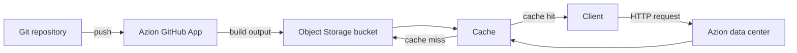

import FrameBox from '@aziontech/webkit/frame-box'
import ItemList from '@aziontech/webkit/item-list'
import DocItem from '@aziontech/webkit/doc-item'

## Purpose

An architecture page shows one Reference Architecture from the Use Case catalog: how Products and Platform Resources combine into one design. The reader wants to understand the shape of the design before building it.

It applies the **explanation** base form, the same form as a [concept page](/en/documentation/style-guide/content/concept/). The difference is the subject: a concept page explains one thing, an architecture page explains how many things fit together.

## When to use

Write an architecture page when:

- A design needs more than one Product or Platform Resource, and the relationship between them is the point.
- The reader must see the order of a request or a dataflow to understand the design.
- A guide keeps redrawing the same system in prose.

Do not write an architecture page when:

- The subject is one product or one idea. Write a [concept page](/en/documentation/style-guide/content/concept/).
- The reader wants to build the thing. Write the [use-case page](/en/documentation/style-guide/content/use-cases/) that builds it, or a [multi-product guide](/en/documentation/style-guide/content/multi-product-guides/), and link it from here.
- The catalog has no entry for the design. Propose it to the Use Case catalog first; the page comes after the entry.
- The design cannot be drawn. A design you cannot draw is one you do not yet understand well enough to publish.

## Register

Descriptive: 25 words per sentence, active voice, passive only when the actor is unknown. Tone: explanatory, plain, systematic. [Sentence structure](/en/documentation/style-guide/writing/sentence-structure/) holds the rules.

## Structure

The title is the Reference Architecture name from the catalog, verbatim. That name is a noun phrase naming the system built, such as `Server-rendered headless CMS website`, never with a *Reference Architecture* suffix. The opening paragraph is the entry's Summary: what problem the design solves, and for whom. It names the Use Case the design implements, linked to the use-case page where one is published.

**Required sections, in order**

- **`## Architecture diagram`**: the diagram as a `mermaid` code fence, then a paragraph that reads it.
- **`### Dataflow`**: a numbered walkthrough of what moves where, with six items at most.
- **`## Components`**: one entry per Component of the catalog entry, with its role. Products go by name, Platform Resources lowercase as instances, and features and integrations labeled as the catalog labels them.
- **`## Implementation`**: only links. The use-case page goes here when it builds this design, followed by the guides and Marketplace templates that implement all or part of it. A use-case page that builds a sibling design is linked from the opening paragraph, as the Use Case the architecture implements, and not here.
- **`## Related resources`**: the closing section, a `DocItem` list, each row with its reason.

## Template

````mdx
import FrameBox from '@aziontech/webkit/frame-box'
import ItemList from '@aziontech/webkit/item-list'
import DocItem from '@aziontech/webkit/doc-item'

<The entry's Summary: what problem this design solves, for whom, and which Use Case it implements.>

## Architecture diagram

```mermaid
flowchart LR
  <the design, as text an agent can read>
```

<A paragraph that reads the diagram: what to look at first, and what depends on what.>

### Dataflow

1. <What moves first, and where it goes.>
2. <What the platform does with it.>
3. <Where the flow ends.>

## Components

- **<Component name>**: <what it does and why it is there>.
- **<Component name>**: <what it does and why it is there>.

## Implementation

- [<Use-case page, only when it builds this design>](<page URL>) - <why the reader follows it>.
- [<Guide or template that implements part of it>](<URL>) - <which part it implements>.

## Related resources

<FrameBox>
<ItemList>
  <DocItem title="<Related page>" href="<page URL>"><what the reader gets there>.</DocItem>
</ItemList>
</FrameBox>
````

## Rules

- **Draw the diagram in `mermaid`.** The diagram is text, so an agent fetching the markdown twin reads the design itself instead of an image reference. Do not use an image for an architecture diagram.
- **The diagram never stands alone.** The numbered dataflow carries the meaning, and it stays even when the diagram renders.
- **Label every node and edge in words**, and never rely on color alone to carry a distinction.
- **Name every component and say why it is there.** A list of product names is a parts list.
- **Link the implementation, do not inline it.** Steps belong in a [how-to guide](/en/documentation/style-guide/content/how-to-guides/) or a [multi-product guide](/en/documentation/style-guide/content/multi-product-guides/).
- **Write only the sections you can confirm.** A required section whose content you cannot confirm with the team that owns the product is left out until you can, never filled with a guess.
- **Report the permalink when the page ships**, so the catalog entry's Docs field can read Published.

## Examples

- [Deploy Jamstack websites](/en/documentation/use-cases/build-and-run-applications/build-and-run-marketing-websites/): the published page the catalog maps to *Git-driven static website*. It carries a diagram, a numbered dataflow, the components involved, and links out to the implementation.

This trimmed excerpt shows the opening, the diagram section, and the dataflow of the *Git-driven static website* page. The catalog records that Reference Architecture under the Use Case *Build and run marketing websites*. No use-case page is published yet, so the Use Case is named without a link:

````mdx
A static website whose pages and content live in a Git repository. The Azion GitHub App builds the site on every push and deploys the output to Object Storage. An application serves the output through Cache, and a previous build can be redeployed to roll back. This design implements the Use Case *Build and run marketing websites*.

## Architecture diagram



The diagram carries two flows. The publish flow runs from the repository through the GitHub App to the bucket, and it moves only on a push. The request flow runs from the client to a data center on Azion's distributed infrastructure. There, Cache answers from its copy or reads the file from the bucket.

### Dataflow

Content moves through the design in this order:

1. A push to the repository triggers the Azion GitHub App, which builds the site.
2. The GitHub App deploys the build output to the Object Storage bucket.
3. A client sends an HTTP or HTTPS request to the domain of the application that serves the bucket.
4. In the data center, Cache answers the request from its copy of the file when it holds one.
5. On a cache miss, the application reads the file from the bucket, and Cache stores it for the next request.
````

## Related

<FrameBox>
<ItemList>
  <DocItem title="Concept pages" href="/en/documentation/style-guide/content/concept/">The same base form, for one idea rather than a system.</DocItem>
  <DocItem title="Multi-product guides" href="/en/documentation/style-guide/content/multi-product-guides/">The page that builds what this one describes.</DocItem>
  <DocItem title="Images" href="/en/documentation/style-guide/formatting/images/">Alt text and asset paths.</DocItem>
  <DocItem title="Choose a content type" href="/en/documentation/style-guide/content/choose-a-content-type/">The full catalogue of page kinds.</DocItem>
</ItemList>
</FrameBox>
