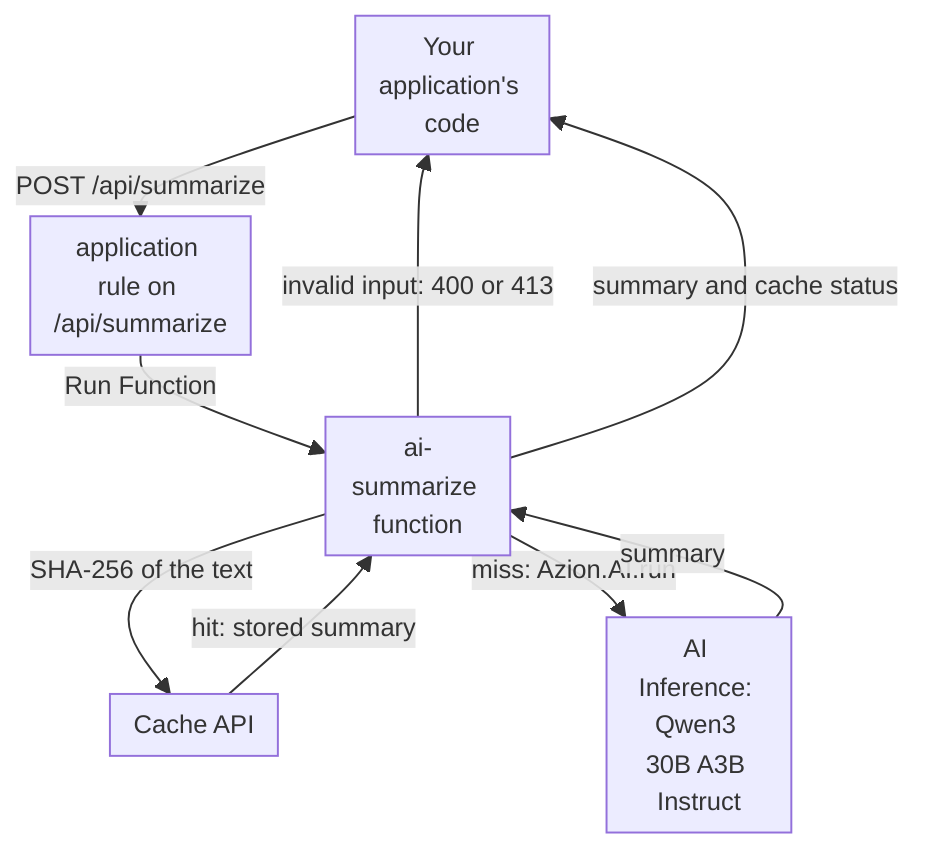

import DocCardGroup from '@aziontech/webkit/doc-card-group'
import DocCard from '@aziontech/webkit/doc-card'

A product team wants AI features such as summarization, classification, moderation, or image understanding in an application it already runs, without operating GPU infrastructure. The application already sits behind Azion, and the team wants one more API route that it can call from its code like any other. This page adds a summarization route to that application: a function validates the request, calls a model from the AI Inference catalog, caches the result for identical text, and returns the summary. The result is measured by inference latency per request, consumption per thousand requests, and task accuracy on a test set.

This use case does not cover conversational assistants grounded in company content, or training models from scratch. For assistants, refer to [Build and run customer support AI assistants](/en/documentation/use-cases/build-and-run-ai-workloads/build-and-run-customer-support-ai-assistants/).

## Prerequisites

- An Azion account. If you do not have one, [create an account](https://console.azion.com/signup).
- An application and a workload that already serve your application, with **Application Accelerator** turned on, which the **Run Function** behavior requires. To create them, refer to [Applications quickstart](/en/documentation/platform/applications/quickstart/).

---

## Required products

| The feature needs | Which means | Product | Documented in |
| --- | --- | --- | --- |
| A model that summarizes, with no inference server to run | A catalog model called with `Azion.AI.run` | AI Inference | [Call a model on AI Inference from a function](/en/documentation/guides/ai/inference/call-a-model-on-ai-inference-from-a-function/) |
| One API route that validates input and shapes output | A function that the application runs on `/api/summarize` | Functions | [Functions quickstart](/en/documentation/platform/functions/quickstart/) |
| The same text summarized once, not on every request | Results stored and matched with the Cache API, keyed by a hash of the text | Cache | [Cache a function's response with the Cache API](/en/documentation/guides/application-development/functions-and-runtime/cache-a-function-response-with-the-cache-api/) |
| A view of how often the route runs | The **Invocations** dashboard of the **Functions** tab | Real-Time Metrics | [Build dashboards](/en/documentation/platform/real-time-metrics/build-dashboards/#functions) |
| A rule that runs the function on the route | The **Run Function** behavior, which requires Application Accelerator on the application | Application Accelerator | [Run a function on an application](/en/documentation/guides/application-development/functions-and-runtime/serverless-functions/) |

---

## Reference architecture

This page builds the *Catalog-model inference API*: the model is used as AI Inference publishes it, behind a function your application calls.

Read the diagram from the function outward. The arrows that reach the function come from a route of an application that already serves your traffic, so your application's code reaches the model through one more path on a domain it already calls. The arrows that leave the function are one execution: the function holds the request open while the model generates, and no arrow leads to an inference server, because the function names a model id and Azion runs the model. The model is used as published, so the design has no training step and no model version to choose beyond the id.

### Dataflow

1. Your application's code sends `POST /api/summarize` with the text to summarize, and the application's rule runs the `ai-summarize` function. Every other path keeps its own rules.
2. The function validates the body before any model call, and refuses a missing text with `400` and a text over 20,000 characters with `413`.
3. The function hashes the text and looks the hash up in the cache. A match returns the stored summary with no model call.
4. On a miss, the function sends the text to the catalog model with `Azion.AI.run`, with an instruction to summarize it, and AI Inference runs the model and returns the summary.
5. The function stores the summary in the cache under the hash, for one day.
6. The function returns the summary and whether it came from the cache.

### Platform Resources

- **application**: the Platform Resource that routes `/api/summarize` to the function. The route is one rule on the application that already serves your traffic, so the domain, the TLS certificate, and any authentication in front of it are the ones the application already has. Azion issues no credential for a model call, so a route with no check of its own answers anyone who reaches it.
- **Functions**: handles each request. The `ai-summarize` function holds the prompt, the model id, the input bounds, and the shape of the response, so every decision about what the model receives is code your team owns.
- **AI Inference**: runs the catalog model, `Qwen/Qwen3-30B-A3B-Instruct-2507-FP8`. Your team loads no model and sizes no cluster, and the id from the model's page is the only address the function needs.
- **Cache**: stores results for repeated inputs, a design option. The function keys a result by a hash of its input through the Cache API, and uses it only for tasks whose output is the same for every identical input.
- **Real-Time Metrics**: reports the latency and volume of the route. A design with no inference server of its own still needs a view of what the route carried.

### Other designs for this use case

- *Fine-tuned inference API with LoRA adapters*: for teams whose task needs a specialized model. The team trains a LoRA adapter on its own dataset with LoRA Fine-Tune, evaluates it, and serves the base model with the adapter on AI Inference behind the same kind of function API, which adds a training and evaluation control flow and a model-version decision before serving.

---

## How the design works

This section explains the summarization function and the route that runs it, and the reason behind each choice.

### The summarization function

The function is the whole feature: it decides what the model is asked, what it may receive, and what the caller gets back.

- **The model is `Qwen/Qwen3-30B-A3B-Instruct-2507-FP8`.** Its page lists summarization among its uses, it serves a 64k-token context, and it is the model the AI Inference Starter Kit calls. The function calls it as [Call a model on AI Inference from a function](/en/documentation/guides/ai/inference/call-a-model-on-ai-inference-from-a-function/) describes, with `stream` set to `false` and the summarization instruction as the `system` message.
- **A text is at most 20,000 characters.** The model reads every character it receives, and the function waits while it does, so a bound on the input is a bound on the wait. The response's `usage.prompt_tokens` shows what a text consumed, which is how to adjust the bound.
- **`max_tokens` is `300`.** A summary is short by definition, and the cap ends a generation that runs on.
- **A result is cached for one day under the SHA-256 of the text.** The same text yields a summary the caller can reuse, so a repeated text costs no model call. The function caches as [Cache a function's response with the Cache API](/en/documentation/guides/application-development/functions-and-runtime/cache-a-function-response-with-the-cache-api/) describes, with the cache `ai-summarize`, the key `https://ai-summarize.cache/<sha-256 of the text>`, and `max-age=86400`.
- **The model's text is read with optional chaining.** A response missing a level yields an empty summary, which the function reports as `502`, instead of an exception.

### The API route

The route is a rule on the application that already serves your application. It matches `/api/summarize` exactly, so no other path of your application runs the function, and it runs in the Request Phase, because the function produces the whole response.

---

## Measuring results

| Metric | Where to read it | What working looks like |
| --- | --- | --- |
| Inference latency per request | The **Request Time** of requests to `/api/summarize`, in the **HTTP Requests** data source of [Real-Time Events](/en/documentation/platform/real-time-events/data-sources/#http-requests) | Requests answered from the cache are faster than misses, and misses stay stable as volume grows |
| Request volume | **Total Invocations** on the **Invocations** dashboard of the **Functions** tab in [Real-Time Metrics](/en/documentation/platform/real-time-metrics/build-dashboards/#functions) | Follows your application's own traffic to the feature |
| Consumption per thousand requests | `compute_time` over `invocations`, times 1,000, from the consumption dataset in [Query usage data from Functions](/en/documentation/guides/platform/observability/query-functions-usage-data-with-graphql/). Functions and AI Inference are each charged at their own rates, in [Pricing](/en/documentation/fundamentals/pricing/) | Falls as the share of cached answers rises |
| Task accuracy on a test set | A fixed set of texts with reference summaries, sent to `/api/summarize` after every change to the prompt or the model | Holds or rises from one run to the next |

---

## Best practices

- **Validate in the function, before the model call.** The function is the one place a request can be refused before a model runs, and every model call consumes Compute Time. For the reasoning, refer to [AI Inference best practices](/en/documentation/platform/ai-inference/best-practices/).
- **Cache only tasks whose output can be reused.** A summary of identical text can stand for every request that sends it. A task whose answer must differ per user or per moment, such as one that reads the current time, must not go through the cache.
- **Copy the model id from its page.** Model ids do not share one form, so an id derived from the model name can be wrong for another model. To change the model, copy the id from [AI models](/en/documentation/platform/ai-inference/models/) and change the cache name, so summaries from the old model are not returned for the new one.
- **Add authentication when the route is public.** The route answers anyone who reaches your domain, and each miss runs a model. When your application has a session or an API key, check it in the function before the cache lookup.

---

## Guides in this use case

<DocCardGroup cols={2}>
  <DocCard title="Summarize text with AI Inference and cache the summary" href="/en/documentation/guides/ai/inference/summarize-text-with-ai-inference-and-cache-the-summary/" label="Holds the ai-summarize function's code, creates its instance, and runs the checks of this use case." />
  <DocCard title="Run a function on an application" href="/en/documentation/guides/application-development/functions-and-runtime/serverless-functions/" label="Creates the rule that runs the function on /api/summarize, in Azion Console or with the API." />
  <DocCard title="Cache a function's response with the Cache API" href="/en/documentation/guides/application-development/functions-and-runtime/cache-a-function-response-with-the-cache-api/" label="Stores each summary under the hash of its text and returns it for the same text." />
  <DocCard title="Call a model on AI Inference from a function" href="/en/documentation/guides/ai/inference/call-a-model-on-ai-inference-from-a-function/" label="Sends the text to the catalog model with Azion.AI.run and reads the summary from the response." />
</DocCardGroup>
