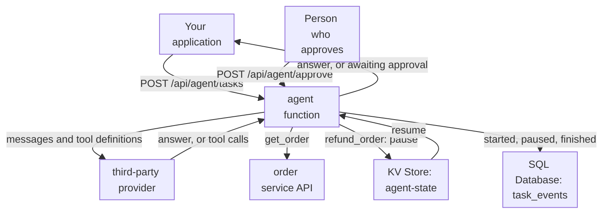

import DocCardGroup from '@aziontech/webkit/doc-card-group'
import DocCard from '@aziontech/webkit/doc-card'

A product or operations team builds agents that complete tasks instead of only answering: they call internal APIs and SaaS tools, keep state across steps, and hand off to a person for approval when needed. A model that can call tools still decides nothing on its own. Something has to run the loop, execute each tool the model asks for, stop before an action a person must approve, and remember where the task stopped. This page runs that loop as a function on Azion with a tool-calling model from a third-party provider, keeps paused tasks in KV Store, and records every task in SQL Database. The result is measured by task completion rate, steps and latency per task, and the share of actions that needed human approval.

This use case does not cover assistants that only answer from company content, or exposing tools to external agents. For those, refer to [Build and run customer support AI assistants](/en/documentation/use-cases/build-and-run-ai-workloads/build-and-run-customer-support-ai-assistants/) and [Deploy remote MCP servers](/en/documentation/use-cases/build-and-run-ai-workloads/deploy-remote-mcp-servers/).

## Prerequisites

- An application and a workload that serve your domain, with **Application Accelerator** turned on, which the **Run Function** behavior requires. To create them, refer to [Applications quickstart](/en/documentation/platform/applications/quickstart/).
- KV Store and SQL Database enabled on the account. Both are in Preview and not enabled by default, so request access through [Technical Support](/en/documentation/support/).
- A personal token with the **Edit SQL Database** permission, for the database and KV Store calls. To create one, refer to [Personal tokens](/en/documentation/guides/platform/account-and-billing/personal-tokens/).
- The [Azion CLI](/en/documentation/devtools/cli/), installed and authorized, to store the environment variables.
- A third-party provider whose chat endpoint accepts the OpenAI chat completions format with tool definitions, with its URL, the name of a model that supports tool calling, and an API key.
- The values of your own setup. This page gives the agent two tools over an order service at `https://api.example.com/v1`: `get_order`, which reads `GET /orders/{id}`, and `refund_order`, which calls `POST /orders/{id}/refunds` and needs a person's approval. It uses `agent-state` for the KV Store namespace, `agent-history` for the database, and `www.example.com` for the domain. Replace each value with yours in every step.

---

## Required products

| The agent needs | Which means | Product | Documented in |
| --- | --- | --- | --- |
| A loop that sends the task to the model, runs the tools it asks for, and stops when it answers | A function that calls the provider and the internal APIs with `fetch()` | Functions | [Functions quickstart](/en/documentation/platform/functions/quickstart/) |
| A paused task that resumes where it stopped | The task's messages and pending action, stored under the task's ID until a person decides | KV Store | [KV Store API](/en/documentation/devtools/runtime/api-reference/kv-store/) |
| A record of every task, its steps, and its approvals | A `task_events` table written through the Azion API | SQL Database | [Write rows to SQL Database from a function](/en/documentation/guides/application-development/data/write-sql-database-rows-from-a-function/) |
| Rules that run the function on the agent's paths | The **Run Function** behavior, which requires Application Accelerator on the application | Application Accelerator | [Run a function on one path, and roll it back](/en/documentation/guides/application-development/functions-and-runtime/run-a-function-on-one-path-and-roll-it-back/) |

The model comes from the third-party provider. A team that runs the model on AI Inference instead calls a model whose Tool calling capability is Yes in [AI models](/en/documentation/platform/ai-inference/models/), with the same `tools` array.

---

## Reference architecture

This page builds the *Tool-calling agent over third-party LLMs*: every step of the loop calls the provider's API, and the tools run in the function.



Read the diagram from the function outward. The loop lives in the function, and every turn of it crosses to the provider: the arrow to the provider is taken once per step, so the provider's latency multiplies by the number of steps, and its failures can end a task at any step. The arrow to the order service leaves Azion only when the tool is an external service. KV Store and SQL Database hold what must outlive one request: the state of a task that waits for a person, and the record of what every task did.

### Dataflow

1. Your application sends a task to `POST /api/agent/tasks`, and the application's rule runs the agent function. The function gives the task an ID, records it as started, and sends the task and the tool definitions to the provider with the provider key.
2. When the model asks for `get_order`, the function calls the order service with the backend token and sends the result back to the model as the next message.
3. When the model asks for `refund_order`, the function stores the task's messages and the pending refund in KV Store, records the pause, and answers `awaiting_approval`.
4. A person sends the decision to `POST /api/agent/approve`. The function reads the task from KV Store, runs the refund only when approved, and resumes the loop.
5. When the model answers with text and no tool call, the function records the task as completed and returns the answer.
6. A provider call that fails ends the task with `502`, and the function writes that failure to its log. A design that adds a second provider moves the task to it instead, so provider keys, latency, and fallback are decided in the function. A task that reaches six steps stops with `step_limit`.

### Components

- **Functions**: runs the agent loop and the tool execution. The loop, the step limit, the approval rule, and the fallback decision are code in the `ops-agent` function, and the provider key is an environment variable the function reads.
- **third-party LLM provider**: the integration that reasons at each step and chooses the tools. It is the one part Azion does not operate, so its availability, its rate limits, and its billing stay with the provider.
- **LangGraph**: the agent framework, a design option. It runs inside the function in place of a hand-written loop, as the LangGraph AI Agent Boilerplate does.
- **KV Store**: holds the step state between requests, in the `agent-state` namespace, read and written by one key per task. A paused task resumes from it, and an expiration on the key drops a task nobody decides on.
- **SQL Database**: holds the task history in the `task_events` table, one row per event, so completion rate, steps per task, and approvals are counted with SQL. A function opens it through a read replica, so the history is written through the Azion API.
- **internal APIs and SaaS tools**: the integrations the tools act on, here the order service at `https://api.example.com/v1`. Each tool is a call from the function, with credentials the function reads from environment variables.
- **application**: the Platform Resource that serves the agent API. Its rules run the function on the agent's paths.

### Other designs for this use case

- *Tool-calling agent on platform-hosted models*: for teams that keep the whole agent on Azion. The function sends the task and the tool definitions to a tool-calling model on AI Inference instead of a provider, so reasoning and tool execution stay inside Azion and only the tool calls leave it.

---

## Configure the agent's stores

The agent keeps two kinds of data, and each one goes where its access pattern fits:

- **A paused task goes to KV Store.** The function reads and writes it by one key, `task:<task-id>`, and only when a task pauses or resumes, far below the one write per second that KV Store accepts on a key. Each write sets `expirationTtl` to `86400`, so a task nobody decides on is dropped after one day.
- **The task history goes to SQL Database.** One row per event lets you count completions, steps, and approvals with SQL. A function opens SQL Database through a read replica, so the agent writes the rows through the Azion API, with a personal token.

To create the namespace, send its name to the KV Store API:

```bash
curl --request POST \
  --url https://api.azion.com/v4/workspace/kv/namespaces \
  --header 'Accept: application/json' \
  --header 'Authorization: Token [TOKEN VALUE]' \
  --header 'Content-Type: application/json' \
  --data '{"name": "agent-state"}'
```

The API answers `201` with the namespace. A namespace cannot be renamed or deleted, so check the name before you send it:

```json
{
  "name": "agent-state",
  "created_at": "2026-09-18T16:35:27.577829",
  "last_modified": "2026-09-18T16:35:27.577829"
}
```

To create the database, send its name to the SQL Database API:

```bash
curl --request POST \
  --url https://api.azion.com/v4/workspace/sql/databases \
  --header 'Accept: application/json' \
  --header 'Authorization: Token [TOKEN VALUE]' \
  --header 'Content-Type: application/json' \
  --data '{"name":"agent-history"}'
```

The API answers `202` with the database in `data`. Keep its `id`, and send `GET /v4/workspace/sql/databases/<database-id>` until `status` reads `created`, which takes about 15 seconds. Then create the table:

```bash
curl --request POST \
  --url https://api.azion.com/v4/workspace/sql/databases/<database-id>/query \
  --header 'Accept: application/json' \
  --header 'Authorization: Token [TOKEN VALUE]' \
  --header 'Content-Type: application/json' \
  --data '{"statements":["CREATE TABLE task_events (task_id TEXT NOT NULL, event TEXT NOT NULL, steps INTEGER NOT NULL, at TEXT NOT NULL);"]}'
```

The API answers `200` with `"state": "executed"`. A statement that fails still answers `200`, with `error` in place of `results` in its entry, so read the entry before you continue.

The account holds the `agent-state` namespace and the `agent-history` database with an empty `task_events` table.

---

## Configure the agent function

The agent function runs the loop on `/api/agent/tasks` and resumes it on `/api/agent/approve`. The decisions it applies:

- **The loop stops at six steps.** A step is one provider call plus the tools it asks for. Six steps bound the time one task holds a request, and they keep an invocation well inside the 50 outbound `fetch()` calls a function may make.
- **A tool result goes back as a `user` message.** The message reads `Result of <tool>: <JSON>`, and the model's tool request goes back as an `assistant` message naming the tools it called. Both use only the `system`, `user`, and `assistant` roles that [Model invocation](/en/documentation/platform/ai-inference/model-invocation/#message-objects) documents for the chat format.
- **`refund_order` pauses the task.** A tool in `APPROVAL_TOOLS` never runs from the loop. The function stores the task and returns the action for a person to decide, and the approval path runs it only when the decision is `approved`.
- **The approval path checks a secret, and a pending action runs once.** The function clears the pending action in KV Store before it runs the tool, so a second approval of the same task answers `404`.
- **Every task ID is validated.** The ID is a UUID the function generated, and the approval path refuses any other value before the ID reaches a SQL statement.
- **Keys stay out of the code.** The provider key, the backend token, the approver secret, and the personal token are environment variables.
- **Every event is one history row.** `record()` writes it as [Write rows to SQL Database from a function](/en/documentation/guides/application-development/data/write-sql-database-rows-from-a-function/) describes, with `SQL_DATABASE_ID` and `AZION_TOKEN`. A failed write is logged as `history_write_failed` and does not stop the task.

To store the values the function reads, run these commands with the Azion CLI. A key that contains `key`, `token`, or `secret` is stored as a secret by default:

```bash
azion create variables --key "PROVIDER_URL" --value "<provider-chat-completions-url>" --secret false
azion create variables --key "PROVIDER_MODEL" --value "<provider-model-name>" --secret false
azion create variables --key "PROVIDER_API_KEY" --value "<provider-api-key>"
azion create variables --key "BACKEND_API_TOKEN" --value "<backend-token>"
azion create variables --key "APPROVER_SECRET" --value "<approver-secret>"
azion create variables --key "AZION_TOKEN" --value "[TOKEN VALUE]"
azion create variables --key "SQL_DATABASE_ID" --value "<database-id>" --secret false
```

Create a function named `ops-agent` with this code. The provider call sends the key as `Authorization: Bearer`; change that header to the one your provider requires:

```javascript
const MAX_STEPS = 6;
const API_BASE = "https://api.example.com/v1";
const APPROVAL_TOOLS = new Set(["refund_order"]);
const UUID = /^[0-9a-f]{8}-[0-9a-f]{4}-[0-9a-f]{4}-[0-9a-f]{4}-[0-9a-f]{12}$/;
const SYSTEM_PROMPT =
  "You are an operations agent for an order service. Use the tools to complete the task. " +
  "Answer with a short summary once the task is done.";

const TOOLS = [
  { "type": "function", "function": {
    "name": "get_order",
    "description": "Get one order by its ID, with its status and total.",
    "parameters": { "type": "object", "properties": { "order_id": { "type": "string" } }, "required": ["order_id"] }
  } },
  { "type": "function", "function": {
    "name": "refund_order",
    "description": "Refund an order in full. A person approves every refund before it runs.",
    "parameters": { "type": "object", "properties": { "order_id": { "type": "string" }, "reason": { "type": "string" } }, "required": ["order_id", "reason"] }
  } }
];

async function runTool(name, args) {
  const headers = {
    "Authorization": `Bearer ${Azion.env.get("BACKEND_API_TOKEN")}`,
    "Content-Type": "application/json"
  };
  const order = encodeURIComponent(args.order_id ?? "");
  let response;
  if (name === "get_order") {
    response = await fetch(`${API_BASE}/orders/${order}`, { headers });
  } else if (name === "refund_order") {
    response = await fetch(`${API_BASE}/orders/${order}/refunds`, {
      method: "POST", headers, body: JSON.stringify({ reason: args.reason })
    });
  } else {
    return { error: `unknown tool ${name}` };
  }
  return response.ok ? await response.json() : { error: `the order service answered ${response.status}` };
}

async function callModel(messages) {
  const response = await fetch(Azion.env.get("PROVIDER_URL"), {
    method: "POST",
    headers: {
      "Authorization": `Bearer ${Azion.env.get("PROVIDER_API_KEY")}`,
      "Content-Type": "application/json"
    },
    body: JSON.stringify({ model: Azion.env.get("PROVIDER_MODEL"), messages, tools: TOOLS })
  });
  if (!response.ok) throw new Error(`provider answered ${response.status}`);
  const body = await response.json();
  return body?.choices?.[0]?.message;
}

async function record(taskId, event, steps) {
  const statement =
    `INSERT INTO task_events (task_id, event, steps, at) VALUES ('${taskId}', '${event}', ${steps}, datetime('now'));`;
  const response = await fetch(
    `https://api.azion.com/v4/workspace/sql/databases/${Azion.env.get("SQL_DATABASE_ID")}/query`,
    {
      method: "POST",
      headers: {
        "Accept": "application/json",
        "Authorization": `Token ${Azion.env.get("AZION_TOKEN")}`,
        "Content-Type": "application/json"
      },
      body: JSON.stringify({ statements: [statement] })
    }
  );
  const body = await response.json();
  const failed = (body.data ?? []).find((entry) => entry.error);
  if (!response.ok || failed) {
    console.log(JSON.stringify({ event: "history_write_failed", taskId, error: failed?.error ?? response.status }));
  }
}

async function runLoop(kv, taskId, state) {
  while (state.steps < MAX_STEPS) {
    state.steps++;
    const message = await callModel(state.messages);
    const calls = message?.tool_calls ?? [];
    if (calls.length === 0) {
      await record(taskId, "completed", state.steps);
      return { task_id: taskId, status: "completed", answer: message?.content ?? "", steps: state.steps };
    }
    state.messages.push({
      role: "assistant",
      content: message.content || `Calling ${calls.map((c) => c.function?.name).join(", ")}.`
    });
    for (const call of calls) {
      const name = call.function?.name;
      const raw = call.function?.arguments ?? {};
      const args = typeof raw === "string" ? JSON.parse(raw) : raw;
      if (APPROVAL_TOOLS.has(name)) {
        state.pending = { name, args };
        await kv.put(`task:${taskId}`, state, { expirationTtl: 86400 });
        await record(taskId, "awaiting_approval", state.steps);
        return { task_id: taskId, status: "awaiting_approval", action: state.pending };
      }
      const result = await runTool(name, args);
      state.messages.push({ role: "user", content: `Result of ${name}: ${JSON.stringify(result)}` });
    }
  }
  await record(taskId, "step_limit", state.steps);
  return { task_id: taskId, status: "step_limit", steps: state.steps };
}

export default {
  async fetch(request, env, ctx) {
    if (request.method !== "POST") {
      return new Response("Method not allowed", { status: 405 });
    }
    const url = new URL(request.url);
    const kv = await Azion.KV.open("agent-state");
    let taskId = null;
    try {
      if (url.pathname === "/api/agent/tasks") {
        const { task } = await request.json();
        if (typeof task !== "string" || task.trim() === "") {
          return Response.json({ error: "task is required" }, { status: 400 });
        }
        taskId = crypto.randomUUID();
        await record(taskId, "started", 0);
        const state = {
          steps: 0,
          pending: null,
          messages: [{ role: "system", content: SYSTEM_PROMPT }, { role: "user", content: task }]
        };
        return Response.json(await runLoop(kv, taskId, state));
      }

      if (url.pathname === "/api/agent/approve") {
        if (request.headers.get("Authorization") !== `Bearer ${Azion.env.get("APPROVER_SECRET")}`) {
          return new Response("Unauthorized", { status: 401 });
        }
        const { task_id, approved } = await request.json();
        if (!UUID.test(task_id ?? "")) {
          return Response.json({ error: "task_id is not a task ID" }, { status: 400 });
        }
        taskId = task_id;
        const state = await kv.get(`task:${taskId}`, "json");
        if (!state?.pending) {
          return Response.json({ error: "no pending action for this task" }, { status: 404 });
        }
        const { name, args } = state.pending;
        state.pending = null;
        await kv.put(`task:${taskId}`, state, { expirationTtl: 86400 });
        await record(taskId, approved === true ? "approved" : "rejected", state.steps);
        const result = approved === true ? await runTool(name, args) : { error: "a person rejected this action" };
        state.messages.push({ role: "user", content: `Result of ${name}: ${JSON.stringify(result)}` });
        return Response.json(await runLoop(kv, taskId, state));
      }

      return new Response("Not found", { status: 404 });
    } catch (error) {
      console.log(JSON.stringify({ event: "task_failed", taskId, error: String(error?.message ?? error) }));
      if (taskId) await record(taskId, "failed", 0);
      return Response.json({ task_id: taskId, status: "failed", error: "the task could not continue" }, { status: 502 });
    }
  },
};
```

Run the function with these values, following [Functions quickstart](/en/documentation/platform/functions/quickstart/):

- **Function instance**: `ops-agent`, with no Args.
- **Rule**: a Request Phase rule created as [Run a function on one path, and roll it back](/en/documentation/guides/application-development/functions-and-runtime/run-a-function-on-one-path-and-roll-it-back/) describes, with these values: the name `agent - tasks and approvals`, one criteria group with `${uri}` _starts with_ `/api/agent/` in place of the guide's path and method groups, and the **Run Function** behavior selecting the `ops-agent` instance. Both agent paths take `POST`, and the function answers any other method with `405`.

A task sent to `/api/agent/tasks` runs until the model answers, a refund needs approval, or six steps pass, and every start, pause, decision, and end lands in `task_events`. A new rule takes a few minutes to propagate.

---

## Verify the setup

- **A read-only task completes.** Send a task that needs only `get_order`:

  ```bash
  curl -s -X POST https://www.example.com/api/agent/tasks \
    -H 'Content-Type: application/json' \
    -d '{"task":"What is the status of order <order-id>?"}'
  ```

  The response carries `"status":"completed"`, an `answer` that states the order's status, and `steps` of 2 or more: one step that calls `get_order`, and one that answers.

- **A refund waits for a person.** Send `{"task":"Refund order <order-id>, the customer received a damaged item."}` to the same path. The response carries `"status":"awaiting_approval"`, the `task_id`, and an `action` naming `refund_order` with the order ID, and the order service has received no refund.

- **An approval resumes the task once.** Approve the refund with the `task_id` from that response:

  ```bash
  curl -s -X POST https://www.example.com/api/agent/approve \
    -H 'Authorization: Bearer <approver-secret>' \
    -H 'Content-Type: application/json' \
    -d '{"task_id":"<task-id>","approved":true}'
  ```

  The response carries `"status":"completed"`, and the order service has received one refund. The same request sent again answers `404` with `no pending action for this task`, and a request without the `Authorization` header answers `401`.

- **Every task is recorded.** Read the events of the refund task through the SQL Database API, with the statement `SELECT event, steps FROM task_events WHERE task_id = '<task-id>' ORDER BY rowid;`. The `results` rows list `started`, `awaiting_approval`, `approved`, and `completed`, in that order.

When a request answers with your application's own page, the rule may still be propagating. When a task answers `failed`, read the `task_failed` line under the **Functions Console** data source of [Real-Time Events](/en/documentation/platform/real-time-events/quickstart/).

---

## Measuring results

| Metric | Where to read it | What working looks like |
| --- | --- | --- |
| Task completion rate | `SELECT COUNT(DISTINCT task_id) FROM task_events WHERE event = 'completed';` over the same count for `started`, through the SQL Database API | Most tasks complete. A rise in `step_limit` or `failed` points at a prompt, a tool, or the provider |
| Steps per task | The `steps` of the `completed` events in `task_events` | Stable per kind of task. A task that keeps reaching six steps needs a better tool description or a narrower task |
| Latency per task | The **Request Time** of requests to `/api/agent/tasks`, in the **HTTP Requests** data source of [Real-Time Events](/en/documentation/platform/real-time-events/data-sources/#http-requests) | Grows with steps, and holds steady for the same kind of task |
| Share of actions that needed human approval | The count of `awaiting_approval` events over the count of `started` events | Matches the share of tasks that ask for a refund, and `rejected` events stay rare |

---

## Best practices

- **Put every action that changes data behind approval until its record is clean.** The model decides when to call a tool, so a tool that moves money or deletes data runs only after a person approves it. Move a tool out of `APPROVAL_TOOLS` only when `task_events` shows its approvals are routine.
- **Describe each tool for the model, not for a developer.** The model picks a tool from its `description` and fills its `parameters` from the schema. A description that says when to use the tool, and a schema that marks each field `required`, cut the steps a task takes.
- **Keep the step limit, and read the tasks that reach it.** A loop with no limit runs until the function's 5-minute wall-clock limit or its 50 outbound calls stop it. The `step_limit` event names the tasks to look at.
- **Write task history through the API, and check each entry.** The SQL Database API answers `200` even when a statement fails, with `error` in that statement's entry, so the function reads every entry and logs a failed write. For the error shapes, refer to [SQL Database best practices](/en/documentation/platform/sql-database/best-practices/).

---

## Guides in this use case

<DocCardGroup cols={2}>
  <DocCard title="Write rows to SQL Database from a function" href="/en/documentation/guides/application-development/data/write-sql-database-rows-from-a-function/" label="Writes one task_events row per event and checks every statement entry." />
  <DocCard title="Run a function on one path, and roll it back" href="/en/documentation/guides/application-development/functions-and-runtime/run-a-function-on-one-path-and-roll-it-back/" label="Creates the rule that runs the agent function on /api/agent/, and turns it off to roll back." />
</DocCardGroup>
