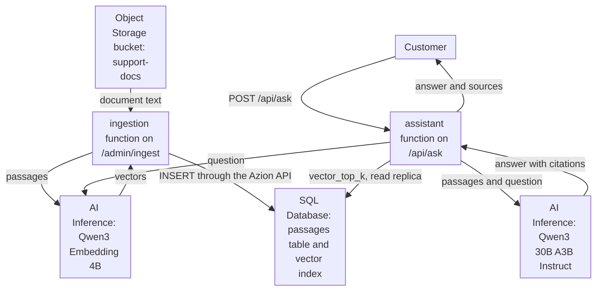

import DocCardGroup from '@aziontech/webkit/doc-card-group'
import DocCard from '@aziontech/webkit/doc-card'

A support or product team wants an assistant that answers customers from the company's own documentation, help center, or product data, instead of from a model's general knowledge. A model alone answers from what it learned in training, so it cannot know a return policy or a plan limit that only your documents state. This page sets up the whole assistant on Azion: a function splits the documents stored in Object Storage, embeds each passage with a model on AI Inference, and stores the passages in SQL Database for vector search. A second function embeds each question, retrieves the closest passages, and asks a model on AI Inference to answer from them and cite them. The result is measured by answer latency, the share of answers that cite retrieved sources, and answer accuracy on a test set.

This use case does not cover AI features that are not conversational. For those, refer to [Add AI features to existing applications](/en/documentation/use-cases/build-and-run-ai-workloads/add-ai-features-to-existing-applications/).

## Prerequisites

- An Azion account. If you do not have one, [create an account](https://console.azion.com/signup).
- An application and a workload that serve your domain, with **Application Accelerator** turned on, which the **Run Function** behavior requires. To create them, refer to [Applications quickstart](/en/documentation/platform/applications/quickstart/).
- SQL Database enabled on the account. The product is in Preview and is not enabled by default, so request access through [Technical Support](/en/documentation/support/).
- An Object Storage bucket with `workloads_access` set to `read_only`, holding the documents as UTF-8 text or Markdown files. To create the bucket and upload the files, refer to [Object Storage quickstart](/en/documentation/platform/object-storage/quickstart/).

---

## Required products

| The assistant needs | Which means | Product | Documented in |
| --- | --- | --- | --- |
| The company's documents in one place the assistant reads from | A bucket that the ingestion function reads with the `azion:storage` module | Object Storage | [Object Storage API](/en/documentation/devtools/runtime/api-reference/storage/) |
| Passages that can be found by meaning, not by keyword | A table with a vector column and a vector index, queried with `vector_top_k` | SQL Database | [Vector search](/en/documentation/platform/sql-database/vector-search/) |
| A vector for every passage and every question, and an answer written from the passages | An embedding model and a chat model called with `Azion.AI.run` | AI Inference | [Embed documents into a vector table with AI Inference](/en/documentation/guides/ai/agents-and-rag/embed-documents-into-a-vector-table/) |
| Code that splits, embeds, retrieves, and assembles the prompt | Two functions, each run by a rule on its own path | Functions | [Functions quickstart](/en/documentation/platform/functions/quickstart/) |
| Rules that run a function on a path | The **Run Function** behavior, which requires Application Accelerator on the application | Application Accelerator | [How Functions works](/en/documentation/platform/functions/how-it-works/#execution-phases-and-criteria) |

---

## Reference architecture

This page builds the *Retrieval-augmented assistant on platform-hosted models*: the documents, the vectors, the retrieval, and both models stay on Azion.

The diagram carries two flows that meet at the database. The ingestion flow, at the top, runs when a document changes: it turns a document into passages and vectors, and writes them to the `passages` table. The request flow runs on every question: the assistant function embeds the question, retrieves passages by vector distance, and asks the chat model to answer from them. Both models run on AI Inference, so neither flow leaves Azion. A failed model call ends inside the function, and the function decides what the customer receives.

### Dataflow

1. An operator sends `POST /admin/ingest` with a document key, and the ingestion function reads that document from the `support-docs` bucket in Object Storage.
2. The function splits the document into passages, embeds all of them in one call to the embedding model on AI Inference, and writes them to the `passages` table through the Azion API, because the runtime connection to a database is read-only.
3. A customer sends a question to `POST /api/ask`. The application's rule runs the assistant function, which embeds the question with the same embedding model.
4. The assistant function asks the vector index of `passages` for the four passages nearest to the question, through a read replica of the database.
5. The function sends the passages, the earlier turns of the conversation, and the question to the chat model on AI Inference, which answers and cites the passages it used.
6. The function returns the answer and the list of its sources to the customer. A model call that fails ends inside the function, so the failure flow stays inside Azion.

### Platform Resources

- **Functions**: runs ingestion and retrieval. The `support-ingest` function splits and embeds documents, and the `support-assistant` function embeds the question, retrieves passages, assembles the prompt, and calls the chat model. Both models are reached with `Azion.AI.run`, so the code names no host and holds no model credential.
- **AI Inference**: runs the embedding model, `Qwen/Qwen3-Embedding-4B`, that turns passages and questions into vectors, and the chat model, `Qwen/Qwen3-30B-A3B-Instruct-2507-FP8`, that writes the answer. Both run on Azion's infrastructure, which keeps the request flow and its failures inside Azion.
- **SQL Database**: stores the passages, their source documents, and their vectors in one table, `passages`, in the `support-kb` database. The assistant reads them through a read replica, and ingestion writes them through the Azion API.
- **Vector Search**: the Feature of SQL Database that ranks passages by vector distance. The `passages_idx` vector index answers `vector_top_k` without comparing the question with every row, so retrieval reads a fixed number of passages however large the table grows.
- **Object Storage**: holds the source documents in the `support-docs` bucket. The ingestion function reads them by key, so the documents stay the single copy that the passages are derived from.
- **application**: the Platform Resource that receives the questions and serves the front end. Its rules decide which path runs which function, and they run before the function does.

### Other designs for this use case

- *Retrieval-augmented assistant over third-party LLMs*: for teams committed to a model provider such as OpenAI or Anthropic. A function on Azion still retrieves the passages from SQL Database, but it sends them with the question to the provider's API and keeps conversation state between turns, so generation crosses to an external provider and adds provider keys, provider latency, and fallback decisions to the request flow.

---

## How the design works

This section explains the passages table and the two functions that write and read it, and the reason behind each choice.

### The passages table

The passages table holds each passage, the document it came from, and its vector. The vector column declares `F32_BLOB(1024)` because the functions request 1,024-dimension vectors from `Qwen/Qwen3-Embedding-4B`, one of the five widths the model returns. The column and the request must state the same number, and a narrower vector stores less per passage. The index uses the cosine metric, and the table carries `INTEGER PRIMARY KEY AUTOINCREMENT`, because a vector index requires a `ROWID` or a single-column primary key.

### The ingestion function

The ingestion function turns one document into rows of `passages`. It reads, splits, and embeds the document as [Embed documents into a vector table with AI Inference](/en/documentation/guides/ai/agents-and-rag/embed-documents-into-a-vector-table/) describes, and writes the rows as [Write rows to SQL Database from a function](/en/documentation/guides/application-development/data/write-sql-database-rows-from-a-function/) describes, with the assistant's values:

- **Path**: `POST /admin/ingest?key=<object-key>`, one document per request. The route writes to the database, so it refuses a request without the ingestion secret.
- **Passages**: runs of paragraphs up to 1,500 characters. A short passage points the answer at one section of a document, and four of them still fit the prompt with room for the conversation. A single paragraph longer than that stays one passage, which the embedding model's 32k-token context reads whole.
- **Passages per document**: at most 99, so the `DELETE` for the document's old rows and one `INSERT` per passage fit one call of 100 statements. A longer document is refused with `413`, so split it into two files.
- **Vectors**: `Qwen/Qwen3-Embedding-4B` at 1,024 dimensions, the width of the `embedding` column.

### The assistant function

The assistant function answers one question per request. It embeds the question with the same model and width as the passages, because a query vector is comparable only with vectors that model produced. It retrieves the four nearest passages: four passages of up to 1,500 characters ground the answer in more than one section, and keep the prompt far below the 64k-token context of the chat model.

Three more decisions are in the code:

- **The query vector is written into the SQL text.** The runtime refuses a JavaScript string as a parameter value, so the vector goes inside `vector('[...]')`, as the vector search reference does. It holds only numbers the embedding model returned.
- **The client carries the conversation.** The request body holds `history`, the earlier `user` and `assistant` messages, and the function keeps the last six, which is three turns. The function stores nothing between requests, and a bounded history keeps the prompt from growing with each turn.
- **`max_tokens` is `800`.** The function waits while the model generates, so a cap on the answer's length is also a cap on the time a customer waits.

The function writes one log line per answer, recording whether the answer cites a passage. That line is the source of the citation metric in [Measuring results](#measuring-results).

---

## Measuring results

| Metric | Where to read it | What working looks like |
| --- | --- | --- |
| Answer latency | The **Request Time** of requests to `/api/ask`, in the **HTTP Requests** data source of [Real-Time Events](/en/documentation/platform/real-time-events/data-sources/#http-requests) | Stable as the number of documents grows, because each answer reads four passages whatever the size of the table |
| Share of answers that cite retrieved sources | The `"event":"answer"` lines the assistant function writes, in the **Functions Console** data source of [Real-Time Events](/en/documentation/platform/real-time-events/data-sources/#functions-console): the lines with `"cited":true` over all of them | Close to every answer. A drop points at a question the documents do not cover, or at passages that no longer match the documents |
| Answer accuracy on a test set | A fixed list of questions with known answers from your documents, sent to `/api/ask` after every change to the documents, the prompt, or the models | The share of correct answers holds or rises from one run to the next |

---

## Best practices

- **Embed questions and passages with the same model and width.** Vector distance compares two vectors only when one model produced both at one width. Changing the model or `dimensions` means a new column declaration and a full re-ingestion, so keep both values in one constant shared by the two functions.
- **Re-ingest a document when it changes.** The `DELETE` before the `INSERT` statements replaces a document's passages, so the table never answers from a superseded version. A retired document needs its own `DELETE FROM passages WHERE source = '<key>';`.
- **Check every statement entry as well as the status.** The SQL Database API answers `200` even when a statement fails, with `error` in that statement's entry. The ingestion function reads every entry, and any script that writes passages should do the same. For the error shapes, refer to [SQL Database best practices](/en/documentation/platform/sql-database/best-practices/).
- **Read the model's text with optional chaining.** The function reads `modelResponse?.choices?.[0]?.message?.content`, so a response without one of those levels yields an empty answer instead of an exception. For the reasoning, refer to [AI Inference best practices](/en/documentation/platform/ai-inference/best-practices/).

---

## Guides in this use case

<DocCardGroup cols={2}>
  <DocCard title="Answer questions from a vector table" href="/en/documentation/guides/ai/agents-and-rag/answer-questions-from-a-vector-table/" label="Holds the code of the support-ingest and support-assistant functions, stores their variables, and runs every check of this use case." />
  <DocCard title="Create and manage databases" href="/en/documentation/guides/application-development/data/manage-sql-database/" label="Creates the support-kb database with the API." />
  <DocCard title="Run a function on an application" href="/en/documentation/guides/application-development/functions-and-runtime/serverless-functions/" label="Creates the rules that run the two functions on /admin/ingest and /api/ask, in Azion Console or with the API." />
  <DocCard title="Embed documents into a vector table with AI Inference" href="/en/documentation/guides/ai/agents-and-rag/embed-documents-into-a-vector-table/" label="Reads, splits, and embeds each document, the pattern the ingestion function follows." />
  <DocCard title="Write rows to SQL Database from a function" href="/en/documentation/guides/application-development/data/write-sql-database-rows-from-a-function/" label="Writes the passages through the Azion API and checks every statement entry." />
</DocCardGroup>
