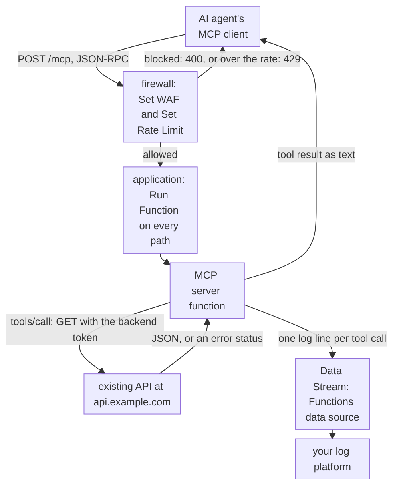

import DocCardGroup from '@aziontech/webkit/doc-card-group'
import DocCard from '@aziontech/webkit/doc-card'

A platform or product team wants AI agents, its own or its customers', to use its services through the Model Context Protocol (MCP). The services already exist as an HTTP API, and an agent cannot call that API as a tool until something describes each operation in MCP terms. This page deploys an MCP server as a function on Azion over the streamable HTTP transport, maps each tool to a call to the existing API, puts a firewall with WAF and a rate limit in front of it, and streams one log line per tool call. The result is measured by tool-call latency, error rate per tool, and the calls the firewall refuses.

This use case does not cover building the agents that call the servers. For that, refer to [Build AI agents](/en/documentation/use-cases/build-and-run-ai-workloads/build-ai-agents/).

## Prerequisites

- The [Azion CLI](/en/documentation/devtools/cli/), installed and logged in, and Node.js with npm. The CLI creates and deploys the project, as [Run an MCP server on Azion](/en/documentation/guides/application-development/automation/run-mcp-server/) shows.
- A firewall with WAF turned on in its main settings, bound to the workload that `azion deploy` creates. To turn WAF on, refer to [Set a firewall's main settings](/en/documentation/guides/application-security/firewall-and-waf/firewall-configure-main-settings/). To bind the firewall, refer to [Bind a firewall to a workload](/en/documentation/guides/application-security/firewall-and-waf/firewall-protect-your-domain/).
- A WAF rule set named `mcp-waf`, with every threat family at medium sensitivity. To create it, refer to [Create a rule set at medium sensitivity](/en/documentation/guides/application-security/firewall-and-waf/rule-set-medium/).
- A personal token, for the API steps. To create one, refer to [Personal tokens](/en/documentation/guides/platform/account-and-billing/personal-tokens/).
- An HTTPS endpoint of your log platform that accepts `POST` requests, for the tool-call logs.
- The values of your own API. This page maps an order service at `https://api.example.com`, which answers `GET /v1/orders/{id}` and `GET /v1/orders?customer_id={id}&limit={n}` and expects `Authorization: Bearer <backend-token>`. It uses `my-mcp-server` for the project and `<your-domain>` for the domain `azion deploy` prints. Replace each value with yours in every step.

---

## Required products

| The MCP server needs | Which means | Product | Documented in |
| --- | --- | --- | --- |
| A server agents reach over the streamable HTTP transport | A function built with the MCP SDK, answering `POST /mcp` | Functions | [Run an MCP server on Azion](/en/documentation/guides/application-development/automation/run-mcp-server/) |
| Each tool mapped to an operation of the existing API | A tool handler that translates its arguments into a `fetch()` call and the response into tool output | Functions | [Fetch API](/en/documentation/devtools/runtime/api-reference/fetch/) |
| Attack payloads filtered before they reach the server | A firewall rule on `/mcp` with the **Set WAF** behavior in blocking mode | WAF | [Apply a rule set to every request](/en/documentation/guides/application-security/firewall-and-waf/apply-rule-set/) |
| An agent that loops cannot flood the server or the API behind it | The **Set Rate Limit** behavior on the same rule, counted per client IP address | Firewall | [Apply WAF and a rate limit to one path](/en/documentation/guides/application-security/firewall-and-waf/apply-waf-and-rate-limit-to-one-path/) |
| A record of every tool call | A log line per call, streamed from the Functions data source to your log platform | Data Stream | [Send logs to an HTTP endpoint](/en/documentation/guides/platform/observability/connector-standard-https-post/) |

---

## Reference architecture

This page builds the *MCP gateway over existing APIs*: every tool forwards to the API that already runs the service, so no business logic moves into the function.



Read the diagram from the function to the existing API. Every tool call crosses that arrow, so the API is in the request flow of every call and in its failure flow: a slow or failing API is a slow or failing tool. Each side of the arrow speaks its own schema. An agent sees a tool name, a description, and a typed input schema. The API sees a method, a path, and its own fields. The function translates between the two, and that mapping is the main design decision. The firewall in front decides which requests reach the function at all.

### Dataflow

1. An agent's MCP client sends a JSON-RPC request as a `POST` to `/mcp` on the workload's domain.
2. The firewall applies the `mcp-waf` rule set and the rate limit. A request the rule set blocks answers `400`, and a request over the rate answers `429`.
3. An allowed request reaches the application, whose rule runs the MCP server function. The function answers `initialize` and `tools/list` itself, from the tools it registers.
4. For `tools/call`, the function validates the arguments against the tool's input schema, builds the API request from the method, the path, and the query, and calls the existing API with the backend token. The call is bounded by a timeout.
5. The function returns the fields the agent needs as the tool result, or a message saying what failed when the API answers with an error or does not answer in time.
6. The function writes one log line per tool call, and Data Stream sends the lines to your log platform.

### Components

- **Functions**: runs the MCP-to-API translation. The server is built with the MCP SDK over the streamable HTTP transport, registers one tool per API operation, and calls the API with `fetch()`. Every schema decision lives here: which operations become tools, how arguments map to a request, and which response fields reach the agent.
- **backend API**: the integration that is the existing service, here the order service at `https://api.example.com`. It keeps its own logic, data, and credentials, and every tool call reaches it, so its latency and its errors are the tool's latency and errors.
- **firewall**: the Platform Resource that is the enforcement point. A rule on `/mcp` takes every request before the application does, so a refused request never runs the function or reaches the API.
- **WAF**: filters agent traffic for attack payloads, through the rule's **Set WAF** behavior with the `mcp-waf` rule set. The same rule's **Set Rate Limit** behavior caps how fast one client can call, which bounds the load an agent caught in a loop puts on the API.
- **KV Store**: holds sessions, for a server that keeps state between the requests of one agent connection. A server built with no session ID keeps none, and every request carries everything it needs.
- **Data Stream**: sends the tool-call logs the function writes, from the Functions data source, to your log platform. Error rate and latency per tool are computed there.
- **application**: the Platform Resource that routes requests to the function. Its rule runs the function, and the workload that serves the application also binds the firewall.

### Other designs for this use case

- *Remote MCP server on Functions*: for tools whose logic can run on Azion. The function implements each tool itself instead of forwarding it to an existing API, and keeps session state in KV Store behind the same firewall, so a tool call leaves Azion only when the tool itself calls out.

---

## Configure the tool mappings

The tool mappings are the server's `src/index.ts`: one registered tool per API operation. Start from the Hono project that [Run an MCP server on Azion](/en/documentation/guides/application-development/automation/run-mcp-server/) creates with `azion init --name my-mcp-server`, with `@modelcontextprotocol/sdk` and `zod@3` installed. The route, the transport, and the error handling stay as the guide writes them. Only `getServer()` changes.

The mapping decisions, each made once here:

- **Two tools, named verb and noun.** `get_order` maps `GET /v1/orders/{id}`, and `list_customer_orders` maps `GET /v1/orders?customer_id={id}&limit={n}`. An agent picks a tool by its name and description, so each description says when to use it.
- **Arguments are typed and bounded.** `limit` is an integer from 1 to 20, so an agent cannot ask the API for an unbounded page. Every path segment and query value is encoded before it enters the URL.
- **The result carries only the fields an agent needs.** The handler returns the order's ID, status, total, and creation date, and drops every other field the API returns, so internal data does not reach an agent.
- **A failure is a message, not an exception.** An error status or a call that runs past 8 seconds becomes a tool result that says what failed. Eight seconds leaves the agent time to retry within its own timeout, and the function's wall-clock limit is 5 minutes.
- **The backend token stays out of the code.** The function reads it from the `BACKEND_API_TOKEN` environment variable.

To store the backend token, run:

```bash
azion create variables --key "BACKEND_API_TOKEN" --value "<backend-token>"
```

A key that contains `token` is stored as a secret by default. Replace `getServer()` in `src/index.ts` with this code, and add the `declare` line and the two helpers above it:

```typescript
declare const Azion: { env: { get(key: string): string | undefined } }

const API_BASE = 'https://api.example.com/v1'
const TIMEOUT_MS = 8000

function pickOrder(order: any) {
  return { id: order.id, status: order.status, total: order.total, created_at: order.created_at }
}

async function callApi(tool: string, path: string) {
  const started = Date.now()
  const controller = new AbortController()
  const timer = setTimeout(() => controller.abort(), TIMEOUT_MS)
  try {
    const response = await fetch(`${API_BASE}${path}`, {
      headers: { Authorization: `Bearer ${Azion.env.get('BACKEND_API_TOKEN')}` },
      signal: controller.signal
    })
    console.log(JSON.stringify({ event: 'tool_call', tool, status: response.status, ok: response.ok, ms: Date.now() - started }))
    if (!response.ok) {
      return { error: `The order service answered ${response.status} for ${path}.` }
    }
    return { data: await response.json() }
  } catch (error) {
    console.log(JSON.stringify({ event: 'tool_call', tool, status: 0, ok: false, ms: Date.now() - started }))
    return { error: `The order service did not answer within ${TIMEOUT_MS / 1000} seconds.` }
  } finally {
    clearTimeout(timer)
  }
}

function getServer() {
  const server = new McpServer({ name: 'orders-mcp-server', version: '1.0.0' })

  server.registerTool('get_order',
    {
      title: 'Get order',
      description: 'Get one order by its ID. Use it when the user names a specific order.',
      inputSchema: { order_id: z.string().min(1) }
    },
    async ({ order_id }) => {
      const result = await callApi('get_order', `/orders/${encodeURIComponent(order_id)}`)
      const text = result.error ?? JSON.stringify(pickOrder(result.data))
      return { content: [{ type: 'text', text }] }
    }
  )

  server.registerTool('list_customer_orders',
    {
      title: 'List customer orders',
      description: 'List the most recent orders of one customer. Use it to find an order when the user does not know its ID.',
      inputSchema: { customer_id: z.string().min(1), limit: z.number().int().min(1).max(20) }
    },
    async ({ customer_id, limit }) => {
      const query = `customer_id=${encodeURIComponent(customer_id)}&limit=${limit}`
      const result = await callApi('list_customer_orders', `/orders?${query}`)
      const text = result.error ?? JSON.stringify(result.data.map(pickOrder))
      return { content: [{ type: 'text', text }] }
    }
  )

  return server
}
```

Remove the `ResourceTemplate` import, which the guide's server uses and this one does not. Then deploy from the project folder:

```bash
azion deploy
```

The CLI prints the URL of the project's domain, in the form `https://xxxxxxxxxx.map.azionedge.net`, and the server answers at `https://<your-domain>/mcp`. The first deploy can take several minutes to answer from every location.

`list_customer_orders` assumes the API returns a JSON array. Map the field names in `pickOrder` and the response shape to the ones your API returns.

---

## Configure the firewall for agent traffic

One firewall rule carries both protections, because **Set WAF** is one of the two behaviors that another behavior can follow. The criterion is `${request_uri}` _starts with_ `/mcp`. Every MCP request is a `POST` whose payload sits in the body, and a criterion on the query string would skip it.

The rate limit counts per client IP address: an average of `10` requests per second with a burst of `20`. An agent opens a connection with `initialize`, `notifications/initialized`, and `tools/list` in quick succession, then sends one request per tool call. The burst admits that opening, and the average stops an agent caught in a loop before it floods the API behind the tools.

Create the rule as [Apply WAF and a rate limit to one path](/en/documentation/guides/application-security/firewall-and-waf/apply-waf-and-rate-limit-to-one-path/) describes, with these values:

- **Name**: `mcp - waf and rate limit`.
- **Criterion**: `Request Uri` _starts with_ `/mcp`.
- **Set WAF**: the `mcp-waf` rule set in _Blocking_ mode.
- **Set Rate Limit**: _Req/s_, _Client IP address_, an **Average Rate Limit** of `10`, and a **Maximum Burst Size** of `20`.

In the API, the two behaviors go in this order:

```json
[
  { "type": "set_waf", "attributes": { "waf_id": <waf-rule-set-id>, "mode": "blocking" } },
  { "type": "set_rate_limit", "attributes": { "type": "second", "limit_by": "client_ip", "average_rate_limit": 10, "maximum_burst_size": 20 } }
]
```

Every request to `/mcp` is scored by `mcp-waf` and counted against the rate before it reaches the function. A request the rule set blocks answers `400` with the default Bad Request page, and a request over the rate answers `429` with the default Too Many Requests page. Neither response carries a header that names the firewall or a retry time.

---

## Configure the tool-call log stream

The function writes one JSON line per tool call, with the tool name, the API status, whether it succeeded, and the time it took. Data Stream sends those lines from the *Functions* data source to your log platform, where error rate and latency are computed per tool.

Create the stream as [Send logs to an HTTP endpoint](/en/documentation/guides/platform/observability/connector-standard-https-post/) shows, with these values:

- **Data Source**: _Functions_. In the API, `functions_console`.
- **Template**: _Functions Event Collector_, whose `$log_message` variable carries each line the function writes.
- **Option**: _Filter Workloads_, with the workload that `azion deploy` created as the only chosen workload. A filter keeps this stream from deactivating the other streams on the account, which saving an active stream with sampling does.
- **Connector**: _Standard HTTP/HTTPS POST_, with your log platform's URL and the header it requires to accept the request.

The stream becomes active within one to two minutes of saving it. Your log platform then receives one line per tool call, each carrying the `$request_id` of the request that made it.

---

## Verify the setup

- **The server answers the MCP handshake.** Send an `initialize` request:

  ```bash
  curl -s -i -X POST https://<your-domain>/mcp \
    -H 'Content-Type: application/json' \
    -H 'Accept: application/json, text/event-stream' \
    --data '{"jsonrpc":"2.0","id":1,"method":"initialize","params":{"protocolVersion":"2025-03-26","capabilities":{},"clientInfo":{"name":"curl","version":"1.0.0"}}}'
  ```

  The server answers `200` with `content-type: text/event-stream` and one event whose data names `orders-mcp-server`.

- **Both tools are listed.** Send `tools/list` to the same URL with the body `{"jsonrpc":"2.0","id":2,"method":"tools/list"}`. The result lists `get_order` and `list_customer_orders`, each with the input schema the code declares.

- **A tool reaches the API.** Call `get_order` with the ID of an order that exists:

  ```bash
  curl -s -X POST https://<your-domain>/mcp \
    -H 'Content-Type: application/json' \
    -H 'Accept: application/json, text/event-stream' \
    --data '{"jsonrpc":"2.0","id":3,"method":"tools/call","params":{"name":"get_order","arguments":{"order_id":"<order-id>"}}}'
  ```

  The event's `result.content` holds one `text` item with the order's `id`, `status`, `total`, and `created_at`, and no other field. An ID that does not exist returns a text that names the status the API answered.

- **The rate limit refuses a loop.** Send 60 `tools/list` requests, 30 at a time, so they arrive faster than 10 per second:

  ```bash
  seq 1 60 | xargs -P 30 -I {} curl -s -o /dev/null -w '%{http_code}\n' \
    -X POST https://<your-domain>/mcp \
    -H 'Content-Type: application/json' \
    -H 'Accept: application/json, text/event-stream' \
    --data '{"jsonrpc":"2.0","id":2,"method":"tools/list"}' | sort | uniq -c
  ```

  The count shows both `200` and `429`: the rate and the burst admit some of the requests, and the firewall refuses the others.

- **Every tool call is logged.** After the `get_order` call, your log platform receives a line whose message holds `"event":"tool_call"` and `"tool":"get_order"`.

A new firewall rule takes a few minutes to propagate. When a check fails after that, read the function's log lines under the **Functions Console** data source of [Real-Time Events](/en/documentation/platform/real-time-events/quickstart/).

---

## Measuring results

| Metric | Where to read it | What working looks like |
| --- | --- | --- |
| Tool-call latency | The `ms` field of the `tool_call` lines in your log platform, per `tool` | Stable per tool. A rise on one tool points at its API operation, not at the server |
| Error rate per tool | The `tool_call` lines with `"ok":false` over all lines, per `tool` | Low and steady. `status` `0` counts timeouts, and any other value is the status the API answered |
| Calls the firewall refuses | Requests to `/mcp` with status `400` or `429`, in the **HTTP Requests** data source of [Real-Time Events](/en/documentation/platform/real-time-events/data-sources/#http-requests) | `429` only from agents that loop, and `400` only on payloads the rule set flags |

---

## Best practices

- **Return only the fields an agent needs.** An agent passes every field of a tool result to a model, and the model may repeat it to a user. `pickOrder` is where that decision is made, one place per tool.
- **Treat every tool as safe to call twice.** An agent retries a call it believes failed, including a call that timed out after the API acted. Map read operations first, and give a write operation a request ID the API can deduplicate before you expose it as a tool.
- **Size the rate limit for agents behind one address.** The limit counts per client IP address, so several agents behind one network address share one budget. Raise the average when the `429` count rises with no loop in the logs.
- **Add authentication before you share the URL.** The server on this page checks no credential, so anyone who knows the URL can call its tools. Decide how agents prove who they are, and check it in the function or the firewall before you publish the URL. For the checks a server needs before others use it, refer to [Prepare the server for agents](/en/documentation/guides/application-development/automation/run-mcp-server/#prepare-the-server-for-agents).

---

## Guides in this use case

<DocCardGroup cols={2}>
  <DocCard title="Apply WAF and a rate limit to one path" href="/en/documentation/guides/application-security/firewall-and-waf/apply-waf-and-rate-limit-to-one-path/" label="Creates the one rule on /mcp that carries both the WAF and the rate limit." />
  <DocCard title="Run an MCP server on Azion" href="/en/documentation/guides/application-development/automation/run-mcp-server/" label="Creates and deploys the Hono project with the MCP SDK that the tool mappings start from." />
</DocCardGroup>
