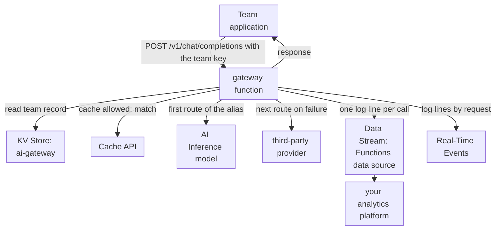

import DocCardGroup from '@aziontech/webkit/doc-card-group'
import DocCard from '@aziontech/webkit/doc-card'

A platform team supports product teams that call AI models from several providers and from AI Inference. Each team holds its own provider keys and its own fallback code, so nobody can route a request to another model when a provider fails, stop a team that spends past its budget, or say which model answered a given request. This page puts a gateway built on Functions in front of every model. Applications call one endpoint with a team key, and the gateway authenticates the team, picks a model by policy, falls back to the next model when a call fails, caches responses the caller allows, and logs every call. The result is measured by requests answered despite a provider failure, spend per team within budget, the share of requests answered from cache, and audit coverage of model calls.

This use case does not cover building the applications or agents that call the models. For that, refer to [Build AI agents](/en/documentation/use-cases/build-and-run-ai-workloads/build-ai-agents/).

## Prerequisites

- An Azion account. If you do not have one, [create an account](https://console.azion.com/signup).
- An application and a workload that serve the gateway's domain, with **Application Accelerator** turned on, which the **Run Function** behavior requires. To create them, refer to [Applications quickstart](/en/documentation/platform/applications/quickstart/).
- KV Store enabled on the account. The product is in Preview and is not enabled by default, so request access through [Technical Support](/en/documentation/support/).
- A third-party provider whose chat endpoint accepts the OpenAI chat completions format, with its URL, a model name, and an API key.
- An HTTPS endpoint of your analytics or log platform that accepts `POST` requests, for the usage and audit logs.

---

## Required products

| The gateway needs | Which means | Product | Documented in |
| --- | --- | --- | --- |
| One endpoint that holds the routing, fallback, and authentication logic | A function on the gateway's application, run on every path by one rule | Functions | [Functions quickstart](/en/documentation/platform/functions/quickstart/) |
| Platform-hosted models among the routes | `Azion.AI.run` with a model id from the AI Inference model catalog | AI Inference | [Call a model on AI Inference from a function](/en/documentation/guides/ai/inference/call-a-model-on-ai-inference-from-a-function/) |
| Team keys, the models each team may call, and whether a team is still within budget | One record per team, read by key on every request | KV Store | [KV Store API](/en/documentation/devtools/runtime/api-reference/kv-store/) |
| Repeated prompts answered without a model call, where the caller allows it | Responses stored and matched with the Cache API | Cache | [Cache a function's response with the Cache API](/en/documentation/guides/application-development/functions-and-runtime/cache-a-function-response-with-the-cache-api/) |
| A usage and audit record of every model call | A log line per call, streamed from the Functions data source | Data Stream | [Send logs to an HTTP endpoint](/en/documentation/guides/platform/observability/connector-standard-https-post/) |
| One request investigated after the fact | The function's log lines for that request | Real-Time Events | [Real-Time Events data sources](/en/documentation/platform/real-time-events/data-sources/#functions-console) |
| A rule that runs the function | The **Run Function** behavior, which requires Application Accelerator on the application | Application Accelerator | [How Functions works](/en/documentation/platform/functions/how-it-works/#execution-phases-and-criteria) |

---

## Reference architecture

This page builds the *Multi-model AI gateway*: one function in front of every model, with the policy, the keys, and the log in one place.

Read the diagram from the function outward. Every model call passes through it, so it is the one place where a team is identified, a model is chosen, and a call is recorded. The arrows to the models are ordered: the policy names a first route and the routes after it, and the function moves to the next one only when a call fails. The arrows to KV Store and the Cache API are reads that come before any model call, so a refused team or a stored answer costs no model call at all.

### Dataflow

1. A team application sends an OpenAI-compatible request to `/v1/chat/completions`, with its team key as a bearer token and a model alias in `model` rather than a model id.
2. The gateway hashes the key and reads the team's record from KV Store. An unknown key answers `401`, a team over budget answers `429`, and an alias the team may not call answers `403`.
3. When the caller allows caching, the gateway looks the request up in the cache and returns a stored response on a match.
4. Otherwise the gateway calls the routes of the alias in order: a model on AI Inference first, then the third-party provider when the first call fails.
5. The gateway writes one log line with the team, the alias, the model that answered, whether it fell back, the cache result, and the tokens used. Data Stream sends it to your analytics platform, and Real-Time Events holds the lines of each request for investigation.
6. The gateway returns the model's response, and stores it in the cache when the caller allowed it.

### Platform Resources

- **Functions**: runs authentication, routing, and fallback. The policy is code in the `ai-gateway` function, so a change to a route reaches every team at once, and no team holds a provider key or fallback logic of its own.
- **AI Inference**: runs the platform-hosted models, called with `Azion.AI.run` and a model id. A call to it stays inside Azion and needs no provider key.
- **third-party LLM providers**: the integrations that run external models. The function calls them with keys it reads from environment variables, so their latency and failures enter only the routes that name them.
- **Cache**: holds responses to repeated prompts, through the Cache API of the function. A stored response is returned without a model call, only for requests whose caller allows it.
- **KV Store**: holds the keys, quotas, and budgets: one record per team in the `ai-gateway` namespace, keyed by a hash of the team key, with the models the team may call and whether it is within budget. The function reads it on every request.
- **Data Stream**: sends the usage and audit log lines the function writes, from the Functions data source, to your analytics platform, where spend per team is summed.
- **Real-Time Events**: holds the function's log lines grouped by request, for investigating one call after the fact.
- **application**: the Platform Resource that is the gateway endpoint. A rule runs the function on its paths, so every application points at one domain.

---

## How the design works

This section explains how the gateway function applies the policy, how team records admit or refuse a team, and how model calls become a usage and audit record.

### The gateway function

The gateway is one function. Every decision it applies is in the code, so a policy change is a code change that every team gets at once.

- **Teams send an alias, not a model id.** `general` routes to `Qwen/Qwen3-30B-A3B-Instruct-2507-FP8` on AI Inference, and `long-context` to `gpt-oss-20b`, whose 131k-token context is the longest among the models AI Inference runs. Both fall back to the provider. An alias lets the platform team change the model behind it without a change in any team's code. The gateway calls an AI Inference route as [Call a model on AI Inference from a function](/en/documentation/guides/ai/inference/call-a-model-on-ai-inference-from-a-function/) describes, with these values: the route's model id, and the team's request body with `stream` set to `false`.
- **The key is stored as a hash.** The record key is `team:` followed by the SHA-256 of the team key, so KV Store never holds a usable key. SHA-256 is one of the digests `crypto.subtle.digest` supports.
- **A failed call moves to the next route.** A call that throws, returns no `choices`, answers with an error status, or runs past 30 seconds counts as failed. Thirty seconds bounds how long a team waits on one route before the next one runs, inside the 5-minute wall-clock limit of a function.
- **Caching is the caller's decision.** The gateway caches only requests that carry `x-gateway-cache: allow`, because only the team knows whether one answer can stand for every identical prompt. The gateway caches as [Cache a function's response with the Cache API](/en/documentation/guides/application-development/functions-and-runtime/cache-a-function-response-with-the-cache-api/) describes, with the cache `ai-gateway`, the key `https://ai-gateway.cache/<sha-256 of the alias and the request body>`, and `max-age=3600`, one hour.
- **Every call writes one log line.** The line is the usage and audit record: a team's spend is the sum of its `total_tokens`, and the line names the model that answered.
- **The `fallback-test` alias proves the fallback.** Its first route names a model id that does not exist, so every call to it falls back. Remove it once the fallback is confirmed.

### The team records

A team record is a JSON object under `team:<sha256 of the team key>` in the `ai-gateway` namespace: the team's name, the aliases it may call, and its status. The gateway reads the record on every request, and admits a request only while `status` is `active`.

Budget enforcement reads that status rather than counting each call. KV Store accepts one write per second to the same key and offers no atomic increment, so a counter written on every request would lose updates under concurrent traffic. Spend is computed instead in your analytics platform from the `total_tokens` of each team's log lines. When a team reaches its budget, an operator sets its `status` to `blocked`, and the gateway answers `429` to that team from then on.

Keys are written from a function rather than through the API, so the gateway's `/admin/teams` path writes each record.

### The usage and audit stream

Every `model_call` line is a usage and audit record, and Data Stream delivers the lines from the *Functions* data source to your analytics platform, where spend and fallbacks are summed per team.

A filter keeps this stream from deactivating the other streams on the account, which saving an active stream with sampling does.

---

## Measuring results

| Metric | Where to read it | What working looks like |
| --- | --- | --- |
| Requests answered despite a provider failure | The `model_call` lines with `"ok":true` and `"fallback":true`, in your analytics platform | Every route failure in a `route_failed` line is followed by a successful `model_call` for the same request, unless every route failed |
| Spend per team within budget | The sum of `total_tokens` per `team` over the budget period, in your analytics platform | Each team's sum stays under its budget, and a team that reaches it has `status` set to `blocked` |
| Share of requests answered from cache | The `model_call` lines with `"cache":"hit"` over the lines with `"cache":"hit"` or `"cache":"miss"` | Rises for teams that allow caching on prompts that repeat |
| Audit coverage of model calls | The count of `model_call` lines against the gateway's invocations in the **Functions** tab of [Real-Time Metrics](/en/documentation/platform/real-time-metrics/build-dashboards/#functions), less the `/admin/teams` calls and the refused requests | The two counts match, so every model call has a record |

---

## Best practices

- **Give each team its own key, and rotate it by replacing the record.** The record key is the hash of the team key, so a new key is a new record. Set the old record to `blocked` once the team switches, because a KV Store key cannot be listed and a forgotten record stays readable.
- **Keep the provider key in an environment variable.** The function reads `PROVIDER_API_KEY` with `Azion.env.get()`, so the key never appears in the code, and teams never hold it. A changed variable reaches the function only after it is redeployed.
- **Let teams opt in to caching per request.** A cached answer is returned for every identical prompt, whichever team sends it. Caching a prompt whose answer must change, such as one that asks about the current state of an account, returns a stale answer for an hour.
- **Account for KV Store reads at the gateway's request rate.** Every request reads one team record, and KV Store includes 100,000 keys read per day before a charge applies. For the included amounts and the rate past them, refer to [KV Store limits](/en/documentation/platform/kv-store/limits/).

---

## Guides in this use case

<DocCardGroup cols={2}>
  <DocCard title="Route model calls through a gateway function" href="/en/documentation/guides/ai/inference/route-model-calls-through-a-gateway-function/" label="Creates the ai-gateway namespace, stores the variables, holds the gateway's code, adds the team record, and runs the checks of this use case." />
  <DocCard title="Run a function on an application" href="/en/documentation/guides/application-development/functions-and-runtime/serverless-functions/" label="Creates the rule that runs the gateway on every path, in Azion Console or with the API." />
  <DocCard title="Debug functions with Data Stream" href="/en/documentation/guides/platform/observability/debugging-functions-data-stream/" label="Creates the stream from the Functions data source with a workload filter, and confirms its delivery." />
  <DocCard title="Cache a function's response with the Cache API" href="/en/documentation/guides/application-development/functions-and-runtime/cache-a-function-response-with-the-cache-api/" label="Stores and matches the responses that a caller allows the gateway to cache." />
  <DocCard title="Call a model on AI Inference from a function" href="/en/documentation/guides/ai/inference/call-a-model-on-ai-inference-from-a-function/" label="Calls the first route of an alias, a model on AI Inference, with Azion.AI.run." />
</DocCardGroup>
