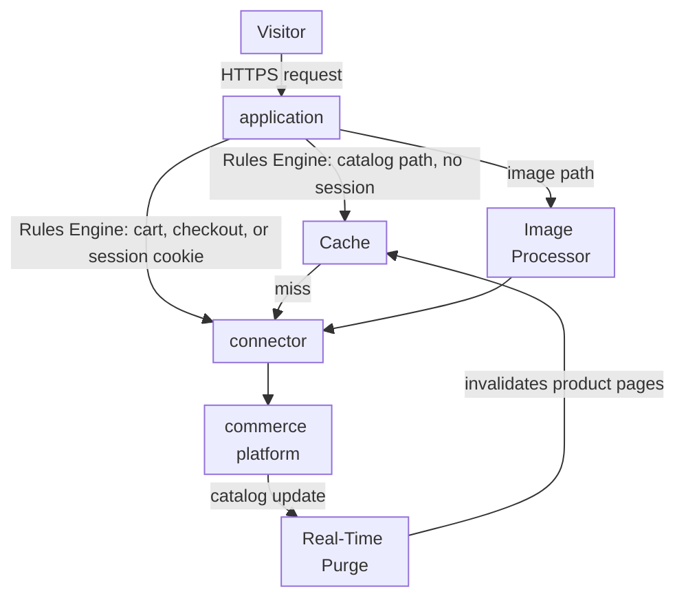
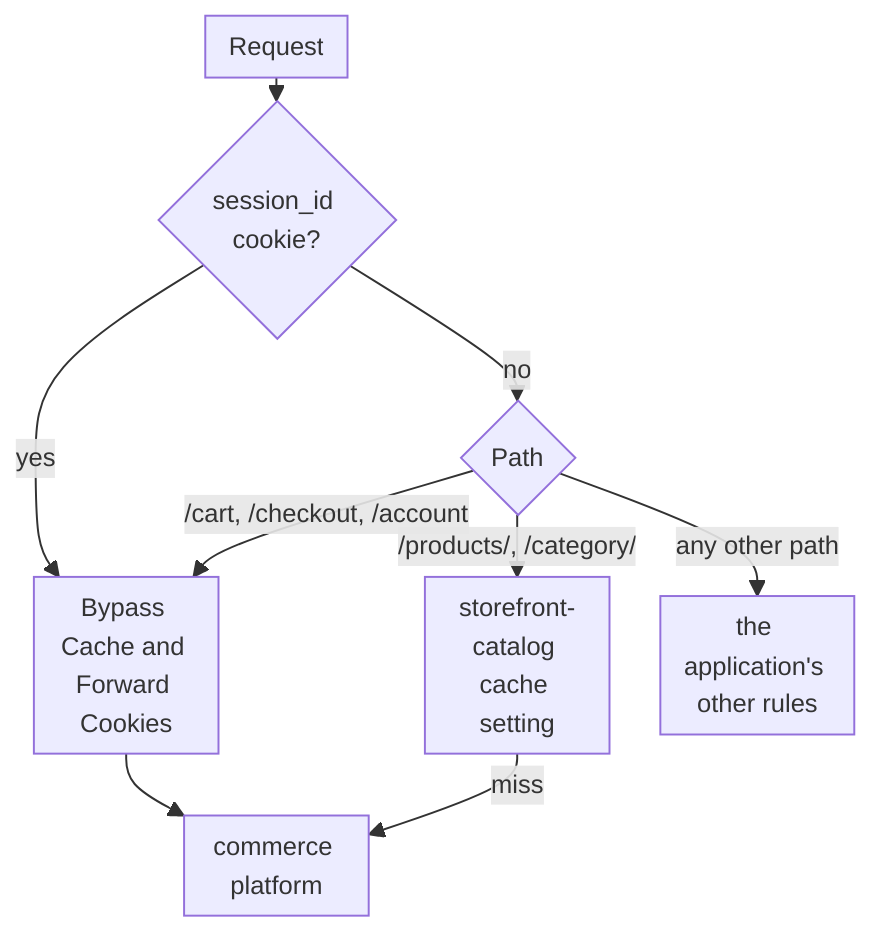
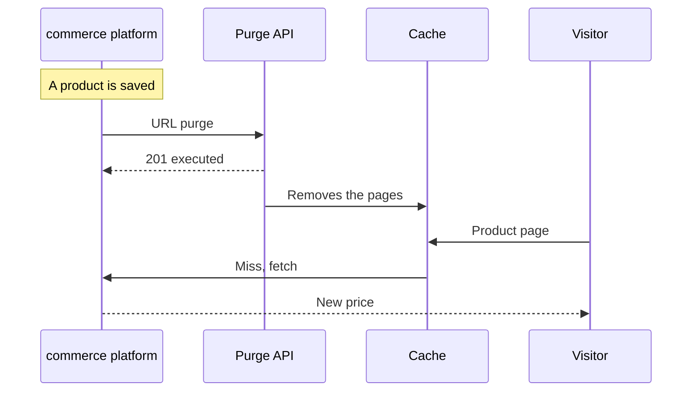

import DocCardGroup from '@aziontech/webkit/doc-card-group'
import DocCard from '@aziontech/webkit/doc-card'

A digital commerce team runs the storefront of an online store on a commerce platform it operates, such as Magento or WooCommerce. Catalog and product pages are the same for every visitor and must stay fast during traffic peaks, while prices and stock change during the day. The cart, the checkout, and the pages of a signed-in visitor are different for every visitor and must never come from a shared copy. This page configures an application in front of the store that caches the catalog, sends cart, checkout, and session traffic to the store, and purges a product page when it changes. The result is measured by time to first byte on catalog and product pages, the time from a price or stock change to a live page, and the share of catalog requests that never reach the commerce platform.

This use case does not cover protecting login and checkout against bots. For that, refer to [Block account takeover on login and checkout flows](/en/documentation/use-cases/secure-applications-and-networks/block-account-takeover-on-login-and-checkout-flows/).

## Prerequisites

- An Azion account. If you do not have one, [create an account](https://console.azion.com/signup).
- An application that serves the store through a connector and a workload. To create them, refer to [Applications quickstart](/en/documentation/platform/applications/quickstart/).
- Application Accelerator on that application, which the **Bypass Cache** and **Forward Cookies** behaviors require. To turn it on, refer to [Turn on Application Accelerator](/en/documentation/guides/application-performance/cache-and-purge/cache-settings/#turn-on-application-accelerator).

---

## Required products

| The storefront needs | Which means | Product | Documented in |
| --- | --- | --- | --- |
| Catalog and product pages that answer from cache | A cache setting applied by a rule matched on the catalog paths, for visitors without a session | Cache | [Cache settings](/en/documentation/platform/applications/cache/cache-settings/) |
| Cart, checkout, and session pages that never come from a shared copy | A rule that bypasses the cache by path and by session cookie | Application Accelerator | [Bypass the cache for a path](/en/documentation/guides/application-performance/cache-and-purge/cache-settings/#bypass-the-cache-for-a-path) |
| Product pages that refresh when the catalog changes | A purge by URL that the commerce platform sends when a product changes | Cache | [Purge pages when the origin publishes a change](/en/documentation/guides/application-performance/cache-and-purge/purge-on-publish/) |
| Product images at the size and format each page asks for | Image Processor on the application, applied by a rule on image paths | Image Processor | [Image Processor quickstart](/en/documentation/platform/applications/image-processor/quickstart/) |

---

## Reference architecture

This page builds the *Origin-hosted commerce platform storefront*: an application in front of a store that keeps rendering every page.

Read the diagram from the application outward. Every request passes through its rules, which split it into three paths: catalog pages that Cache can answer, per-visitor pages that must reach the store, and images that Image Processor transforms. All three paths end at the same connector, because the commerce platform remains the only origin. The loop from the store back to Cache is the purge, which keeps cached pages in step with the catalog.

### Dataflow

1. A visitor's request reaches the workload on the store's domain, which hands it to the application, and Rules Engine reads its path and its `session_id` cookie in the Request Phase.
2. A catalog or product page requested without a session cookie is served from Cache. On a miss, the application fetches it from the store through the connector and caches it.
3. A cart, checkout, or account request, or any request that carries the session cookie, bypasses the cache and goes to the store through the connector.
4. An image request goes through Image Processor, which resizes or converts the original fetched from the store, and Cache keeps each variation.
5. When a product changes, the commerce platform calls the Real-Time Purge API, which removes the affected product pages from Cache before their TTL ends.
6. The next request for a purged page reaches the store, and the new version is cached.

### Platform Resources

- **application**: the Platform Resource in front of the store. It holds the cache settings and the rules that decide, request by request, whether a page is cached or bypassed.
- **Rules Engine**: the Feature of the application that matches paths and cookies. The cache bypass for a signed-in visitor depends on a cookie condition, because the same product path is shared for an anonymous visitor and private for a signed-in one.
- **connector**: the Platform Resource that reaches the store. Every path, cached or not, ends at it, because the store renders every page.
- **Cache**: stores catalog and product pages, so repeated requests for them never reach the store.
- **Real-Time Purge**: the Platform Resource that removes a changed product page from Cache before its TTL ends, so a price or stock change goes live without waiting for the page to expire.
- **Image Processor**: resizes and converts product images on request, so the store keeps one original per image.
- **commerce platform**: the integration that is the origin and the content source. It renders every page, owns the cart and the checkout, and sends the purge when the catalog changes.

### Other designs for this use case

- *Statically generated headless commerce storefront*: for catalogs that change a few times a day, where a site generator pulls products from the commerce platform's API at build time. Catalog pages are prebuilt in Object Storage and served through Cache, so price and stock freshness depend on rebuilds, and only cart and checkout reach the commerce API.
- *Server-rendered headless commerce storefront*: for catalogs with frequent price and stock changes or prices per region, where functions render pages with a framework such as Next.js and call the commerce API. Pages render on request, so the commerce API is in the request and failure flows, and freshness is a caching decision instead of a rebuild.

---

## How the design works

This section explains how the application splits shared catalog pages from per-visitor pages, and how a catalog change reaches the cache.

### The catalog cache

The catalog cache is a cache setting and the rule that applies it. The rule matches the catalog paths only for visitors without a session, so a signed-in visitor never receives a shared copy.

The cache setting uses two values. **Max Age** is `600` seconds: the purge configured below refreshes a changed page at once, so **Max Age** only bounds how long a page stays stale when a purge is missed. The browser cache is overridden to `0` seconds, because a copy in the visitor's browser cannot be purged, and a stale price would stay there until it expires.

### The bypass for cart, checkout, and sessions

The bypass rule sends every per-visitor request to the store. It matches the cart, checkout, and account paths, and any request that carries the session cookie, so a visitor who added an item to the cart also bypasses the cache on catalog pages. The rule carries **Forward Cookies** as well, so the session cookie the store sets reaches the visitor. Nothing this rule matches is cached, so no visitor can receive another visitor's cookie.

1. A request that carries the `session_id` cookie bypasses the cache, whatever its path.
2. A request without the cookie bypasses the cache on `/cart`, `/checkout`, and `/account`.
3. A request without the cookie on `/products/` or `/category/` takes the `storefront-catalog` cache setting.
4. Any other path is left to the application's other rules.

### The purge on catalog changes

A changed product page is refreshed by a purge that the commerce platform sends when the product is saved. The call goes in the code the platform runs when a product is saved, and it authenticates with the personal token.

1. An admin saves a product, and the platform runs its save code.
2. The save code sends a URL purge for the product page and its category page, and a wildcard purge for the images when they changed.
3. Azion removes both pages from the cache once the purge propagates.
4. The next request for each page reaches the store, and the new version is cached.

Azion accepts 2,000 wildcard purge requests in a 24-hour interval, so a wildcard on every save of a large catalog can reach that bound.

---

## Measuring results

| Metric | Where to read it | What working looks like |
| --- | --- | --- |
| Share of catalog requests that never reach the store | **Requests Offloaded** in Real-Time Metrics, filtered to the store's domain. Refer to [Measure cache offload for a domain](/en/documentation/guides/platform/observability/measure-cache-offload/) | Rises after the catalog rule propagates, and holds during traffic peaks |
| Time to first byte on catalog and product pages | The `ttfb` field of Edge Pulse measurements, taken in the visitors' browsers. Refer to [Edge Pulse quickstart](/en/documentation/platform/edge-pulse/quickstart/) | Lower on catalog pages than on cart and checkout pages, in every region |
| Time from a price or stock change to a live page | The purge history of **Real-Time Purge** in Azion Console, which lists each purge when it is complete. Refer to [Real-Time Purge](/en/documentation/platform/applications/cache/real-time-purge/#confirmation) | Each purge completes, and no product page waits for its 600-second **Max Age** to expire |

---

## Best practices

- **Exclude sessions with a criterion, not with cookie variation.** Varying the catalog cache key by `session_id` stores one copy per visitor, because the cookie is unique per visitor. The `does not exist` criterion keeps a single shared copy for every visitor without a session. For cookie variation and its cost, refer to [Applications best practices](/en/documentation/platform/applications/best-practices/).
- **Never put Forward Cookies on a rule that caches.** On a cached response, **Forward Cookies** can hand one visitor the `Set-Cookie` of another visitor's session. On this page it sits only on the bypass rule, where nothing is cached.
- **Purge on change instead of shortening Max Age.** A short **Max Age** sends more catalog requests to the store and still leaves a stale window. The purge refreshes the page when it changes, and **Max Age** stays a safety bound for a missed purge.
- **Use Bypass Cache for the cart, not a Max Age of 0.** A **Max Age** of `0` merges simultaneous requests for one path into one origin request, and two visitors who load their carts at the same moment need different answers. For the difference between the two, refer to [Cache variation](/en/documentation/platform/applications/application-accelerator/cache-variation/#bypass-cache-and-a-ttl-of-0).

---

## Guides in this use case

<DocCardGroup cols={2}>
  <DocCard title="Configure cache policies for an application" href="/en/documentation/guides/application-performance/cache-and-purge/cache-settings/" label="Creates the catalog cache rule and the bypass rule for cart, checkout, and sessions, in Azion Console or with the API." />
  <DocCard title="Purge pages when the origin publishes a change" href="/en/documentation/guides/application-performance/cache-and-purge/purge-on-publish/" label="Sends the purge calls the store makes on each product save, and confirms each one completed." />
  <DocCard title="Configure Image Processor on an application" href="/en/documentation/guides/application-performance/delivery-optimization/process-images/" label="Confirms that each product image variant is processed and cached." />
</DocCardGroup>
