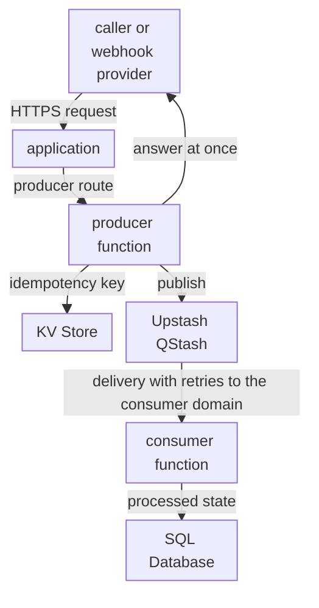
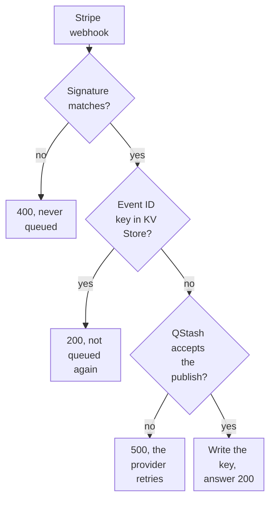

import DocCardGroup from '@aziontech/webkit/doc-card-group'
import DocCard from '@aziontech/webkit/doc-card'

A development team builds APIs that react to events instead of answering a caller on the spot, such as the webhooks a payment provider sends when a payment succeeds. The provider must get its answer at once and retries any event it does not see acknowledged, so the same event can arrive more than once, and none may be lost. This page sets up the producer side: a function route that verifies each Stripe webhook, filters repeated events with a key in KV Store, publishes the event to Upstash QStash, and answers at once. The result is measured by the share of events processed within the target time, zero events lost after retries, and the time from event to processed state.

This page does not cover the consumer function that receives each delivery from QStash and records the event in SQL Database. The use case does not cover request-response APIs, which [Build REST and GraphQL APIs](/en/documentation/use-cases/build-and-run-applications/build-rest-and-graphql-apis/) covers, or stream analytics.

## Prerequisites

- An Azion account. If you do not have one, [create an account](https://console.azion.com/signup).
- The Stripe webhook handler that [Build a Stripe webhook handler with Functions](/en/documentation/guides/application-development/functions-and-runtime/stripe-webhooks-functions/) builds, through its step 4: the Hono project, the `verifyStripeWebhook` middleware, and the two Stripe variables. This page replaces its webhook route and deploys it.
- An Upstash account and its **QStash Token**, from the **QStash** tab of the Upstash Console, as [Use the QStash Function Scheduler](/en/documentation/guides/application-development/frameworks/qstash-function-scheduler/) shows. QStash usage is billed by Upstash.
- The domain of the consumer that receives each event from QStash.

---

## Required products

| The event API needs | Which means | Product | Documented in |
| --- | --- | --- | --- |
| Events accepted and acknowledged without waiting for processing | A producer route that verifies the webhook, publishes the event to Upstash QStash, and answers at once | Functions | [Publish a message to Upstash QStash from a function](/en/documentation/guides/application-development/integrations/publish-a-message-to-upstash-qstash-from-a-function/) |
| A repeated delivery that is not queued again | A key per event ID in a namespace, written after the publish and read before it | KV Store | [Deduplicate webhook deliveries with KV Store](/en/documentation/guides/application-development/data/deduplicate-webhook-deliveries-with-kv-store/) |

---

## Reference architecture

This page builds the producer side of the *Queue-backed asynchronous API*: a producer function answers the caller at once and hands each event to Upstash QStash, which delivers it to a consumer function.

Read the diagram as two flows joined by the queue. The request flow ends at the producer, which answers the caller as soon as the message is queued. The processing flow starts at Upstash QStash, which calls the consumer at the domain the producer names as the destination, so the caller never waits for it. Duplicate handling sits on both sides of the queue: the producer's key in KV Store filters a repeated request, and the consumer's write to SQL Database is the record that decides whether an event was processed.

### Dataflow

1. The payment provider sends a signed webhook to the producer route, `POST /webhook`, and the `verifyStripeWebhook` middleware rejects a request whose signature does not match.
2. The producer reads the event ID in KV Store. A key that exists means an earlier delivery was queued, so the producer answers `200` and publishes nothing.
3. Otherwise the producer publishes a message with the event to Upstash QStash, writes the event ID to KV Store, and answers `200`, before any processing starts. When the publish fails, it answers `500`, and the provider retries the event.
4. QStash holds the message and delivers it to the consumer's domain, retrying a delivery that does not succeed.
5. The consumer processes the message and writes the result to SQL Database, keyed by the event, so a message delivered twice leaves one record. This page does not configure the consumer.

### Platform Resources

- **Functions**: run the producer endpoint, which accepts and queues each event, and the consumer handler, which processes each delivery. Splitting the two is what lets the caller's answer stop depending on the processing. This page builds the producer.
- **Upstash QStash**: the integration that holds each message and delivers it to the consumer with retries. Delivery and retries move out of the producer, so a slow or failing consumer does not reach the caller.
- **KV Store**: holds the idempotency key of each queued event, which the producer reads before it publishes. KV Store is eventually consistent and has no compare-and-set, so the key filters repeats and does not, alone, guarantee a single publish.
- **SQL Database**: holds the processed state. A primary key on the event identifier makes a second write of the same event a no-op, which is the guard that holds when a duplicate passes the KV check.
- **application**: the Platform Resource that routes the producer route the caller reaches. The consumer route QStash delivers to answers on the domain the producer names as the destination.

### Other designs for this use case

- *Scheduled job API on Functions*: for teams with work that runs on a clock, such as syncs, cleanups, or reports, where Upstash QStash schedules call a function endpoint with signed requests. No caller exists, so the control flow starts from the schedule, the function takes a lock in KV Store so runs do not overlap, and overlap and missed-run handling become the design decisions.

---

## How the design works

This section explains how the producer filters repeated events, how it reaches QStash, and how it decides whether to queue each event.

### The idempotency namespace

The producer keeps one key per queued event in the KV Store namespace `events-idempotency`, a fast check it runs before it publishes. The check filters repeats; it does not guarantee a single publish, as the best practices below explain.

### The queue credentials

The producer authenticates to QStash with the QStash token and publishes to the consumer's domain. Both values are account environment variables, so neither enters the code, and the destination changes without a code edit.

### The producer route

The producer route replaces the `POST /webhook` route of the Stripe webhook handler. It keeps the `verifyStripeWebhook` middleware, so only an event whose signature matches reaches it. It then decides, per event, whether to queue it:

1. A request whose signature does not match answers `400` in the middleware and is never queued.
2. An event whose ID already has a key in KV Store answers `200` and is not published again.
3. A publish that QStash does not accept answers `500`. The provider retries an event the endpoint does not acknowledge, so the event comes back.
4. A publish that QStash accepts writes the key and answers `200`.

Each key expires after `86400` seconds, one day, so a repeat that arrives later than that reaches the table's primary key instead.

---

## Measuring results

| Metric | Where to read it | What working looks like |
| --- | --- | --- |
| Webhooks acknowledged at once | **Average Request Time** on the **Requests** dashboard of Real-Time Metrics, filtered by **Host** to the producer's domain. Refer to [Build dashboards](/en/documentation/platform/real-time-metrics/build-dashboards/#requests) | Stays low as event volume rises, because the producer never waits for processing |
| Events left unacknowledged | The deliveries, response codes, and retries the Stripe Dashboard lists for the endpoint. Refer to [Build a Stripe webhook handler with Functions](/en/documentation/guides/application-development/functions-and-runtime/stripe-webhooks-functions/) | Every event ends in a `200`, after retries when a publish failed |
| Failed publishes | **HTTP Status Codes 5XX** on the **Status Codes** dashboard of Real-Time Metrics, filtered to the domain. Refer to [Build dashboards](/en/documentation/platform/real-time-metrics/build-dashboards/#status-codes) | No `500` series; one points at a failed publish, which the function logs |

---

## Best practices

- **Treat the KV key as a filter, not a guarantee.** KV Store is eventually consistent: a write becomes visible everywhere within 60 seconds, and the client has no compare-and-set. Two deliveries of one event close together can both read no key and both publish, so the consumer must still record each event ID once. For the consistency model, refer to [How KV Store works](/en/documentation/platform/kv-store/how-it-works/#consistency).
- **Write the key only after the publish succeeds.** A key written before a failed publish marks the event as queued, the provider's retry then reads the key, and the event is never queued.
- **Answer 500 when the event is not queued.** The provider retries an event the endpoint does not acknowledge. An error answer turns a failed publish into a retry instead of a lost event.
- **Keep one key per event, not per message.** KV Store accepts one write per second to the same key, and the event ID changes on every event, so the producer writes each key once.

---

## Guides in this use case

<DocCardGroup cols={2}>
  <DocCard title="Publish a message to Upstash QStash from a function" href="/en/documentation/guides/application-development/integrations/publish-a-message-to-upstash-qstash-from-a-function/" label="Sends the publish request the producer route makes for each new event." />
  <DocCard title="Deduplicate webhook deliveries with KV Store" href="/en/documentation/guides/application-development/data/deduplicate-webhook-deliveries-with-kv-store/" label="Reads and writes the key per event ID that keeps a repeated delivery from being queued again." />
  <DocCard title="Build a Stripe webhook handler with Functions" href="/en/documentation/guides/application-development/functions-and-runtime/stripe-webhooks-functions/" label="Builds the Hono project and the verifyStripeWebhook middleware that the producer route keeps, and checks the handler with the Stripe CLI." />
</DocCardGroup>
