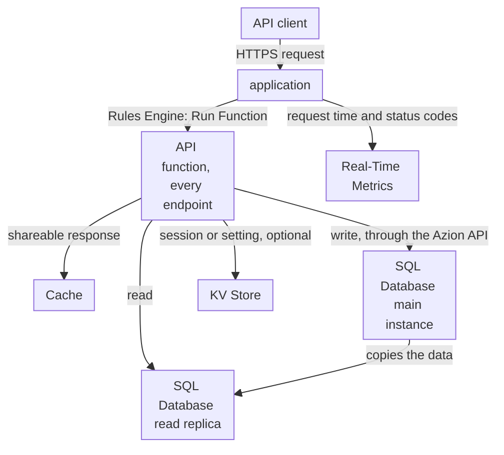

import DocCardGroup from '@aziontech/webkit/doc-card-group'
import DocCard from '@aziontech/webkit/doc-card'
import DocSteps from '@aziontech/webkit/doc-steps'
import DocStep from '@aziontech/webkit/doc-step'

A development team builds the REST or GraphQL backend that its web and mobile clients call, with users in several regions and no server it wants to operate. The API keeps its records in a relational database, most calls read, and some calls write. This page deploys one function that implements every endpoint of a REST API, reads its records from SQL Database, writes them through the Azion API, and keeps the list response in cache for a short time. The result is measured by API response time per region, error rate under load, and the time from a code change to production.

This use case does not cover APIs that react to events instead of callers, which [Build event-driven APIs](/en/documentation/use-cases/build-and-run-applications/build-event-driven-apis/) covers, or security controls in front of an API that runs elsewhere, which [Protect public APIs from abuse](/en/documentation/use-cases/secure-applications-and-networks/protect-public-apis-from-abuse/) covers.

## Prerequisites

- Azion CLI installed, with your personal token saved. To set it up, refer to [Azion CLI quickstart](/en/documentation/devtools/cli/quickstart/).
- SQL Database enabled on your account, and the **Edit SQL Database** permission. The product is in Preview, so request access through [Technical Support](/en/documentation/support/).
- A personal token for the database calls, separate from the one the CLI uses, because the function stores it. To create one, refer to [Personal tokens](/en/documentation/guides/platform/account-and-billing/personal-tokens/).
- Node.js and a package manager, which the CLI uses to build the project.
- The names this page uses: `tasks-api` for the database and the response cache, `/api/tasks` for the API path, `TASKS_DB_ID` and `TASKS_SQL_TOKEN` for the function's environment variables, and `api.example.com` for the domain. The deploy prints a `xxxxxxxxxx.map.azionedge.net` domain; to serve the API on your own domain, refer to [Add a custom domain to a workload](/en/documentation/guides/platform/migration/configure-a-domain/). Replace each value with yours in every step.

---

## Required products

| The API needs | Which means | Product | Documented in |
| --- | --- | --- | --- |
| Endpoints that run with no server to operate | One function, deployed with the Azion CLI, that the application runs on every request | Functions | [Deploy a function with Azion CLI](/en/documentation/guides/application-development/functions-and-runtime/deploy-function-with-cli/) |
| Records that every endpoint reads and writes | Reads from a read replica of the database inside the function, and writes through the Azion API | SQL Database | [Write rows to SQL Database from a function](/en/documentation/guides/application-development/data/write-sql-database-rows-from-a-function/) |
| A list response that is not rebuilt on every call | A response the function stores with the runtime Cache API, under a `max-age` | Cache | [Cache a function's response with the Cache API](/en/documentation/guides/application-development/functions-and-runtime/cache-a-function-response-with-the-cache-api/) |
| Latency and errors on the API's domain | The **Requests** and **Status Codes** dashboards filtered to the domain, and the **Functions** invocations | Real-Time Metrics | [Build dashboards](/en/documentation/platform/real-time-metrics/build-dashboards/) |

---

## Reference architecture

This page builds the *Single-service API on SQL Database*: one function implements every endpoint and reads and writes one database in SQL Database.



Read the diagram from the function outward. Every request the application receives runs the same function, so the function is the one place that knows every endpoint. From there, the paths split by what the endpoint does: a response that every client may share goes to Cache, a read goes to a replica of the database, and a write goes to the main instance. KV Store sits beside the database for values read by key, such as a session, and the design works without it. Real-Time Metrics reads what the application records and changes nothing on the request path.

### Dataflow

1. A client's request reaches the workload on the API's domain, which hands it to the application, and a rule of the application runs the API function.
2. The function matches the method and the path. A path outside `/api/tasks` answers `404`.
3. A `GET` for the task list is answered from the copy the function stored in Cache. When no copy exists, the function reads the rows and stores the new response for 60 seconds.
4. A `GET` for one task opens a connection to a read replica of the database with `Database.open`, which takes the database name and no token, so the data a read needs stays inside Azion.
5. A `POST` or a `DELETE` sends its statement to the database's query endpoint of the Azion API, with the personal token the function reads from an environment variable, because the main instance is the only one that applies writes. The replicas then hold the change.
6. After a write, the function deletes the stored list response, so the next list request reads the rows again.

### Components

- **application**: the Platform Resource that receives the API's requests on its domain and routes them to the function with a Rules Engine rule.
- **Functions**: one function implements every endpoint. A deploy replaces the code of all the endpoints together, which is what makes the API one unit, so a deploy, a rollback, or a schema change reaches every endpoint at the same moment.
- **SQL Database**: holds the API's relational data. A function reads through a read replica with no token, and writes go to the main instance through the Azion API with a personal token.
- **KV Store**: holds sessions and configuration read by key, a design option. It is eventually consistent and has no compare-and-set, so it carries values that tolerate a short delay, not the API's records.
- **Cache**: stores the responses that every client may share, such as a list or a lookup, so a repeated call skips the database read.
- **Real-Time Metrics**: reports the API's request time and status codes by domain, and the number of times the function ran.

### Other designs for this use case

- *Single-service API over an external database*: for teams whose data already lives in a managed database such as Neon, MongoDB Atlas, TiDB, or Turso, which one function queries through its serverless driver or HTTP API. Every uncached call crosses to the external database, so its latency and availability enter the request and failure flows.
- *Microservices API on Functions*: for teams that split an API into services owned by different teams, each one a function with its own store, deployed and versioned on its own. A Rules Engine rule routes each path prefix to its service and services call each other over HTTP through the same rules, so a deploy changes one service and leaves the others on the version they had.

---

## Configure the tasks database

The tasks API keeps its records in one table of a database named `tasks-api`. The function reads the database by its name and writes to it by its identifier, so this section creates the database through the API, whose create response returns that identifier. Azion Console can also create the database and run the statement in its **Editor** tab, as [Create and manage databases](/en/documentation/guides/application-development/data/manage-sql-database/) shows.

To create the database:

```bash
curl --request POST \
  --url https://api.azion.com/v4/workspace/sql/databases \
  --header 'Accept: application/json' \
  --header 'Authorization: Token <personal-token>' \
  --header 'Content-Type: application/json' \
  --data '{"name": "tasks-api"}'
```

The API answers `202`. Keep `data.id`: it is the database identifier the function writes to.

```json
{"state":"pending","data":{"id":<database-id>,"name":"tasks-api","status":"creating","active":true,...}}
```

Provisioning takes roughly 15 seconds. Send `GET /v4/workspace/sql/databases/<database-id>` until `status` reads `created`, then create the table and two rows to read back. `completed` is an integer column, `0` or `1`, because the function reads it as a number:

```bash
curl --request POST \
  --url https://api.azion.com/v4/workspace/sql/databases/<database-id>/query \
  --header 'Accept: application/json' \
  --header 'Authorization: Token <personal-token>' \
  --header 'Content-Type: application/json' \
  --data '{"statements": [
    "CREATE TABLE IF NOT EXISTS tasks (id INTEGER PRIMARY KEY AUTOINCREMENT, title TEXT NOT NULL, completed INTEGER NOT NULL DEFAULT 0);",
    "INSERT INTO tasks (title, completed) VALUES ('\''Write the API spec'\'', 0);",
    "INSERT INTO tasks (title, completed) VALUES ('\''Deploy the API'\'', 1);"
  ]}'
```

The API answers `200` with `"state": "executed"` and one entry per statement in `data`. A statement that fails also answers `200`, with `error` in place of `results` in its entry, so check each entry:

```json
{"state":"executed","data":[{"results":{"columns":[],"rows":[],"rows_read":0,"rows_written":0,...}},...]}
```

The `tasks-api` database holds the `tasks` table and two rows.

---

## Configure the function's write credentials

A function reads a database through a read-only replica, and a statement that writes fails there with ``attempt to write a readonly database``. The API function therefore sends its writes to the Azion API, and it needs two values to do so: the database identifier and a personal token. Store both as [Write rows to SQL Database from a function](/en/documentation/guides/application-development/data/write-sql-database-rows-from-a-function/) describes, with the API's key names:

```bash
azion create variables --key TASKS_DB_ID --value <database-id> --secret false
azion create variables --key TASKS_SQL_TOKEN --value <personal-token> --secret true
```

A variable reaches the function only after a deploy, so create both before the deploy in the next section.

---

## Configure the API function

The API function is one ES Modules handler that implements every endpoint under `/api/tasks`. It reads with the `Database` class of the `Azion.Sql` global. Its writes follow [Write rows to SQL Database from a function](/en/documentation/guides/application-development/data/write-sql-database-rows-from-a-function/), and its list follows [Cache a function's response with the Cache API](/en/documentation/guides/application-development/functions-and-runtime/cache-a-function-response-with-the-cache-api/), with these values:

- **Writes**: `writeTasks` sends one statement per call, with `TASKS_DB_ID` and `TASKS_SQL_TOKEN`, and throws on a failed request or a failed statement.
- **List cache**: the cache `tasks-api`, the key `<origin>/api/tasks`, and `max-age=60`. Every `POST` and `DELETE` deletes that key after its write, so 60 seconds only bounds how long a list stays stale when that delete does not run.

<DocSteps>
  <DocStep title="Create the project">

  Run `azion init`, enter `tasks-api` as the name, and select the _Javascript_ preset and the _Hello World_ template, as [Deploy a function with Azion CLI](/en/documentation/guides/application-development/functions-and-runtime/deploy-function-with-cli/) shows. Then go to the project directory.

  </DocStep>
  <DocStep title="Replace the handler">

  Replace the contents of `index.js`, the entrypoint the build reads, with the code below.

  </DocStep>
  <DocStep title="Deploy the project">

  Run `azion deploy` from the project directory. The command builds the project, creates the application and the function, instantiates the function, and prints the domain that serves it.

  </DocStep>
</DocSteps>

```javascript
const { Database } = Azion.Sql;

const DATABASE_NAME = 'tasks-api';
const CACHE_NAME = 'tasks-api';
const LIST_MAX_AGE = 60;

function json(body, status = 200, headers = {}) {
  return new Response(JSON.stringify(body), {
    status,
    headers: { 'content-type': 'application/json', ...headers },
  });
}

// Reads come from a read replica. Integer parameters bind; string parameters are refused.
async function readTasks(id) {
  const connection = await Database.open(DATABASE_NAME);
  const rows = id === undefined
    ? await connection.query('SELECT id, title, completed FROM tasks ORDER BY id')
    : await connection.query('SELECT id, title, completed FROM tasks WHERE id = ?', [id]);
  const tasks = [];
  let row = await rows.next();
  while (row) {
    tasks.push({ id: row.getValue(0), title: row.getValue(1), completed: row.getValue(2) === 1 });
    row = await rows.next();
  }
  return tasks;
}

// Writes go to the main instance through the Azion API. A failed statement still answers 200.
async function writeTasks(statement) {
  const response = await fetch(
    `https://api.azion.com/v4/workspace/sql/databases/${Azion.env.get('TASKS_DB_ID')}/query`,
    {
      method: 'POST',
      headers: {
        Accept: 'application/json',
        Authorization: `Token ${Azion.env.get('TASKS_SQL_TOKEN')}`,
        'Content-Type': 'application/json',
      },
      body: JSON.stringify({ statements: [statement] }),
    },
  );
  if (!response.ok) {
    throw new Error(`Azion API answered ${response.status}`);
  }
  const entry = (await response.json()).data[0];
  if (entry.error) {
    throw new Error(entry.error);
  }
  return entry.results;
}

// The query endpoint takes SQL strings, so a text value is quoted and its quotes doubled.
function sqlText(value) {
  return `'${String(value).replaceAll("'", "''")}'`;
}

export default {
  async fetch(request) {
    const url = new URL(request.url);
    const match = url.pathname.match(/^\/api\/tasks(?:\/(\d+))?$/);
    if (!match) {
      return json({ error: 'Not found' }, 404);
    }
    const id = match[1] === undefined ? undefined : Number(match[1]);
    const cache = await caches.open(CACHE_NAME);
    const listKey = `${url.origin}/api/tasks`;

    try {
      if (request.method === 'GET' && id === undefined) {
        const cached = await cache.match(listKey);
        if (cached) {
          return cached;
        }
        const list = json(await readTasks(), 200, {
          'cache-control': `max-age=${LIST_MAX_AGE}`,
          'x-tasks-cached-at': new Date().toISOString(),
        });
        await cache.put(listKey, list.clone());
        return list;
      }
      if (request.method === 'GET') {
        const [task] = await readTasks(id);
        return task ? json(task) : json({ error: 'Task not found' }, 404);
      }
      if (request.method === 'POST' && id === undefined) {
        const { title, completed = false } = await request.json();
        if (typeof title !== 'string' || title.length === 0) {
          return json({ error: 'title is required' }, 400);
        }
        const results = await writeTasks(
          `INSERT INTO tasks (title, completed) VALUES (${sqlText(title)}, ${completed ? 1 : 0}) RETURNING id`,
        );
        await cache.delete(listKey);
        return json({ id: results.rows[0][0], title, completed: Boolean(completed) }, 201);
      }
      if (request.method === 'DELETE' && id !== undefined) {
        const results = await writeTasks(`DELETE FROM tasks WHERE id = ${id}`);
        await cache.delete(listKey);
        return results.rows_written > 0
          ? json({ message: 'Task deleted' })
          : json({ error: 'Task not found' }, 404);
      }
      return json({ error: 'Method not allowed' }, 405);
    } catch (error) {
      console.log(error.message);
      return json({ error: 'Internal error' }, 500);
    }
  },
};
```

The code makes three more decisions:

- **Reads stay inside Azion.** `Database.open` needs no token, and the `?` parameter carries the task ID as an integer, which the replica binds. Passing a JavaScript string as a parameter fails with ``unknown variant `String` ``.
- **The delete reports a missing task.** `rows_written` counts the rows the statement wrote, so `0` means no task carried that ID.
- **The list copy carries its own timestamp.** `x-tasks-cached-at` is set once, when the function stores the response, so two responses with the same value came from the same stored copy.

The API answers on the domain the deploy printed, every endpoint runs in the function, and the list response is cached for 60 seconds. The first deploy can take several minutes to answer from every location.

---

## Verify the setup

Each check calls the API on its domain. A first deploy that does not answer yet is still propagating; wait a few minutes and retry.

- **The list endpoint reads the database.** Request the list:

  ```bash
  curl -i https://api.example.com/api/tasks
  ```

  The response carries `200` and the two rows the table holds:

  ```json
  [{"id":1,"title":"Write the API spec","completed":false},{"id":2,"title":"Deploy the API","completed":true}]
  ```

- **The list comes from the cached copy.** Repeat the request within 60 seconds. The `x-tasks-cached-at` header carries the same value as in the first response.

- **A write reaches the database.** Create a task:

  ```bash
  curl -i -X POST https://api.example.com/api/tasks \
    -H "Content-Type: application/json" \
    -d '{"title": "Review the logs"}'
  ```

  The response carries `201` and the ID the database assigned:

  ```json
  {"id":3,"title":"Review the logs","completed":false}
  ```

  A `500` here means the write failed. Read the message the function logged, as [Query function console logs](/en/documentation/guides/platform/observability/query-function-console-events/) shows: `Azion API answered 401` points at the `TASKS_SQL_TOKEN` value, and a database error string points at the statement.

- **A write refreshes the list.** Request the list again. The response carries a new `x-tasks-cached-at` value and three tasks.

- **A missing task answers 404.** Delete the same task twice:

  ```bash
  curl -X DELETE https://api.example.com/api/tasks/3
  ```

  The first call answers `{"message":"Task deleted"}`, and the second answers `404` with `{"error":"Task not found"}`.

---

## Measuring results

| Metric | Where to read it | What working looks like |
| --- | --- | --- |
| API response time per region | **Average Request Time** on the **Requests** dashboard of Real-Time Metrics, filtered by **Host** to the API's domain and by **Country**. Refer to [Filter a Real-Time Metrics dashboard](/en/documentation/guides/platform/observability/add-filters-metrics/) | Comparable across the countries your clients call from, and stable as traffic grows |
| Error rate under load | **HTTP Status Codes 5XX** on the **Status Codes** dashboard, filtered to the API's domain. Refer to [Build dashboards](/en/documentation/platform/real-time-metrics/build-dashboards/#status-codes) | No `500` series rising with request volume; a rise points at failed writes, which the function logs |
| How often the API code runs | **Total Invocations** on the **Functions** tab, **Edge Application Invocations** series. Refer to [Build dashboards](/en/documentation/platform/real-time-metrics/build-dashboards/#functions) | Tracks the API's request count, since every request runs the function |
| Time from a code change to production | The deploy log that `azion deploy` links in Azion Console. Refer to [How Azion CLI works](/en/documentation/devtools/cli/how-it-works/#from-a-project-to-a-deployment) | Each deploy completes, and the new code answers once it propagates, in about two minutes for a deploy after the first |

---

## Best practices

- **Read through the replica and write through the API.** `Database.open` reaches a read replica with no token, and it refuses writes. Sending reads to the API instead spends the personal token on every call and adds a request the replica answers directly. For how the main instance and the replicas split the work, refer to [How SQL Database works](/en/documentation/platform/sql-database/how-it-works/).
- **Check every statement, not the HTTP status.** A failed statement returns `200` with `error` in its entry. A client that reads only the status reports a failed insert as a success, and the record is never written:

  ```javascript
  const entry = (await response.json()).data[0];
  if (entry.error) throw new Error(entry.error);
  ```

- **Give the function a token of its own, with a planned expiration.** A personal token expires at the date chosen when it is created, and every write fails from that moment. A token used only by the function can be replaced and redeployed without touching the CLI's token. For the expiration options, refer to [Personal tokens](/en/documentation/guides/platform/account-and-billing/personal-tokens/).
- **Never build a statement from raw request text.** The query endpoint takes SQL strings, so a title that carries a quote changes the statement the database runs. Quote text values and double their quotes, as `sqlText` does, and validate every field before it reaches a statement.
- **Cache only what every client may read.** A response stored with the Cache API is returned to any later request for the same key. Cache list and lookup responses that are the same for every client, and never a response built from a client's credentials.

---

## Guides in this use case

<DocCardGroup cols={2}>
  <DocCard title="Write rows to SQL Database from a function" href="/en/documentation/guides/application-development/data/write-sql-database-rows-from-a-function/" label="Stores the database credentials as environment variables and sends the writes the API function makes." />
  <DocCard title="Cache a function's response with the Cache API" href="/en/documentation/guides/application-development/functions-and-runtime/cache-a-function-response-with-the-cache-api/" label="Stores the list response under a max-age, and deletes it after each write." />
</DocCardGroup>
