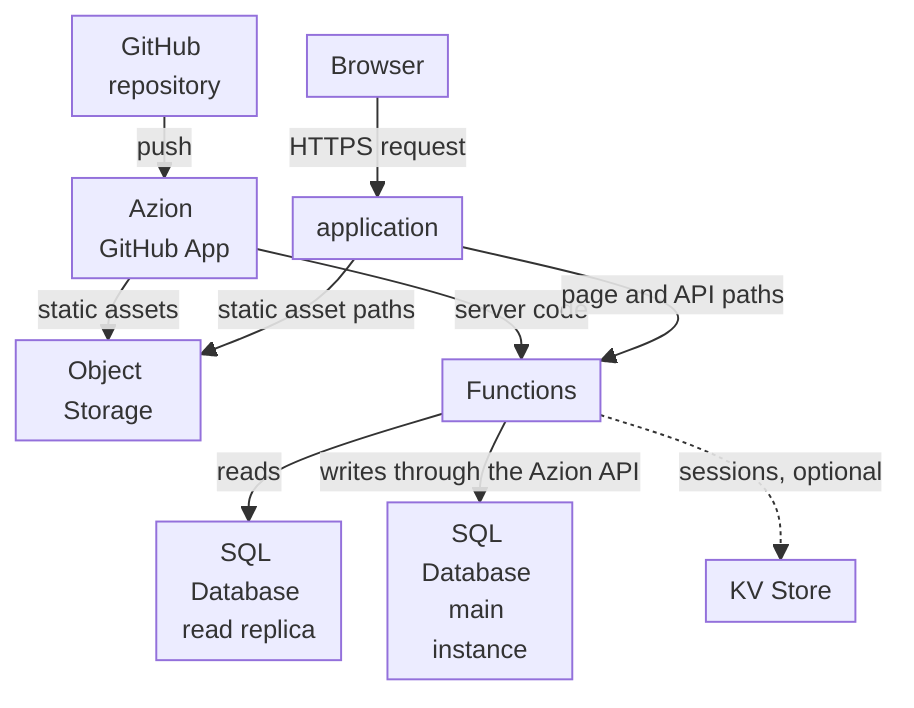

import DocCardGroup from '@aziontech/webkit/doc-card-group'
import DocCard from '@aziontech/webkit/doc-card'

A product engineering team builds a web application with a user interface, server logic, and its own data, such as a customer portal or a dashboard, for users in several regions. The interface and the server logic ship together from one Next.js repository, and the data is relational. This page deploys that repository from GitHub so its build assets are served from a bucket, its pages are rendered on each request by a function that reads SQL Database, and its writes go through the Azion API. Every later push deploys the application again. The result is measured by page and API response time per region, the error rate under load, and the time from a commit to production.

This use case does not cover APIs without a user interface, which [Build REST and GraphQL APIs](/en/documentation/use-cases/build-and-run-applications/build-rest-and-graphql-apis/) covers, or frontends whose backend stays on an existing origin, which [Deploy frontend applications](/en/documentation/use-cases/build-and-run-applications/deploy-frontend-applications/) covers.

## Prerequisites

- An Azion account. If you do not have one, [create an account](https://console.azion.com/signup).
- A GitHub repository with a Next.js project at its root, on a version Azion supports. For the versions and features, refer to [Next.js versions](/en/documentation/devtools/runtime/frameworks/nextjs-compatibility/).
- SQL Database enabled on your account, and the **Edit SQL Database** permission. The product is in Preview, so request access through [Technical Support](/en/documentation/support/).

---

## Required products

| The application needs | Which means | Product | Documented in |
| --- | --- | --- | --- |
| Pages rendered on each request, and API routes in the same project | The server code of the Next.js build, deployed as a function that a rule runs on every path that is not a static asset | Functions | [Build with Next.js](/en/documentation/guides/application-development/frameworks/next/) |
| Relational data that pages read and routes write | Reads from a read replica of the database inside the function, and writes through the Azion API | SQL Database | [Write rows to SQL Database from a function](/en/documentation/guides/application-development/data/write-sql-database-rows-from-a-function/) |
| Build assets served without running the function | The static output of the build, uploaded to a bucket that rules deliver for `/_next/static/` and static file types | Object Storage | [Build with Next.js](/en/documentation/guides/application-development/frameworks/next/) |
| A deploy on every commit | The repository imported through the Azion GitHub App, which deploys every push | Azion GitHub App (integration) | [Import a project from GitHub](/en/documentation/guides/application-development/automation/import-an-existing-project-from-github/) |

---

## Reference architecture

This page builds the *Server-rendered full-stack application on SQL Database*: a server-rendering framework whose build splits into static assets in Object Storage and server code in a function that reads Azion's stores.

Read the diagram as two flows. The publish flow runs from the repository through the Azion GitHub App, which puts the build's static assets in Object Storage and its server code in a function. The request flow starts at the application, which sends static asset paths to the bucket and every other path to the function. Every page view therefore includes a function run and a data read, so the database sits inside both the request flow and the failure flow, while the static assets do not depend on either.

### Dataflow

1. A push to the repository makes the Azion GitHub App build the project. The build uploads the static assets to an Object Storage bucket and deploys the server code as a function.
2. A browser's request reaches the application. Its rules deliver paths under `/_next/static/` and static file types from the bucket, without running the function.
3. A rule runs the function on every other path. The function renders the page, or answers the API route, on each request.
4. To render a page, the function reads the database through a read replica with `Database.open`, which takes the database name and no token. A response that is the same for every visitor can be stored with the runtime Cache API and returned to later requests.
5. An API route that writes sends its statement to the query endpoint of the Azion API, with the personal token it reads from an environment variable, and the main instance applies the write. A failed statement still answers `200`, with the error inside its entry.
6. When a read or a write fails, the function answers the error for that page or route, while requests for the build assets keep answering from the bucket.

### Platform Resources

- **Functions**: run the server code of the build. They render each page on request, answer the API routes, and carry the only path to the data.
- **SQL Database**: holds the relational data. The main instance takes every write, and read replicas answer the reads a function sends with `Database.open`, which is read-only.
- **KV Store**: keeps sessions, a design option. It is eventually consistent, so a session written in one location can take up to 60 seconds to be visible in every other.
- **Object Storage**: holds the static assets of the build, in a bucket the application reads, so they are delivered without a function run.
- **application**: the Platform Resource whose rules split each request between the bucket and the function, by path.
- **Cache**: keeps the responses that are the same for every visitor, so a repeat request skips the render. A function stores a response with the runtime Cache API, and a `max-age` on it bounds how long later requests receive it.
- **Azion GitHub App**: the integration that builds the repository on every push and deploys the static assets and the function, so a commit reaches production with no manual step.

### Other designs for this use case

- *Server-rendered full-stack application over an external database*: for teams whose data already lives in a managed database such as Neon, MongoDB Atlas, TiDB, or Turso, which the rendering functions query through its serverless driver or HTTP API. Every uncached page view crosses to the external database, so its latency and availability enter the request and failure flows, and caching and query batching become design decisions.
- *Client-rendered full-stack application on SQL Database*: for teams building a single-page application, whose compiled interface is served as static files from Object Storage through Cache. The browser renders the interface and calls API routes that functions answer from SQL Database, so page loads read only static files, and the interface and the API deploy and fail independently.
- *Client-rendered full-stack application over an external database*: for single-page applications whose data lives in a managed database outside Azion. Page loads stay static, but every data call from the API functions crosses to the external database, which enters the API's request and failure flows.

---

## How the design works

This section explains the four parts of the portal's design: its database, the credentials its writes use, its server code, and its deploy from GitHub.

### The portal database

The portal keeps its records in a database named `portal-app`. The server code reads it by name and writes to it by its identifier, so it is created through the API, whose create response returns that identifier. Azion Console can also create the database and run statements in its **Editor** tab.

### The database credentials

The portal's server code reads through a read replica, which refuses a statement that writes with ``attempt to write a readonly database``. Its API route therefore writes through the Azion API, and it needs the database identifier and a personal token. Both are stored as environment variables with the portal's key names, so neither enters the repository.

### The server code

The portal's server code is two files of the Next.js App Router: a page that lists the projects, and a route handler that creates one. Both run in the function the build deploys. Both export `dynamic = 'force-dynamic'`, so Next.js renders them on each request instead of once at build time, when the database is out of reach.

### The deploy from GitHub

The portal deploys through the Azion GitHub App: the import builds the repository once, and every later push deploys it again. The _Next.js_ preset splits the build. The static assets go to a bucket that workloads can only read, and the rest runs as a function. Rules deliver `/_next/static/` and static file types from the bucket and run the function on every other path.

---

## Measuring results

| Metric | Where to read it | What working looks like |
| --- | --- | --- |
| Page and API response time per region | **Average Request Time** on the **Requests** dashboard of Real-Time Metrics, filtered by **Host** to the application's domain and by **Country**. Refer to [Filter a Real-Time Metrics dashboard](/en/documentation/guides/platform/observability/add-filters-metrics/) | Comparable across the countries your users visit from, and stable as traffic grows |
| Time to first byte in your users' browsers | The `ttfb` field of the `pulseEvents` dataset, grouped by `locationhref`, once the Edge Pulse tag is on the portal's layout. Refer to [Edge Pulse quickstart](/en/documentation/platform/edge-pulse/quickstart/) | Stable on the pages that read the database, and not rising after a deploy |
| Error rate under load | **HTTP Status Codes 5XX** on the **Status Codes** dashboard, filtered to the application's domain. Refer to [Build dashboards](/en/documentation/platform/real-time-metrics/build-dashboards/#status-codes) | No `500` series rising with request volume; a rise points at a failed read or write, which the function logs |
| Time from a commit to production | The time between a push and the first request that returns the change, as the push check in [Confirm the page reads and the route writes](/en/documentation/guides/application-development/data/read-and-write-sql-database-from-a-nextjs-app/#confirm-the-page-reads-and-the-route-writes) shows | Each push answers with the change, in about two minutes for a deploy after the first |

---

## Best practices

- **Render per request only what reads the database.** A page exported with `dynamic = 'force-dynamic'` runs the function and reads a replica on every view. Leave pages that read nothing at their Next.js defaults, so the build writes them as static output.
- **Check every statement, not the HTTP status.** The query endpoint answers `200` when a statement fails, with `error` in its entry. A route that reads only the status reports a failed insert as created.

- **Keep the write token out of the repository.** Every push is built from the repository, so a token committed there reaches every reader of it. An account environment variable reaches only the function, and a secret one is never printed by the CLI.
- **Give the write token a planned expiration.** A personal token expires at the date chosen when it is created, and every write fails from that moment. Replace it before then and deploy again, since a new variable value reaches the function only on a deploy. For the expiration options, refer to [Personal tokens](/en/documentation/guides/platform/account-and-billing/personal-tokens/).
- **Keep sessions out of a store that must be current everywhere at once.** KV Store, the usual place for sessions in this design, is eventually consistent: a write can take up to 60 seconds to be visible in every location. For what that means for a session, refer to [How KV Store works](/en/documentation/platform/kv-store/how-it-works/).

---

## Guides in this use case

<DocCardGroup cols={2}>
  <DocCard title="Create and manage databases" href="/en/documentation/guides/application-development/data/manage-sql-database/" label="Creates the portal-app database through the API, whose response returns the identifier the route writes to." />
  <DocCard title="Create tables and query data" href="/en/documentation/guides/application-development/data/create-tables-sql-database/" label="Creates the projects table and inserts the first row the page renders." />
  <DocCard title="Write rows to SQL Database from a function" href="/en/documentation/guides/application-development/data/write-sql-database-rows-from-a-function/" label="Stores the database credentials as environment variables and sends the writes the API route makes." />
  <DocCard title="Read and write SQL Database from a Next.js app" href="/en/documentation/guides/application-development/data/read-and-write-sql-database-from-a-nextjs-app/" label="Adds the page that lists the projects and the route handler that creates one, and runs the checks of this use case." />
  <DocCard title="Import a project from GitHub" href="/en/documentation/guides/application-development/automation/import-an-existing-project-from-github/" label="Imports the portal repository with the Next.js preset, so every push deploys the assets and the function." />
</DocCardGroup>
