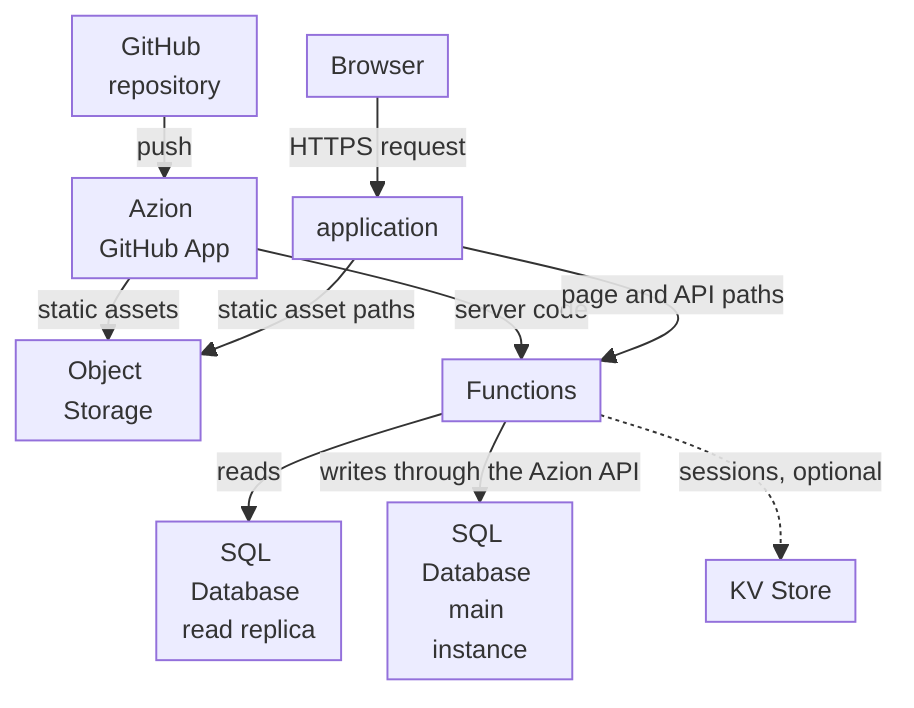

import DocCardGroup from '@aziontech/webkit/doc-card-group'
import DocCard from '@aziontech/webkit/doc-card'

A product engineering team builds a web application with a user interface, server logic, and its own data, such as a customer portal or a dashboard, for users in several regions. The interface and the server logic ship together from one Next.js repository, and the data is relational. This page deploys that repository from GitHub so its build assets are served from a bucket, its pages are rendered on each request by a function that reads SQL Database, and its writes go through the Azion API. Every later push deploys the application again. The result is measured by page and API response time per region, the error rate under load, and the time from a commit to production.

This use case does not cover APIs without a user interface, which [Build REST and GraphQL APIs](/en/documentation/use-cases/build-and-run-applications/build-rest-and-graphql-apis/) covers, or frontends whose backend stays on an existing origin, which [Deploy frontend applications](/en/documentation/use-cases/build-and-run-applications/deploy-frontend-applications/) covers.

## Prerequisites

- A GitHub repository with a Next.js project at its root, on a version Azion supports. For the versions and features, refer to [Next.js versions](/en/documentation/devtools/runtime/frameworks/nextjs-compatibility/).
- Azion CLI installed, with your personal token saved, for the environment variables. To set it up, refer to [Azion CLI quickstart](/en/documentation/devtools/cli/quickstart/).
- SQL Database enabled on your account, and the **Edit SQL Database** permission. The product is in Preview, so request access through [Technical Support](/en/documentation/support/).
- A personal token for the database writes, separate from the one the CLI uses, because the application stores it. To create one, refer to [Personal tokens](/en/documentation/guides/platform/account-and-billing/personal-tokens/).
- The names this page uses: `portal-app` for the database, `projects` for its table and for the API route under `/api/projects`, `PORTAL_DB_ID` and `PORTAL_SQL_TOKEN` for the environment variables, and `app.example.com` for the domain. The deploy gives the application a `xxxxxxxxxx.map.azionedge.net` domain; to serve it on your own domain, refer to [Add a custom domain to a workload](/en/documentation/guides/platform/migration/configure-a-domain/). Replace each value with yours in every step.

---

## Required products

| The application needs | Which means | Product | Documented in |
| --- | --- | --- | --- |
| Pages rendered on each request, and API routes in the same project | The server code of the Next.js build, deployed as a function that a rule runs on every path that is not a static asset | Functions | [Build with Next.js](/en/documentation/guides/application-development/frameworks/next/) |
| Relational data that pages read and routes write | Reads from a read replica of the database inside the function, and writes through the Azion API | SQL Database | [Write rows to SQL Database from a function](/en/documentation/guides/application-development/data/write-sql-database-rows-from-a-function/) |
| Build assets served without running the function | The static output of the build, uploaded to a bucket that rules deliver for `/_next/static/` and static file types | Object Storage | [Build with Next.js](/en/documentation/guides/application-development/frameworks/next/) |
| A deploy on every commit | The repository imported through the Azion GitHub App, which deploys every push | Azion GitHub App (integration) | [Import a project from GitHub](/en/documentation/guides/application-development/automation/import-an-existing-project-from-github/) |

---

## Reference architecture

This page builds the *Server-rendered full-stack application on SQL Database*: a server-rendering framework whose build splits into static assets in Object Storage and server code in a function that reads Azion's stores.



Read the diagram as two flows. The publish flow runs from the repository through the Azion GitHub App, which puts the build's static assets in Object Storage and its server code in a function. The request flow starts at the application, which sends static asset paths to the bucket and every other path to the function. Every page view therefore includes a function run and a data read, so the database sits inside both the request flow and the failure flow, while the static assets do not depend on either.

### Dataflow

1. A push to the repository makes the Azion GitHub App build the project. The build uploads the static assets to an Object Storage bucket and deploys the server code as a function.
2. A browser's request reaches the application. Its rules deliver paths under `/_next/static/` and static file types from the bucket, without running the function.
3. A rule runs the function on every other path. The function renders the page, or answers the API route, on each request.
4. To render a page, the function reads the database through a read replica with `Database.open`, which takes the database name and no token. A response that is the same for every visitor can be stored with the runtime Cache API and returned to later requests.
5. An API route that writes sends its statement to the query endpoint of the Azion API, with the personal token it reads from an environment variable, and the main instance applies the write. A failed statement still answers `200`, with the error inside its entry.
6. When a read or a write fails, the function answers the error for that page or route, while requests for the build assets keep answering from the bucket.

### Components

- **Functions**: run the server code of the build. They render each page on request, answer the API routes, and carry the only path to the data.
- **SQL Database**: holds the relational data. The main instance takes every write, and read replicas answer the reads a function sends with `Database.open`, which is read-only.
- **KV Store**: keeps sessions, a design option. It is eventually consistent, so a session written in one location can take up to 60 seconds to be visible in every other.
- **Object Storage**: holds the static assets of the build, in a bucket the application reads, so they are delivered without a function run.
- **application**: the Platform Resource whose rules split each request between the bucket and the function, by path.
- **Cache**: keeps the responses that are the same for every visitor, so a repeat request skips the render. A function stores a response with the runtime Cache API, and a `max-age` on it bounds how long later requests receive it.
- **Azion GitHub App**: the integration that builds the repository on every push and deploys the static assets and the function, so a commit reaches production with no manual step.

### Other designs for this use case

- *Server-rendered full-stack application over an external database*: for teams whose data already lives in a managed database such as Neon, MongoDB Atlas, TiDB, or Turso, which the rendering functions query through its serverless driver or HTTP API. Every uncached page view crosses to the external database, so its latency and availability enter the request and failure flows, and caching and query batching become design decisions.
- *Client-rendered full-stack application on SQL Database*: for teams building a single-page application, whose compiled interface is served as static files from Object Storage through Cache. The browser renders the interface and calls API routes that functions answer from SQL Database, so page loads read only static files, and the interface and the API deploy and fail independently.
- *Client-rendered full-stack application over an external database*: for single-page applications whose data lives in a managed database outside Azion. Page loads stay static, but every data call from the API functions crosses to the external database, which enters the API's request and failure flows.

---

## Configure the portal database

The portal keeps its records in a database named `portal-app`. The server code reads it by name and writes to it by its identifier, so this section creates it through the API, whose create response returns that identifier. Azion Console can also create the database and run statements in its **Editor** tab, as [Create and manage databases](/en/documentation/guides/application-development/data/manage-sql-database/) shows.

To create the database:

```bash
curl --request POST \
  --url https://api.azion.com/v4/workspace/sql/databases \
  --header 'Accept: application/json' \
  --header 'Authorization: Token <personal-token>' \
  --header 'Content-Type: application/json' \
  --data '{"name": "portal-app"}'
```

The API answers `202`. Keep `data.id`: it is the identifier the API route writes to.

```json
{"state":"pending","data":{"id":<database-id>,"name":"portal-app","status":"creating","active":true,...}}
```

Provisioning takes roughly 15 seconds. Send `GET /v4/workspace/sql/databases/<database-id>` until `status` reads `created`, then create the table and one row for the first page to render:

```bash
curl --request POST \
  --url https://api.azion.com/v4/workspace/sql/databases/<database-id>/query \
  --header 'Accept: application/json' \
  --header 'Authorization: Token <personal-token>' \
  --header 'Content-Type: application/json' \
  --data '{"statements": [
    "CREATE TABLE IF NOT EXISTS projects (id INTEGER PRIMARY KEY AUTOINCREMENT, name TEXT NOT NULL);",
    "INSERT INTO projects (name) VALUES ('\''Customer portal'\'');"
  ]}'
```

The API answers `200` with `"state": "executed"` and one entry per statement. A statement that fails also answers `200`, with `error` in place of `results` in its entry, so check each entry:

```json
{"state":"executed","data":[{"results":{"columns":[],"rows":[],"rows_read":0,"rows_written":0,...}},...]}
```

The `portal-app` database holds the `projects` table and one row.

---

## Configure the database credentials

The portal's server code reads through a read replica, which refuses a statement that writes with ``attempt to write a readonly database``. Its API route therefore writes through the Azion API, and it needs the database identifier and a personal token. Store both as [Write rows to SQL Database from a function](/en/documentation/guides/application-development/data/write-sql-database-rows-from-a-function/) describes, with the portal's key names, so neither enters the repository:

```bash
azion create variables --key PORTAL_DB_ID --value <database-id> --secret false
azion create variables --key PORTAL_SQL_TOKEN --value <personal-token> --secret true
```

A variable reaches the function only after the next deploy, so create both before the repository is imported.

---

## Configure the server code

The portal's server code is two files of the Next.js App Router: a page that lists the projects, and a route handler that creates one. Both run in the function the build deploys. Both export `dynamic = 'force-dynamic'`, so Next.js renders them on each request instead of once at build time, when the database is out of reach.

Add the page as `app/page.js`. It reads the rows through a read replica, with the `Database` class of the `Azion.Sql` global:

```javascript
export const dynamic = 'force-dynamic';

async function readProjects() {
  const { Database } = globalThis.Azion.Sql;
  const connection = await Database.open('portal-app');
  const rows = await connection.query('SELECT id, name FROM projects ORDER BY id');
  const projects = [];
  let row = await rows.next();
  while (row) {
    projects.push({ id: row.getValue(0), name: row.getValue(1) });
    row = await rows.next();
  }
  return projects;
}

export default async function Page() {
  const projects = await readProjects();
  return (
    <main>
      <h1>Projects</h1>
      <ul>
        {projects.map((project) => (
          <li key={project.id}>{project.name}</li>
        ))}
      </ul>
    </main>
  );
}
```

Add the route handler as `app/api/projects/route.js`. It sends the insert as [Write rows to SQL Database from a function](/en/documentation/guides/application-development/data/write-sql-database-rows-from-a-function/) describes, with `PORTAL_DB_ID` and `PORTAL_SQL_TOKEN`, and answers `500` on a failed request or a failed statement:

```javascript
export const dynamic = 'force-dynamic';

function json(body, status) {
  return new Response(JSON.stringify(body), {
    status,
    headers: { 'content-type': 'application/json' },
  });
}

// The query endpoint takes SQL strings, so a text value is quoted and its quotes doubled.
function sqlText(value) {
  return `'${String(value).replaceAll("'", "''")}'`;
}

export async function POST(request) {
  const { name } = await request.json();
  if (typeof name !== 'string' || name.length === 0) {
    return json({ error: 'name is required' }, 400);
  }
  const env = globalThis.Azion.env;
  const response = await fetch(
    `https://api.azion.com/v4/workspace/sql/databases/${env.get('PORTAL_DB_ID')}/query`,
    {
      method: 'POST',
      headers: {
        Accept: 'application/json',
        Authorization: `Token ${env.get('PORTAL_SQL_TOKEN')}`,
        'Content-Type': 'application/json',
      },
      body: JSON.stringify({
        statements: [`INSERT INTO projects (name) VALUES (${sqlText(name)}) RETURNING id`],
      }),
    },
  );
  if (!response.ok) {
    console.log(`Azion API answered ${response.status}`);
    return json({ error: 'Internal error' }, 500);
  }
  const entry = (await response.json()).data[0];
  if (entry.error) {
    console.log(entry.error);
    return json({ error: 'Internal error' }, 500);
  }
  return json({ id: entry.results.rows[0][0], name }, 201);
}
```

Commit both files to the repository's default branch. The page lists the projects of `portal-app` on every request, and `POST /api/projects` adds one.

---

## Configure the deploy from GitHub

The portal deploys through the Azion GitHub App: the import builds the repository once, and every later push deploys it again. The _Next.js_ preset splits the build. The static assets go to a bucket that workloads can only read, and the rest runs as a function. Rules deliver `/_next/static/` and static file types from the bucket and run the function on every other path.

Import the repository as [Import a project from GitHub](/en/documentation/guides/application-development/automation/import-an-existing-project-from-github/) describes, with these values:

- **GitHub Connection**: the [Azion GitHub App](/en/documentation/guides/application-development/automation/azion-github-app/), installed with access to the repository that holds the portal.
- **Application Name**: `portal-app`. The bucket and the function take the same name.
- **Preset**: _Next.js_.
- **Root Directory**: `/`, because the project sits at the root of the repository.
- **Install Command**: `npm install`.

The deploy page shows the build in the **Deploy Log** panel. A successful deploy shows **Successfully created!** and the URL of the application's domain. The first deploy can take several minutes to answer from every location; later deploys take about two minutes.

---

## Verify the setup

Each check requests the application on its domain. A location that does not have the application yet answers a `404` page that reads `There's nothing here yet`; wait a few minutes and retry.

- **The page renders from the database.** Request the home page:

  ```bash
  curl -s https://app.example.com/
  ```

  The HTML carries the row the table holds, in the list the page renders:

  ```text
  <h1>Projects</h1><ul><li>Customer portal</li></ul>
  ```

- **Build assets come from the bucket.** Copy a URL under `/_next/static/` from the page's HTML and request it:

  ```bash
  curl -sI https://app.example.com/_next/static/<path-from-the-page>
  ```

  The response carries `200`, without the request reaching the function.

- **A route writes to the database.** Create a project:

  ```bash
  curl -i -X POST https://app.example.com/api/projects \
    -H "Content-Type: application/json" \
    -d '{"name": "Billing dashboard"}'
  ```

  The response carries `201` and the ID the database assigned:

  ```json
  {"id":2,"name":"Billing dashboard"}
  ```

  A `500` means the write failed. Read the line the route logged, as [Troubleshoot function execution and logs](/en/documentation/platform/functions/troubleshooting/) shows: `Azion API answered 401` points at the `PORTAL_SQL_TOKEN` value, and a database error string points at the statement.

- **The page shows the write.** Request the home page again. The list carries both projects.

- **A push deploys.** Change the `<h1>` text, commit, and push to the default branch. Request the home page after the deploy propagates. The HTML carries the new heading.

---

## Measuring results

| Metric | Where to read it | What working looks like |
| --- | --- | --- |
| Page and API response time per region | **Average Request Time** on the **Requests** dashboard of Real-Time Metrics, filtered by **Host** to the application's domain and by **Country**. Refer to [Filter a Real-Time Metrics dashboard](/en/documentation/guides/platform/observability/add-filters-metrics/) | Comparable across the countries your users visit from, and stable as traffic grows |
| Time to first byte in your users' browsers | The `ttfb` field of the `pulseEvents` dataset, grouped by `locationhref`, once the Edge Pulse tag is on the portal's layout. Refer to [Edge Pulse quickstart](/en/documentation/platform/edge-pulse/quickstart/) | Stable on the pages that read the database, and not rising after a deploy |
| Error rate under load | **HTTP Status Codes 5XX** on the **Status Codes** dashboard, filtered to the application's domain. Refer to [Build dashboards](/en/documentation/platform/real-time-metrics/build-dashboards/#status-codes) | No `500` series rising with request volume; a rise points at a failed read or write, which the function logs |
| Time from a commit to production | The time between a push and the first request that returns the change, as the push check in Verify the setup shows | Each push answers with the change, in about two minutes for a deploy after the first |

---

## Best practices

- **Render per request only what reads the database.** A page exported with `dynamic = 'force-dynamic'` runs the function and reads a replica on every view. Leave pages that read nothing at their Next.js defaults, so the build writes them as static output.
- **Check every statement, not the HTTP status.** The query endpoint answers `200` when a statement fails, with `error` in its entry. A route that reads only the status reports a failed insert as created:

  ```javascript
  const entry = (await response.json()).data[0];
  if (entry.error) throw new Error(entry.error);
  ```

- **Keep the write token out of the repository.** Every push is built from the repository, so a token committed there reaches every reader of it. An account environment variable reaches only the function, and a secret one is never printed by the CLI.
- **Give the write token a planned expiration.** A personal token expires at the date chosen when it is created, and every write fails from that moment. Replace it before then and deploy again, since a new variable value reaches the function only on a deploy. For the expiration options, refer to [Personal tokens](/en/documentation/guides/platform/account-and-billing/personal-tokens/).
- **Keep sessions out of a store that must be current everywhere at once.** KV Store, the usual place for sessions in this design, is eventually consistent: a write can take up to 60 seconds to be visible in every location. For what that means for a session, refer to [How KV Store works](/en/documentation/platform/kv-store/how-it-works/).

---

## Guides in this use case

<DocCardGroup cols={2}>
  <DocCard title="Write rows to SQL Database from a function" href="/en/documentation/guides/application-development/data/write-sql-database-rows-from-a-function/" label="Stores the database credentials as environment variables and sends the writes the API route makes." />
  <DocCard title="Import a project from GitHub" href="/en/documentation/guides/application-development/automation/import-an-existing-project-from-github/" label="Imports the portal repository with the Next.js preset, so every push deploys the assets and the function." />
</DocCardGroup>
