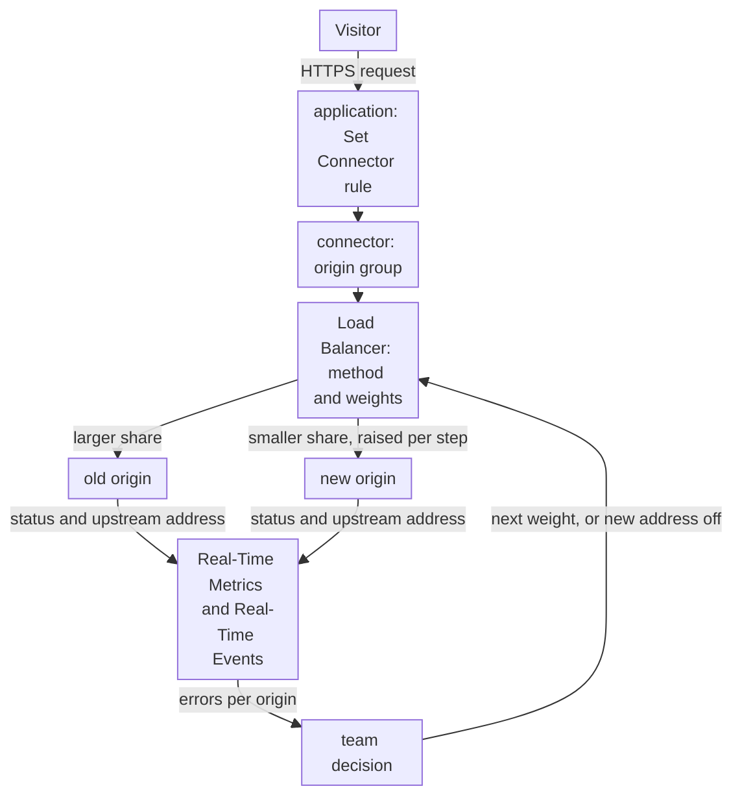
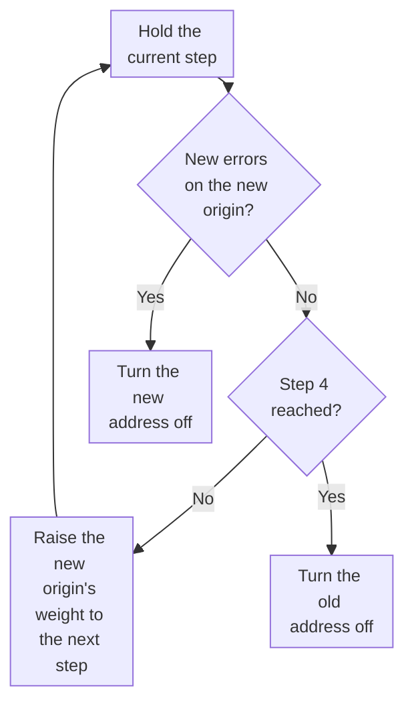

import DocCardGroup from '@aziontech/webkit/doc-card-group'
import DocCard from '@aziontech/webkit/doc-card'

A platform or SRE team is moving an application from one origin to another, such as from a data center to a cloud, or between two clouds. The application cannot go offline, and the team cannot switch every user at once, because a fault on the new origin would then reach everyone. This page puts both origins behind one connector with Load Balancer, sends a small share of requests to the new origin, raises that share step by step while it watches the errors of each origin, and rolls back by turning one address off. The result is measured by zero downtime during the migration, the error rate on the new origin at each step, and the time to roll back.

This use case does not cover rewriting the application onto functions on Azion. For that, refer to [Modernize a monolithic application without a rewrite](/en/documentation/use-cases/build-and-run-applications/modernize-a-monolithic-application-without-a-rewrite/). It also does not cover keeping two origins active for failover. For that, refer to [Keep an application online when an origin fails](/en/documentation/use-cases/improve-performance-and-reliability/keep-an-application-online-when-an-origin-fails/).

## Prerequisites

- An Azion account. If you do not have one, [create an account](https://console.azion.com/signup).
- An application that serves the site through a connector to the old origin, a rule that sends every request to that connector, and a workload. To create the application and the workload, refer to [Applications quickstart](/en/documentation/platform/applications/quickstart/). To create the connector and the rule, refer to [Connect an application to an origin](/en/documentation/guides/application-development/getting-started/work-with-origins/).
- Two origins that hold the same application and answer HTTPS on port `443` for the site's hostname. Every address of a connector receives the same `Host` header, so both origins must answer for the name the visitor requested.

---

## Required products

| The migration needs | Which means | Product | Documented in |
| --- | --- | --- | --- |
| Both origins behind the same site, with no DNS change | One connector that holds the old and the new origin as two addresses | Load Balancer | [Put both origins on the connector](/en/documentation/guides/application-performance/availability/shift-traffic-between-two-origins-by-weight/#put-both-origins-on-the-connector) |
| A share of requests that moves to the new origin step by step | The _Round Robin_ method and a weight on each address | Load Balancer | [Change the weights](/en/documentation/guides/application-performance/availability/shift-traffic-between-two-origins-by-weight/#change-the-weights) |
| A rollback that is a configuration change | The **Active** switch of the new address | Load Balancer | [Take an origin out of rotation](/en/documentation/guides/application-performance/availability/shift-traffic-between-two-origins-by-weight/#take-an-origin-out-of-rotation) |
| The share of traffic each origin receives | The requests of the `workloadBreakdownMetrics` dataset grouped by upstream address | Real-Time Metrics | [Real-Time Metrics GraphQL fields](/en/documentation/devtools/graphql/gql-real-time-metrics-fields/#workloadbreakdownmetrics) |
| The failing requests of the new origin | The HTTP Requests data source filtered by upstream address and upstream status | Real-Time Events | [Data sources](/en/documentation/platform/real-time-events/data-sources/#http-requests) |

---

## Reference architecture

This page builds the *Weighted canary origin pool*: one connector groups the old and the new origin, and Load Balancer weights decide the share each one receives.

Read the diagram as two loops. The request loop runs from the visitor through one rule to one connector, where Load Balancer picks an origin for each request. The control loop runs from the observations back to Load Balancer: the team reads the errors of each origin, then either raises the new origin's weight or turns its address off. Nothing in the request loop changes during the migration except the weights and the **Active** switch of each address, so the application, its rules, and DNS stay as they are.

### Dataflow

1. A visitor's request reaches the workload on the site's domain, and the application's rule, with its _Set Connector_ behavior, sends it to the connector that holds both origins.
2. Load Balancer picks one active address of the connector in proportion to its weight under _Round Robin_, or by the client IP address under _IP Hash_. Each data center balances on its own, so the split is a proportion, not an exact count.
3. The connector sends the request to the chosen origin with the same `Host` header, path, and protocol for both addresses.
4. Real-Time Metrics counts the requests per upstream address, and Real-Time Events records the address and the status of the origin that answered each request.
5. While the new origin shows no new errors, the team raises its weight at the next step. When errors appear, the team turns the new address off, and every request returns to the old origin once the change reaches each data center.
6. When the new origin carries the traffic with no new errors, the team turns the old address off, and every request reaches the new origin.

### Platform Resources

- **connector**: the Platform Resource that groups the old and the new origin as addresses. One connector keeps the rule that names it unchanged through the migration, and its single `Host` setting means both origins must answer for the same name.
- **Load Balancer**: chooses the address of each request. Weights from 1 to 100 set each origin's share under _Round Robin_, the **Active** switch takes an address out of rotation for a rollback or the cutover, and _IP Hash_ keeps a client IP address on one origin when sessions live in one server's memory.
- **application**: the Platform Resource whose rule sends every request to the connector. It is the routing that stays constant while the weights move.
- **Real-Time Metrics**: shows the share of requests each origin receives, grouped by upstream address in the `workloadBreakdownMetrics` dataset, and the status codes of the application. Its datasets do not pair the upstream address with a status, so the errors of one origin come from Real-Time Events.
- **Real-Time Events**: holds one record per request, with the upstream address and the upstream status, so a filter lists the failing requests of the new origin at each step.

### Other designs for this use case

- *Path-based origin cutover*: for migrations done section by section, such as a site that moves area by area to a new platform. Rules Engine sends each migrated path to a connector for the new origin and every other path to the old one, so traffic moves by path instead of by share of requests, and a section rolls back by pointing its rule at the old connector again.

---

## How the design works

This section explains how the origin pool, the weight schedule, and the rollback and the cutover move traffic to the new origin without downtime.

### The origin pool

The origin pool is the existing connector, with Load Balancer turned on and the new origin added as a second address. The rule that sends requests to the connector stays as it is, so the migration never touches the application or DNS.

The first step sends about one request in a hundred to the new origin: weight `99` on the old address and `1` on the new one. A weight is a whole number from 1 to 100, and a share is the address's weight against the sum of all weights. The share is a proportion, not an exact split, because each data center balances on its own.

The **Host** becomes `${host}`, the host the visitor requested, because one connector sends the same `Host` header to both addresses. A literal old-origin hostname would reach the new origin under a name it may not answer for. **Max Retries**, **Connection Timeout**, and **Read/Write Timeout** take the values the Console fills in, `3`, `30`, and `60`, so that both interfaces produce the same connector. The API defaults are `0`, `60`, and `120` when the body leaves them out.

### The weight schedule

The weight schedule moves traffic in steps, and each step changes only the two weights. Hold each step long enough for the new origin to serve the requests that expose its faults, such as a full hour bucket in Real-Time Metrics, before you take the next one.

The weights of each step add up to 100, so each weight reads as a percentage. The schedule stops at `10` for the old origin, because a weight cannot be `0`. The last move to the new origin is a change to the **Active** switch, described in the next section.

1. Hold each step, and read the errors of the new origin.
2. When no new error appears, set the weights of the next step.
3. When errors appear, roll back by turning the new address off.
4. After step 4 holds with no new errors, turn the old address off to finish.

### The rollback and the cutover

Both the rollback and the cutover turn one address off with its **Active** switch. An address that is off stays on the connector with its role and weight, so turning it back on restores the step it left.

- **Rollback** turns `new-origin.example.com` off. Every request then reaches the old origin, and the new origin keeps its weight for the next attempt.
- **Cutover** turns `old-origin.example.com` off after step 4. Every request then reaches the new origin, and the old address stays on the connector as a way back until you remove it.

The change takes several minutes to spread, and data centers apply it at different times. Keep the origin you turned off answering until no request reaches it, which the Real-Time Events records of its address show.

---

## Measuring results

| Metric | Where to read it | What working looks like |
| --- | --- | --- |
| Downtime during the migration | The **Status Codes** dashboard of Real-Time Metrics, filtered to the workload, with its **Requests by Status and Upstream Status** table. Refer to [Break down requests by status code](/en/documentation/guides/platform/observability/break-down-requests-by-status-code/) | The **HTTP Status Codes 5XX** chart stays at its level from before the migration through every step |
| Error rate on the new origin at each step | Real-Time Events, HTTP Requests, filtered by `upstream_addr` and `upstream_status`. Refer to [Filter events](/en/documentation/guides/platform/observability/add-filters-events/) | Failing requests on the new origin stay at the rate the old origin shows for the same step |
| Share of traffic per origin | `workloadBreakdownMetrics` grouped by `upstreamAddr`, in hour buckets | The new origin's share matches the step, within the variation of per-data-center balancing |
| Time to roll back | The time from the **Active** change to the last HTTP Requests record with the new origin's `upstream_addr` | The records stop within the connector propagation time |

---

## Best practices

- **Keep Round Robin unless sessions live in one origin's memory.** _Round Robin_ hands out requests in proportion to the weights, which is what makes a step a known share. When the origins keep each visitor's session in the memory of one server, _IP Hash_ maps each client IP address to one address, so a visitor stays on one origin across requests. A visitor whose IP address changes, such as a phone that moves between networks, can still reach the other origin, and _IP Hash_ refuses _Backup_ addresses. For both methods, refer to [Balancing methods](/en/documentation/platform/connectors/load-balancer/balancing-methods/).
- **Turn an address off instead of deleting it.** An address with **Active** off keeps its weight and role, so a rollback undone is one switch. A deleted address has to be added again with every field, while traffic waits.
- **Judge a step only after it has spread.** Each data center applies a connector change at its own moment, so the first minutes after a change mix the old and the new weights. For how a change spreads, refer to [Wait for a connector change to propagate before you judge it](/en/documentation/platform/connectors/best-practices/#wait-for-a-connector-change-to-propagate-before-you-judge-it).
- **Keep the old origin answering after the cutover.** Some data centers send requests to the old address until they receive the change. Retire the old origin only after the event filter shows no request reaching it.

---

## Guides in this use case

<DocCardGroup cols={2}>
  <DocCard title="Shift traffic between two origins by weight" href="/en/documentation/guides/application-performance/availability/shift-traffic-between-two-origins-by-weight/" label="Puts both origins on the connector, changes the weights at each step, takes an origin out of rotation for the rollback or the cutover, and measures the share and the errors of each origin." />
  <DocCard title="Connect an application to an origin" href="/en/documentation/guides/application-development/getting-started/work-with-origins/" label="Creates the connector to the old origin and the rule that sends every request to it, before the migration starts." />
</DocCardGroup>
