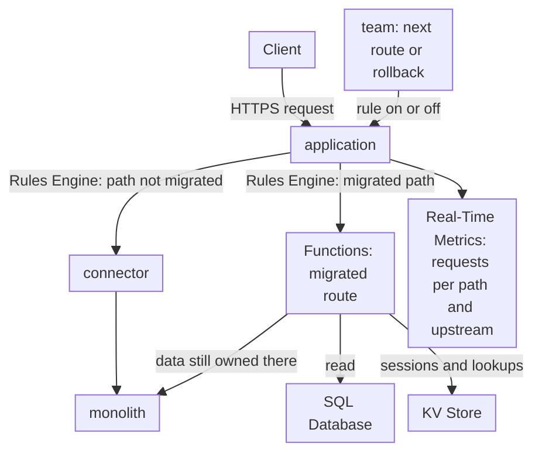

import DocCardGroup from '@aziontech/webkit/doc-card-group'
import DocCard from '@aziontech/webkit/doc-card'

A platform or application team runs a monolithic application in its own data center or in a cloud region, and cannot afford to rewrite it in one project. The team puts an application on Azion in front of the monolith, so every route keeps reaching the monolith until the team moves it. This page moves one read route to a function on Azion that reads its data from SQL Database, while every other route still reaches the monolith through a connector, and rolls the route back by turning its rule off. The result is measured by the share of requests served without reaching the monolith, the latency of migrated routes, and zero downtime during each cut-over.

This use case does not cover moving the whole application to a new origin in one step, or the security hardening of the monolith.

## Prerequisites

- An Azion account. If you do not have one, [create an account](https://console.azion.com/signup).
- An application that serves the monolith through a connector, a rule that sends every request to that connector, and a workload. To create them, refer to [Applications quickstart](/en/documentation/platform/applications/quickstart/).
- Application Accelerator on that application, which the **Run Function** behavior requires. To turn it on, refer to [Turn on Application Accelerator](/en/documentation/guides/application-performance/cache-and-purge/cache-settings/#turn-on-application-accelerator). A new application has Functions on already.

---

## Required products

| The modernization needs | Which means | Product | Documented in |
| --- | --- | --- | --- |
| A migrated route that Azion answers | A function, instantiated on the application, that builds the route's response | Functions | [Functions quickstart](/en/documentation/platform/functions/quickstart/) |
| The state of the migrated route | A table the function reads through the read replica of a database | SQL Database | [Query a database from a function](/en/documentation/guides/application-development/data/retrieve-data-with-functions/) |
| Routes that move one at a time and roll back | A rule per migrated route, with the **Run Function** behavior and its **Active** switch | Application Accelerator | [Run a function on one path, and roll it back](/en/documentation/guides/application-development/functions-and-runtime/run-a-function-on-one-path-and-roll-it-back/) |
| The traffic split per route | The requests of the `workloadBreakdownMetrics` dataset grouped by path and upstream address | Real-Time Metrics | [Real-Time Metrics GraphQL fields](/en/documentation/devtools/graphql/gql-real-time-metrics-fields/#workloadbreakdownmetrics) |

---

## Reference architecture

This page builds the *Strangler façade for legacy applications*: an application on Azion becomes the single entry point for the domain, and each migrated path goes to a function while every other path goes to the monolith.

Read the diagram from the application outward. Every request enters through the application, and its rules split the traffic by path: a path nobody moved goes through the connector to the monolith, and a migrated path goes to a function. The function keeps its state in SQL Database or KV Store, and it can still call the monolith for data the monolith owns. The control loop at the bottom is how routes move: the team turns a route's rule on to move it and off to roll it back, and Real-Time Metrics shows where each path is served.

### Dataflow

1. A client's request reaches the workload on the domain, and the application runs its Request Phase rules in order, reading the path and the method of the request.
2. The first rule matches every path and names the connector to the monolith, so a route nobody moved keeps reaching the monolith.
3. A later rule matches `GET /api/stores` and runs the function instance, and the function's response is what the client receives.
4. The function opens `stores-db` on its read replica, queries the `stores` table, and answers with JSON. A migrated route can also read sessions and lookups from KV Store, or call the monolith's API for a table the monolith still owns.
5. Real-Time Metrics records the path and the upstream address of each request, where `127.0.0.1:1666` marks Azion Runtime and the monolith's address marks the routes it still serves.
6. The team moves the next route with a new rule. To roll a route back, the team turns its rule off, and the next requests to that path match only the first rule and reach the monolith.

### Platform Resources

- **application**: the Platform Resource that is the entry point for the domain. Every request crosses it, so a route can move without a DNS change or a client change.
- **Rules Engine**: the Feature of the application that routes per path. A rule for every path names the connector, and one later rule per migrated route runs its function. Matching rules run in order, so the later rule wins for its path.
- **Functions**: run the migrated routes on Azion Runtime. The **Run Function** behavior that triggers them needs Application Accelerator on the application.
- **connector**: the Platform Resource that is the path to the monolith. Every route that is not migrated, and every route rolled back, ends at it.
- **SQL Database**: holds the state of migrated routes. A function opens a database on its read replica, so a migrated route reads there, and writes go through the Azion API or stay on the monolith until their table moves.
- **KV Store**: holds sessions and lookups, a design option for a route that reads a value by a key the request carries.
- **Cache**: stores cacheable responses from either side. A cache setting and a **Set Cache Policy** rule cache the monolith's responses, and a function caches its own responses through the Cache API.
- **Real-Time Metrics**: shows the traffic split per route, grouping requests by path and upstream address, where `127.0.0.1:1666` marks Azion Runtime. The status codes of the application show the error rate during each cut-over.

### Other designs for this use case

- *Middleware layer over a legacy origin*: for teams that need new behavior before they can move any code, such as authentication checks, response personalization, or header and HTML rewrites. Functions run before and after the call to the monolith to change the request or the response, so no path stops reaching the monolith, and the monolith stays in the request flow and the failure flow of every route.

---

## How the design works

This section explains the data of the migrated route, the function that answers it, and the rule that cuts the route over and rolls it back.

### The route's data

The migrated route reads its data from a table that the team writes through the Azion API. A function opens SQL Database on its read replica, so the route reads there and never writes. This page moves a read route whose data the team now owns in SQL Database: the `stores` table holds every store location, and the monolith no longer serves the list.

### The migrated route

The migrated route is a function that answers `GET /api/stores` with the rows of the `stores` table. The function reads the database through the `Azion.Sql` global, which takes the database name and no token.

### The cut-over and the rollback

The cut-over is a rule that runs the `stores-route` instance for `GET /api/stores`. It comes after the rule that sends every path to the monolith, and the function's response is what the client receives. The rule matches the method as well as the path, so a `POST` to `/api/stores` still reaches the monolith.

The two conditions sit in two criteria groups, because groups join with `and`: a request matches only when its path is `/api/stores` and its method is `GET`.

- **Position**: after the rule that sends every path to the monolith, where a new rule is created.
- **Rollback**: the rule's **Active** switch, `"active": false` in the API. Keep the rule's `id` for it.

When the function does not answer, turn on [Debug Rules](/en/documentation/platform/applications/main-settings/#debug-rules) to see which rules ran on the request. When **Run Function** is missing from the behaviors list, the application needs Application Accelerator.

---

## Measuring results

| Metric | Where to read it | What working looks like |
| --- | --- | --- |
| Share of requests served without reaching the monolith | `workloadBreakdownMetrics` grouped by `requestPath` and `upstreamAddr`, in hour buckets, with the `requests` sum. Rows with `127.0.0.1:1666` are the requests Azion Runtime answered. Refer to [Query the httpBreakdownMetrics dataset](/en/documentation/guides/platform/observability/query-httpbreakdownmetrics-data-with-graphql/) | Each migrated path moves to `127.0.0.1:1666`, and the monolith's rows shrink route by route |
| Latency of migrated routes | The **Request Time** of HTTP Requests records in Real-Time Events, filtered to the migrated path. Refer to [Data sources](/en/documentation/platform/real-time-events/data-sources/#http-requests) | The migrated route answers no slower than the monolith did for the same path |
| Downtime during each cut-over | The **Status Codes** dashboard of Real-Time Metrics, filtered to the workload. Refer to [Break down requests by status code](/en/documentation/guides/platform/observability/break-down-requests-by-status-code/) | The **HTTP Status Codes 5XX** chart stays at its level from before the cut-over while the rule spreads |

---

## Best practices

- **Move read routes first.** A function opens SQL Database on its read replica, and a write statement there fails with ``Error: SQLite failure: `attempt to write a readonly database` ``. A route that writes keeps reaching the monolith, or calls the monolith's API from the function, until its writes have a new owner. For the read-only connection, refer to [SQL Database API](/en/documentation/devtools/runtime/api-reference/sql-database/#database).
- **Give every migrated route its own rule.** A rule per route makes each rollback one switch that touches no other route. Keep the rule that sends every path to the monolith first, so a rule turned off falls back to it.
- **Match the method as well as the path.** A path often carries both reads and writes. Matching `GET` moves the read and leaves the write on the monolith until it moves on its own.
- **Bind integers in queries.** A JavaScript string passed as a query parameter is refused with ``TypeError: unknown variant `String` ``, so look a record up by a numeric key. For the parameter forms, refer to [Parameters](/en/documentation/devtools/runtime/api-reference/sql-database/#parameters).
- **Keep sessions and lookups in KV Store when a migrated route needs them.** A key the request already carries, such as a session ID, reads in one call from the function. For the client, refer to [KV Store API](/en/documentation/devtools/runtime/api-reference/kv-store/).

---

## Guides in this use case

<DocCardGroup cols={2}>
  <DocCard title="Run a function on one path, and roll it back" href="/en/documentation/guides/application-development/functions-and-runtime/run-a-function-on-one-path-and-roll-it-back/" label="Creates the cut-over rule for GET /api/stores and turns it off to roll the route back." />
  <DocCard title="Query a database from a function" href="/en/documentation/guides/application-development/data/retrieve-data-with-functions/" label="Creates the stores-db database and its table, and holds the stores-route function that returns the rows as JSON from the read replica." />
  <DocCard title="Import data with the EdgeSQL Shell" href="/en/documentation/guides/application-development/data/import-data-sql-database/" label="Loads more rows into the stores table, such as an export of the monolith's database." />
</DocCardGroup>
