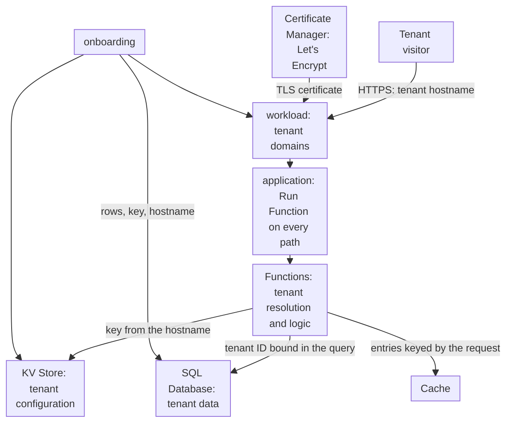

import DocCardGroup from '@aziontech/webkit/doc-card-group'
import DocCard from '@aziontech/webkit/doc-card'

A SaaS product team serves many customers, each on its own hostname, and must onboard tenants without a deployment per tenant. Every tenant shares one deployment, so a tenant's configuration and data must never reach another tenant's visitors. This page runs the product as one function that resolves the tenant from the hostname of each request, reads the tenant's configuration from KV Store, and reads only that tenant's rows from SQL Database. Tenants live on subdomains of the product's domain, under one Let's Encrypt wildcard certificate, so onboarding a tenant is a data change and a domain change. The result is measured by the time to onboard a tenant with its hostname, zero cross-tenant data exposure, and response time per tenant.

This use case does not cover running code supplied by tenants.

## Prerequisites

- An Azion account. If you do not have one, [create an account](https://console.azion.com/signup).
- An application with Application Accelerator on, served by a workload on the production infrastructure. To create them, refer to [Applications quickstart](/en/documentation/platform/applications/quickstart/), and to turn on Application Accelerator, refer to [Turn on Application Accelerator](/en/documentation/guides/application-performance/cache-and-purge/cache-settings/#turn-on-application-accelerator). The rule of this design answers every path with the function.
- The product's domain as an active zone in [Edge DNS](/en/documentation/platform/edge-dns/), which the wildcard certificate needs for automatic issuance.
- A KV Store namespace for tenant configuration. To create one, refer to [Namespaces](/en/documentation/platform/kv-store/namespaces/#create-a-namespace).
- A SQL Database database for tenant data. To create one, refer to [Databases and queries](/en/documentation/platform/sql-database/databases-and-queries/#create-a-database).

---

## Required products

| The product needs | Which means | Product | Documented in |
| --- | --- | --- | --- |
| HTTPS on every tenant hostname, with no certificate per tenant | A Let's Encrypt wildcard certificate for `*.app.example.com`, bound to the workload | Certificate Manager | [Request a wildcard certificate](/en/documentation/guides/application-security/tls-and-certificates/how-to-generate-a-lets-encrypt-certificate-via-api/#request-a-wildcard-certificate) |
| The tenant resolved on every request | A function that reads the hostname of the request and runs on every path | Functions | [Functions quickstart](/en/documentation/platform/functions/quickstart/) |
| Tenant configuration that onboarding writes with no deployment | One key per tenant hostname in a namespace | KV Store | [KV Store API](/en/documentation/devtools/runtime/api-reference/kv-store/) |
| Tenant data that no other tenant can read | Rows keyed by an integer tenant ID, read with that ID bound in every query | SQL Database | [SQL Database API](/en/documentation/devtools/runtime/api-reference/sql-database/) |
| A rule that sends every path to the function | The **Run Function** behavior, which requires Application Accelerator | Application Accelerator | [Run a function on an application](/en/documentation/guides/application-development/functions-and-runtime/serverless-functions/) |

---

## Reference architecture

This page builds the *Pooled multi-tenant application*: every tenant hostname reaches the same workload and the same function, and isolation lives in the code and in the data keys.

Read the diagram from the visitor down. Every tenant reaches the same workload, application, and function, so nothing in the request path names a tenant until the function reads the hostname. From there, isolation is a chain of keys: the hostname selects the configuration in KV Store, the configuration carries the tenant ID, and the tenant ID is bound in every query to SQL Database. Onboarding, at the bottom, writes data and a domain, and it touches no code and no deployment.

### Dataflow

1. A visitor requests a tenant hostname, and the workload completes the TLS handshake with the wildcard certificate that Certificate Manager issued for it.
2. The application's rule runs the `tenant-app` function on every path.
3. The function reads the hostname of the request and looks up the key `tenant:<hostname>` in the `saas-tenants` namespace. A hostname with no key answers `404`.
4. The tenant's configuration carries its integer ID, and the function binds that ID in its query to `saas-data`, so the result holds only that tenant's rows.
5. The function answers with the tenant's data. A cached response is keyed by the request, which carries the hostname, so it never answers another tenant.
6. Onboarding a tenant writes its rows and its key, adds its hostname to the workload, and points the hostname at the workload. The tenant answers once the change propagates, with no deployment.

### Platform Resources

- **workload**: the Platform Resource that carries the tenant domains. Every tenant hostname is listed on it in full, because a workload refuses a wildcard entry, and its one deployment sends all of them to the same application.
- **Certificate Manager**: the Platform Resource that issues and renews the Let's Encrypt certificates for the tenant hostnames. A wildcard certificate for the tenants' parent domain, validated through DNS-01 in Edge DNS, covers a new tenant hostname with no new certificate.
- **Functions**: resolve the tenant from the hostname and run the product's logic. Isolation lives in this code, so every query takes the tenant ID from the configuration, never from the request.
- **KV Store**: holds the tenant configuration, one key per hostname, which a function writes and reads. A new key is visible everywhere within 60 seconds.
- **SQL Database**: holds the tenant data, isolated by an integer tenant key bound in every query, or by one database per tenant as a design option. A function reads it on its read replica, and writes go through the Azion API.
- **Cache**: stores responses keyed by tenant. The default cache key carries the host, and a function's Cache API entry is keyed by the request, so a cached response stays with its tenant.
- **application**: the Platform Resource that routes every path to the tenant function. The **Run Function** behavior needs Application Accelerator on the application.

### Other designs for this use case

- *Siloed multi-tenant application*: for SaaS products whose tenants need dedicated resources, for compliance or custom configuration. A provisioning pipeline creates each tenant's workload, application, functions, and stores from one template through the Azion API or the Terraform Provider, so isolation comes from separation instead of code, and updates roll out tenant by tenant.

---

## How the design works

This section explains the certificate that covers every tenant, the function that resolves each one, and what onboarding a tenant changes.

### The tenant certificate

Every tenant hostname is a subdomain of `app.example.com`, so one wildcard certificate covers all of them, and a new tenant needs no certificate of its own. Azion issues a wildcard certificate only through the DNS-01 challenge, and it inserts the challenge record itself when the zone is active in Edge DNS. A workload's form requests certificates only for the hostnames it lists, and it cannot list a wildcard, so the request goes through the API.

- **Request body**: the zone `example.com` is active in Edge DNS, so the DNS-01 challenge needs no record from you.
- **Binding**: `tenants-wildcard`, selected under **My certificates** in the **Digital Certificate** field of the workload that serves the application.
- **Workload domains**: each tenant hostname, such as `acme.app.example.com`, listed in full, because a workload refuses a wildcard entry. A workload lists up to 50 domains unless Azion raises the bound.

### The tenant application

The tenant application is one function, `tenant-app`, that runs on every path. It does two jobs. On a tenant hostname, it resolves the tenant and answers with that tenant's projects. On `PUT /_admin/tenants/<hostname>`, it writes a tenant's configuration, which is how onboarding reaches KV Store: a key is written only from a function. The admin path checks a token held in an environment variable, so the token never enters the code.

A function reads a variable's new value only after it is deployed again, so the variable exists before the function does.

The tenant ID must be an integer, because a query refuses a JavaScript string as a parameter. The lookup key is the hostname, which the request always carries, because KV Store has no operation that lists keys.

### Tenant onboarding

Onboarding a tenant is four changes, and none of them is a deployment: the tenant's rows, its configuration key, its hostname on the workload, and its DNS record.

---

## Measuring results

| Metric | Where to read it | What working looks like |
| --- | --- | --- |
| Time to onboard a tenant with its hostname | The time from the first onboarding call to the first answer from the tenant hostname that names the tenant | Bound by the workload propagation of the hostname change, with no deployment in the path |
| Cross-tenant data exposure | A request to each tenant hostname, run on a schedule, compared with the tenant the hostname belongs to | Every response names its own tenant, and no tenant ID appears under another hostname |
| Response time per tenant | The `requestTime` and `requests` of `workloadMetrics` grouped by `host`. Refer to [Real-Time Metrics GraphQL fields](/en/documentation/devtools/graphql/gql-real-time-metrics-fields/#workloadmetrics) | Close across tenants, since every tenant runs the same function |

---

## Best practices

- **Take the tenant ID from KV Store, never from the request.** The hostname selects the key, and the key holds the ID that every query binds. A tenant ID read from a header, a cookie, or a path segment lets a visitor ask for another tenant's rows.
- **Keep the tenant key derivable from the request.** No interface lists the keys of a namespace, so `tenant:<hostname>` is the only way back to a tenant's configuration. For the convention, refer to [Derive a key name from what the request already carries](/en/documentation/platform/kv-store/best-practices/#derive-a-key-name-from-what-the-request-already-carries).
- **Cache by the full request, never by the path alone.** The default cache key carries the host, and a function that caches through the Cache API keys the entry by the request, which carries the hostname too. A key built from the path alone would hand one tenant's page to another. For the key format, refer to [Cache keys](/en/documentation/platform/applications/cache/cache-keys/).
- **Name a namespace once.** A namespace cannot be renamed or deleted, and names are case-sensitive. For the naming rule, refer to [Name a namespace as though you can never change it](/en/documentation/platform/kv-store/best-practices/#name-a-namespace-as-though-you-can-never-change-it).
- **Rotate the admin token by deploying the function again.** A function reads a changed variable only after it is redeployed, so a rotation is a variable change followed by a deploy.

---

## Guides in this use case

<DocCardGroup cols={2}>
  <DocCard title="Request a Let's Encrypt certificate with the API" href="/en/documentation/guides/application-security/tls-and-certificates/how-to-generate-a-lets-encrypt-certificate-via-api/" label="Requests the wildcard certificate for the tenant hostnames through the DNS-01 challenge and binds it to the workload." />
  <DocCard title="Resolve tenants by hostname in a function" href="/en/documentation/guides/application-development/functions-and-runtime/resolve-tenants-by-hostname-in-a-function/" label="Stores the admin token, creates the tenant-app function, onboards a tenant, and runs the checks of this use case." />
  <DocCard title="Run a function on an application" href="/en/documentation/guides/application-development/functions-and-runtime/serverless-functions/" label="Adds the rule that runs the tenant-app instance on every path of every tenant hostname." />
</DocCardGroup>
