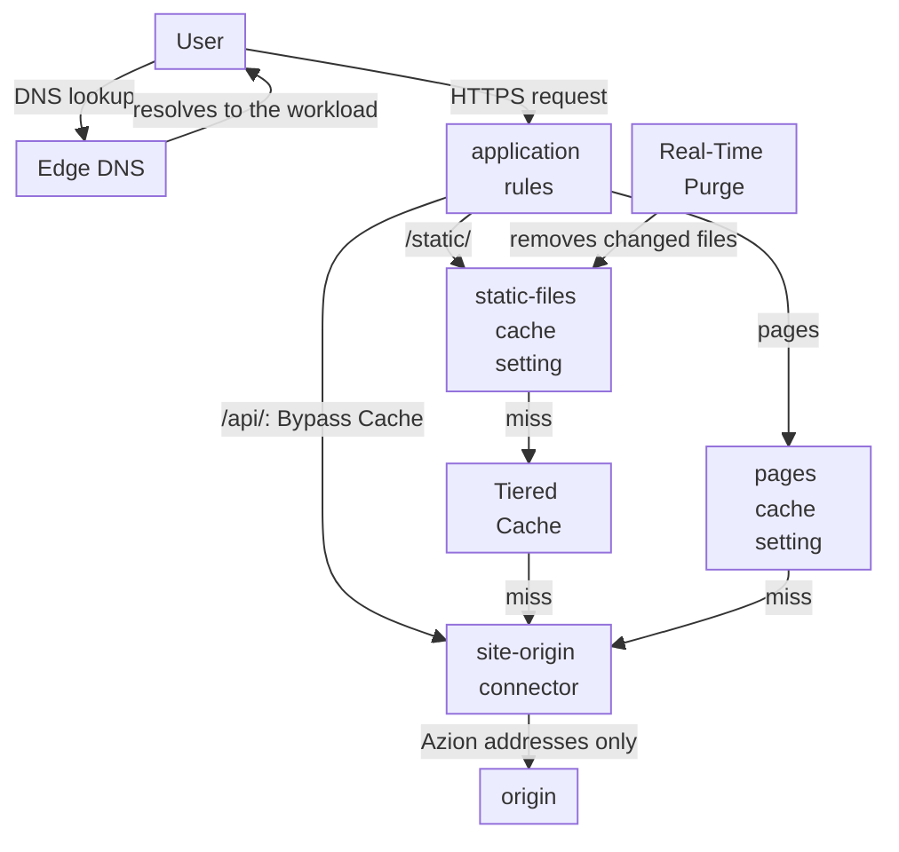
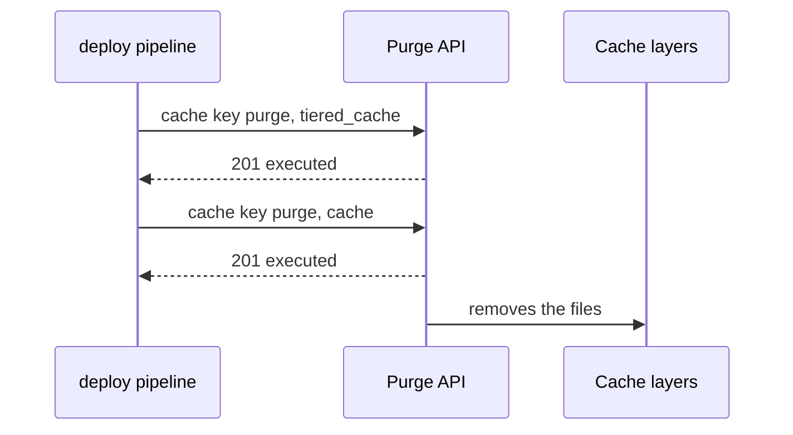

import DocCardGroup from '@aziontech/webkit/doc-card-group'
import DocCard from '@aziontech/webkit/doc-card'

An engineering or SRE team runs a website and its APIs on an origin it operates, in a cloud region or a data center. Users far from that origin see slow pages, and traffic peaks overload it. Static files and pages are the same for every user, while API calls are different for each one and must always reach the origin. This page configures an application in front of the origin that caches static files and pages, with Tiered Cache for the static files, passes API calls through to the origin, and lets the origin accept connections from Azion only. The result is measured by time to first byte and page load time for users, by the share of requests answered from cache, and by the drop in requests and data that reach the origin.

This use case does not cover moving the site off its origin, failover between origins, or image optimization. For failover, refer to [Keep an application online when an origin fails](/en/documentation/use-cases/improve-performance-and-reliability/keep-an-application-online-when-an-origin-fails/). For images, refer to [Optimize images for websites and mobile apps](/en/documentation/use-cases/improve-performance-and-reliability/optimize-images-for-websites-and-mobile-apps/). For a marketing website on a CMS, refer to [Build and run marketing websites](/en/documentation/use-cases/build-and-run-applications/build-and-run-marketing-websites/).

## Prerequisites

- An Azion account. If you do not have one, [create an account](https://console.azion.com/signup).
- An application that serves your site through a connector and a workload, with a rule whose **Set Connector** behavior sends every request to the connector. To create them, refer to [Applications quickstart](/en/documentation/platform/applications/quickstart/).
- Application Accelerator on that application, which the **Bypass Cache** behavior and the `POST`, `PUT`, `PATCH`, `DELETE`, and `OPTIONS` methods of the API require. To turn it on, refer to [Turn on Application Accelerator](/en/documentation/guides/application-performance/cache-and-purge/cache-settings/#turn-on-application-accelerator).
- Access to the firewall in front of your origin, where the allowlist goes.

---

## Required products

| The site needs | Which means | Product | Documented in |
| --- | --- | --- | --- |
| The domain answered by Azion instead of the origin | A `CNAME` record for a subdomain, or an `ANAME` record at the apex, pointing at the workload domain in an Edge DNS zone | Edge DNS | [Point a domain to a workload](/en/documentation/guides/platform/migration/point-domain-to-azion/) |
| Static files and pages served near the user | Two cache settings, each applied by a rule matched on its paths | Cache | [Create a cache setting](/en/documentation/guides/application-performance/cache-and-purge/tune-cache-settings/) |
| Fewer requests reaching the origin when a data center misses | Tiered Cache on the cache setting of the static files | Cache | [Tiered Cache](/en/documentation/platform/applications/cache/tiered-cache/) |
| API calls that always reach the origin, with every method | A rule that bypasses the cache on the API path | Application Accelerator | [Bypass Cache](/en/documentation/platform/applications/rules-engine/#bypass-cache) |
| An origin that accepts connections from Azion only | Origin IP ACL on the connector, and the `Azion Origin Shield` list at the origin's firewall | Origin Shield | [Restrict an origin to Azion with Origin IP ACL](/en/documentation/guides/application-security/bots-and-network/restrict-an-origin-to-azion-with-origin-ip-acl/) |
| Share of requests from cache and load on the origin | The **Requests**, **Data Transferred**, and **Tiered Cache** dashboards, filtered to the domain | Real-Time Metrics | [Measure cache offload for a domain](/en/documentation/guides/platform/observability/measure-cache-offload/) |

Pointing the domain at Azion is the same for every site, so it has no section on this page. To create the record, refer to [Point a domain to a workload](/en/documentation/guides/platform/migration/point-domain-to-azion/), and for the apex, to [Point an apex domain with ANAME](/en/documentation/guides/application-security/dns/access-root-domain/).

---

## Reference architecture

This page builds the *Caching reverse proxy in front of an origin*: an application that answers from cache whatever it can and reaches the origin only on a miss.

Read the diagram as a chain of layers that each try to answer before the next one is asked. The data center's cache answers first, the Tiered Cache layer answers the static files the data center misses, and only a miss in every layer reaches the origin through the connector. API calls skip the layers and go straight to the connector. The origin sits behind an allowlist, so the connector is the only way in. Real-Time Purge works on the cache from the side, removing content the origin changed before its TTL ends.

### Dataflow

1. Edge DNS resolves `www.example.com` to the workload, and the user's request reaches the application in a nearby data center.
2. The application's rules read the path in the Request Phase and apply a cache setting: `static-files` to a `/static/` file, `pages` to a page. A valid copy in the data center's cache answers the request, and the origin is not asked.
3. On a miss for a static file, the data center asks the Tiered Cache layer, which is shared by every data center and keeps objects longer. A copy there answers the request without reaching the origin.
4. An `/api/` call bypasses the cache and reaches the origin through the `site-origin` connector, with every HTTP method. Any other miss also reaches the origin through `site-origin`, and the response is stored for the next request.
5. The connector reaches the origin from an address on the `Azion Origin Shield` list, and the origin's firewall refuses every other source.
6. When a deploy changes static files, a cache key purge removes them before their TTL ends, from the Tiered Cache layer first and from Cache second, and the next request fetches the new version. A cache key purge is the only type that reaches the Tiered Cache layer.

### Platform Resources

- **Edge DNS**: resolves the domain to the workload. A subdomain such as `www.example.com` points at the workload domain with a `CNAME` record, and the apex with an `ANAME` record.
- **application**: the Platform Resource that holds the `static-files` and `pages` cache settings and the rules that apply them, path by path, beside the rule that bypasses the cache on `/api/`.
- **Application Accelerator**: the Product the **Bypass Cache** behavior requires, so the application can send every call on `/api/` to the origin without storing the response.
- **Cache**: stores responses in the data center that fetched them and answers repeated requests from the copy, for the TTL of the cache setting.
- **Tiered Cache**: the Feature that adds a second cache layer between Cache and the origin, in the region its topology names. It requires _Override cache behavior_ and a **Max Age** of at least 3 seconds, and on this page it covers the static files only.
- **connector**: the Platform Resource that reaches the origin on a miss in every cache layer, and on every API call. On this page it is `site-origin`.
- **Origin Shield**: with Origin IP ACL on the connector, the origin's own firewall allows the prefixes of the `Azion Origin Shield` list and refuses every other source.
- **Real-Time Purge**: the Platform Resource that removes changed content from cache before its TTL ends.
- **Real-Time Metrics**: shows the share of requests and data answered from cache, what reached the origin, and what the Tiered Cache layer absorbed.

### Other designs for this use case

- *Accelerating reverse proxy for dynamic APIs*: for teams whose responses are personalized or transactional and cannot be cached. Every request on a dynamic path crosses to the origin, so the origin's response time is always part of the response time, and the decisions are connection handling and cache bypass instead of TTLs and purge.

---

## How the design works

This section explains the four parts of the design that are specific to this site: the cache for static files and pages, the API pass-through, Origin Shield on the connector, and purge on deploy.

### The cache for static files and pages

The cache for this site is two cache settings, one per kind of content, each applied by its own rule. Static files change only when you deploy, so they stay cached long and go through Tiered Cache. Pages change between deploys, so they stay cached briefly.

The `static-files` setting uses _Override cache behavior_ with a **Max Age** of `86400` seconds, one day. The purge on deploy removes a changed file at deploy time, so the day only bounds how long a file stays stale when a purge is missed. **Tiered Cache** is on, with the nearest region as its topology: Tiered Cache is designed for objects that stay cached a long time, and it requires _Override cache behavior_. The browser cache honors the `Cache-Control` the origin sends for each file.

The `pages` setting uses a **Max Age** of `300` seconds, so a page edited at the origin reaches users within five minutes with no purge. Its browser cache is overridden to `0` seconds, because a copy in the user's browser cannot be purged. It has no Tiered Cache, because a five-minute object gains little from a second layer.

Both settings keep **Stale cache** on, as Azion Console sets it for a new setting. An expired copy then answers for up to 300 seconds when the origin returns a `5xx` error or times out.

### The API pass-through

API responses are different for each caller, so the API path bypasses the cache and every call reaches the origin. The rule matches `/api/` and carries **Bypass Cache**. Application Accelerator, already on the application, is what makes the application accept the API's `POST`, `PUT`, `PATCH`, `DELETE`, and `OPTIONS` calls, beyond `GET` and `HEAD`. A bypassed request keeps protocol optimizations and, where possible, a keep-alive connection to the origin, so each call skips a new connection.

The API path has no cache setting with Tiered Cache, so no response of it lands in the Tiered Cache layer either: **Bypass Cache** acts on Azion's cache and not on that layer.

### Origin Shield on the connector

Origin IP ACL makes the origin accept connections from Azion only, so a client that finds the origin's address cannot reach it around the application. The check has two halves. The connector turns on Origin IP ACL, which makes the `Azion Origin Shield` network list available to your account. Your origin's firewall then allows the prefixes of that list and denies every other source. Azion does not enforce the allowlist: your firewall does.

Both halves run on `site-origin` and on the firewall in front of your origin. The allowlist holds the IPv4 and the IPv6 prefixes of the list, and the deny rule comes only after every prefix is allowed.

Azion changes the list from time to time and emails your account each time. Servers behind an added prefix go into production 7 days after Azion publishes the change, so a job that reads the list on a schedule shorter than 7 days keeps your allowlist current.

### Purge on deploy

A deploy that changes static files sends a purge, so users get the new files without waiting for the one-day **Max Age**. The `static-files` setting has Tiered Cache on, and a cache key purge is the only type that reaches the Tiered Cache layer. The deploy therefore purges each changed file by cache key, first in the Tiered Cache layer and then in Cache, so the first layer cannot refill from a stale Tiered Cache copy.

1. The deploy publishes the new files at the origin.
2. It sends a cache key purge for each changed file with `layer` set to `tiered_cache`.
3. It sends the same purge with `layer` set to `cache`.
4. The next request for each file misses both layers, reaches the origin, and stores the new version.

A cache key is the scheme, the host, and the path, with no separator between them.

A cache key purge takes up to 50 keys per request, so a deploy that changes more files splits them into several requests. A page that changes without a deploy needs no purge: its five-minute **Max Age** refreshes it.

---

## Measuring results

| Metric | Where to read it | What working looks like |
| --- | --- | --- |
| Share of requests answered from cache | **Requests Offloaded** in Real-Time Metrics, filtered to the host. Refer to [Measure cache offload for a domain](/en/documentation/guides/platform/observability/measure-cache-offload/) | Rises after the cache rules propagate, and holds during traffic peaks |
| Requests and data that reach the origin | **Missed Requests** and **Missed Data**, filtered to the host, and **Tiered Cache Offload** on the **Tiered Cache** tab | Fall after the cache rules propagate; Tiered Cache Offload shows the misses the second layer absorbed |
| Time to first byte and page load time for users | The `ttfb` and `pageloadtime` fields of Edge Pulse measurements, taken in the users' browsers. Refer to [Edge Pulse quickstart](/en/documentation/platform/edge-pulse/quickstart/) | Lower after the domain points at Azion, on every page that carries the Edge Pulse tag |

---

## Best practices

- **Keep Tiered Cache off any path you bypass.** **Bypass Cache** acts on Azion's cache and not on the Tiered Cache layer, so a path whose cache setting has Tiered Cache on keeps answering from that layer. On this page the bypassed `/api/` path has no cache setting at all. For the symptom, refer to [Troubleshoot Applications](/en/documentation/platform/applications/troubleshooting/#cache).
- **Purge on deploy instead of shortening Max Age.** A short **Max Age** sends more requests to the origin and still leaves a stale window. The deploy knows which files changed, so it purges them, and **Max Age** stays a safety bound.
- **Use Bypass Cache for the API, not a Max Age of 0.** A **Max Age** of `0` merges simultaneous requests for one path into one origin request, and two callers of an API need two answers. For the difference, refer to [Cache variation](/en/documentation/platform/applications/application-accelerator/cache-variation/#bypass-cache-and-a-ttl-of-0).
- **Allow both address families at the origin.** The `Azion Origin Shield` list carries IPv6 prefixes beside its IPv4 prefixes, and Azion connects to origins over both. An allowlist with only the IPv4 prefixes refuses the connections Azion opens over IPv6.

---

## Guides in this use case

<DocCardGroup cols={2}>
  <DocCard title="Create a cache setting" href="/en/documentation/guides/application-performance/cache-and-purge/tune-cache-settings/" label="Creates the static-files and pages cache settings, with Tiered Cache on the static files, and the rules that apply them." />
  <DocCard title="Restrict an origin to Azion with Origin IP ACL" href="/en/documentation/guides/application-security/bots-and-network/restrict-an-origin-to-azion-with-origin-ip-acl/" label="Turns on Origin IP ACL on site-origin and allows only the Azion Origin Shield list at the origin's firewall." />
  <DocCard title="Configure cache policies for an application" href="/en/documentation/guides/application-performance/cache-and-purge/cache-settings/" label="Creates the cdn - api pass-through rule that bypasses the cache on /api/, in Azion Console or with the API." />
  <DocCard title="Purge cached content" href="/en/documentation/guides/application-performance/cache-and-purge/purge-cached-content/" label="Sends the cache key purges of a deploy to the Tiered Cache layer and to Cache, and confirms them." />
  <DocCard title="Point a domain to a workload" href="/en/documentation/guides/platform/migration/point-domain-to-azion/" label="Points www.example.com at the workload and checks that the hostname resolves." />
  <DocCard title="Check the cache status of a response" href="/en/documentation/guides/application-performance/cache-and-purge/check-page-cache-time/" label="Reads the x-cache and x-cache-key headers that the cache checks rely on." />
</DocCardGroup>
