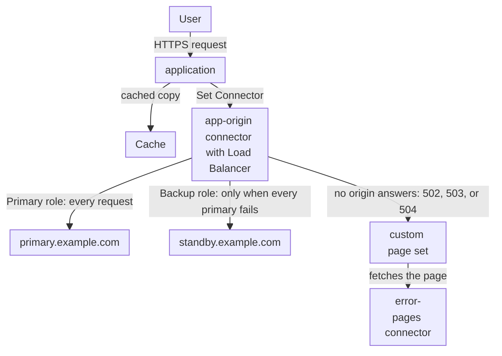

import DocCardGroup from '@aziontech/webkit/doc-card-group'
import DocCard from '@aziontech/webkit/doc-card'

An SRE team runs an application on a primary origin and keeps a standby copy of it in a second data center, cloud, or region. Users must keep being served when the primary fails, and the switch must happen on Azion's side, with no DNS change and no logic in the client. This page groups both origins in one connector with Load Balancer, so the standby receives requests only when the primary fails, and replaces Azion's default error page with your own when neither origin can answer. The result is measured by the share of requests that still succeed during an origin incident and by the error rate users see while traffic moves to the standby.

This use case does not cover data replication between the origins, or the performance of a single origin. For a single origin, refer to [Accelerate websites and APIs with a CDN](/en/documentation/use-cases/improve-performance-and-reliability/accelerate-websites-and-apis-with-a-cdn/).

## Prerequisites

- An Azion account. If you do not have one, [create an account](https://console.azion.com/signup).
- An application that serves your site through a workload, with a rule whose **Set Connector** behavior sends its requests to a connector of your primary origin. To create them, refer to [Applications quickstart](/en/documentation/platform/applications/quickstart/).
- A standby origin that holds the same content as the primary and is set up the same way for the application.
- A second connector that serves your error page at `/errors/503.html` and reaches neither origin, such as a connector of type `storage` that reads an [Object Storage](/en/documentation/platform/object-storage/) bucket. For its fields, refer to [Connector settings](/en/documentation/platform/connectors/settings/#storage).

---

## Required products

| The application needs | Which means | Product | Documented in |
| --- | --- | --- | --- |
| A standby origin that takes the traffic when the primary fails | Load Balancer on the connector, with the primary origin as a _Primary_ address and the standby as a _Backup_ address | Load Balancer | [Add a backup origin to a connector](/en/documentation/guides/application-performance/availability/add-a-backup-origin-to-a-connector/) |
| A page of your own when neither origin can answer | A custom page set for `502`, `503`, and `504`, assigned in the workload's deployment | Workloads | [Show your own page when no origin answers](/en/documentation/guides/application-performance/availability/show-your-own-page-when-no-origin-answers/) |
| Cached content that keeps answering while the origins change | The application's cache settings, and stale cache for expired copies | Cache | [Expiration and freshness](/en/documentation/platform/applications/cache/expiration-and-freshness/#stale-cache) |
| Errors and traffic per origin, during and after an incident | The **Status Codes** dashboard and the upstream address of each request | Real-Time Metrics | [Build dashboards](/en/documentation/platform/real-time-metrics/build-dashboards/#status-codes) |

---

## Reference architecture

This page builds the *Active-passive origin pool*: one connector that groups a primary origin and a standby, with the standby serving only when the primary fails.

Read the diagram from the application. Cache answers what it already holds, and every other request reaches one connector, which holds both origins. Inside the connector, the role of each address decides who serves: the primary in normal operation, the standby only after the primary fails. The custom page set sits at the end of the failure path, for the moment when neither origin can answer.

### Dataflow

1. A user's request reaches the application, and a valid copy that Cache holds answers it without reaching either origin.
2. Any other request goes to the `app-origin` connector through the application's **Set Connector** rule.
3. Load Balancer sends the request to `primary.example.com`, the only _Primary_ address. The standby receives nothing while the primary answers, so only one origin writes data at a time.
4. When every _Primary_ address fails, as detected from failed and timed-out connections, Load Balancer sends the request to `standby.example.com`, the _Backup_ address. The switch to the standby needs no DNS change.
5. When no origin can be selected or none answers in time, Azion returns `502`, `503`, or `504`, and the custom page set replaces that response with the page the `error-pages` connector serves, outside the pool.
6. Real-Time Metrics counts the status codes of the domain and, per request, the origin that answered, while traffic moves to the standby and back.

### Platform Resources

- **connector**: the Platform Resource that groups the origins. One connector, `app-origin`, holds the primary and the standby, so the rule that names it needs no change when traffic moves between them.
- **Load Balancer**: assigns each address the _Primary_ or the _Backup_ role. _Primary_ addresses are always preferred, and a _Backup_ address takes requests only when every _Primary_ address fails. **Max Retries**, **Connection Timeout**, and **Read/Write Timeout** decide how long a failing connection holds a request. The _IP Hash_ method refuses _Backup_ addresses.
- **application**: the Platform Resource that routes requests to `app-origin` with a **Set Connector** rule, and applies the cache settings.
- **Cache**: keeps answering the content it holds while the origins change. With **Stale cache** on, it also serves an expired copy when the origin returns a `5xx` error or times out.
- **Custom Pages**: the Platform Resource that replaces Azion's error responses with a page of your own. Each page is fetched from a connector, so the page lives on `error-pages`, a connector that reaches neither origin.
- **Real-Time Metrics**: shows the traffic per origin and the errors users see, through the status codes and the upstream address of each request.

### Other designs for this use case

- *Active-active origin pool across clouds*: for teams that serve from two or more origins at once, to spread load or cost. Every origin serves live traffic, so the design needs replicated or shared state and a session-affinity decision, and a failure removes capacity instead of switching sides.
- *Single origin with stale-cache fallback*: for applications with one origin whose content tolerates being briefly out of date. There is no second origin, so the failure flow serves expired content instead of switching origins, and only content already in cache survives the outage.

---

## How the design works

This section explains the two parts of the design that keep the site answering when an origin fails: the origin pool and the error page when no origin answers.

### The origin pool

The origin pool is the `app-origin` connector with Load Balancer on and two addresses. The primary origin takes the _Primary_ role, so it receives every request while it answers. The standby takes the _Backup_ role, so it stands by out of daily traffic and receives requests only when every _Primary_ address fails.

- **Addresses** `primary.example.com` with **Server Role** _Primary_, and `standby.example.com` with _Backup_ and **Active** on.
- **Method** _Round Robin_. With one _Primary_ address, there is nothing to rotate, and _IP Hash_ refuses _Backup_ addresses with `28005`.
- **Max Retries** `1`. A connection to the origin that fails is retried once. The user waits through every retry before receiving an answer, so one retry bounds that wait.
- **Connection Timeout** `10` seconds. An origin that accepts no connection within 10 seconds fails the connection, instead of holding the user for the 60-second API default.
- **Read/Write Timeout** `60` seconds, the value the Console fills in. It bounds the wait for data on an open connection to an origin that has stopped answering.

Load Balancer has no health check: no probe and no interval, so nothing tests either origin between requests. The API default of **Max Retries** is `0`, so an API or CLI body sets every value explicitly.

Both addresses receive the same `Host` header, path prefix, and protocol from the connector. When the standby answers under another name than the primary, set the connector's **Host** to `${host}`, which sends the host the user requested. For the connection options, refer to [Connector settings](/en/documentation/platform/connectors/settings/#connection-options).

### The error page when no origin answers

When no origin can answer, Azion returns a status code of its own: `502` when no origin server can be selected or the origin returns an invalid response, and `504` when the origin does not answer in time. Without a custom page, the user receives the page titled `Azion - Default error page`. A custom page set replaces those responses with your page.

The set in this section binds `502`, `503`, and `504` to `/errors/503.html` on the `error-pages` connector, and answers each one with `503`. The `503` status marks a temporary condition, which is what an origin outage is. The page's **Response TTL** is `86400` seconds, one day: an error page is static and rarely changes, and a long TTL keeps requests away from the `error-pages` connector. The page comes from a connector that reaches neither origin, because a page fetched from the failing pool would fail with it.

---

## Measuring results

| Metric | Where to read it | What working looks like |
| --- | --- | --- |
| Share of requests that succeed during an origin incident | The **HTTP Status Codes 2XX** and **HTTP Status Codes 5XX** charts of Real-Time Metrics, filtered to the host, over the incident | 2XX responses continue through the incident, carried by the standby |
| Error rate users see while traffic moves | **Requests by Status and Upstream Status**, on the **Status Codes** dashboard. Upstream status `502` marks a request for which no origin server could be selected. Refer to [Build dashboards](/en/documentation/platform/real-time-metrics/build-dashboards/#status-codes) | 5XX responses rise only while the primary fails, and fall once the standby answers |
| Traffic per origin | The `upstreamAddr` field of the `workloadBreakdownMetrics` dataset, which holds the address and port of the origin that answered, summed by hour. Refer to [Real-Time Metrics GraphQL fields](/en/documentation/devtools/graphql/gql-real-time-metrics-fields/#workloadbreakdownmetrics) | Only the primary's address outside incidents; the standby's address during one |

---

## Best practices

- **Test the standby in every maintenance window.** A _Backup_ address carries no traffic while the primary answers, so nothing exercises it. Run a failure check in each maintenance window, so a standby that drifted from the primary is found before an incident.
- **Set Max Retries and the timeouts in every API call.** A connector whose Load Balancer configuration is created through the API takes `max_retries` `0`, `connection_timeout` `60`, and `read_write_timeout` `120` for every key the body leaves out. A pool without retries fails a request on the first connection failure.
- **Never put the error page behind the pool it covers.** A custom page fetches its content from a connector. A page served by `app-origin` fails in the same incident that should show it.
- **Let Cache answer what it can during the switch.** A request that a valid cached copy answers never reaches either origin. With **Stale cache** on in a cache setting, Azion also serves an expired copy when the origin returns a `5xx` error or times out, for 300 seconds under _Override cache behavior_, and the response reports `STALE`. For when it applies, refer to [Expiration and freshness](/en/documentation/platform/applications/cache/expiration-and-freshness/#stale-cache).
- **Do not use IP Hash for this pool.** _IP Hash_ keeps a client on one address, and it refuses _Backup_ addresses with `28005`. A pool that needs session affinity across several live origins is the *Active-active origin pool across clouds* design, not this one.

---

## Guides in this use case

<DocCardGroup cols={2}>
  <DocCard title="Add a backup origin to a connector" href="/en/documentation/guides/application-performance/availability/add-a-backup-origin-to-a-connector/" label="Turns on Load Balancer on app-origin, with the primary as a Primary address and the standby as a Backup address." />
  <DocCard title="Show your own page when no origin answers" href="/en/documentation/guides/application-performance/availability/show-your-own-page-when-no-origin-answers/" label="Creates the origin-down custom page set and assigns it in the workload's deployment." />
</DocCardGroup>
