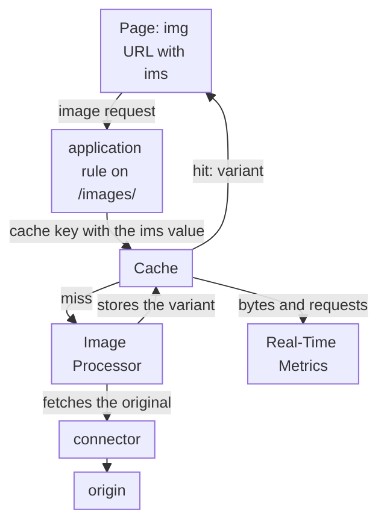

import DocCardGroup from '@aziontech/webkit/doc-card-group'
import DocCard from '@aziontech/webkit/doc-card'
import Tabs from '~/components/webkit/Tabs.vue'

A commerce, media, or marketing team keeps a large image library on its own origin or CMS, and pages that load full-size images are slow on mobile networks. Every device needs the same picture at a different size, and producing and storing each size in advance does not scale with the library. This page configures an application that resizes and converts each image on request from the original on the origin, caches every variant it produces, and has the pages ask for a small, fixed set of sizes. The result is measured by the image bytes delivered compared with the originals, and by the share of image requests answered from cache.

This use case does not cover video or image editing workflows.

## Prerequisites

- An application that serves your images from your origin through a connector and a workload. To create them, refer to [Applications quickstart](/en/documentation/platform/applications/quickstart/).
- Image Processor and Application Accelerator on that application. Image Processor transforms the images, and Application Accelerator owns the query-string variation that caches each transformation separately. To turn both on, refer to [Image Processor quickstart](/en/documentation/platform/applications/image-processor/quickstart/).
- A personal token, for the API steps. To create one, refer to [Personal tokens](/en/documentation/guides/platform/account-and-billing/personal-tokens/).
- Access to the templates that render the `img` elements of your pages.
- The paths and sizes of your images. This page uses `/images/` for the image path on the origin, `www.example.com` for the domain, and three display widths of `400`, `800`, and `1200` pixels. Replace each value with yours in every step.

---

## Required products

| The pages need | Which means | Product | Documented in |
| --- | --- | --- | --- |
| Each image at the size and format the page asks for, from one original | A rule with **Optimize Images** on the image path, and an `ims` query string in each image URL | Image Processor | [Configure Image Processor on an application](/en/documentation/guides/application-performance/delivery-optimization/process-images/) and [Image Processor URL parameters](/en/documentation/platform/applications/image-processor/url-parameters/) |
| Each variant served from cache after its first request | A cache setting that varies the cache key by the `ims` argument | Cache | [Image delivery](/en/documentation/platform/applications/image-processor/image-delivery/#one-cache-entry-per-transformation) |
| A cache key per `ims` value | **Cache vary by Query String**, with `ims` in an allowlist | Application Accelerator | [Configure Advanced Cache Key for an application](/en/documentation/guides/application-performance/cache-and-purge/advanced-cache-key/#vary-the-cache-by-a-query-string-argument) |
| Bytes saved and image requests served | The **Bandwidth Saving** dashboard and the **Image Processor** tab, filtered to the domain | Real-Time Metrics | [Build dashboards](/en/documentation/platform/real-time-metrics/build-dashboards/#bandwidth-saving) |

---

## Reference architecture

This page builds the *Origin-backed image optimization proxy*: image routes on an application that transform the originals fetched from your origin and cache each variant.



Read the diagram from the image rule. The rule on the image path sends the request to Cache first, and a variant already stored answers it with no processing and no origin request. Only a miss reaches Image Processor, which fetches the original through the connector, transforms it, and stores the result for the next request of the same variant. The origin stays in the path of every miss.

### Dataflow

1. A page requests an image under `/images/` with an `ims` query string that names the size, such as `?ims=fit-in/800x800/filters:quality(85)`.
2. The application's rule on `/images/` applies the `images` cache setting, whose cache key varies by `ims`, and the **Optimize Images** behavior.
3. A variant already in cache answers the request without processing, and a variant served from cache is not counted against the Images meter.
4. On a miss, the application fetches the original from your origin through the connector, so the origin's availability and egress stay in the data flow of every miss.
5. Image Processor resizes the original and converts it to WEBP for browsers that accept that format. It never modifies the original, and it does not keep the variant as an asset of the account.
6. Cache stores the variant under a key that carries the `ims` value and, for a converted image, the delivered format. The next request for the same size and format is answered from cache, and the origin serves an original only on a miss.

### Components

- **application**: the Platform Resource that holds the image route, the `images - optimize` rule that matches `/images/` and applies the `images` cache setting and **Optimize Images**.
- **Image Processor**: transforms the original into the variant the `ims` query string asks for, and chooses WEBP for browsers that accept it.
- **connector**: the Platform Resource that reaches the origin of the originals on each cache miss.
- **Cache**: stores each variant under its own key. The key varies by `ims` through the query-string allowlist of the cache setting, which belongs to Application Accelerator.
- **Real-Time Metrics**: shows the bytes Image Processor saved, the image requests served, and the share answered from cache.

### Other designs for this use case

- *Object storage-backed image optimization proxy*: for teams that move their originals to Azion, such as user uploads or a product catalog. The originals live in Object Storage, uploaded with the Azion CLI or the S3-compatible API, so the design adds an upload path and the request flow has no customer origin.

---

## Configure the cache setting for image variants

The `images` cache setting gives each `ims` value its own cache key, so a request for the 400-pixel image is never answered with the 800-pixel one. **Cache vary by Query String** uses an _Allowlist_ with only `ims`, so another argument, such as a campaign tag, does not create another copy of the same image.

**Max Age** is `31536000` seconds, the ceiling a cache setting accepts. A variant served from cache runs no transformation and adds nothing to the monthly Images meter, while a short **Max Age** repeats the same transformation on a timer that has nothing to do with changes at the origin. The browser cache honors the `Cache-Control` your origin sends for each image.

<Tabs client:visible sharedStore="interface">
<Fragment slot="tab.console">Console</Fragment>
<Fragment slot="tab.api">API</Fragment>

<Fragment slot="panel.console">

Create the cache setting as [Configure Advanced Cache Key for an application](/en/documentation/guides/application-performance/cache-and-purge/advanced-cache-key/#vary-the-cache-by-a-query-string-argument) describes, with these values. The rule that applies it is the next section.

- **Name**: `images`.
- **Browser Cache**: _Honor cache policies_.
- **Cache**: _Override cache behavior_, with **Max Age** set to `31536000`.
- **Cache vary by Query String**: _Allowlist_, with `ims` as the only argument.

</Fragment>

<Fragment slot="panel.api">

To create the cache setting:

```bash
curl --request POST \
  --url https://api.azion.com/v4/workspace/applications/<application-id>/cache_settings \
  --header 'Authorization: Token <personal-token>' \
  --header 'Content-Type: application/json' \
  --data '{
  "name": "images",
  "browser_cache": { "behavior": "honor" },
  "modules": {
    "cache": { "behavior": "override", "max_age": 31536000 },
    "application_accelerator": {
      "cache_vary_by_querystring": { "behavior": "allowlist", "fields": ["ims"] }
    }
  }
}'
```

The API answers `201` with `"state": "executed"` and the new setting. Keep its `id` for the rule:

```json
{"state":"executed","data":{"id":<images-id>,"name":"images",...}}
```

</Fragment>
</Tabs>

The application has a cache setting that stores one object per distinct `ims` value, for up to a year.

---

## Configure the image rule

The image rule matches every request under `/images/`, applies the `images` cache setting, and adds **Optimize Images**, which hands the request to Image Processor. A request the rule does not match is delivered unprocessed, so the rule is what gives the `ims` query string its meaning.

The rule adds no `Accept` header. Image Processor detects whether the browser supports WEBP from the browser's own `Accept` header and converts the image when it does, so each browser receives a format it reads. Forcing `Accept: image/webp` would send WEBP to browsers that never asked for it.

Create the rule as [Configure Image Processor on an application](/en/documentation/guides/application-performance/delivery-optimization/process-images/) describes, with these values in place of the guide's extension match:

- **Name**: `images - optimize`, in the Request Phase.
- **Criteria**: `${uri}` _starts with_ `/images/`.
- **Behaviors**: **Set Cache Policy** with the `images` cache setting, then **Optimize Images**. No **Add Request Header** behavior.

Through the API, the rule carries this criterion and both behaviors, and `optimize_images` takes no attributes:

```json
"criteria": [[{ "variable": "${uri}", "conditional": "if", "operator": "starts_with", "argument": "/images/" }]],
"behaviors": [
  { "type": "set_cache_policy", "attributes": { "value": <images-id> } },
  { "type": "optimize_images" }
]
```

Every request under `/images/` now reaches Image Processor and carries the `images` cache setting. A new rule takes a few minutes to propagate.

---

## Configure the image URLs in your pages

Each distinct `ims` string is a distinct object in cache, and a distinct transformation on its first request. A page that asks for any width the layout happens to compute stores an object per width, while a page that asks for three fixed widths stores three. The templates therefore request `400`, `800`, and `1200` pixels only.

Each URL uses `fit-in`, which keeps the image's proportions inside the box and never enlarges it, so no part of a product photo is cropped. Each URL also applies `quality(85)`, the value Azion recommends, which optimizes the file without a noticeable loss of visual quality. The 1,200-pixel box stays under the default width limit of 3,840 pixels.

In the template that renders an image, write the three sizes in the `srcset` of the `img` element, so the browser picks the smallest one that fits:

```html

```

Keep `ims` as the last argument of the query string. A parameter placed after it may make the request return a `504` error, so a script that appends a cache-busting or tracking value inserts it before `ims`.

Pages built from the template request one of three variants of each image, and each variant is processed once and then served from cache.

---

## Verify the setup

- **The image is processed.** Request one size of an image with a browser's `Accept` header:

  ```bash
  curl -sI -H "Accept: image/webp" "https://www.example.com/images/blue-shirt.jpg?ims=fit-in/800x800/filters:quality(85)"
  ```

  The response carries `x-ims: Enabled`, `content-type: image/webp`, and `x-original-image-size` with the size of the original before the transformation.

- **Each variant answers from cache.** Request the same URL twice with the `Pragma: azion-debug-cache` header:

  ```bash
  curl -sI -H "Accept: image/webp" -H "Pragma: azion-debug-cache" "https://www.example.com/images/blue-shirt.jpg?ims=fit-in/800x800/filters:quality(85)"
  ```

  The second response carries `x-cache: HIT`, and `x-cache-key` ends with the `ims` value and `@@webp`, the format the variant was converted to.

- **Two sizes are two objects.** Request the `400x400` URL with the same headers. Its `x-cache-key` differs from the `800x800` key, and its first response carries `x-cache: MISS`.

- **A browser without WEBP gets the original format.** Request the `800x800` URL with `-H "Accept: image/jpeg"` and the `Pragma: azion-debug-cache` header. The response carries the original format in `content-type`, and its `x-cache-key` carries no `@@webp`.

For how to read the debug headers, refer to [Check the cache status of a response](/en/documentation/guides/application-performance/cache-and-purge/check-page-cache-time/).

---

## Measuring results

| Metric | Where to read it | What working looks like |
| --- | --- | --- |
| Image bytes saved compared with the originals | The **Bandwidth Saving** dashboard of Real-Time Metrics, filtered to the host, or `bandwidthImagesProcessedSavedData` in the `workloadMetrics` dataset. Refer to [Build dashboards](/en/documentation/platform/real-time-metrics/build-dashboards/#bandwidth-saving) | Grows with the image traffic once the templates request the three sizes |
| Image requests served | The **Image Processor** tab of Real-Time Metrics, **Total Requests** | Follows the image traffic of the pages built from the templates |
| Share of image requests answered from cache | **Requests Offloaded** on the **Requests** dashboard, filtered to the host. Refer to [Measure cache offload for a domain](/en/documentation/guides/platform/observability/measure-cache-offload/) | Rises as each variant is cached, because each one is processed once and served from cache after |

---

## Best practices

- **Request a small, fixed set of sizes.** Every distinct `ims` string is a distinct object in cache and a distinct transformation counted against the Images meter. Three widths per image cost three transformations, however many visitors load them.
- **Purge every variant when an original is replaced.** A replaced original leaves its variants cached for up to a year, one key per size and per format. A URL purge does not reach the `@@webp` variants, so purge them with a wildcard that ends the path with `*`, such as `www.example.com/images/blue-shirt*`. For the wildcard purge and its daily bound, refer to [Purge pages when the origin publishes a change](/en/documentation/guides/application-performance/cache-and-purge/purge-on-publish/).
- **Keep `ims` the only argument in the allowlist.** An allowlist that names only `ims` keeps every other argument out of the cache key, so tracking values do not multiply the variants. For why, refer to [Applications best practices](/en/documentation/platform/applications/best-practices/#image-processor).
- **Use fit-in when no edge may be lost.** `?ims=800x800` fills the box exactly and autocrops the axis that overflows. `fit-in` keeps the whole image inside the box, so use the plain form only where the layout needs the box filled.

---

## Guides in this use case

<DocCardGroup cols={2}>
  <DocCard title="Configure Advanced Cache Key for an application" href="/en/documentation/guides/application-performance/cache-and-purge/advanced-cache-key/" label="Creates the images cache setting, which keeps one cached object per ims value." />
  <DocCard title="Configure Image Processor on an application" href="/en/documentation/guides/application-performance/delivery-optimization/process-images/" label="Creates the images - optimize rule, which applies the cache setting and hands each image request to Image Processor." />
</DocCardGroup>
