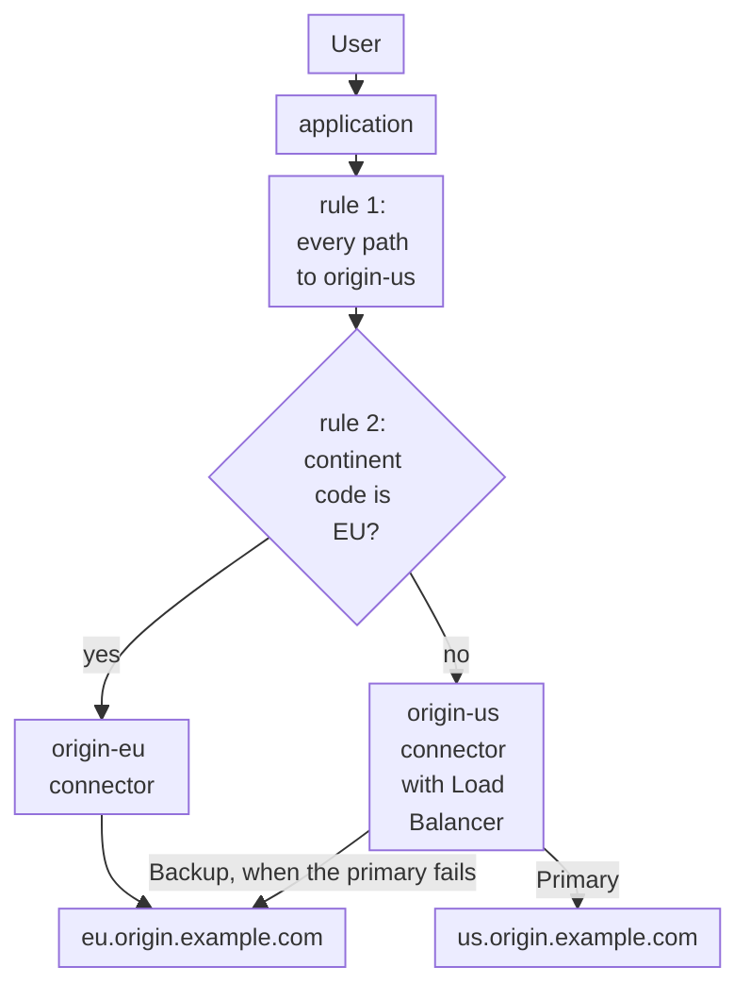
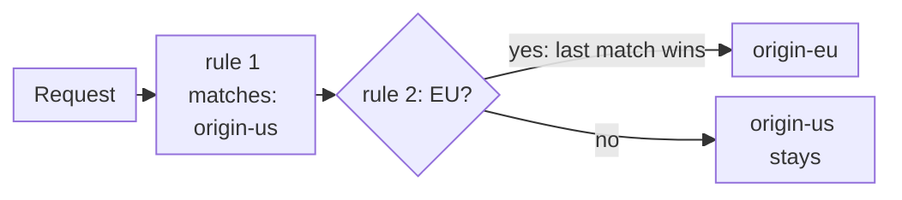

import DocCardGroup from '@aziontech/webkit/doc-card-group'
import DocCard from '@aziontech/webkit/doc-card'

An engineering team runs its application in several regions, for latency or because the data of some users must stay in their region under laws such as LGPD or GDPR. Each user must reach the right region without any logic in the client, and a regional outage must fall back to another region only where the team's residency rules allow it. This page sends each request to the connector of the user's region with a geolocation rule, keeps a default region for users from anywhere else, and gives the default region a backup origin in another region. The result is measured by the latency per region, by the share of requests served by the user's home region, and by the count of requests from a restricted region that reach an origin outside it, which stays at zero.

This use case does not cover single-origin acceleration or failover between identical origins. For failover, refer to [Keep an application online when an origin fails](/en/documentation/use-cases/improve-performance-and-reliability/keep-an-application-online-when-an-origin-fails/).

## Prerequisites

- An application that serves your site through a workload. To create one, refer to [Applications quickstart](/en/documentation/platform/applications/quickstart/).
- Two connectors, one per region. To create a connector, refer to [Connectors quickstart](/en/documentation/platform/connectors/quickstart/).
- A rule on the application whose **Set Connector** behavior sends every request, `${uri}` _starts with_ `/`, to the connector of the default region. It is the rule the [Applications quickstart](/en/documentation/platform/applications/quickstart/) creates.
- A personal token, for the API steps. To create one, refer to [Personal tokens](/en/documentation/guides/platform/account-and-billing/personal-tokens/).
- The names of your regions and origins. This page uses `origin-us` for the connector of the default region, with the address `us.origin.example.com`, and `origin-eu` for the connector of the European region, with the address `eu.origin.example.com`. Requests from Europe must stay on European origins. Requests from anywhere else may fall back to Europe when the default region fails. Each origin adds an `X-Origin-Region` response header with the value `us` or `eu`, so a response names the region that answered. The domain is `www.example.com`. Replace each value with yours in every step.

---

## Required products

| The application needs | Which means | Product | Documented in |
| --- | --- | --- | --- |
| Each user sent to the origin of their region | A rule that reads the request's continent code and sets the connector of that region | Applications | [Route requests by country or continent](/en/documentation/guides/application-performance/availability/route-requests-by-country-or-continent/) |
| A backup in another region, only where residency allows it | Load Balancer on the default region's connector, with the other region's origin as a _Backup_ address | Load Balancer | [Add a backup origin to a connector](/en/documentation/guides/application-performance/availability/add-a-backup-origin-to-a-connector/) |
| Traffic per region and per origin | The country and the origin address of each request, in the request metrics | Real-Time Metrics | [Real-Time Metrics GraphQL fields](/en/documentation/devtools/graphql/gql-real-time-metrics-fields/#workloadbreakdownmetrics) |

---

## Reference architecture

This page builds the *Geo-routed multi-region origins*: geolocation rules that send each request to the connector of the user's region, a default region for everyone else, and a backup origin only where residency rules allow it.



Read the diagram from the rules. Every request first matches the default rule, and a request whose geolocation matches a region then matches that region's rule too, which wins. Each connector holds the origins of one region. A backup in another region appears only on the connectors whose users may be served elsewhere, so a restricted region's requests have no path out of it.

### Dataflow

1. A user's request reaches the application, which reads the geolocation variables of the client's IP address in the Request Phase, such as `${geoip_continent_code}` or `${geoip_country_code}`.
2. The first rule matches every request and sets `origin-us`, the connector of the default region.
3. The second rule, placed after the first, matches a request whose `${geoip_continent_code}` is `EU` and sets `origin-eu`. **Set Connector** runs only from the last rule that matched, so the regional rule overrides the default and a European request goes to `origin-eu`.
4. `origin-eu` holds one European address and no backup, so a European request never leaves Europe, even when that origin fails.
5. `origin-us` sends every other request to `us.origin.example.com`, its _Primary_ address, and to `eu.origin.example.com`, its _Backup_ address, only when the primary fails.

### Components

- **application**: the Platform Resource that routes each request to a connector with its rules.
- **Rules Engine**: the Feature that matches the geolocation variables of the request. The order of its rules sets the default: the broad rule that sends every path to `origin-us` first, and the regional rule for Europe after it.
- **connectors**: the Platform Resources that hold the origins, one connector per region: `origin-us` and `origin-eu`. A rule names a connector, so moving a region's origin means editing one connector.
- **Load Balancer**: gives a regional connector a _Backup_ origin, which takes requests only when every _Primary_ origin fails. Only `origin-us` has one, because its users may be served from Europe.
- **Real-Time Metrics**: shows the traffic per country and the origin address that answered each request, which is how a request that left its region is found.

---

## Configure the backup region of the default connector

The default region takes the users whose data may leave their region, so its connector gets a backup in the other region. Load Balancer on `origin-us` keeps `us.origin.example.com` as the _Primary_ address, which receives every request while it answers. It adds `eu.origin.example.com` as a _Backup_ address, which receives requests only when every _Primary_ address fails.

`origin-eu` gets no backup outside Europe, because its users' requests must stay there. It keeps its single address and needs no change.

The backup is added as [Add a backup origin to a connector](/en/documentation/guides/application-performance/availability/add-a-backup-origin-to-a-connector/) describes, on `origin-us`, with these values:

- **Addresses** `us.origin.example.com` with **Server Role** _Primary_, and `eu.origin.example.com` with _Backup_.
- **Method** _Round Robin_.
- **Max Retries** `1`. One retry bounds how long a user waits through a failing connection.
- **Connection Timeout** `10` seconds. It stops a request from waiting the 60-second API default on an origin that accepts no connection.
- **Read/Write Timeout** `60` seconds.

`origin-us` holds the default region's origin and a backup in Europe, and `origin-eu` holds only its European origin. A connector change reaches Azion's distributed infrastructure over several minutes.

Both addresses of `origin-us` receive the same `Host` header from the connector. When the European origin answers under another name, set the connector's **Host** to `${host}`, which sends the host the user requested.

---

## Configure the geolocation rule

The geolocation rule sends European users to `origin-eu`. It matches `${geoip_continent_code}`, the two-letter continent code of the client's IP address, against `EU`, and its **Set Connector** behavior names `origin-eu`.

**Set Connector** does not add up across rules: when several matching rules carry it, only the one from the last matching rule runs. The default rule that sends every path to `origin-us` therefore stays first, and the geolocation rule comes after it, so it overrides the default for European requests. A new rule is created at the end of the phase, which is the position it needs.



1. Every request matches rule 1, which sets `origin-us`.
2. A request from Europe also matches rule 2, which sets `origin-eu`, and the later rule wins.
3. Any other request keeps `origin-us`.

The rule is created and kept after the default rule as [Route requests by country or continent](/en/documentation/guides/application-performance/availability/route-requests-by-country-or-continent/) describes, with these values:

- **Rule name**: `geo - europe`.
- **Criterion**: `${geoip_continent_code}` _is equal_ `EU`.
- **Behavior**: **Set Connector** with `origin-eu`, whose ID goes in `attributes.value` in the API.
- **Position**: after the default rule that sends every path to `origin-us`, so its `order` is higher than the default rule's.

Requests from Europe go to `origin-eu`, and every other request to `origin-us`. A new rule takes a few minutes to propagate.

---

## Verify the setup

Each check reads the `X-Origin-Region` header your origins set. The rule reads the location of the client's IP address, so each check runs from a machine in the region it tests.

- **Users outside Europe reach the default region.** From a machine outside Europe, send several requests:

  ```bash
  curl -s -D - -o /dev/null https://www.example.com/
  ```

  Every response carries `x-origin-region: us`. Under HTTP/2, header names arrive in lower case.

- **Users in Europe reach the European region.** From a machine in Europe, send the same request. Every response carries `x-origin-region: eu`.
- **The location Azion read matches the region that answered.** Access [Azion Console](https://console.azion.com/) > **Real-Time Events**, select the _HTTP Requests_ data source, and enter `host='www.example.com'` in **Filter by**. Each record of your requests carries **Geoloc Country Name** and **Upstream Addr**, the address of the origin that answered. For the filter syntax, refer to [Filter events](/en/documentation/guides/platform/observability/add-filters-events/).
- **The default region falls back, and Europe does not.** In a maintenance window, stop the web server on `us.origin.example.com` and repeat the request from outside Europe. The responses carry `x-origin-region: eu`. Start it again. A European origin outage, by design, shows the European users an error instead of a response from another region.

A rule or connector change that seems to have no effect may still be propagating. When it persists after a few minutes, turn on [Debug Rules](/en/documentation/platform/applications/main-settings/#debug-rules) to see which rules ran on the request.

---

## Measuring results

| Metric | Where to read it | What working looks like |
| --- | --- | --- |
| Latency per region | `requestTime` and `upstreamResponseTime` of the `workloadMetrics` dataset, grouped by `geolocCountryName`. Refer to [Real-Time Metrics GraphQL fields](/en/documentation/devtools/graphql/gql-real-time-metrics-fields/#workloadmetrics) | Stable for each country from week to week; a rise for one country points at the origin of its region |
| Share of requests served by the user's home region | `requests` of the `workloadBreakdownMetrics` dataset, grouped by `geolocCountryName` and `upstreamAddr`, the address of the origin that answered | European countries pair with the European origin's address, and the other countries with the default region's |
| Requests from Europe that reached an origin outside it | The same breakdown, for European countries paired with the address of `us.origin.example.com` | Zero rows |

---

## Best practices

- **Match a country list when a rule must follow a jurisdiction.** A continent code is geography, not a legal boundary: `EU` covers countries of Europe inside and outside the European Union. When the residency rule names countries, match `${geoip_country_code}` with the _matches_ operator and a regular expression of two-letter country codes, such as `^(DE|FR|IT|ES)$`.
- **Keep the default rule first.** **Set Connector** runs only from the last matching rule, so a reordered list can send European users to the default region with no change to any rule. Check the order of the **Request** list after every change to it.
- **Keep regional responses out of a shared cache key.** The default cache key is the scheme, the host, and the path, with no geolocation in it. A response that differs by region, or that carries a user's data, gets no cache setting, so one region's response is never served to another.
- **Give a restricted region a backup inside the region, if it needs one.** A _Backup_ address in the same region keeps the region answering during an outage of one origin without sending requests elsewhere. A restricted region with a single origin answers its users with an error during that origin's outage.

This configuration decides where requests go. It does not by itself establish compliance with LGPD, GDPR, or any other law.

---

## Guides in this use case

<DocCardGroup cols={2}>
  <DocCard title="Add a backup origin to a connector" href="/en/documentation/guides/application-performance/availability/add-a-backup-origin-to-a-connector/" label="Adds the European origin to origin-us as a Backup address for the default region." />
  <DocCard title="Route requests by country or continent" href="/en/documentation/guides/application-performance/availability/route-requests-by-country-or-continent/" label="Creates the geolocation rule that sends European requests to origin-eu, after the default rule." />
</DocCardGroup>
