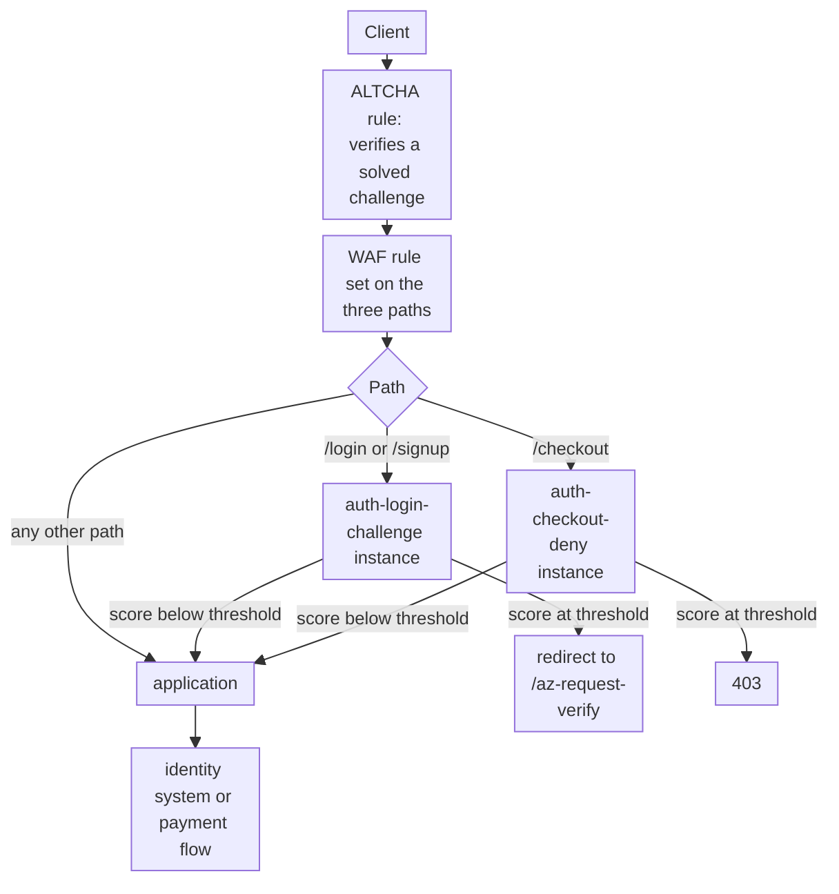

import DocCardGroup from '@aziontech/webkit/doc-card-group'
import DocCard from '@aziontech/webkit/doc-card'

A fraud or security team in retail, financial services, or gaming sees credential stuffing, fake account creation, and card testing on its login, signup, and checkout endpoints. Those three paths are where an automated client gains the most per request, and where a refused customer costs the most. This page configures Bot Manager on the firewall for those paths only: it scores every request for automation, sends a flagged client on login and signup to a challenge a person can solve, and denies a flagged client on checkout, while WAF filters attacks on the same paths. The result is measured by the share of automated login and checkout attempts blocked, the false-positive rate on real users, and the attack traffic that still reaches the origin.

This use case does not cover general API abuse, which [Protect public APIs from abuse](/en/documentation/use-cases/secure-applications-and-networks/protect-public-apis-from-abuse/) covers.

## Prerequisites

- An Azion account. If you do not have one, [create an account](https://console.azion.com/signup).
- An application that serves the site through a connector and a workload. To create them, refer to [Applications quickstart](/en/documentation/platform/applications/quickstart/).
- A firewall bound to that workload's deployment, with WAF and Functions turned on in **Main Settings** › **Modules**. To bind it, refer to [Bind a firewall to a workload](/en/documentation/guides/application-security/firewall-and-waf/firewall-protect-your-domain/), and to turn on WAF, refer to [Set a firewall's main settings](/en/documentation/guides/application-security/firewall-and-waf/firewall-configure-main-settings/).
- Bot Manager enabled on the account, or Bot Manager Lite installed from Azion Marketplace. To install Bot Manager Lite, refer to [Install Bot Manager Lite](/en/documentation/guides/application-development/integrations/bot-manager-lite/).
- ALTCHA instanced on the same firewall, with its rule matching `/login`, `/signup`, `/az-request-verify`, and `/az-request-captcha`, created before the Bot Manager rules on this page. ALTCHA serves the challenge Bot Manager redirects a flagged client to. To set it up, follow [Protect a route with an ALTCHA challenge](/en/documentation/guides/application-development/functions-and-runtime/altcha/) on this firewall, with `/login` and `/signup` as the protected routes, and leave out its application rule: on this page, the `redirect` action of Bot Manager sends only flagged clients to the challenge.

---

## Required products

| The flows need | Which means | Product | Documented in |
| --- | --- | --- | --- |
| Every request to login, signup, and checkout scored for automation | Bot Manager instances run by firewall rules scoped to the three paths | Bot Manager | [Run Bot Manager on selected paths](/en/documentation/guides/application-security/bots-and-network/run-bot-manager-on-selected-paths/) |
| A flagged client on login and signup challenged instead of refused | The `redirect` action, sending the client to the ALTCHA challenge | Bot Manager | [Arguments](/en/documentation/platform/firewall/bot-manager/arguments/#action) |
| A challenge that a person can solve | The ALTCHA function, run on the firewall before Bot Manager | Functions | [Protect a route with an ALTCHA challenge](/en/documentation/guides/application-development/functions-and-runtime/altcha/) |
| Attack payloads on the same paths refused | A WAF rule set applied by a _Set WAF_ rule on the three paths | WAF | [WAF quickstart](/en/documentation/platform/firewall/waf/quickstart/) |
| Bot Manager's decisions in the fraud team's tools | A stream of the _Functions_ data source, which carries the Bot Manager report lines, to the team's endpoint | Data Stream | [Debug functions with Data Stream](/en/documentation/guides/platform/observability/debugging-functions-data-stream/) |
| Each decision explained, request by request | The report line of the request, with its score and the rules it matched | Real-Time Events | [Read the report log](/en/documentation/guides/application-security/bots-and-network/read-the-report-log/) |

---

## Reference architecture

This page builds the *Bot-scoring perimeter for authentication flows*: firewall rules that scope Bot Manager to the login, signup, and checkout paths, where the score decides whether a request passes, is challenged, or is denied.

Read the diagram at the path split. The firewall's rules hand only the three sensitive paths to WAF and Bot Manager, so every other page is served without a score. On `/login`, `/signup`, and `/checkout`, the score of the instance that path runs sends each request one of three ways: through to the application, to the ALTCHA challenge a person can solve, or to a refusal. One instance per kind of path lets each run its own threshold and action.

### Dataflow

1. A request reaches the firewall bound to the workload. The ALTCHA rule runs first, so a client that already solved a challenge carries a session that ALTCHA validates.
2. The WAF rule scores requests to the three paths for attack payloads, such as an injection in a form field.
3. On `/login` and `/signup`, the `auth-login-challenge` instance scores the request. A score at its threshold redirects the client to the ALTCHA challenge. A person who solves it continues, and later requests pass without a new challenge.
4. On `/checkout`, the `auth-checkout-deny` instance scores the request. A score at its threshold receives `403`, because a checkout request that a script sends has no person to answer a challenge.
5. A request below the threshold reaches the application, and from it the identity system or the payment flow.
6. Each instance writes a report line per request, which Real-Time Events holds and Data Stream sends to the fraud team's tools.

### Platform Resources

- **firewall**: the Platform Resource whose path-scoped rules decide which requests Bot Manager and WAF see. One rule per kind of path lets each run its own threshold and action.
- **Bot Manager**: scores each request for automation and runs the action its instance sets once the score reaches the threshold. Its actions include `redirect`, which sends a client to a challenge, and `deny`, which refuses it with `403`.
- **WAF**: scores the same paths for attack payloads, such as injections in login and checkout form fields.
- **Functions**: runs the challenge, here ALTCHA from Azion Marketplace, ahead of Bot Manager, and any check the team writes for the `firewall` execution environment on the same paths.
- **Data Stream**: sends the _Functions_ data source, which carries the Bot Manager report lines, to an endpoint the fraud team reads.
- **SIEM**: the integration where the fraud team correlates Bot Manager's decisions with its own signals.
- **Real-Time Events**: holds each report line, with the score and the rules behind it, for the investigation of one decision.

---

## How the design works

This section explains why Bot Manager first observes the three paths, then challenges or denies a flagged client by path, and why WAF scores the same paths.

### The observation window

Before any instance refuses a request, one instance in observation mode scores the three paths and refuses nothing: `action` is `allow`, and `internal_logs` is `2`, so every request writes a report line. Run it for 24 to 72 hours, long enough to cover peak hours, weekly crawlers, and overnight jobs. The lines are the only description of how your own customers score, and the thresholds of the challenge and deny instances come from them. `threshold` is `10`, the stricter of the two starting points below, so the `classified` label shows which requests that threshold would act on. `log_tag` is `auth-observe`, so each line names this instance.

### Challenge and deny by path

One instance carries one threshold and one action, so the two kinds of path take an instance each. The thresholds start where [Firewall best practices](/en/documentation/platform/firewall/best-practices/#run-a-stricter-bot-manager-instance-on-a-high-value-path) start them for these paths, and the observation window moves them: lower while automated clients pass, higher while customers you recognize are flagged.

- **`auth-login-challenge`**: `/login` and `/signup`, `threshold` `10`, `action` `redirect`, because a person flagged by mistake on a sign-in or a signup can still pass the challenge. Account creation starts at `12` in Firewall best practices; this page uses one instance for both paths, at the stricter `10`.
- **`auth-checkout-deny`**: `/checkout`, `threshold` `10`, `action` `deny`, because card testing has no person behind it, and a checkout request a challenge interrupts loses the order anyway.

`redirect_to` is `/az-request-verify`, the path where ALTCHA serves its challenge. With no valid `redirect_to`, Bot Manager runs `allow` instead, so confirm in the report log that the instance redirects. Each instance has its own `log_tag`, so a refusal can be traced to the path that produced it.

`internal_logs` stays at `2` on both instances while you verify them, so every request writes a line. Observation mode writes a line for every request, so lower `internal_logs` once the thresholds hold. An argument change reaches traffic about 105 seconds after it is saved, and a new rule 6 to 10 minutes after.

### WAF on the authentication paths

The WAF rule set `auth-waf` scores requests to the three paths for attack payloads, such as an injection in a login form field. It carries the eight threat families at `medium`, the level every family starts at, and the rule that applies it starts in _Logging_. Move it to _Blocking_ once 3 days of **Tuning** hold no request that should have been served. The rule matches the paths, not the query string, because a login form posts its fields in the body.

---

## Measuring results

| Metric | Where to read it | What working looks like |
| --- | --- | --- |
| Share of automated login and checkout attempts blocked | **Top Bot Action** on the Bot Manager dashboard, with **Top Impacted URLs** narrowing it to the three paths. Refer to [Secure dashboards](/en/documentation/platform/real-time-metrics/secure-dashboards/#bot-manager) | `Deny` and `Redirect` carry the automated traffic on the three paths. Record the threshold beside every figure, because the classification moves with it |
| False-positive rate on real users | **Bot CAPTCHA** on the same dashboard, which splits the challenges into solved and not solved, and the `challenge_solved` field of the report line | A solved challenge is a flagged client that a person answered, so a share that keeps rising points to a threshold inside your customers' scores |
| Attack traffic that still reaches the origin | The report lines of the three paths whose `action` reads `allow`, read against their `score` | No cluster of automated clients sits just under the threshold |

---

## Best practices

- **Set each threshold from your own scores.** The starting values are documented starting points, not descriptions of your traffic. A threshold inside the customers' cluster refuses them, and one past the automated cluster acts on nothing. For the reasoning, refer to [Set the Bot Manager threshold from your own score distribution](/en/documentation/platform/firewall/best-practices/#set-the-bot-manager-threshold-from-your-own-score-distribution).
- **Run ALTCHA before Bot Manager.** A redirected client comes back to the firewall. When Bot Manager scores the returning request before ALTCHA validates its session, it redirects the client again.
- **Write out every argument the instance depends on.** Nothing validates the arguments object. A misspelled key such as `thresold` is stored without an error, and the instance runs its default, which on Bot Manager Lite is `deny` at `30`.
- **Read what a rule matched before you disable it.** `matched_rules` names the Bot Manager rules behind each score. Disabling one stops it for every client, so narrow the instance's paths instead when a rule flags customers on one path.
- **Keep a copy of the report lines you own.** Real-Time Events keeps an event record for 7 days, and a fraud investigation often looks further back. Send the _Functions_ data source to the fraud team's endpoint with [Debug functions with Data Stream](/en/documentation/guides/platform/observability/debugging-functions-data-stream/).

---

## Guides in this use case

<DocCardGroup cols={2}>
  <DocCard title="Run Bot Manager on selected paths" href="/en/documentation/guides/application-security/bots-and-network/run-bot-manager-on-selected-paths/" label="Create the instances and the rules that scope Bot Manager to login, signup, and checkout." />
  <DocCard title="Protect a route with an ALTCHA challenge" href="/en/documentation/guides/application-development/functions-and-runtime/altcha/" label="Instantiate ALTCHA on the firewall, with the rule that serves the challenge the redirect action sends a flagged client to." />
  <DocCard title="Run Bot Manager in observation mode" href="/en/documentation/guides/application-security/bots-and-network/observation-mode/" label="Run the observation instance whose report lines set the thresholds of the two instances." />
  <DocCard title="Read the report log for one instance" href="/en/documentation/guides/application-security/bots-and-network/read-the-report-log/" label="Query the report lines that every check in this use case reads." />
  <DocCard title="Create a rule set at medium sensitivity" href="/en/documentation/guides/application-security/firewall-and-waf/rule-set-medium/" label="Create auth-waf with every threat family at medium." />
  <DocCard title="Apply a rule set to every request" href="/en/documentation/guides/application-security/firewall-and-waf/apply-rule-set/" label="Apply auth-waf in Logging to the login, signup, and checkout paths." />
  <DocCard title="Switch a rule set to blocking" href="/en/documentation/guides/application-security/firewall-and-waf/switch-to-blocking/" label="Move the auth-waf rule to Blocking once Tuning holds no request that should have been served." />
</DocCardGroup>
