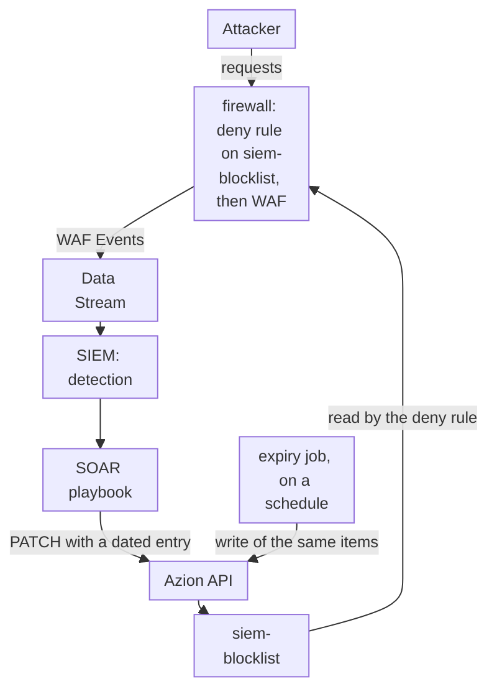
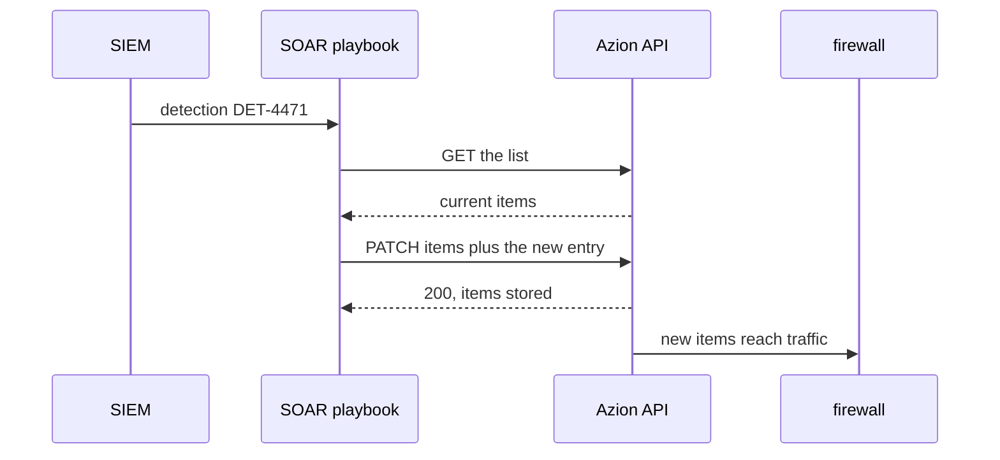

import DocCardGroup from '@aziontech/webkit/doc-card-group'
import DocCard from '@aziontech/webkit/doc-card'

A SOC team detects threats in its SIEM but applies blocks by hand, so an attacker keeps reaching the applications between the detection and the mitigation. The firewall already runs WAF, and its events already reach the SIEM, yet nothing carries a decision back. This page configures a network list that a firewall rule denies, the call a SIEM or SOAR playbook sends to add an address to it with an expiry, and the job that removes expired entries. The result is measured by the time from detection to block and the share of incidents mitigated without manual steps.

This use case does not cover the detection logic itself, which stays in the team's SIEM.

## Prerequisites

- An Azion account. If you do not have one, [create an account](https://console.azion.com/signup).
- A firewall bound to the workload of each application to protect, with WAF applied by a rule. To build one, refer to the [WAF quickstart](/en/documentation/platform/firewall/waf/quickstart/).
- A stream of the WAF events to the SIEM. To create it, refer to [Stream WAF events to a SIEM](/en/documentation/guides/application-security/firewall-and-waf/integrate-siems/).
- A SIEM or SOAR platform that can send an HTTPS request from a playbook, and run a job on a schedule.

---

## Required products

| The SOC needs | Which means | Product | Documented in |
| --- | --- | --- | --- |
| Firewall and WAF events in the SIEM, where detections run | A stream of the _WAF Events_ data source to the SIEM's endpoint | Data Stream | [Stream WAF events to a SIEM](/en/documentation/guides/application-security/firewall-and-waf/integrate-siems/) |
| The attack signals the detections read | A WAF rule set that a _Set WAF_ rule applies to the application's requests | WAF | [WAF quickstart](/en/documentation/platform/firewall/waf/quickstart/) |
| A block that a playbook can apply without changing a rule | A network list that one deny rule reads through the _Network_ criterion | Network Shield | [Network Lists](/en/documentation/platform/firewall/network-shield/network-lists/) |
| Blocks that end on their own | A due date on each entry, applied by a scheduled write of the list | Network Shield | [Update a network list from an automation](/en/documentation/guides/application-security/bots-and-network/update-network-list-from-automation/) |

---

## Reference architecture

This page builds the *SIEM-driven firewall mitigation loop*: events leave the firewall for the SIEM, and a detection comes back as an entry in a network list that a firewall rule already enforces.

Read the diagram as a loop that starts and ends at the firewall. Events leave it through Data Stream, the decision is made in the SIEM, and the decision comes back as data, an entry in `siem-blocklist`, never as a new rule. The rule that reads the list exists before any detection does, so the loop changes what the firewall matches without changing its configuration. The expiry job closes the loop from the other side, ending each block once its time has passed.

### Dataflow

1. The attacker's requests reach the firewall. WAF scores them, and Data Stream sends the WAF events to the SIEM.
2. A detection in the SIEM starts a SOAR playbook, which reads `siem-blocklist`, adds the attacker's address with a due date, and writes the list back through the API.
3. The deny rule already reads `siem-blocklist`, so the next requests from that address receive `403` once the change reaches traffic, in about 100 seconds.
4. One list can be read by rules on several firewalls, so one write blocks the address on every application those firewalls protect.
5. A scheduled job writes the list's items back, and the platform drops every entry whose due date has passed, which ends that block.

### Platform Resources

- **Data Stream**: exports the events of the firewall's WAF to the endpoint the SIEM reads, which is where the loop starts.
- **SIEM or SOAR**: the integration that holds the detection logic and runs the playbook that turns a detection into a list update.
- **API and Terraform Provider**: the Platform Resources through which the playbook updates the list. The API replaces the list's items on each write, and the Terraform Provider manages the list as a resource.
- **Network Shield**: adds the _Network_ criterion that compares each client address with the list, and holds the list with a due date and a comment on each entry.
- **firewall**: the Platform Resource that enforces the block. Its deny rule on the list runs before WAF, so a listed address is refused before it is scored.
- **WAF**: the event source. Its scores, matched rules, and actions are what the SIEM's detections read.

---

## How the design works

This section explains why the loop takes its shape: the list and the rule that enforces it, the playbook's write to the list, and the expiry job.

### The list and the rule that enforces it

The rule exists before any detection does, so a playbook never creates or changes a rule. A change to a list's items reaches traffic in about 100 seconds, while a new rule takes 6 to 10 minutes, and a list adds nothing to the rules your plan includes per firewall. The rule holds the first position on the firewall, so a listed address is refused before WAF scores it.

The list starts with one entry with no due date, `192.0.2.10`. A write in which every entry is past due is refused with `22019`, so one undated entry keeps the list writable after every detection has expired.

To protect several applications, add the same rule to each of their firewalls: every rule reads the one list, so one write blocks the address everywhere.

### The playbook's write to the list

The playbook sends two calls for each detection: it reads the list, then writes it back with the new entry. A `PATCH` that sends `items` replaces the whole array, so a playbook that sent only the new address would remove every other entry, the permanent one included.

Each new entry carries two annotations. The due date, `--LT` and a UTC date and time in whole seconds, marks when the block ends, and this page uses 24 hours after the detection. The comment, `#` and the detection's ID, tells an analyst why the address is there.

1. The SIEM raises a detection for `198.51.100.23` and starts the playbook.
2. The playbook reads the current items of `siem-blocklist`.
3. The playbook adds `198.51.100.23 --LT<due-date> #DET-4471` to those items, and writes the whole array back.
4. The API answers `200` and stores the items. The firewall denies the address once the change reaches traffic.

The playbook validates every entry before it sends the array, because a refused write names only the first invalid entry.

The Azion Terraform Provider also manages a network list, as the `azion_network_list` resource. For its arguments, refer to [Security resources](/en/documentation/devtools/terraform/security/).

### The expiry job

A due date never removes an entry by itself. The platform reads due dates only when the items of a list are written: each write drops the entries already past due, and an entry whose date passes after the write keeps matching. The expiry job is that write, sent on a schedule. It reads the items and sends the same items back, and the platform drops the expired ones.

The schedule sets how long an expired entry keeps blocking. This page runs the job every hour, so a block ends at most one hour after its due date. A detection that fires again before the job runs keeps the address listed: the playbook's write carries a new due date for it.

---

## Measuring results

| Metric | Where to read it | What working looks like |
| --- | --- | --- |
| Time from detection to block | The detection's timestamp in the SIEM, against the first `403` for the address in the HTTP Requests data source of [Real-Time Events](/en/documentation/platform/real-time-events/data-sources/#http-requests), read by **Remote Address** and **Status** | The playbook's run time plus about 100 seconds of propagation |
| Share of incidents mitigated without manual steps | The list's **Last Editor**, the user whose token made the last write, and the playbook's run history in the SOAR platform | Every write to `siem-blocklist` comes from the playbook's user, and every detection of the blocking type has a run |

---

## Best practices

- **Give the list one owner.** Each write replaces the whole array and overwrites every other editor, so an analyst's edit in Azion Console between the playbook's read and its write is lost. Keep manual blocks in a list of their own, with its own rule.
- **Give the playbook its own user and token.** **Last Editor** names the user whose token wrote the list, so writes by the playbook and by people stay apart, and the token can be revoked without touching anyone's access.
- **Put a due date on every automated entry.** An entry with no due date blocks until someone removes it, and a list a playbook fills grows with every detection. The due date makes each automated block end on its own, at the next run of the expiry job.
- **Write the detection's ID in the comment.** The comment is stored with the entry and shown in the list, so an analyst who receives a complaint from a blocked customer finds the detection behind it.
- **Never write the Azion-maintained lists.** Any write to `Azion IP Tor Exit Nodes` is refused with `22004`. Reference it from a rule of its own, and keep the playbook's addresses in `siem-blocklist`.

---

## Guides in this use case

<DocCardGroup cols={2}>
  <DocCard title="Block addresses until a date" href="/en/documentation/guides/application-security/bots-and-network/temporary-block/" label="Create siem-blocklist with its first entry, and the rule that denies every address in it." />
  <DocCard title="Change the order of firewall rules" href="/en/documentation/guides/application-security/bots-and-network/change-the-order-of-firewall-rules/" label="Move the deny rule above the rule that applies WAF, so a listed address is refused before it is scored." />
  <DocCard title="Update a network list from an automation" href="/en/documentation/guides/application-security/bots-and-network/update-network-list-from-automation/" label="Send the read and the write that add a dated entry to siem-blocklist, and the scheduled write that drops expired ones." />
  <DocCard title="Stream WAF events to a SIEM" href="/en/documentation/guides/application-security/firewall-and-waf/integrate-siems/" label="Create the stream of WAF events that the SIEM's detections read, and confirm that the SIEM's endpoint accepts it." />
</DocCardGroup>
