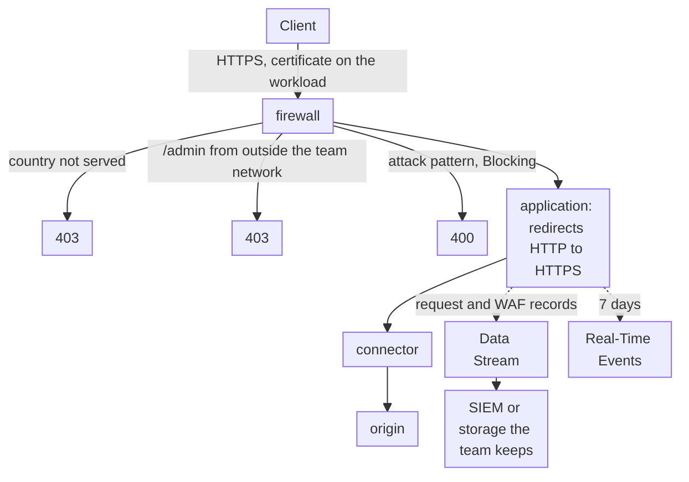

import DocCardGroup from '@aziontech/webkit/doc-card-group'
import DocCard from '@aziontech/webkit/doc-card'

A security or compliance team is responsible for a web application that handles card data or personal data under a standard such as PCI DSS, SOC 2, LGPD, or GDPR. It must show auditors that traffic is encrypted, that application-layer attacks are filtered, that access is restricted, and that security events are kept. This page configures the HTTPS redirect on the application, the country and address restrictions on its firewall, and a stream that exports every request and WAF event to a destination the team keeps. The result is measured by each audited control mapped to a platform setting, the completeness and retention period of the security logs, and the time needed to prepare audit evidence.

This use case does not cover Azion's own certifications as a vendor, for which refer to [PCI Compliance](/en/documentation/fundamentals/pci-dss-certification/) and [SOC Compliance](/en/documentation/fundamentals/soc/), or where the team's databases store regulated data.

## Prerequisites

- An Azion account. If you do not have one, [create an account](https://console.azion.com/signup).
- An application that serves the web application through a connector and a workload. To create them, refer to [Applications quickstart](/en/documentation/platform/applications/quickstart/).
- HTTPS turned on in the workload's protocol settings, with a certificate that covers its domains. To have Azion request and renew one, refer to [Request a Let's Encrypt certificate](/en/documentation/guides/application-security/tls-and-certificates/how-to-generate-a-lets-encrypt-certificate/), and to upload one of your own, refer to the [Certificate Manager quickstart](/en/documentation/platform/workloads/certificate-manager/quickstart/).
- A firewall bound to the workload's deployment, with WAF applied to every request. To build it, refer to [Bind a firewall to a workload](/en/documentation/guides/application-security/firewall-and-waf/firewall-protect-your-domain/) and [Apply a rule set to every request](/en/documentation/guides/application-security/firewall-and-waf/apply-rule-set/).
- An endpoint that keeps the events for the period your standard requires, such as a SIEM or a storage bucket. For the endpoints a stream sends to, refer to [Endpoints](/en/documentation/platform/data-stream/endpoints/).

---

## Required products

| The audit asks for | Which means | Product | Documented in |
| --- | --- | --- | --- |
| Traffic encrypted in transit | A certificate on the workload, and a _Redirect HTTP to HTTPS_ rule on the application | Certificate Manager | [Certificate Manager quickstart](/en/documentation/platform/workloads/certificate-manager/quickstart/) and [Redirect HTTP to HTTPS](/en/documentation/guides/application-security/tls-and-certificates/redirect-http-to-https/) |
| Application-layer attacks filtered | A WAF rule set that a _Set WAF_ rule applies to every request | WAF | [Apply a rule set to every request](/en/documentation/guides/application-security/firewall-and-waf/apply-rule-set/) |
| Access restricted by country and by network | Network lists that deny rules read through the _Network_ criterion | Network Shield | [Network Lists](/en/documentation/platform/firewall/network-shield/network-lists/) |
| Security events kept outside the platform | A stream of the _Applications_ data source, with the WAF variables, to the team's endpoint | Data Stream | [Stream request and WAF records to a SIEM](/en/documentation/guides/platform/observability/stream-request-and-waf-records-to-siem/) |
| One incident reviewed request by request | The record of each request, with its WAF fields | Real-Time Events | [Data sources](/en/documentation/platform/real-time-events/data-sources/#http-requests) |

DDoS Protection mitigates DoS and DDoS attacks on every workload, with nothing to configure. For the attack types it covers, refer to [Attack mitigation](/en/documentation/platform/workloads/ddos-protection/ddos-mitigation/).

---

## Reference architecture

This page builds the *Compliance perimeter with security event retention*: encryption, filtering, and access restrictions in front of the application, and an export of every security event to a destination the team keeps.

Read the diagram as two paths. The solid path is the request: encrypted on arrival, filtered by the firewall's rules, and delivered to the origin through the connector. The dotted path is the evidence: a record of every request, with its WAF decision, leaves for a destination the team keeps, while Real-Time Events holds a short window for review. An audit asks about both paths, and each control on the first has a record on the second.

### Dataflow

1. A client connects over HTTPS, and the workload presents the certificate that Certificate Manager holds for the domain. DDoS Protection assesses the traffic before any firewall rule runs.
2. The firewall's rules deny, through Network Shield lists, a client whose country is not in the served list and a request to `/admin` from outside the team's network.
3. WAF scores every request, and in _Blocking_ refuses one whose score reaches a family's threshold.
4. A request that passes reaches the application, which redirects plain HTTP to HTTPS and forwards the request to the origin through the connector.
5. Data Stream exports the record of every request, with its WAF variables, to the SIEM or the storage the team keeps for the period its standard requires.
6. Real-Time Events keeps each record for 7 days, for the review of a recent incident.

### Platform Resources

- **Certificate Manager**: the Platform Resource that holds the TLS certificates a workload presents, either uploaded by the team or requested from Let's Encrypt and renewed by Azion.
- **application**: the Platform Resource that redirects plain HTTP to HTTPS and delivers the requests the firewall lets through.
- **firewall**: the Platform Resource that is the enforcement point, where each control runs as a rule a team can name to an auditor.
- **DDoS Protection**: the Feature that mitigates DoS and DDoS attacks on every workload, always on and with nothing to configure.
- **WAF**: the application-layer control, which scores each request against eight threat families and refuses attack patterns in _Blocking_.
- **Network Shield**: restricts access by network and by country, through lists that deny rules read with the _Network_ criterion.
- **connector**: the Platform Resource that reaches the origin.
- **Data Stream**: exports the request records, with the WAF variables, for retention outside the platform. Its _Activity History_ data source also exports the configuration changes users make in Azion Console.
- **Real-Time Events**: holds each request record for 7 days, for incident review.
- **SIEM or storage**: the integration that holds the evidence for the period the team's standard requires.

---

## How the design works

This section explains why each control takes its shape: HTTPS enforcement, the access and geographic restrictions, and the event export.

### HTTPS enforcement

The certificate on the workload encrypts every HTTPS connection, and the application's rule closes the other path: a request made over plain HTTP is redirected to HTTPS instead of being served. _Redirect HTTP to HTTPS_ does nothing to a request already made over HTTPS, so the rule matches `${uri}` _starts with_ `/`, every path, with no condition on the scheme. The behavior requires HTTPS turned on in the workload's protocol settings.

The workload's **Minimum TLS version** defaults to TLS 1.3. Keep it, or record the version you set, because an auditor asks for the floor, not for the version one session negotiated.

The rule's name, `audit - redirect to HTTPS`, is a name an auditor can map to the encryption control, and the rule sits before any rule of the application whose behavior ends the processing, so no HTTP request skips the redirect.

### Access and geographic restrictions

Two deny rules restrict access on the firewall. The first refuses every client whose country is not in `audit-served-countries`, with the _Network_ criterion's _does not match_ operator, so a new country stays refused until someone adds it. The second refuses a request to `/admin` from any address outside `audit-team-addresses`, so the administration path answers only your team. Its two criteria sit in one block joined by _and_: the rule acts only where the path and the address both match.

Country resolution can be wrong for some addresses, so the administration rule reads an `ip_cidr` list rather than a country. Give each entry of `audit-team-addresses` a comment naming whose network it is, because an auditor asks who can reach the path.

### The event export

The stream reads the _Applications_ data source with the _Applications + WAF Event Collector_ template, `184` in the API. Each log line then carries the request, the response, and the client address, with the WAF score, matched rules, and action of the same request, so one line answers an auditor's question about one request. The stream filters on the application's workload rather than sampling, so every request is exported and the account's other streams stay active.

Real-Time Events keeps each record for 7 days, so evidence for an audit period comes from the destination, which keeps the lines for as long as the team configures it to.

---

## Measuring results

| Metric | Where to read it | What working looks like |
| --- | --- | --- |
| Each audited control mapped to a platform setting | The team's own control map, which names for each control the setting on this page that implements it: the workload's certificate and TLS floor, the redirect rule, the WAF rule, the two deny rules, and the stream | No control in the audit's scope without a named setting |
| Completeness of the security logs | The `dataStreamedEvents` dataset of Real-Time Events, which records the status code of every send. Refer to [Watch the status code of every send](/en/documentation/platform/data-stream/best-practices/#watch-the-status-code-of-every-send-in-real-time-events) | Every send answers `200`, and the destination holds a line for each period with traffic |
| Retention period of the security logs | The retention setting of the destination | Meets the period the team's standard requires |
| Time to prepare audit evidence | The time to export one audit period from the destination, and the control map with it | Falls to the time of one query per control |

---

## Best practices

- **Keep the evidence outside the platform.** Real-Time Events keeps a record for 7 days, and a failed send that nobody reads within that period leaves no record either. The destination is the only place the evidence lasts.
- **Export configuration changes too.** The _Activity History_ data source carries each change a user makes on the account in Azion Console, with the author and the time, and its _Activity History Collector_ template is `251`. An auditor who asks who changed a rule reads it there.
- **Keep the administration path on addresses, not on countries.** Country resolution can be wrong for some addresses, and an `ip_cidr` list names exactly who can reach the path.
- **Read the shared responsibility before you write the control map.** Azion secures the platform, and the team configures and evidences the controls of its own application. For the split, refer to [Shared Responsibility Model](/en/documentation/fundamentals/shared-responsibility/).

---

## Guides in this use case

<DocCardGroup cols={2}>
  <DocCard title="Redirect HTTP to HTTPS" href="/en/documentation/guides/application-security/tls-and-certificates/redirect-http-to-https/" label="Create the application rule that redirects every plain HTTP request to HTTPS." />
  <DocCard title="Deny requests from a list of countries" href="/en/documentation/guides/application-security/bots-and-network/deny-countries/" label="Create audit-served-countries, and confirm that a client from a country outside it receives 403." />
  <DocCard title="Allow only the addresses in a list" href="/en/documentation/guides/application-security/bots-and-network/allowlist/" label="Create audit-team-addresses and a rule whose does not match operator refuses every client outside a list." />
  <DocCard title="Guard one path with a network list" href="/en/documentation/guides/application-security/bots-and-network/guard-one-path/" label="Join a Request Uri criterion to the Network criterion, so the administration rule acts only on /admin." />
  <DocCard title="Stream request and WAF records to a SIEM" href="/en/documentation/guides/platform/observability/stream-request-and-waf-records-to-siem/" label="Create the stream that exports every request with its WAF variables to the destination that keeps the evidence." />
  <DocCard title="Apply a rule set to every request" href="/en/documentation/guides/application-security/firewall-and-waf/apply-rule-set/" label="Apply the WAF rule set to every request, the application-layer control the audit asks for." />
</DocCardGroup>
