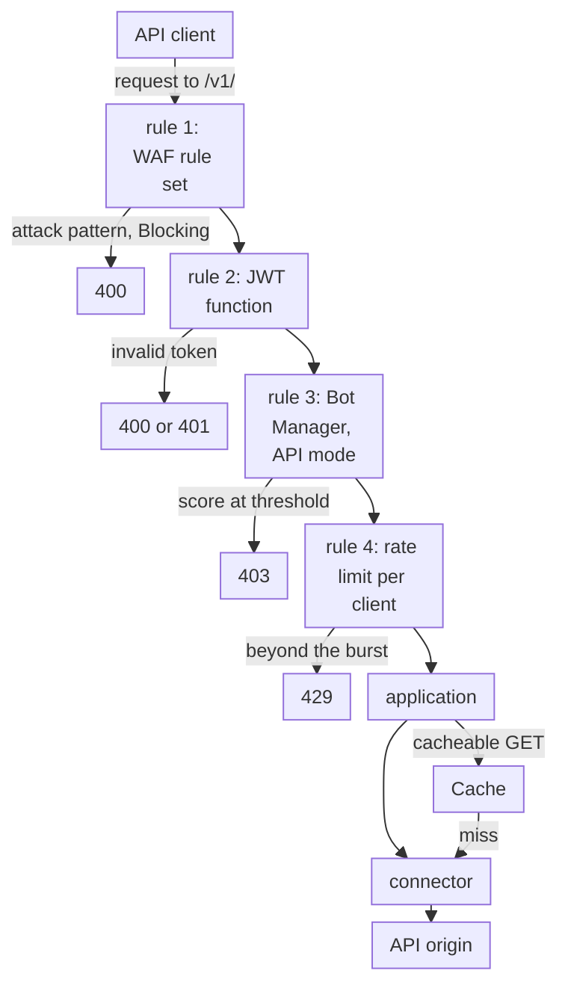

import DocCardGroup from '@aziontech/webkit/doc-card-group'
import DocCard from '@aziontech/webkit/doc-card'
import DocSteps from '@aziontech/webkit/doc-steps'
import DocStep from '@aziontech/webkit/doc-step'
import Tabs from '~/components/webkit/Tabs.vue'

An API or security team exposes public, mobile, or partner APIs from its own gateway, cloud, or data center. It sees scraping, token misuse, credential abuse, and request floods that overload the backend, and every one of those requests reaches the API origin before anything inspects it. This page configures a firewall in front of the API that scores each request with WAF, checks its token, scores automated clients, and caps the rate of each client, and streams the security events to the team's SIEM. The result is measured by the share of abusive requests blocked before the origin, the backend error rate during an attack, and the time from detection to a new block.

This use case does not cover API design or lifecycle management, or account takeover on login flows, which [Block account takeover on login and checkout flows](/en/documentation/use-cases/secure-applications-and-networks/block-account-takeover-on-login-and-checkout-flows/) covers.

## Prerequisites

- An application that serves the API through a connector and a workload. To create them, refer to [Applications quickstart](/en/documentation/platform/applications/quickstart/).
- A firewall bound to that workload's deployment, with WAF and Functions turned on in **Main Settings** › **Modules**. To bind it, refer to [Bind a firewall to a workload](/en/documentation/guides/application-security/firewall-and-waf/firewall-protect-your-domain/), and to turn on WAF, refer to [Set a firewall's main settings](/en/documentation/guides/application-security/firewall-and-waf/firewall-configure-main-settings/).
- The JWT function installed from Azion Marketplace. To install it, refer to [How to Install the JWT Integration](/en/documentation/guides/application-development/integrations/jwt/).
- Bot Manager enabled on the account, or Bot Manager Lite installed from Azion Marketplace. To install Bot Manager Lite, refer to [Install Bot Manager Lite](/en/documentation/guides/application-development/integrations/bot-manager-lite/).
- The key ID and secret key pairs your token issuer signs tokens with.
- A personal token, for the API tabs. To create one, refer to [Personal tokens](/en/documentation/guides/platform/account-and-billing/personal-tokens/).
- The values of your API. This page uses `api.example.com` for the domain, `/v1/` for the path every API route starts with, and `api` as the prefix of every object it creates. Replace each value with yours in every step.

---

## Required products

| The API needs | Which means | Product | Documented in |
| --- | --- | --- | --- |
| Injection and other attack patterns refused before the origin | A WAF rule set that a _Set WAF_ rule applies to the API paths | WAF | [WAF quickstart](/en/documentation/platform/firewall/waf/quickstart/) |
| A request without a valid token refused before the origin | The JWT function, instanced on the firewall and run by a rule on the API paths | Functions | [How to Install the JWT Integration](/en/documentation/guides/application-development/integrations/jwt/) |
| Automated clients scored | A Bot Manager instance, scoring clients that carry no cookies, run by a rule on the API paths | Bot Manager | [Run Bot Manager on selected paths](/en/documentation/guides/application-security/bots-and-network/run-bot-manager-on-selected-paths/) |
| Floods from one client capped | A _Set Rate Limit_ rule that counts requests per client IP address on the API paths | None: built into the firewall | [Apply WAF and a rate limit to one path](/en/documentation/guides/application-security/firewall-and-waf/apply-waf-and-rate-limit-to-one-path/) |
| Safe GET responses answered without the origin | A cache setting applied by an application rule on the cacheable routes | Cache | [Cache settings](/en/documentation/platform/applications/cache/cache-settings/) |
| Security events in the team's SIEM | A stream of the _WAF Events_ data source to the SIEM's endpoint | Data Stream | [Stream WAF events to a SIEM](/en/documentation/guides/application-security/firewall-and-waf/integrate-siems/) |
| Each blocked request explained | The record of the request, found by its `x-azion-request-id` | Real-Time Events | [Find the WAF score of a blocked request](/en/documentation/guides/application-security/firewall-and-waf/how-to-find-waf-score/) |


---

## Reference architecture

This page builds the *API security perimeter*: a firewall on the API's workload that filters each request by rules, tokens, bot scores, and rates before the connector forwards it to the API origin.



Read the diagram at the firewall rules. The connection is already accepted when a request reaches them, so every check acts on a request, not on a client's identity: rules, a token, a bot score, and a rate. Each check acts through the rule that calls it, so the order of the rules is the order of the checks. Only a request that passes them all reaches the application, which answers safe GET requests from Cache and sends the rest to the API origin.

### Dataflow

1. An API client's request to `api.example.com/v1/` reaches the workload. DDoS Protection assesses it before any firewall rule runs, and the firewall bound to the workload then runs its rules in order.
2. The WAF rule set scores the request, its JSON body included. In _Blocking_, a request whose score reaches a threshold receives `400`.
3. The JWT function checks the token the request carries in its `Authorization` header. A request whose token is invalid receives `400` or `401`.
4. The Bot Manager instance scores the client for automation. Once its action is `deny`, a score at the threshold receives `403`.
5. The rate limit counts the requests of each client IP address, and a request beyond the burst receives `429`.
6. A request that passes reaches the application. A cacheable GET response comes from Cache, and every other request reaches the API origin through the connector. Data Stream sends the requests WAF analyzed to the SIEM, and Real-Time Events holds the record of each request, joined to a refusal by its `x-azion-request-id`.

### Components

- **firewall**: the Platform Resource that is the enforcement point. Its rules run WAF, the functions, and the rate limit per client in the order the rules set, and _Set Rate Limit_ is one of its built-in behaviors.
- **DDoS Protection**: the Feature that mitigates DoS and DDoS attacks on every workload, always on, before any firewall rule runs.
- **WAF**: scores each request against eight threat families and refuses attack patterns in _Blocking_. It parses JSON bodies, so it reads the fields an API receives.
- **Bot Manager**: scores each request for automation. Its `api` mode is documented for clients that carry no cookies, which is how most API clients behave.
- **Functions**: runs the token check on the firewall, such as the JWT function from Azion Marketplace, and any custom check the team writes in the `firewall` execution environment.
- **application**: the Platform Resource that routes the requests the firewall lets through, and decides which responses Cache can answer.
- **Cache**: answers safe GET responses, so repeated reads never reach the API origin.
- **connector**: the Platform Resource that reaches the API origin. Every request that passes the firewall and misses Cache ends at it.
- **Data Stream**: sends the requests WAF analyzed, with their score, matched rules, and action, to an endpoint the SIEM reads.
- **SIEM**: the integration that correlates the API's security events with the team's other sources.
- **Real-Time Events**: holds the record of each request, so a client's report of a refusal can be traced to the rule that decided it.

### Other designs for this use case

- *Mutual TLS perimeter for partner APIs*: serves B2B and partner integrations where every client is known. The workload requires a client certificate signed by a certificate authority the team registers in Certificate Manager, so a caller without a valid certificate is refused during the TLS handshake, before any request exists, and the firewall then applies WAF rules and rate limits per partner.

---

## Configure WAF on the API paths

The rule set `api-waf` scores the eight threat families at `medium` sensitivity, the level every family starts at. The rule that applies it matches `${request_uri}` _starts with_ `/v1/`, so WAF scores only the API: WAF is billed on the requests it scores, and the rest of the domain needs no API-specific policy. WAF parses a `POST` body sent as `application/json`, so it reads each field of a JSON payload.

The rule starts in _Logging_. API clients send well-formed bodies more often than browsers send unusual ones, yet one integration that sends, for example, an apostrophe in a field turns into `400` errors in _Blocking_. Move the rule to _Blocking_ once 3 days of **Tuning** hold no request that should have been served.

<Tabs client:visible sharedStore="interface">
<Fragment slot="tab.console">Console</Fragment>
<Fragment slot="tab.api">API</Fragment>

<Fragment slot="panel.console">

To create the rule set and apply it:

<DocSteps>
  <DocStep title="Open the WAF Rules page">

  Access [Azion Console](https://console.azion.com/) > **Edge Libraries** > **WAF Rules**, then select **+ WAF Rule**.

  </DocStep>
  <DocStep title="Name the rule set">

  Enter `api-waf` as the **Name**, keep every family at _Sensitivity Medium_, and select **Save**.

  </DocStep>
  <DocStep title="Open the firewall's Rules Engine tab">

  Access **Firewalls**, select the firewall, go to the **Rules Engine** tab, and select **+ Rule**.

  </DocStep>
  <DocStep title="Name the rule">

  Enter `api - apply api-waf`.

  </DocStep>
  <DocStep title="Match the API paths">

  In the **Criteria** section, select `Request Uri`, _starts with_, and `/v1/`.

  </DocStep>
  <DocStep title="Add the Set WAF behavior">

  In the **Behaviors** section, select **Set WAF**, then `api-waf` and _Logging_.

  </DocStep>
  <DocStep title="Select Save" />
</DocSteps>

</Fragment>

<Fragment slot="panel.api">

To create the rule set, send the eight families at `medium`:

```bash
curl --request POST \
  --url https://api.azion.com/v4/workspace/wafs \
  --header 'Authorization: Token <personal-token>' \
  --header 'Content-Type: application/json' \
  --data '{
  "name": "api-waf",
  "active": true,
  "product_version": "1.0",
  "engine_settings": {
    "engine_version": "2021-Q3",
    "type": "score",
    "attributes": {
      "rulesets": [1],
      "thresholds": [
        { "threat": "cross_site_scripting", "sensitivity": "medium" },
        { "threat": "directory_traversal", "sensitivity": "medium" },
        { "threat": "evading_tricks", "sensitivity": "medium" },
        { "threat": "file_upload", "sensitivity": "medium" },
        { "threat": "identified_attack", "sensitivity": "medium" },
        { "threat": "remote_file_inclusion", "sensitivity": "medium" },
        { "threat": "sql_injection", "sensitivity": "medium" },
        { "threat": "unwanted_access", "sensitivity": "medium" }
      ]
    }
  }
}'
```

The API answers `202` with a `state` of `pending`. Keep the rule set's `id`:

```json
{"state":"pending","data":{"id":<waf-id>,"active":true,"name":"api-waf",...}}
```

To apply it to the API paths, create the rule with `mode` set to `logging`:

```bash
curl --request POST \
  --url https://api.azion.com/v4/workspace/firewalls/<firewall-id>/request_rules \
  --header 'Authorization: Token <personal-token>' \
  --header 'Content-Type: application/json' \
  --data '{
  "name": "api - apply api-waf",
  "active": true,
  "criteria": [
    [{ "variable": "${request_uri}", "conditional": "if", "operator": "starts_with", "argument": "/v1/" }]
  ],
  "behaviors": [{ "type": "set_waf", "attributes": { "waf_id": <waf-id>, "mode": "logging" } }]
}'
```

The API answers `202` with a `state` of `pending` and the rule as it was stored.

</Fragment>
</Tabs>

Every request to `/v1/` is scored against `api-waf`, and what would be blocked is recorded. To move the rule to _Blocking_, refer to [Switch a rule set to blocking](/en/documentation/guides/application-security/firewall-and-waf/switch-to-blocking/).

---

## Configure the token check

The JWT function runs on the firewall, so a request without a valid token is refused before it reaches the API origin, and the origin never contacts an authenticator for it. The token travels in the request's `Authorization` header, in the Bearer scheme. The instance's arguments carry the key ID and secret key pairs your token issuer signs with, so the function can verify a signature without calling the issuer. The JWT integration is configured in Azion Console.

To instance the JWT function:

<DocSteps>
  <DocStep title="Open the Functions Instances tab">

  Access [Azion Console](https://console.azion.com/) > **Firewalls**, select the firewall, then go to the **Functions Instances** tab.

  </DocStep>
  <DocStep title="Select + Function Instance" />
  <DocStep title="Name the instance">

  Enter `api-jwt`.

  </DocStep>
  <DocStep title="Select JWT in the function list" />
  <DocStep title="Enter the key pairs">

  In the **Arguments** tab, replace the example with your pairs, each key ID mapped to its secret key:

  ```json
  [{ "kids": { "<key-id>": "<secret-key>" } }]
  ```

  </DocStep>
  <DocStep title="Select Save" />
</DocSteps>

To run it on the API paths:

<DocSteps>
  <DocStep title="Go to the Rules Engine tab" />
  <DocStep title="Select + Rule" />
  <DocStep title="Name the rule">

  Enter `api - check token`.

  </DocStep>
  <DocStep title="Match the API paths">

  In the **Criteria** section, select `Request Uri`, _starts with_, and `/v1/`.

  </DocStep>
  <DocStep title="Add the Run Function behavior">

  In the **Behaviors** section, select **Run Function**, then `api-jwt`.

  </DocStep>
  <DocStep title="Select Save" />
</DocSteps>

A request to `/v1/` with an invalid token receives `400` or `401`, depending on the error. A route your API serves without a token needs its own path outside `/v1/`, or a criterion that excludes it from this rule.

---

## Configure Bot Manager for API clients

API clients carry no cookies, so the instance sets `mode` to `api`, which Bot Manager documents for web services and API traffic without cookies. Bot Manager Lite documents no `mode`, and its function ignores the key. The instance starts in observation mode: `action` is `allow` and `internal_logs` is `2`, so every request is scored, served, and written to the report log. `threshold` is `15`, the starting point [Firewall best practices](/en/documentation/platform/firewall/best-practices/#run-a-stricter-bot-manager-instance-on-a-high-value-path) give for API endpoints, and while `action` is `allow` it only sets the `classified` label of each line. `log_tag` is `api-bots`, so each line names this instance.

Create the instance and the rule as [Run Bot Manager on selected paths](/en/documentation/guides/application-security/bots-and-network/run-bot-manager-on-selected-paths/) describes, with these values:

- **Instance**: `api-bots`, with these arguments:

  ```json
  { "mode": "api", "threshold": 15, "action": "allow", "internal_logs": 2, "log_tag": "api-bots" }
  ```

- **Rule**: `api - score clients`, with one block of criteria: `Request Uri` _starts with_ `/v1/`.
- **Behavior**: _Run Function_ with `api-bots`.

Every request to `/v1/` writes a report line tagged `api-bots`. After 24 to 72 hours, read the scores of the clients you recognize, set `threshold` in the gap between them and the automated clients, and set `action` to `deny`. A scored client at the threshold then receives `403`. An API client cannot answer a challenge, so `deny` fits these paths better than `redirect`. For the procedure, refer to [Refuse requests above the threshold](/en/documentation/guides/application-security/bots-and-network/refuse-above-threshold/).

---

## Configure the rate limit per client

The rate limit counts requests per client IP address on `/v1/`, at `10` requests per second with a burst of `10`. Requests over the rate are queued and released at the rate, and only simultaneous requests beyond the burst receive `429`. A burst of ten times the rate at most keeps the queue at 10 seconds of traffic, so a legitimate client's peak is delayed rather than refused. Set `average_rate_limit` from the request rate your heaviest legitimate client sends.

The API paths already carry a _Set WAF_ rule, and the token and Bot Manager rules must run before the limit, so _Set Rate Limit_ goes in a rule of its own. Create the rule as [Apply WAF and a rate limit to one path](/en/documentation/guides/application-security/firewall-and-waf/apply-waf-and-rate-limit-to-one-path/) describes for a limit in its own rule, after the WAF, token, and Bot Manager rules, so it holds the last position on the API paths. Use these values:

- **Name**: `api - rate limit per client`.
- **Criterion**: `Request Uri` _starts with_ `/v1/`.
- **Behavior**: _Set Rate Limit_ alone, with _Req/s_, _Client IP address_, an **Average Rate Limit** of `10`, and a **Maximum Burst Size** of `10`. In the API, the behavior is:

  ```json
  { "type": "set_rate_limit", "attributes": { "type": "second", "limit_by": "client_ip", "average_rate_limit": 10, "maximum_burst_size": 10 } }
  ```

Each client IP address can send 10 requests per second to `/v1/`, with a peak of 10 more queued. The rate applies in each data center, and no response carries a rate-limit header, so a client has no signal of how long to wait.

---

## Verify the setup

A new rule reaches traffic 6 to 10 minutes after it is saved, and an instance's arguments about 105 seconds after they change. Repeat each request until the answer holds.

- **A request without a valid token is refused.** Send a request with no `Authorization` header:

  ```bash
  curl -s -o /dev/null -w '%{http_code}\n' https://api.example.com/v1/orders
  ```

  The command prints `400` or `401`. The same request with a valid `Authorization: Bearer <token>` header reaches the API.

- **WAF scores an attack pattern.** With a valid token, send an injection-shaped query string:

  ```bash
  curl -i -H "Authorization: Bearer <token>" "https://api.example.com/v1/orders?q=1%27%20OR%20%271%27%3D%271"
  ```

  In _Logging_, the API answers as usual. After the switch to _Blocking_, the same request receives:

  ```text
  HTTP/2 400
  ```

  Its `x-azion-request-id` finds the record in Real-Time Events.

- **Bot Manager scores API clients.** Send a request with a valid token and no user agent:

  ```bash
  curl -A "" -H "Authorization: Bearer <token>" https://api.example.com/v1/orders
  ```

  The `functionConsoleEvents` dataset of Real-Time Events holds a line that opens with `[Bot-Protection][api-bots] Report:`, with the request's `score` and `matched_rules`.

- **A flood from one client is capped.** From one address, send 30 simultaneous requests:

  ```bash
  seq 30 | xargs -P 30 -I{} curl -s -o /dev/null -w '%{http_code}\n' -H "Authorization: Bearer <token>" https://api.example.com/v1/orders
  ```

  Some answers print `429`: the simultaneous requests beyond the burst of `10`.

- **Cacheable responses do not reach the origin.** Request a route your cache setting covers twice, with the `Pragma: azion-debug-cache` header. The second response carries `x-cache: HIT`. For how to read it, refer to [Check the cache status of a response](/en/documentation/guides/application-performance/cache-and-purge/check-page-cache-time/).

- **Security events reach the SIEM.** In Real-Time Events, the _Data Stream_ data source lists each send of the stream, and a **Status Code** of `200` means the SIEM's endpoint accepted the batch.

---

## Measuring results

| Metric | Where to read it | What working looks like |
| --- | --- | --- |
| Share of abusive requests blocked before the origin | The requests to `api.example.com` answered `400`, `401`, `403`, or `429`, against all its requests, in the HTTP Requests data source of [Real-Time Events](/en/documentation/platform/real-time-events/data-sources/#http-requests), and **WAF Threat Requests by Host** on the [WAF dashboard](/en/documentation/platform/real-time-metrics/secure-dashboards/#waf) | The share rises during an attack while the requests that reach the origin stay at their usual level |
| Backend error rate during an attack | The `Upstream Status` of each request in the HTTP Requests data source, which holds the origin's status code | Origin `5xx` answers stay at their usual rate while the refused requests rise |
| Time from detection to a new block | The time from saving a change to the answer holding at a repeated request, as in [Wait for a change to propagate](/en/documentation/platform/firewall/best-practices/#wait-for-a-change-to-propagate-before-you-judge-it) | A change to an existing instance's arguments holds in about 105 seconds, and a new rule in 6 to 10 minutes |

---

## Best practices

- **Match the API paths, not the query string.** `${request_uri}` _starts with_ `/v1/` matches every API request, with or without a query string. `${request_args}` _matches_ `.*` skips every `POST` whose payload sits in the body, which on an API is most of them.
- **Send well-formed JSON with a matching content type.** In _Blocking_, WAF refuses a `POST` with a missing or unparsed `Content-Type`, a JSON body that does not parse, or a body over 131,072 bytes, each with `400`. A client bug then looks like an attack. For the formats WAF parses, refer to [Request body parsing](/en/documentation/platform/firewall/waf/scoring-and-modes/#request-body-parsing).
- **Write `threshold` and `action` on every Bot Manager instance.** Bot Manager Lite ships `deny` at `30`, and Bot Manager documents `allow` at `Infinity`, so an instance that sets neither refuses requests on one edition and passes them on the other.
- **Deny API clients rather than redirect them.** A redirect sends the client to a challenge a person solves, and an API consumer, a health check, or a monitor cannot solve it.
- **Keep the burst within ten times the rate.** A burst smaller than your clients' peaks refuses legitimate concurrent requests, and a larger one delays the last of them longer. For the reasoning, refer to [Keep a rate limit's burst within ten times its average rate](/en/documentation/platform/firewall/best-practices/#keep-a-rate-limits-burst-within-ten-times-its-average-rate).

---

## Guides in this use case

<DocCardGroup cols={2}>
  <DocCard title="Run Bot Manager on selected paths" href="/en/documentation/guides/application-security/bots-and-network/run-bot-manager-on-selected-paths/" label="Create the API-mode instance and the rule that scores every request to the API paths." />
  <DocCard title="Apply WAF and a rate limit to one path" href="/en/documentation/guides/application-security/firewall-and-waf/apply-waf-and-rate-limit-to-one-path/" label="Create the rule that caps each client IP address on the API paths, in its own rule after the other checks." />
</DocCardGroup>
