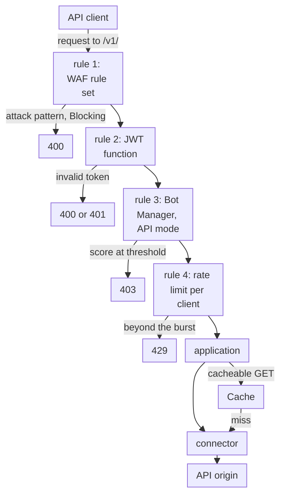

import DocCardGroup from '@aziontech/webkit/doc-card-group'
import DocCard from '@aziontech/webkit/doc-card'

An API or security team exposes public, mobile, or partner APIs from its own gateway, cloud, or data center. It sees scraping, token misuse, credential abuse, and request floods that overload the backend, and every one of those requests reaches the API origin before anything inspects it. This page configures a firewall in front of the API that scores each request with WAF, checks its token, scores automated clients, and caps the rate of each client, and streams the security events to the team's SIEM. The result is measured by the share of abusive requests blocked before the origin, the backend error rate during an attack, and the time from detection to a new block.

This use case does not cover API design or lifecycle management, or account takeover on login flows, which [Block account takeover on login and checkout flows](/en/documentation/use-cases/secure-applications-and-networks/block-account-takeover-on-login-and-checkout-flows/) covers.

## Prerequisites

- An Azion account. If you do not have one, [create an account](https://console.azion.com/signup).
- An application that serves the API through a connector and a workload. To create them, refer to [Applications quickstart](/en/documentation/platform/applications/quickstart/).
- A firewall bound to that workload's deployment, with WAF and Functions turned on in **Main Settings** › **Modules**. To bind it, refer to [Bind a firewall to a workload](/en/documentation/guides/application-security/firewall-and-waf/firewall-protect-your-domain/), and to turn on WAF, refer to [Set a firewall's main settings](/en/documentation/guides/application-security/firewall-and-waf/firewall-configure-main-settings/).
- The JWT function installed from Azion Marketplace. To install it, refer to [How to Install the JWT Integration](/en/documentation/guides/application-development/integrations/jwt/).
- Bot Manager enabled on the account, or Bot Manager Lite installed from Azion Marketplace. To install Bot Manager Lite, refer to [Install Bot Manager Lite](/en/documentation/guides/application-development/integrations/bot-manager-lite/).
- The key ID and secret key pairs your token issuer signs tokens with.

---

## Required products

| The API needs | Which means | Product | Documented in |
| --- | --- | --- | --- |
| Injection and other attack patterns refused before the origin | A WAF rule set that a _Set WAF_ rule applies to the API paths | WAF | [WAF quickstart](/en/documentation/platform/firewall/waf/quickstart/) |
| A request without a valid token refused before the origin | The JWT function, instanced on the firewall and run by a rule on the API paths | Functions | [How to Install the JWT Integration](/en/documentation/guides/application-development/integrations/jwt/) |
| Automated clients scored | A Bot Manager instance, scoring clients that carry no cookies, run by a rule on the API paths | Bot Manager | [Run Bot Manager on selected paths](/en/documentation/guides/application-security/bots-and-network/run-bot-manager-on-selected-paths/) |
| Floods from one client capped | A _Set Rate Limit_ rule that counts requests per client IP address on the API paths | None: built into the firewall | [Apply WAF and a rate limit to one path](/en/documentation/guides/application-security/firewall-and-waf/apply-waf-and-rate-limit-to-one-path/) |
| Safe GET responses answered without the origin | A cache setting applied by an application rule on the cacheable routes | Cache | [Cache settings](/en/documentation/platform/applications/cache/cache-settings/) |
| Security events in the team's SIEM | A stream of the _WAF Events_ data source to the SIEM's endpoint | Data Stream | [Stream WAF events to a SIEM](/en/documentation/guides/application-security/firewall-and-waf/integrate-siems/) |
| Each blocked request explained | The record of the request, found by its `x-azion-request-id` | Real-Time Events | [Find the WAF score of a blocked request](/en/documentation/guides/application-security/firewall-and-waf/how-to-find-waf-score/) |

---

## Reference architecture

This page builds the *API security perimeter*: a firewall on the API's workload that filters each request by rules, tokens, bot scores, and rates before the connector forwards it to the API origin.

Read the diagram at the firewall rules. The connection is already accepted when a request reaches them, so every check acts on a request, not on a client's identity: rules, a token, a bot score, and a rate. Each check acts through the rule that calls it, so the order of the rules is the order of the checks. Only a request that passes them all reaches the application, which answers safe GET requests from Cache and sends the rest to the API origin.

### Dataflow

1. An API client's request to `api.example.com/v1/` reaches the workload. DDoS Protection assesses it before any firewall rule runs, and the firewall bound to the workload then runs its rules in order.
2. The WAF rule set scores the request, its JSON body included. In _Blocking_, a request whose score reaches a threshold receives `400`.
3. The JWT function checks the token the request carries in its `Authorization` header. A request whose token is invalid receives `400` or `401`.
4. The Bot Manager instance scores the client for automation. Once its action is `deny`, a score at the threshold receives `403`.
5. The rate limit counts the requests of each client IP address, and a request beyond the burst receives `429`.
6. A request that passes reaches the application. A cacheable GET response comes from Cache, and every other request reaches the API origin through the connector. Data Stream sends the requests WAF analyzed to the SIEM, and Real-Time Events holds the record of each request, joined to a refusal by its `x-azion-request-id`.

### Platform Resources

- **firewall**: the Platform Resource that is the enforcement point. Its rules run WAF, the functions, and the rate limit per client in the order the rules set, and _Set Rate Limit_ is one of its built-in behaviors.
- **DDoS Protection**: the Feature that mitigates DoS and DDoS attacks on every workload, always on, before any firewall rule runs.
- **WAF**: scores each request against eight threat families and refuses attack patterns in _Blocking_. It parses JSON bodies, so it reads the fields an API receives.
- **Bot Manager**: scores each request for automation. Its `api` mode is documented for clients that carry no cookies, which is how most API clients behave.
- **Functions**: runs the token check on the firewall, such as the JWT function from Azion Marketplace, and any custom check the team writes in the `firewall` execution environment.
- **application**: the Platform Resource that routes the requests the firewall lets through, and decides which responses Cache can answer.
- **Cache**: answers safe GET responses, so repeated reads never reach the API origin.
- **connector**: the Platform Resource that reaches the API origin. Every request that passes the firewall and misses Cache ends at it.
- **Data Stream**: sends the requests WAF analyzed, with their score, matched rules, and action, to an endpoint the SIEM reads.
- **SIEM**: the integration that correlates the API's security events with the team's other sources.
- **Real-Time Events**: holds the record of each request, so a client's report of a refusal can be traced to the rule that decided it.

### Other designs for this use case

- *Mutual TLS perimeter for partner APIs*: serves B2B and partner integrations where every client is known. The workload requires a client certificate signed by a certificate authority the team registers in Certificate Manager, so a caller without a valid certificate is refused during the TLS handshake, before any request exists, and the firewall then applies WAF rules and rate limits per partner.

---

## How the design works

This section explains why each check on the API paths takes its shape and its place in the order: WAF, the token check, Bot Manager, and the rate limit per client.

### WAF on the API paths

The rule set `api-waf` scores the eight threat families at `medium` sensitivity, the level every family starts at. The rule that applies it matches `${request_uri}` _starts with_ `/v1/`, so WAF scores only the API: WAF is billed on the requests it scores, and the rest of the domain needs no API-specific policy. WAF parses a `POST` body sent as `application/json`, so it reads each field of a JSON payload.

The rule starts in _Logging_. API clients send well-formed bodies more often than browsers send unusual ones, yet one integration that sends, for example, an apostrophe in a field turns into `400` errors in _Blocking_. Move the rule to _Blocking_ once 3 days of **Tuning** hold no request that should have been served.

### The token check

The JWT function runs on the firewall, so a request without a valid token is refused before it reaches the API origin, and the origin never contacts an authenticator for it. The token travels in the request's `Authorization` header, in the Bearer scheme. The instance's arguments carry the key ID and secret key pairs your token issuer signs with, so the function can verify a signature without calling the issuer. The JWT integration is configured in Azion Console.

A route your API serves without a token needs its own path outside `/v1/`, or a criterion that excludes it from this rule.

### Bot Manager for API clients

API clients carry no cookies, so the instance sets `mode` to `api`, which Bot Manager documents for web services and API traffic without cookies. Bot Manager Lite documents no `mode`, and its function ignores the key. The instance starts in observation mode: `action` is `allow` and `internal_logs` is `2`, so every request is scored, served, and written to the report log. `threshold` is `15`, the starting point [Firewall best practices](/en/documentation/platform/firewall/best-practices/#run-a-stricter-bot-manager-instance-on-a-high-value-path) give for API endpoints, and while `action` is `allow` it only sets the `classified` label of each line. `log_tag` is `api-bots`, so each line names this instance.

An API client cannot answer a challenge, so `deny` fits these paths better than `redirect`.

### The rate limit per client

The rate limit counts requests per client IP address on `/v1/`, at `10` requests per second with a burst of `10`. Requests over the rate are queued and released at the rate, and only simultaneous requests beyond the burst receive `429`. A burst of ten times the rate at most keeps the queue at 10 seconds of traffic, so a legitimate client's peak is delayed rather than refused. Set `average_rate_limit` from the request rate your heaviest legitimate client sends.

The API paths already carry a _Set WAF_ rule, and the token and Bot Manager rules must run before the limit, so _Set Rate Limit_ goes in a rule of its own.

The rate applies in each data center, and no response carries a rate-limit header, so a client has no signal of how long to wait.

---

## Measuring results

| Metric | Where to read it | What working looks like |
| --- | --- | --- |
| Share of abusive requests blocked before the origin | The requests to `api.example.com` answered `400`, `401`, `403`, or `429`, against all its requests, in the HTTP Requests data source of [Real-Time Events](/en/documentation/platform/real-time-events/data-sources/#http-requests), and **WAF Threat Requests by Host** on the [WAF dashboard](/en/documentation/platform/real-time-metrics/secure-dashboards/#waf) | The share rises during an attack while the requests that reach the origin stay at their usual level |
| Backend error rate during an attack | The `Upstream Status` of each request in the HTTP Requests data source, which holds the origin's status code | Origin `5xx` answers stay at their usual rate while the refused requests rise |
| Time from detection to a new block | The time from saving a change to the answer holding at a repeated request, as in [Wait for a change to propagate](/en/documentation/platform/firewall/best-practices/#wait-for-a-change-to-propagate-before-you-judge-it) | A change to an existing instance's arguments holds in about 105 seconds, and a new rule in 6 to 10 minutes |

---

## Best practices

- **Match the API paths, not the query string.** `${request_uri}` _starts with_ `/v1/` matches every API request, with or without a query string. `${request_args}` _matches_ `.*` skips every `POST` whose payload sits in the body, which on an API is most of them.
- **Send well-formed JSON with a matching content type.** In _Blocking_, WAF refuses a `POST` with a missing or unparsed `Content-Type`, a JSON body that does not parse, or a body over 131,072 bytes, each with `400`. A client bug then looks like an attack. For the formats WAF parses, refer to [Request body parsing](/en/documentation/platform/firewall/waf/scoring-and-modes/#request-body-parsing).
- **Write `threshold` and `action` on every Bot Manager instance.** Bot Manager Lite ships `deny` at `30`, and Bot Manager documents `allow` at `Infinity`, so an instance that sets neither refuses requests on one edition and passes them on the other.
- **Deny API clients rather than redirect them.** A redirect sends the client to a challenge a person solves, and an API consumer, a health check, or a monitor cannot solve it.
- **Keep the burst within ten times the rate.** A burst smaller than your clients' peaks refuses legitimate concurrent requests, and a larger one delays the last of them longer. For the reasoning, refer to [Keep a rate limit's burst within ten times its average rate](/en/documentation/platform/firewall/best-practices/#keep-a-rate-limits-burst-within-ten-times-its-average-rate).

---

## Guides in this use case

<DocCardGroup cols={2}>
  <DocCard title="Create a rule set at medium sensitivity" href="/en/documentation/guides/application-security/firewall-and-waf/rule-set-medium/" label="Create api-waf with every threat family at medium." />
  <DocCard title="Apply a rule set to every request" href="/en/documentation/guides/application-security/firewall-and-waf/apply-rule-set/" label="Apply api-waf in Logging to the API paths, and send the injection-shaped request that checks it." />
  <DocCard title="Switch a rule set to blocking" href="/en/documentation/guides/application-security/firewall-and-waf/switch-to-blocking/" label="Move the api-waf rule to Blocking once Tuning holds no request that should have been served." />
  <DocCard title="Install the JWT integration" href="/en/documentation/guides/application-development/integrations/jwt/" label="Create the api-jwt instance and the rule that checks the token on every request to the API paths." />
  <DocCard title="Refuse requests above the threshold" href="/en/documentation/guides/application-security/bots-and-network/refuse-above-threshold/" label="Move api-bots from allow to deny once the observation window closes." />
  <DocCard title="Change the order of firewall rules" href="/en/documentation/guides/application-security/bots-and-network/change-the-order-of-firewall-rules/" label="Keep the rate limit in the last position on the API paths, after the WAF, token, and Bot Manager rules." />
  <DocCard title="Check the cache status of a response" href="/en/documentation/guides/application-performance/cache-and-purge/check-page-cache-time/" label="Read the x-cache header that shows a cacheable response answered without the API origin." />
  <DocCard title="Run Bot Manager on selected paths" href="/en/documentation/guides/application-security/bots-and-network/run-bot-manager-on-selected-paths/" label="Create the API-mode instance and the rule that scores every request to the API paths." />
  <DocCard title="Apply WAF and a rate limit to one path" href="/en/documentation/guides/application-security/firewall-and-waf/apply-waf-and-rate-limit-to-one-path/" label="Create the rule that caps each client IP address on the API paths, in its own rule after the other checks." />
  <DocCard title="Stream WAF events to a SIEM" href="/en/documentation/guides/application-security/firewall-and-waf/integrate-siems/" label="Stream the WAF events of the API paths to the team's SIEM, and confirm that the SIEM's endpoint accepts each batch." />
</DocCardGroup>
