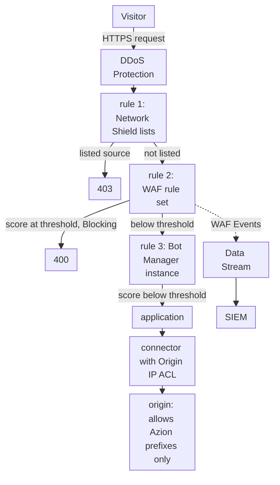

import DocCardGroup from '@aziontech/webkit/doc-card-group'
import DocCard from '@aziontech/webkit/doc-card'

A security team protects a customer-facing web application that runs on its own origin, often behind a standalone WAF, appliances, or separate bot and DDoS vendors. Each of those tools holds its own policy, and the origin still answers anyone who finds its address. This page configures one firewall in front of the application, which refuses listed networks, scores every request with WAF and Bot Manager, and lets the origin accept connections from Azion only. The result is measured by the attacks blocked before the origin, the false-positive rate on legitimate traffic, and the time to change a policy.

This use case does not cover API-specific abuse, which [Protect public APIs from abuse](/en/documentation/use-cases/secure-applications-and-networks/protect-public-apis-from-abuse/) covers, or account takeover, which [Block account takeover on login and checkout flows](/en/documentation/use-cases/secure-applications-and-networks/block-account-takeover-on-login-and-checkout-flows/) covers.

## Prerequisites

- An Azion account. If you do not have one, [create an account](https://console.azion.com/signup).
- An application that serves the web application through a connector and a workload. To create them, refer to [Applications quickstart](/en/documentation/platform/applications/quickstart/).
- A firewall bound to that workload's deployment. To bind one, refer to [Bind a firewall to a workload](/en/documentation/guides/application-security/firewall-and-waf/firewall-protect-your-domain/).
- WAF and Functions turned on in the firewall's **Main Settings** › **Modules**. A new firewall carries WAF off. To turn it on, refer to [Set a firewall's main settings](/en/documentation/guides/application-security/firewall-and-waf/firewall-configure-main-settings/).
- Bot Manager Lite installed from Azion Marketplace, or Bot Manager enabled on the account. To install Bot Manager Lite, refer to [Install Bot Manager Lite](/en/documentation/guides/application-development/integrations/bot-manager-lite/).
- Access to the firewall of your origin, where the allowlist of Azion's addresses goes.

---

## Required products

| The application needs | Which means | Product | Documented in |
| --- | --- | --- | --- |
| Sources the team already distrusts refused before any inspection | A network list that a deny rule reads through the _Network_ criterion | Network Shield | [Network Lists](/en/documentation/platform/firewall/network-shield/network-lists/) |
| Requests that carry OWASP Top 10 attack patterns refused before the origin | A WAF rule set that a rule's _Set WAF_ behavior applies to every request | WAF | [WAF quickstart](/en/documentation/platform/firewall/waf/quickstart/) |
| Automated clients told apart from people | A Bot Manager function instance that a _Run Function_ rule runs on every page request | Bot Manager | [Run Bot Manager on selected paths](/en/documentation/guides/application-security/bots-and-network/run-bot-manager-on-selected-paths/) |
| An origin that accepts connections only from Azion | Origin IP ACL on the connector, and the `Azion Origin Shield` prefixes allowed at the origin's firewall | Origin Shield | [Restrict an origin to Azion with Origin IP ACL](/en/documentation/guides/application-security/bots-and-network/restrict-an-origin-to-azion-with-origin-ip-acl/) |
| Security events in the team's SIEM | A stream of the _WAF Events_ data source to the SIEM's endpoint | Data Stream | [Stream WAF events to a SIEM](/en/documentation/guides/application-security/firewall-and-waf/integrate-siems/) |
| Each block explained, request by request | The WAF fields of the request's record, found by its `x-azion-request-id` | Real-Time Events | [Find the WAF score of a blocked request](/en/documentation/guides/application-security/firewall-and-waf/how-to-find-waf-score/) |

DDoS Protection mitigates DoS and DDoS attacks on every workload, before any firewall rule runs, with nothing to create or configure. For the attack types it covers, refer to [Attack mitigation](/en/documentation/platform/workloads/ddos-protection/ddos-mitigation/).

---

## Reference architecture

This page builds the *Web application and API protection (WAAP) perimeter*: one firewall policy in front of the workload, with the origin closed to every other path.

Read the diagram from top to bottom. DDoS Protection acts before any rule, and the firewall's rules then decide each request in order. Network Shield, WAF, and Bot Manager each act only through the rule that calls them, so the order of those rules is the order of the policy. Every request that passes ends at one connector, and the origin's own firewall closes every other path to it. The dotted edge carries records, not requests: the WAF events leave for the SIEM through Data Stream.

### Dataflow

1. A visitor's request reaches the workload on `www.example.com`. DDoS Protection assesses it first, and the firewall bound to the workload takes it next.
2. The first rule compares the client address with the team's network list and with the Tor exit node list. A listed client receives `403`, and no later rule runs.
3. The second rule hands the request to the WAF rule set. In _Blocking_, a request whose score reaches a family's threshold receives `400`.
4. The third rule runs the Bot Manager instance on every request that is not a static asset. A score at the threshold runs the instance's action.
5. A request that no rule stops reaches the application, which forwards it to the origin through the connector. The origin's firewall accepts the connection because it comes from an `Azion Origin Shield` prefix, and refuses connections from anywhere else.
6. Data Stream sends each request WAF analyzed to the SIEM. Real-Time Events keeps the record of each request for investigation, joined to a refusal by its `x-azion-request-id`.

### Platform Resources

- **firewall**: the Platform Resource that enforces the policy. A workload's deployment names it, and it runs its rules on every request to that workload before the application sees it.
- **DDoS Protection**: the Feature that mitigates DoS and DDoS attacks on every workload, always on and with nothing to configure. It acts before any firewall rule.
- **WAF**: scores each request a _Set WAF_ rule hands it against eight threat families, and refuses the request in _Blocking_ mode when a score reaches its threshold. It filters OWASP Top 10 and other attack patterns.
- **Bot Manager**: scores each request a _Run Function_ rule hands it for signs of automation, and runs the action its instance sets once the score reaches the threshold.
- **Network Shield**: adds the _Network_ criterion, which matches the client address against a list of addresses, ASNs, or countries. It refuses known-bad sources before WAF and Bot Manager score them.
- **application**: the Platform Resource that delivers the requests the firewall lets through, and forwards them to the origin.
- **connector**: the Platform Resource that reaches the origin. Every request that passes the policy ends at it.
- **Origin Shield**: Origin IP ACL on the connector publishes the `Azion Origin Shield` list of Azion's prefixes, which the origin's firewall allows while it refuses every other source. No client can then reach the origin around the policy.
- **Data Stream**: sends the requests WAF analyzed, with their score, matched rules, and action, to an endpoint the SIEM reads.
- **SIEM**: the integration that correlates the firewall's events with the team's other security sources.
- **Real-Time Events**: holds the record of each request, with its WAF fields, so a block can be explained from the request ID its client reports.

---

## How the design works

This section explains why each part of the firewall policy takes its shape: the network blocks, the WAF rule set, Bot Manager scoring, and origin allowlisting.

### The network blocks

The network rule runs first, so a source the team already distrusts is refused before WAF and Bot Manager score it. WAF is billed on the requests it scores, and Bot Manager on the requests it evaluates, so a request this rule denies costs neither. The rule reads two lists. `webapp-blocked-addresses` holds the addresses your team blocks. `Azion IP Tor Exit Nodes`, list `2`, is maintained by Azion, so the rule also matches the exit nodes Azion adds later.

The behavior is _Deny (403 Forbidden)_ rather than _Drop_. A denied visitor sees a page with a request ID that a person blocked by mistake can report. Once the list refuses only the clients you expect, you can switch to _Drop (Close Without Response)_.

### The WAF rule set

The rule set `webapp-waf` scores each request against the eight threat families at `medium` sensitivity, the level every family starts at. The rule that applies it matches `${request_uri}` _starts with_ `/`, which matches every request. A criterion on the query string would skip every `POST` that carries its payload in the body.

The rule starts in _Logging_. A request that reaches a threshold is recorded and still served, and those records are the only description of your traffic as the rule set sees it. Move the rule to _Blocking_ once 3 days of **Tuning** hold no request that should have been served.

### Bot Manager scoring

The Bot Manager instance starts in observation mode: `action` is `allow`, so it refuses nothing, and `internal_logs` is `2`, so every request writes a report line. Run it for 24 to 72 hours, long enough to cover peak hours, weekly crawlers, and overnight jobs. `threshold` is `18`, the value Bot Manager documents to start from. While `action` is `allow`, the threshold only sets the `classified` label of each line. `log_tag` is `webapp-observe`, so each line names this instance.

The rule that runs the instance excludes static assets, because an image or a stylesheet is not a client, and each one is a request Bot Manager bills. It names no path, so every other request of the application is scored.

### Origin allowlisting

Origin IP ACL on the connector gives the account the `Azion Origin Shield` network list, which holds every IPv4 and IPv6 prefix that Azion's infrastructure uses to connect to origins. Your origin's firewall then allows those prefixes and denies every other source, so a client that connects to the origin's address directly never reaches the application around the firewall policy above.

---

## Measuring results

| Metric | Where to read it | What working looks like |
| --- | --- | --- |
| Attacks blocked before the origin | **Threats vs Requests** on the WAF dashboard of Real-Time Metrics, which splits analyzed requests into blocked threats, logged threats, and allowed requests. Refer to [Secure dashboards](/en/documentation/platform/real-time-metrics/secure-dashboards/#waf) | After the switch to _Blocking_, the threats the rule set finds appear as blocked rather than logged |
| False-positive rate on legitimate traffic | The **Tuning** tab of `webapp-waf`, which lists the requests that reached a threshold over the last 3 days. Refer to [Tuning](/en/documentation/platform/firewall/waf/scoring-and-modes/#tuning) | No request you recognize as legitimate, and no exception older than the request that produced it |
| Time to change a policy | The time from saving a change to the answer holding at a repeated request, as in [Wait for a change to propagate](/en/documentation/platform/firewall/best-practices/#wait-for-a-change-to-propagate-before-you-judge-it) | A list change holds in about 100 seconds, and a new rule in 6 to 10 minutes |

---

## Best practices

- **Put the network rule first.** The firewall runs its rules in order, and no later rule runs for a request a deny stops. A listed source then never reaches WAF or Bot Manager, which both bill on the requests they see. For rule order, refer to [How Firewall works](/en/documentation/platform/firewall/how-it-works/#rule-order).
- **Change a list, not a rule, for a source that changes often.** A change to a list's items reaches traffic in about 100 seconds, a new rule in 6 to 10 minutes, and the list adds nothing to the rules your plan includes per firewall.
- **Keep the WAF rule's criterion on the request URI.** `${request_args}` _matches_ `.*` reads as every request and skips every request without a query string. `${request_uri}` _starts with_ `/` matches them all, as in [Match the request, not its query string](/en/documentation/platform/firewall/best-practices/#match-the-request-not-its-query-string).
- **Raise one threat family at a time.** Raising several families at once produces false positives together, with nothing to say which raise produced which block. For the steps, refer to [Raise the sensitivity of one threat family](/en/documentation/guides/application-security/firewall-and-waf/raise-one-threat-family/).
- **Keep IPv6 in the origin allowlist, and update it within 7 days.** The list carries IPv6 prefixes for every data center, and the servers behind a new prefix go into production 7 days after Azion publishes it. An allowlist that misses either refuses connections Azion opens. For the update, refer to [List updates](/en/documentation/platform/connectors/origin-shield/origin-ip-acl-and-hmac/#list-updates).

---

## Guides in this use case

<DocCardGroup cols={2}>
  <DocCard title="Block requests by IP, ASN, or country" href="/en/documentation/guides/application-security/bots-and-network/blocklists-ip-addresses-edge/" label="Create webapp-blocked-addresses and the deny rule that reads it, and confirm that a listed client receives 403." />
  <DocCard title="Create a rule set at medium sensitivity" href="/en/documentation/guides/application-security/firewall-and-waf/rule-set-medium/" label="Create webapp-waf with every threat family at medium." />
  <DocCard title="Apply a rule set to every request" href="/en/documentation/guides/application-security/firewall-and-waf/apply-rule-set/" label="Apply webapp-waf in Logging to every request, and send the injection-shaped request that checks it." />
  <DocCard title="Tune a WAF rule set" href="/en/documentation/guides/application-security/firewall-and-waf/tune-waf/" label="Read the records Logging produces, and turn a false positive into an exception." />
  <DocCard title="Switch a rule set to blocking" href="/en/documentation/guides/application-security/firewall-and-waf/switch-to-blocking/" label="Move the webapp-waf rule to Blocking once Tuning holds no request that should have been served." />
  <DocCard title="Monitor and calibrate Bot Manager" href="/en/documentation/guides/application-security/bots-and-network/monitor-and-calibrate-bot-manager/" label="Read the scores of the observation window, then set the threshold and the deny action." />
  <DocCard title="Find the WAF score of a blocked request" href="/en/documentation/guides/application-security/firewall-and-waf/how-to-find-waf-score/" label="Find a refused request by its x-azion-request-id, with the internal rules that matched." />
  <DocCard title="Run Bot Manager on selected paths" href="/en/documentation/guides/application-security/bots-and-network/run-bot-manager-on-selected-paths/" label="Create the observation instance and the rule that scores every request except static assets." />
  <DocCard title="Restrict an origin to Azion with Origin IP ACL" href="/en/documentation/guides/application-security/bots-and-network/restrict-an-origin-to-azion-with-origin-ip-acl/" label="Publish the Azion Origin Shield prefixes and allow only them at the origin's firewall." />
  <DocCard title="Stream WAF events to a SIEM" href="/en/documentation/guides/application-security/firewall-and-waf/integrate-siems/" label="Stream the WAF events to the team's SIEM, and confirm that the SIEM's endpoint accepts each batch." />
</DocCardGroup>
