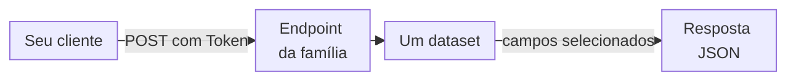

import DocButton from '~/components/webkit/DocButton.vue'
import DocCardGroup from '@aziontech/webkit/doc-card-group'
import DocCard from '@aziontech/webkit/doc-card'

GraphQL é uma linguagem de query para APIs. Um cliente envia uma query que nomeia os registros que deseja e os campos de cada registro, e o servidor retorna um objeto JSON com a mesma forma da query. O cliente escolhe os campos, então uma resposta não traz nada que o cliente não pediu, e uma pergunta diferente exige uma query diferente, não um endpoint diferente.

A **GraphQL API** lê os dados de métricas, eventos, faturamento, contabilização e consumo da sua conta Azion, com um endpoint por família de dados em `https://api.azion.com/v4`. Qualquer cliente que envie um `POST` HTTP com um corpo JSON e um personal token pode chamá-la. Use a GraphQL API para criar gráficos de tendências de requisições, ranquear os endereços IP, URIs ou user agents por trás do seu tráfego, investigar requisições bloqueadas ou ler suas faturas e o uso dos seus produtos.

<DocButton href="/pt-br/documentacao/devtools/graphql/primeiros-passos/" label="Primeiros passos" size="medium" />
<DocButton href="/pt-br/documentacao/devtools/graphql/visao-geral/" label="Veja como funciona" kind="secondary" size="medium" />

---

## Estrutura de uma query

Uma query nomeia um dataset, os argumentos que o filtram, agrupam e ordenam, e os campos a retornar. Esta query soma as requisições dos seus workloads por intervalo de tempo em uma janela de sete dias, das mais recentes para as mais antigas:

```graphql
query {
  workloadMetrics(
    limit: 5
    filter: { tsRange: {begin: "2026-09-26T14:00:00", end: "2026-10-03T14:00:00"} }
    aggregate: { sum: requests }
    groupBy: [ts]
    orderBy: [ts_DESC]
  ) {
    ts
    sum
  }
}
```

O endpoint de métricas retorna HTTP `200` e cinco linhas. A resposta abaixo está cortada após a terceira linha:

```json
{
  "data": {
    "workloadMetrics": [
      {
        "ts": "2026-10-03T13:00:00Z",
        "sum": 2
      },
      {
        "ts": "2026-10-03T12:00:00Z",
        "sum": 2
      },
      {
        "ts": "2026-10-03T03:00:00Z",
        "sum": 2
      },
      …
    ]
  }
}
```

- `workloadMetrics` é o dataset, a tabela de onde vêm as linhas. Ele é servido pelo endpoint de métricas, `https://api.azion.com/v4/metrics/graphql`.
- `filter` leva a janela de tempo em `tsRange`. Datasets de métricas, eventos e consumo recusam uma query sem ela.
- `aggregate: { sum: requests }` e `groupBy: [ts]` somam `requests` por intervalo de tempo, e o campo de resultado se chama `sum`, como a função.
- `limit` limita as linhas a cinco. Sem ele, uma query retorna 10 linhas.

Se você já escreveu uma query GraphQL, a sintaxe é a mesma. A única diferença é uma query recusada: ela retorna um objeto JSON com uma chave `detail`, não um array `errors` do GraphQL.

---

## Endpoints e datasets

A GraphQL API não é um único endpoint. São cinco APIs, cada uma com seu próprio endpoint e schema, e uma query vai para o endpoint que serve o dataset dela:



1. Seu cliente envia a query em uma requisição `POST`, com o header `Authorization: Token [TOKEN VALUE]` e o valor de um personal token.
2. A requisição vai para o endpoint da família de dados que a query lê. Uma query no dataset de eventos `workloadEvents` enviada ao endpoint de métricas retorna `400`.
3. O endpoint seleciona as linhas do dataset que a query nomeia, filtradas, agrupadas e ordenadas pelos argumentos dela.
4. A resposta contém um array por dataset sob a chave `data`, com um objeto por linha e apenas os campos que a query selecionou.

Cada endpoint serve uma família de dados:

| API | Endpoint | Dados |
| --- | --- | --- |
| Metrics | `https://api.azion.com/v4/metrics/graphql` | Dados de requisições do [Real-Time Metrics](/pt-br/documentacao/plataforma/real-time-metrics/), agregados em intervalos de tempo |
| Events | `https://api.azion.com/v4/events/graphql` | Registros brutos do [Real-Time Events](/pt-br/documentacao/plataforma/real-time-events/), um por requisição ou evento |
| Billing | `https://api.azion.com/v4/billing/graphql` | Faturas, lançamentos financeiros e pagamentos |
| Accounting | `https://api.azion.com/v4/accounting/graphql` | Os produtos e as métricas contabilizados na conta |
| Consumption | `https://api.azion.com/v4/consumption/graphql` | Uso de produtos por workload, como dados contabilizados |

Para os datasets, a resolução de tempo e a retenção por trás de cada endpoint, consulte [Como a GraphQL API funciona](/pt-br/documentacao/devtools/graphql/visao-geral/).

---

## Escopo e limites

- **Somente leitura**: a GraphQL API responde a queries. Ela não tem mutations, e nenhuma query altera a sua conta.
- **Autenticação**: toda requisição leva `Authorization: Token [TOKEN VALUE]`. Um header `Bearer` é recusado como um header ausente, com `401` e `Authentication credentials were not provided.` Para criar um token, consulte [Personal tokens](/pt-br/documentacao/guias/plataforma/conta-e-billing/personal-tokens/).
- **Clientes**: o [GraphiQL Playground](/pt-br/documentacao/devtools/graphql/playground-graphql/) é um editor no navegador servido em cada URL de endpoint para uma sessão do Azion Console com login feito. `curl` ou qualquer cliente HTTP envia a query como um corpo JSON, e [Execute queries GraphQL no Postman](/pt-br/documentacao/guias/plataforma/observabilidade/consultar-graphql-postman/) cobre o Postman. O repositório [aziontech/azion-queries](https://github.com/aziontech/azion-queries) contém exemplos de query para adaptar.
- **Datasets e campos**: [Datasets e argumentos de query](/pt-br/documentacao/devtools/graphql/recursos/) lista os datasets de cada endpoint e os argumentos que eles compartilham. Os campos de cada dataset estão em [Campos de Real-Time Metrics](/pt-br/documentacao/devtools/graphql/campos-gql-real-time-metrics/), [Campos de Real-Time Events](/pt-br/documentacao/devtools/graphql/campos-gql-real-time-events/), [Campos de Billing](/pt-br/documentacao/devtools/graphql/campos-gql-billing/), [Campos de Accounting](/pt-br/documentacao/devtools/graphql/campos-gql-accounting/) e [Campos de Consumption](/pt-br/documentacao/devtools/graphql/campos-gql-consumption/). [Queries](/pt-br/documentacao/devtools/graphql/queries/) mostra uma query de dados brutos, uma agregada, uma financeira e uma de uso, cada uma com a sua resposta.
- **Limites**: uma query retorna até 10.000 linhas e seleciona até 37 campos em um dataset de métricas, ou 36 em `workloadEvents`. Datasets de eventos mantêm registros por cerca de 7 dias. Além de um limite de linhas ou de campos, a query retorna `400`, e [Limites da GraphQL API](/pt-br/documentacao/devtools/graphql/limites/) lista todos os limites.
- **Erros**: todo erro é um código de status com um corpo JSON que contém uma chave `detail`. [Respostas de erro](/pt-br/documentacao/devtools/graphql/mensagens-erro/) lista cada mensagem e a sua causa, e [Solucionar problemas da GraphQL API](/pt-br/documentacao/devtools/graphql/solucao-de-problemas/) dá a causa e a correção de cada sintoma.
- **Termos**: o [Glossário](/pt-br/documentacao/devtools/graphql/glossario/) define os termos que estas páginas usam, como dataset, dados brutos e adaptive resolver.

---

## Próximos passos

<DocCardGroup cols={2}>
  <DocCard title="Primeiros passos com a GraphQL API" href="/pt-br/documentacao/devtools/graphql/primeiros-passos/" label="Crie um token e execute sua primeira query." />
  <DocCard title="Como a GraphQL API funciona" href="/pt-br/documentacao/devtools/graphql/visao-geral/" label="Siga uma query do endpoint até as linhas que ela retorna." />
  <DocCard title="Queries" href="/pt-br/documentacao/devtools/graphql/queries/" label="Comece com uma query que funciona para dados brutos, agregados, financeiros ou de uso." />
  <DocCard title="Guias e tutoriais da GraphQL API" href="/pt-br/documentacao/devtools/graphql/guias/" label="Ranqueie as principais URIs, encontre os principais ataques ou conclua outra tarefa." />
</DocCardGroup>
