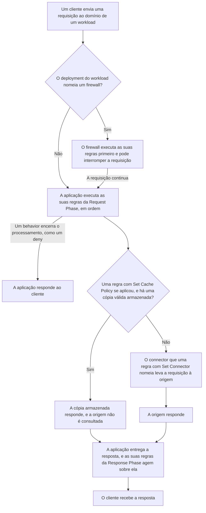
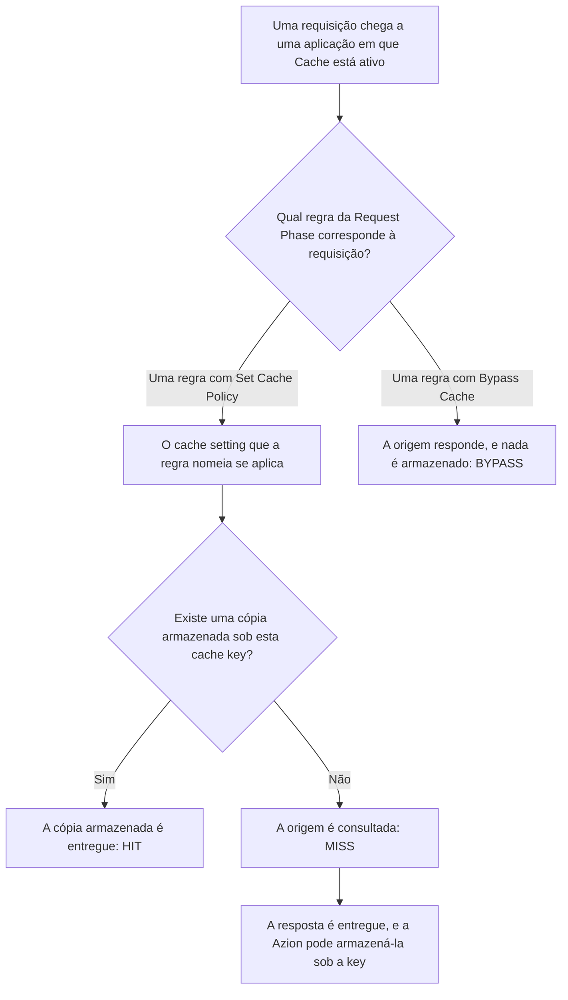
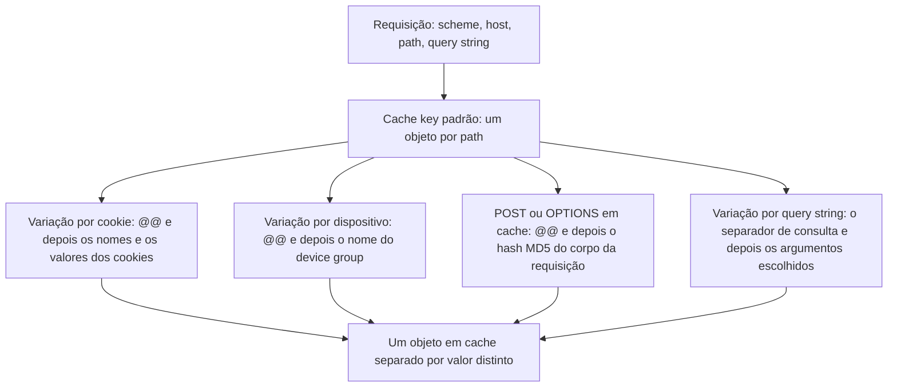
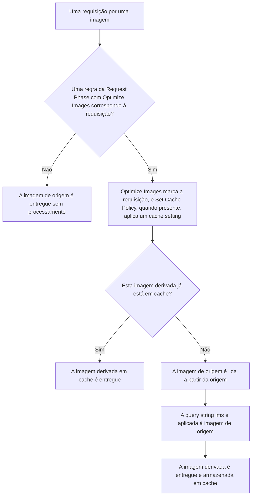

import FrameBox from '@aziontech/webkit/frame-box'
import ItemList from '@aziontech/webkit/item-list'
import DocItem from '@aziontech/webkit/doc-item'

Uma requisição por uma página, um arquivo ou uma rota de API não precisa percorrer todo o caminho até o servidor que guarda o conteúdo. Uma camada na frente desse servidor pode ler a requisição primeiro e decidir o que acontece com ela. Essa camada pode responder a partir de uma cópia que armazenou antes, adicionar ou remover um header, ou escolher qual servidor recebe a requisição. No caminho de volta, a mesma camada pode alterar a resposta antes que o cliente a veja.

Na Azion, essa camada é uma [aplicação](/pt-br/documentacao/plataforma/applications/), uma instância do recurso da plataforma Applications. Um [workload](/pt-br/documentacao/plataforma/workloads/) recebe a requisição no seu domínio, e o deployment do workload nomeia a aplicação que a trata. A aplicação decide por meio das suas regras, escritas em [Rules Engine para Applications](/pt-br/documentacao/plataforma/applications/rules-engine/), em duas fases. As regras da Request Phase agem sobre a requisição, e as regras da Response Phase agem sobre a resposta entregue ao usuário. Uma regra cujo behavior _Set Connector_ nomeia um [connector](/pt-br/documentacao/plataforma/connectors/) envia a requisição à origem.

Três Produtos habilitados em uma aplicação agem ao longo desse caminho. Cache responde a partir de uma cópia armazenada, e Application Accelerator coloca mais da requisição na key que encontra essa cópia. Image Processor constrói uma imagem redimensionada ou convertida a partir da imagem que está na origem.

Esta página cobre os mecanismos, não os campos: cada variável, operador e behavior está em Rules Engine para Applications, e cada limite está em [Limites de Applications](/pt-br/documentacao/plataforma/applications/limites/). As seções seguem o caminho que uma requisição percorre, as duas fases, como as regras são executadas, o que uma aplicação nova tem e a propagação. Cache, Application Accelerator e Image Processor fecham a página, nessa ordem. Uma conexão WebSocket, que uma aplicação encaminha por proxy até a origem, tem uma página própria: [WebSocket Proxy](/pt-br/documentacao/plataforma/applications/websocket/).

---

## O caminho que uma requisição percorre

Uma aplicação não trata nenhuma requisição até que um workload a nomeie. O vínculo fica no deployment do workload, não na aplicação. No Azion Console, ele é o campo **Application** das **Deployment Settings** do workload, e `azion create workload-deployment` o recebe como `--application-id`. O mesmo deployment pode nomear um [firewall](/pt-br/documentacao/plataforma/firewall/), e uma requisição então atravessa o firewall antes de chegar à aplicação. Domínios, protocolos e certificados também pertencem ao workload, então uma aplicação não carrega configurações de entrega próprias.

O registro da aplicação também não nomeia nenhuma origem. Uma aplicação criada pela API somente com `name` e `active` retorna os seus campos `modules`, `active` e `debug`, e nada que aponte para um servidor. Uma requisição chega a uma origem porque uma regra a envia para lá: uma regra da Request Phase cujo behavior _Set Connector_ nomeia um connector. O connector guarda o endereço da origem. Azion Console informa que as origens foram redesenhadas como connectors.

Este diagrama acompanha uma requisição, do workload que ela alcança até a resposta que o cliente recebe:



1. Um cliente envia uma requisição ao domínio de um workload. Quando o deployment do workload nomeia um firewall, o firewall executa as suas regras primeiro e pode interromper a requisição nesse ponto.
2. A aplicação que o deployment nomeia executa as suas regras da Request Phase, em ordem. Um behavior que encerra o processamento, como _Deny (403 Forbidden)_, responde ao cliente, e nada depois dele é executado.
3. Quando uma regra com _Set Cache Policy_ aplicou um cache setting e há uma cópia válida armazenada, a cópia responde, e a origem não é consultada.
4. Caso contrário, o connector que uma regra com _Set Connector_ nomeia leva a requisição à origem, e a origem responde.
5. A aplicação entrega a resposta, as suas regras da Response Phase agem sobre ela e o cliente a recebe.

Escolher a origem por requisição é o que permite que uma aplicação envie `/api/` para um servidor e todos os outros paths para outro, com duas regras e dois connectors. O preço é que nada chega a uma origem por padrão. Sem nenhuma regra que nomeie um connector, uma aplicação não tem origem para onde enviar uma requisição, e uma aplicação nova não tem regras. Para a primeira regra que envia as requisições de uma aplicação a uma origem, consulte [Primeiros passos com Applications](/pt-br/documentacao/plataforma/applications/primeiros-passos/).

---

## Fases de requisição e de resposta

Cada regra de uma aplicação pertence a uma de duas fases, e a aplicação as executa em uma sequência fixa. As regras da Request Phase são executadas quando a requisição chega, antes que a aplicação tenha uma resposta sobre a qual trabalhar. As regras da Response Phase são executadas quando a aplicação entrega a resposta ao usuário, e cada entrega é tratada separadamente. A fase é escolhida na seção **Phase** quando a regra é criada, e não pode ser alterada depois. Para executar a mesma lógica na outra fase, você cria uma regra nova nela.

O que cada fase pode ler decorre dessa sequência. Uma regra da Request Phase lê o que a requisição carrega, como a URI, os headers e os cookies dela, mas nada sobre a resposta, que ainda não existe. Uma regra da Response Phase também pode ler o que voltou, como `${status}` e os headers que a origem enviou. Cada fase também oferece o seu próprio conjunto de behaviors: _Set Connector_, _Set Cache Policy_, _Bypass Cache_ e _Optimize Images_ são executados somente na Request Phase.

O cache é decidido na Request Phase. Uma regra com _Set Cache Policy_ escolhe o cache setting da requisição, e uma regra com _Bypass Cache_ envia a requisição para fora do cache. A resposta é desconhecida nesse ponto, então uma regra não pode escolher um cache setting a partir do status code que a origem retorna: `${status}` só pode ser lido na Response Phase, e _Set Cache Policy_ só é executado na Request Phase.

Alguns behaviors funcionam nas duas fases e mudam de alvo conforme a fase. _Add Request Header_ adiciona um header à requisição enviada à origem, e o mesmo behavior em uma regra da Response Phase o adiciona à resposta enviada ao usuário. _Redirect To_ em uma regra da Response Phase só é executado quando a origem retorna `404`. Por exemplo, um redirecionamento na Response Phase pode enviar o usuário a outra página quando a origem não tem nada no path, enquanto uma requisição para um path que existe passa sem alteração. _Run Function_ também funciona nas duas fases, e o formulário de instância de função no Azion Console informa o limite da segunda: `Only Lua functions can be used in the Response phase.` Para as variáveis e os behaviors que cada fase aceita, consulte [Fases](/pt-br/documentacao/plataforma/applications/rules-engine/#fases).

---

## Como as regras são executadas

Dentro de uma fase, uma aplicação executa as suas regras na ordem delas. Cada regra compara os seus critérios com a requisição, e uma regra cujos critérios correspondem executa os seus behaviors na ordem em que estão dispostos. Uma regra cujos critérios não correspondem não executa nada, e a aplicação passa para a regra seguinte. A aplicação continua até que todas as regras da fase sejam executadas ou até que um behavior encerre o processamento. Para as variáveis, os operadores e os condicionais que os critérios combinam, consulte [Rules Engine para Applications](/pt-br/documentacao/plataforma/applications/rules-engine/#criterios).

Cada regra carrega um `order`, que a plataforma atribui conforme as regras são criadas, começando em `0` para a primeira regra de uma fase. A lista do **Rules Engine** no Azion Console pode ser reordenada, e a API reordena uma fase com uma única chamada. Alguns behaviors não podem ser adicionados juntos à mesma regra, ou só podem sob certas condições, e o Console recusa essas combinações.

### Behaviors que se repetem

Várias regras que correspondem à requisição podem carregar o mesmo behavior, e o tipo do behavior decide o que acontece. Um behavior do tipo Set, como _Set Connector_, não se acumula: só é executado o da última regra cujos critérios corresponderam. Por exemplo, considere uma regra que nomeia um connector para todos os paths, seguida de uma regra que nomeia outro connector para `/api/`. Uma requisição para `/api/` corresponde às duas e passa pelo connector da segunda regra.

Já um behavior do tipo Add se acumula. _Add Cookie_ e _Add Request Header_ são executados uma vez para cada regra que os carrega, então o mesmo nome e o mesmo valor adicionados por duas regras chegam como duas entradas idênticas.

A ordem das regras decide, portanto, o resultado tanto quanto as próprias regras. Uma regra ampla no início da lista define um padrão, e uma regra restrita mais adiante na lista o substitui para as requisições que correspondem a ela. O custo é que reordenar a lista pode mudar o connector que um path alcança, sem nenhuma alteração em nenhuma regra.

### Behaviors que encerram o processamento

Alguns behaviors finalizam o processamento da requisição, e nenhum behavior ou regra depois deles é executado. _Deny (403 Forbidden)_ responde com uma página `403 Forbidden`. _Deliver_ entrega o conteúdo ao usuário, e _Redirect To_ envia o usuário a outra URL com `301` ou `302`. _Finish Request Phase_ encerra a Request Phase: os behaviors depois dele na sua regra e as regras depois dessa regra não são executados.

Um behavior que encerra o processamento é ao mesmo tempo um atalho e uma armadilha. Colocado no início, ele resolve a requisição antes que qualquer regra posterior atue sobre ela. Colocado antes de uma regra de que você ainda precisa, ele impede que essa regra seja executada para cada requisição que corresponde à regra anterior. Para ver quais regras foram executadas em uma requisição, ative **Debug Rules** em **Main Settings**. Para mais informações, consulte [Debug Rules](/pt-br/documentacao/plataforma/applications/main-settings/#debug-rules).

---

## O que uma aplicação nova tem

Uma aplicação nova começa com dois Produtos ativos e nenhuma regra. Criada pela API somente com `name` e `active`, uma aplicação retorna estes campos:

```json
{
  "modules": {
    "cache": { "enabled": true },
    "functions": { "enabled": true },
    "application_accelerator": { "enabled": false },
    "image_processor": { "enabled": false }
  },
  "active": true,
  "debug": false
}
```

A lista das suas regras de requisição volta vazia, com `count` igual a `0`. No Azion Console, os Produtos ficam na seção **Modules** de **Main Settings**, cujos **Default Modules** são **Application Accelerator**, **Cache**, **Functions** e **Image Processor**. O switch **Cache** carrega a nota `Automatically enabled in all accounts.` Tiered Cache não tem switch nessa seção, porque é um toggle dentro de cada cache setting. Para cada switch e o seu campo na API, consulte [Main Settings](/pt-br/documentacao/plataforma/applications/main-settings/#produtos).

Ter Cache ativo não significa que algo seja armazenado em cache. Um cache setting só alcança uma requisição quando uma regra o aplica, e uma aplicação nova não tem cache settings nem regras. Cache em uma aplicação nova, portanto, não armazena nada até que você crie um cache setting e uma regra com _Set Cache Policy_ que o nomeie.

Um Produto desativado mantém as suas opções fora de alcance. No formulário do **Rules Engine**, Azion Console marca uma opção que precisa de um Produto com _- Required Application Accelerator_, _- Required Image Processor_ ou _- Required Function_. A API recusa uma regra que usa uma dessas opções. Por exemplo, uma regra de requisição cujo critério lê `${request_uri}`, em uma aplicação com Application Accelerator desativado, retorna `400` com este corpo:

```json
{
  "errors": [
    {
      "code": "25047",
      "title": "Missing Required Modules",
      "detail": " It requires any of the following modules to be enabled: ['application_accelerator'].",
      "status": "400",
      "source": { "pointer": "/data/criteria/0/0/variable" },
      "meta": {
        "message_prefix": "",
        "owner_modules": "any",
        "missing_required_modules": ["application_accelerator"]
      }
    }
  ]
}
```

A mesma regra com `${uri}` no lugar de `${request_uri}` é aceita, porque `${uri}` não precisa de nenhum Produto. Essa restrição impede que uma regra dependa de um Produto que a aplicação não executa. O custo é uma escolha entre duas variáveis: `${uri}` guarda a URI decodificada sem a query string, e `${request_uri}`, que mantém a query string, precisa de Application Accelerator. Para as variáveis e os behaviors que cada Produto acrescenta, consulte [Rules Engine para Applications](/pt-br/documentacao/plataforma/applications/rules-engine/#behaviors).

---

## Propagação

Uma alteração em uma aplicação não chega ao tráfego de imediato. Ela se propaga pela infraestrutura distribuída da Azion, e nenhuma duração é garantida. Aplicar uma regra nova em uma aplicação que já atende tráfego pode levar alguns minutos. Um workload novo responde com o `404` de placeholder da Azion até que o seu vínculo com a aplicação se propague, o que pode levar vários minutos.

Durante a propagação, as respostas se alternam. Uma requisição retorna o `404` de placeholder, e a seguinte retorna a resposta da aplicação, dependendo de qual data center responde. Uma única requisição depois de uma alteração, portanto, prova pouco: um workload que respondeu uma vez pode retornar o placeholder na requisição seguinte. Envie a requisição de novo até que ela responda como esperado e as respostas concordem.

Um firewall nomeado pelo mesmo deployment pode entrar no caminho muito depois da aplicação. Um domínio que responde, portanto, não significa que o firewall já está no caminho. Para mais informações, consulte [Firewall](/pt-br/documentacao/plataforma/firewall/).

---

## Cache

Um cache mantém uma cópia de uma resposta da origem no data center que a buscou. As requisições seguintes pelo mesmo objeto são respondidas por essa cópia, e a origem não é consultada de novo. A cópia é indexada por uma cache key montada a partir da requisição, e é mantida por um tempo de vida, o TTL. Quando o TTL termina, a cópia expira, e a requisição seguinte verifica a origem.

Em uma aplicação, Cache é o Produto que mantém essas cópias, e ele está ativo em cada aplicação que você cria. Um cache setting, criado com **+ Cache** na aba **Cache Settings**, guarda os TTLs e o que torna duas requisições diferentes. Uma regra da Request Phase com _Set Cache Policy_ aplica um cache setting às requisições que correspondem a ela, e uma regra com _Bypass Cache_ envia uma requisição para fora do cache. Cada campo e o seu padrão estão em [Cache settings](/pt-br/documentacao/plataforma/applications/cache/cache-settings/), e o formato completo da key está em [Cache keys](/pt-br/documentacao/plataforma/applications/cache/cache-keys/). A variação de cache por query string, cookie, device group e método pertence a [Application Accelerator](/pt-br/documentacao/plataforma/applications/como-funciona/#application-accelerator). Para criar um primeiro cache setting e a regra que o aplica, consulte [Primeiros passos com Cache](/pt-br/documentacao/plataforma/applications/cache/primeiros-passos/).

### O caminho do cache

Uma requisição chega a uma cópia em cache por uma cadeia de objetos. Este diagrama mostra a cadeia, da requisição até a cópia armazenada ou até a origem:



1. Uma regra da Request Phase corresponde à requisição e aplica um cache setting por meio de _Set Cache Policy_.
2. A Azion monta a cache key a partir da requisição e de cada variação que o setting nomeia.
3. Quando há uma cópia armazenada sob essa key, o data center que recebeu a requisição responde a partir dela, e a resposta informa `HIT`.
4. Caso contrário, a requisição vai à origem, a resposta informa `MISS` e a Azion pode armazenar a resposta para as requisições seguintes.
5. A cópia responde até que o seu TTL termine, um purge a remova ou uma regra envie a requisição para fora do cache.

Uma regra com _Bypass Cache_, em vez disso, envia as suas requisições à origem, nada é armazenado e a resposta informa `BYPASS`. O status volta no header `x-cache` da resposta a uma requisição enviada com `Pragma: azion-debug-cache`. Para cada status e os headers de debug, consulte [Cache keys](/pt-br/documentacao/plataforma/applications/cache/cache-keys/#status-de-cache).

Em um miss, a plataforma limita o que a origem precisa fazer. Quando várias requisições pelo mesmo objeto fora do cache chegam ao mesmo tempo, a Azion abre uma conexão com a origem para todas elas. Quando possível, a Azion também mantém abertas as suas conexões com a origem entre as buscas, em vez de abrir uma nova a cada vez. Sob uma rajada de requisições por um objeto fora do cache, a origem vê, portanto, uma busca por data center, não uma por visitante.

Para TTL e expiração, stale cache, Large File Optimization, cache keys e variações, Tiered Cache e purge, consulte [Expiração e atualização](/pt-br/documentacao/plataforma/applications/cache/expiracao-e-atualizacao/).

---

## Application Accelerator

Um cache encontra uma cópia armazenada por uma key montada a partir da requisição, e uma key montada apenas a partir da URL pressupõe que uma URL tem uma única resposta correta. Conteúdo dinâmico quebra essa premissa. Sob uma única URL, um visitante autenticado vê o próprio carrinho, uma listagem se reordena a partir de um filtro e um layout muda no celular. Um cache que monta a key apenas pela URL então entrega a resposta de um visitante a outro, ou o path deixa de ser armazenado em cache.

Em uma aplicação, Application Accelerator é o Produto que remove essa premissa. Um switch, **Application Accelerator** em **Main Settings** › **Modules**, o ativa somente para aquela aplicação, e o switch vem desativado em uma aplicação nova. As variações que ele permite ficam na seção **Application Accelerator** de um cache setting, que é o objeto `modules.application_accelerator` do setting na API. Se você já escreveu um header `Vary` ou uma regra de cache key, o modelo se mantém: você nomeia as entradas que tornam duas requisições diferentes. Os nomes dos campos, os tipos e os padrões estão em [Configurações do Application Accelerator](/pt-br/documentacao/plataforma/applications/application-accelerator/configuracoes/), e os limites de TTL estão em [Limites de Applications](/pt-br/documentacao/plataforma/applications/limites/#application-accelerator). Para ativar o switch e variar um primeiro cache setting, consulte [Primeiros passos com Application Accelerator](/pt-br/documentacao/plataforma/applications/application-accelerator/primeiros-passos/).

### Como uma variação altera a cache key

Uma cache key é a entrada de índice de um objeto em cache. Por padrão, a Azion a monta a partir do scheme, do host e do path da requisição, então cada path é um objeto em cache. Enquanto o controle de query string fica no seu padrão, `ignore`, uma query string não divide esse objeto. Cada variação que um cache setting ativa acrescenta uma entrada à key, e cada tipo acrescenta o seu próprio marcador:

- Uma variação por cookie acrescenta o separador `@@`, depois os nomes e os valores dos cookies, cada um seguido de `;`.
- Uma variação por dispositivo acrescenta `@@` e o nome do device group.
- Uma resposta `POST` ou `OPTIONS` em cache acrescenta `@@` e o hash MD5 do corpo da requisição.
- Uma variação por query string acrescenta o separador de consulta e os argumentos escolhidos, na ordem em que a requisição os enviou. Os argumentos já fazem parte da URL, então essa variação não precisa de `@@`.

Uma requisição que usa qualquer método diferente de `GET` ou `HEAD` é uma requisição complexa, e a key dela carrega o método como prefixo. Este diagrama mostra a partir do que a key padrão é montada e o que cada variação acrescenta a ela:



Uma variação por cookie sobre um cookie `user` produz uma key no formato `httpwww.example.com/@@user=user;`. Um `POST` em cache produz uma no formato `httpsdynamic.example.com/path@@md5_of_post_arguments`. Duas requisições compartilham um objeto em cache quando produzem a mesma key, e recebem objetos separados quando não produzem. Para o formato completo e cada entrada que uma key carrega, consulte [Cache keys](/pt-br/documentacao/plataforma/applications/cache/cache-keys/#formato-da-key).

Para saber o que o switch libera, o custo de uma variação, como funcionam os purges e como _Bypass Cache_ difere de um TTL de 0, consulte [Variação de cache](/pt-br/documentacao/plataforma/applications/application-accelerator/variacao-de-cache/).

---

## Image Processor

Uma imagem em uma página muitas vezes precisa chegar em vários tamanhos, recortes e formatos, um para cada layout e browser. Construir cada variante com antecedência significa armazenar um arquivo por variante e reconstruir todos quando o original muda. Uma transformação aplicada quando uma requisição a pede trabalha, em vez disso, a partir de um único original: a URL descreve a variante, e a plataforma a constrói sob demanda.

Em uma aplicação, Image Processor é o Produto que constrói essas variantes. A URL carrega a descrição na query string `ims`. Image Processor aplica essa descrição à imagem de origem que está no servidor de origem e retorna o resultado, a imagem derivada. A imagem de origem nunca é modificada, e a imagem derivada nunca é armazenada como um ativo próprio. Um único arquivo responde, portanto, a cada tamanho, recorte, qualidade e formato que uma página pede.

O switch, **Image Processor** em **Main Settings** › **Modules**, vem desativado em uma aplicação nova. As operações que `ims` aceita estão em [Parâmetros de URL do Image Processor](/pt-br/documentacao/plataforma/applications/image-processor/parametros-de-url/), e os headers e os behaviors estão em [Configurações do Image Processor](/pt-br/documentacao/plataforma/applications/image-processor/configuracoes/). Para requisitar uma primeira imagem derivada, consulte [Primeiros passos com Image Processor](/pt-br/documentacao/plataforma/applications/image-processor/primeiros-passos/).

### Da imagem de origem à imagem derivada

Uma transformação não acontece porque uma query string `ims` está presente. Ela acontece porque uma regra da Request Phase foi executada e aplicou o behavior [Optimize Images](/pt-br/documentacao/plataforma/applications/rules-engine/#optimize-images) à requisição. Ativar Image Processor disponibiliza esse behavior, e ele não processa nada sozinho.

Este diagrama mostra a cadeia, de uma requisição por uma imagem até a imagem derivada:



1. Uma requisição chega para um path que contém uma imagem.
2. A aplicação executa as suas regras da Request Phase. Uma regra para imagens compara `${uri}`, ou `${request_uri}` com Application Accelerator ativo, com um argumento como `\.(jpg|jpeg|gif|bmp|png|ico|webp|avif)`.
3. Uma regra que corresponde à requisição aplica os seus behaviors. _Optimize Images_ marca a requisição para Image Processor, e _Set Cache Policy_, quando a regra o carrega, escolhe o cache setting que guarda a imagem derivada. _Optimize Images_ não recebe argumento, e uma regra pode carregá-lo sozinho.
4. Quando a imagem derivada já está em cache, o cache a entrega, e nenhum processamento acontece.
5. Caso contrário, a imagem de origem é lida a partir da origem, a query string `ims` é aplicada a ela, e o resultado é entregue e armazenado.

Duas consequências decorrem do passo 2, e as duas surpreendem quem espera que a query string sozinha faça o trabalho. Uma requisição que não corresponde a nenhuma regra é entregue sem processamento, com `ims` e tudo. Uma regra que corresponde a um path sem nenhuma imagem é executada mesmo assim, então são os critérios que decidem quais requisições chegam ao Image Processor. Para a regra que envia requisições de imagens ao Image Processor, consulte [Configure Image Processor em uma aplicação](/pt-br/documentacao/guias/performance-e-confiabilidade/otimizacao-de-entrega/processar-imagens/).

Para saber como o formato entregue é escolhido, como o cache diferencia as imagens derivadas e onde Image Processor para, consulte [Entrega de imagens](/pt-br/documentacao/plataforma/applications/image-processor/entrega-de-imagens/).

---

## Recursos relacionados

<FrameBox>
<ItemList>
  <DocItem title="Rules Engine para Applications" href="/pt-br/documentacao/plataforma/applications/rules-engine/">Cada variável, operador e behavior que uma regra combina, por fase, com o Produto que cada um exige.</DocItem>
  <DocItem title="Main Settings" href="/pt-br/documentacao/plataforma/applications/main-settings/">O switch de cada Produto, Debug Rules e os campos da API por trás dos padrões de uma aplicação nova.</DocItem>
  <DocItem title="Primeiros passos com Applications" href="/pt-br/documentacao/plataforma/applications/primeiros-passos/">O caminho mais curto de uma aplicação nova até uma regra que envia as requisições dela a uma origem.</DocItem>
  <DocItem title="Boas práticas de Applications" href="/pt-br/documentacao/plataforma/applications/boas-praticas/">As recomendações que decorrem desses mecanismos, para a aplicação e para cada Produto habilitado nela.</DocItem>
</ItemList>
</FrameBox>
