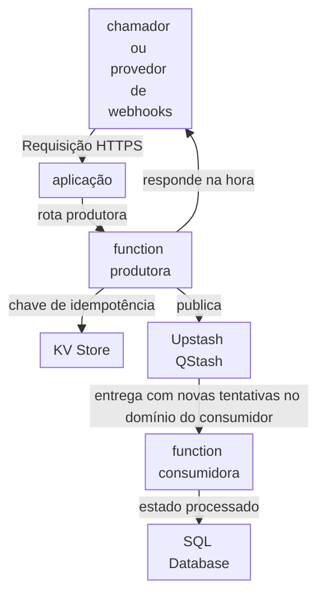
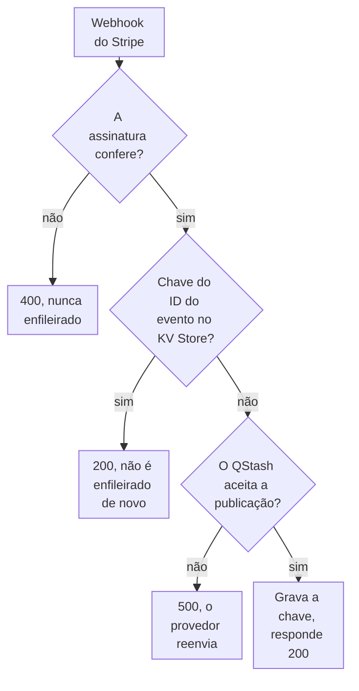

import DocCardGroup from '@aziontech/webkit/doc-card-group'
import DocCard from '@aziontech/webkit/doc-card'

Um time de desenvolvimento constrói APIs que reagem a eventos em vez de responder a um chamador na hora, como os webhooks que um provedor de pagamentos envia quando um pagamento é concluído. O provedor precisa receber a resposta na hora e reenvia qualquer evento que não vê confirmado, então o mesmo evento pode chegar mais de uma vez, e nenhum pode se perder. Esta página configura o lado produtor: uma rota de function que verifica cada webhook do Stripe, filtra eventos repetidos com uma chave no KV Store, publica o evento no Upstash QStash e responde na hora. O resultado é medido pela parcela de eventos processados dentro do tempo-alvo, por zero eventos perdidos depois das novas tentativas e pelo tempo entre o evento e o estado processado.

Esta página não cobre a function consumidora que recebe cada entrega do QStash e registra o evento no SQL Database. O caso de uso não cobre APIs de requisição e resposta, que [Criar APIs REST e GraphQL](/pt-br/documentacao/casos-de-uso/construir-e-executar-aplicacoes/criar-apis-rest-e-graphql/) cobre, nem análise de streams.

## Pré-requisitos

- O handler de webhooks do Stripe que [Construa um handler de webhooks do Stripe com Functions](/pt-br/documentacao/guias/desenvolvimento-de-aplicacoes/functions-e-runtime/webhooks-stripe-functions/) constrói, até o passo 4: o projeto Hono, o middleware `verifyStripeWebhook` e as duas variáveis do Stripe. Esta página substitui a rota de webhook dele e o implanta.
- Uma conta Upstash e o **QStash Token** dela, da aba **QStash** do Upstash Console, como [Use o template QStash Function Scheduler](/pt-br/documentacao/guias/desenvolvimento-de-aplicacoes/frameworks/qstash-function-scheduler/) mostra. O uso do QStash é cobrado pela Upstash.
- O domínio do consumidor que recebe cada evento do QStash. Esta página usa `events-consumer.example.com`.
- Um personal token para a chamada de API que cria o namespace. Para criar um, consulte [Personal tokens](/pt-br/documentacao/guias/plataforma/conta-e-billing/personal-tokens/).
- Os nomes e valores que esta página usa: `events-idempotency` para o namespace do KV Store, `QSTASH_TOKEN` e `CONSUMER_DOMAIN` para as variáveis de ambiente da function, `/webhook` para a rota produtora e `api.example.com` para o domínio que o deploy serve. Substitua cada valor pelo seu em todos os passos.

---

## Produtos necessários

| A API de eventos precisa de | O que significa | Produto | Documentado em |
| --- | --- | --- | --- |
| Eventos aceitos e confirmados sem esperar pelo processamento | Uma rota produtora que verifica o webhook, publica o evento no Upstash QStash e responde na hora | Functions | [Publique uma mensagem no Upstash QStash a partir de uma function](/pt-br/documentacao/guias/desenvolvimento-de-aplicacoes/integracoes/publicar-uma-mensagem-no-upstash-qstash-a-partir-de-uma-function/) |
| Uma entrega repetida que não é enfileirada de novo | Uma chave por ID de evento em um namespace, gravada depois da publicação e lida antes dela | KV Store | [Deduplique entregas de webhook com KV Store](/pt-br/documentacao/guias/desenvolvimento-de-aplicacoes/dados/deduplicar-entregas-de-webhook-com-kv-store/) |

---

## Arquitetura de referência

Esta página constrói o lado produtor da *API assíncrona apoiada em fila*: uma function produtora responde ao chamador na hora e entrega cada evento ao Upstash QStash, que o entrega a uma function consumidora.



Leia o diagrama como dois fluxos ligados pela fila. O fluxo de requisição termina na function produtora, que responde ao chamador assim que a mensagem é enfileirada. O fluxo de processamento começa no Upstash QStash, que chama a function consumidora no domínio que a function produtora indica como destino, então o chamador nunca espera por ele. O tratamento de duplicatas fica dos dois lados da fila: a chave da function produtora no KV Store filtra uma requisição repetida, e a gravação da function consumidora no SQL Database é o registro que decide se um evento foi processado.

### Fluxo de dados

1. O provedor de pagamentos envia um webhook assinado à rota produtora, `POST /webhook`, e o middleware `verifyStripeWebhook` rejeita uma requisição cuja assinatura não confere.
2. A function produtora lê o ID do evento no KV Store. Uma chave que existe significa que uma entrega anterior foi enfileirada, então a function produtora responde `200` e não publica nada.
3. Caso contrário, a function produtora publica uma mensagem com o evento no Upstash QStash, grava o ID do evento no KV Store e responde `200`, antes que qualquer processamento comece. Quando a publicação falha, ela responde `500`, e o provedor reenvia o evento.
4. O QStash guarda a mensagem e a entrega no domínio do consumidor, com novas tentativas para uma entrega que não tem sucesso.
5. A function consumidora processa a mensagem e grava o resultado no SQL Database, indexado pelo evento, então uma mensagem entregue duas vezes deixa um único registro. Esta página não configura a function consumidora.

### Componentes

- **Functions**: executam o endpoint produtor, que aceita e enfileira cada evento, e o handler consumidor, que processa cada entrega. Separar os dois é o que faz a resposta ao chamador deixar de depender do processamento. Esta página constrói o produtor.
- **Upstash QStash**: a integração que guarda cada mensagem e a entrega ao consumidor com novas tentativas. A entrega e as novas tentativas saem da function produtora, então um consumidor lento ou com falhas não chega ao chamador.
- **KV Store**: guarda a chave de idempotência de cada evento enfileirado, que a function produtora lê antes de publicar. O KV Store tem consistência eventual e não tem compare-and-set, então a chave filtra repetições e não garante, sozinha, uma única publicação.
- **SQL Database**: guarda o estado processado. Uma chave primária no identificador do evento faz uma segunda gravação do mesmo evento não ter efeito, e é essa a proteção que vale quando uma duplicata passa pela verificação no KV Store.
- **aplicação**: o Platform Resource que encaminha a rota produtora que o chamador alcança. A rota consumidora em que o QStash entrega responde no domínio que a function produtora indica como destino.

### Outros designs para este caso de uso

- *API de jobs agendados sobre Functions*: para times com trabalho que roda em um horário, como sincronizações, limpezas ou relatórios, em que agendamentos do Upstash QStash chamam um endpoint de function com requisições assinadas. Não existe chamador, então o fluxo de controle começa no agendamento, a function obtém um lock no KV Store para que as execuções não se sobreponham, e o tratamento de sobreposição e de execuções perdidas passa a ser a decisão de design.

---

## Configure o namespace de idempotência

A function produtora guarda uma chave por evento enfileirado no namespace `events-idempotency` do KV Store, uma verificação rápida que ela executa antes de publicar. A verificação filtra repetições; ela não garante uma única publicação, como as boas práticas deste caso de uso explicam.

Para criar o namespace:

```bash
curl --request POST \
  --url https://api.azion.com/v4/workspace/kv/namespaces \
  --header 'Accept: application/json' \
  --header 'Authorization: Token <personal-token>' \
  --header 'Content-Type: application/json' \
  --data '{"name": "events-idempotency"}'
```

A API responde `201` com o namespace. A requisição é síncrona, e não há estado de provisionamento para consultar:

```json
{"name":"events-idempotency","created_at":"...","last_modified":"..."}
```

Um namespace não pode ser renomeado nem apagado, e os nomes diferenciam maiúsculas de minúsculas, então crie-o uma única vez, em letras minúsculas. O namespace `events-idempotency` existe e está vazio.

---

## Configure as credenciais da fila

A function produtora se autentica no QStash com o token do QStash e publica no domínio do consumidor. Os dois valores são variáveis de ambiente da conta, então nenhum deles entra no código, e o destino muda sem uma edição de código.

Para criá-las:

```bash
azion create variables --key QSTASH_TOKEN --value <qstash-token> --secret true
azion create variables --key CONSUMER_DOMAIN --value events-consumer.example.com --secret false
```

Cada comando exibe o UUID da variável que criou:

```text
Created variable with UUID 00000000-0000-0000-0000-000000000005
```

A function lê os dois valores com `Azion.env.get()`. Uma mudança em uma variável só chega à function depois que ela é implantada de novo, o que a configuração da rota produtora faz. Para os limites das variáveis, consulte [Variáveis de ambiente](/pt-br/documentacao/plataforma/functions/environment-variables/).

---

## Configure a rota produtora

A rota produtora substitui a rota `POST /webhook` do handler de webhooks do Stripe. Ela mantém o middleware `verifyStripeWebhook`, então só um evento cuja assinatura confere chega a ela. Depois, ela decide, evento a evento, se o enfileira:



1. Uma requisição cuja assinatura não confere responde `400` no middleware e nunca é enfileirada.
2. Um evento cujo ID já tem uma chave no KV Store responde `200` e não é publicado de novo.
3. Uma publicação que o QStash não aceita responde `500`. O provedor reenvia um evento que o endpoint não confirma, então o evento volta.
4. Uma publicação que o QStash aceita grava a chave e responde `200`.

No arquivo de entrada do projeto, substitua a rota `app.post("/webhook", ...)` por esta:

```typescript
const IDEMPOTENCY_NAMESPACE = "events-idempotency";
const KEY_TTL_SECONDS = 86400;

app.post("/webhook", verifyStripeWebhook, async (c) => {
  const event = c.get("stripeEvent");
  const kv = await Azion.KV.open(IDEMPOTENCY_NAMESPACE);

  // A key for this event means an earlier delivery was already queued.
  if ((await kv.get(event.id, "text")) !== null) {
    return c.json({ received: true, duplicate: true });
  }

  // QStash delivers the message to the consumer's domain.
  const published = await fetch(`https://qstash.upstash.io/v1/publish/${Azion.env.get("CONSUMER_DOMAIN")}`, {
    method: "POST",
    headers: {
      Authorization: `Bearer ${Azion.env.get("QSTASH_TOKEN")}`,
      "Content-Type": "application/json",
    },
    body: JSON.stringify({
      event_id: event.id,
      type: event.type,
      object_id: (event.data.object as { id: string }).id,
      received_ms: Date.now(),
    }),
  });
  if (!published.ok) {
    console.error(`QStash answered ${published.status}`);
    return c.json({ error: "Event not queued" }, 500);
  }

  // Written only after the publish, so a failed publish is never marked as queued.
  await kv.put(event.id, "queued", { expirationTtl: KEY_TTL_SECONDS });
  return c.json({ received: true });
});
```

A rota publica como [Publique uma mensagem no Upstash QStash a partir de uma function](/pt-br/documentacao/guias/desenvolvimento-de-aplicacoes/integracoes/publicar-uma-mensagem-no-upstash-qstash-a-partir-de-uma-function/) descreve e filtra repetições como [Deduplique entregas de webhook com KV Store](/pt-br/documentacao/guias/desenvolvimento-de-aplicacoes/dados/deduplicar-entregas-de-webhook-com-kv-store/) descreve, com estes valores:

- **Publicação**: o destino de `CONSUMER_DOMAIN`, o token de `QSTASH_TOKEN` e um corpo com `event_id`, `type`, `object_id` e `received_ms`.
- **Filtro**: o namespace `events-idempotency`, o ID do evento do Stripe como chave, o valor `queued` e `expirationTtl` definido como `86400` segundos, um dia. Uma repetição que chega depois disso esbarra na chave primária da tabela.

Implante o projeto a partir do diretório dele:

```bash
azion deploy
```

A Azion CLI constrói o projeto, implanta-o e abre o Azion Console na página que traz os logs do deployment. O endpoint de webhook registrado no provedor continua sendo `https://api.example.com/webhook`. A propagação leva alguns minutos.

A function produtora responde ao provedor assim que o evento é enfileirado, seja o que for que o consumidor faça depois.

---

## Verifique a configuração

Cada verificação roda contra a function implantada. Um primeiro deploy que ainda não responde ainda está se propagando; espere alguns minutos e tente de novo.

- **Um webhook é confirmado na hora.** Envie um evento de teste com a Stripe CLI:

  ```bash
  stripe trigger payment_intent.succeeded
  ```

  O handler responde `{ "received": true }`, e o Stripe Dashboard lista a entrega e o código de resposta dela para o endpoint.

- **Todo evento é enfileirado.** Leia o que a function registrou no log:

  ```bash
  azion logs cells --tail
  ```

  O terminal exibe as mensagens de console dos últimos 5 minutos. Nenhuma linha `QStash answered` aparece, então o QStash aceitou todas as publicações.

---

## Medindo resultados

| Métrica | Onde ler | Como fica quando funciona |
| --- | --- | --- |
| Webhooks confirmados na hora | **Average Request Time** no dashboard **Requests** do Real-Time Metrics, filtrado por **Host** pelo domínio da function produtora. Consulte [Dashboards de Build](/pt-br/documentacao/plataforma/real-time-metrics/dashboards-build/#requests) | Continua baixo conforme o volume de eventos sobe, porque a function produtora nunca espera pelo processamento |
| Eventos sem confirmação | As entregas, os códigos de resposta e as novas tentativas que o Stripe Dashboard lista para o endpoint. Consulte [Construa um handler de webhooks do Stripe com Functions](/pt-br/documentacao/guias/desenvolvimento-de-aplicacoes/functions-e-runtime/webhooks-stripe-functions/) | Todo evento termina em um `200`, depois de novas tentativas quando uma publicação falhou |
| Publicações que falharam | **HTTP Status Codes 5XX** no dashboard **Status Codes** do Real-Time Metrics, filtrado pelo domínio. Consulte [Dashboards de Build](/pt-br/documentacao/plataforma/real-time-metrics/dashboards-build/#status-codes) | Nenhuma série de `500`; uma série aponta para uma publicação que falhou, que a function registra no log |

---

## Boas práticas

- **Trate a chave do KV como um filtro, não como uma garantia.** O KV Store tem consistência eventual: uma gravação fica visível em todos os lugares em até 60 segundos, e o cliente não tem compare-and-set. Duas entregas de um mesmo evento próximas uma da outra podem ler, ambas, que não há chave e publicar, ambas, então o consumidor ainda precisa registrar cada ID de evento uma única vez. Para o modelo de consistência, consulte [Como o KV Store funciona](/pt-br/documentacao/plataforma/kv-store/como-funciona/#consistencia).
- **Grave a chave só depois que a publicação tiver sucesso.** Uma chave gravada antes de uma publicação que falha marca o evento como enfileirado, a nova tentativa do provedor lê a chave, e o evento nunca é enfileirado.
- **Responda 500 quando o evento não for enfileirado.** O provedor reenvia um evento que o endpoint não confirma. Uma resposta de erro transforma uma publicação que falhou em uma nova tentativa em vez de um evento perdido.
- **Mantenha uma chave por evento, não por mensagem.** O KV Store aceita uma gravação por segundo na mesma chave, e o ID do evento muda a cada evento, então a function produtora grava cada chave uma única vez.

---

## Guias deste caso de uso

<DocCardGroup cols={2}>
  <DocCard title="Publique uma mensagem no Upstash QStash a partir de uma function" href="/pt-br/documentacao/guias/desenvolvimento-de-aplicacoes/integracoes/publicar-uma-mensagem-no-upstash-qstash-a-partir-de-uma-function/" label="Envia a requisição de publicação que a rota produtora faz para cada novo evento." />
  <DocCard title="Deduplique entregas de webhook com KV Store" href="/pt-br/documentacao/guias/desenvolvimento-de-aplicacoes/dados/deduplicar-entregas-de-webhook-com-kv-store/" label="Lê e grava a chave por ID de evento que impede uma entrega repetida de ser enfileirada de novo." />
</DocCardGroup>
