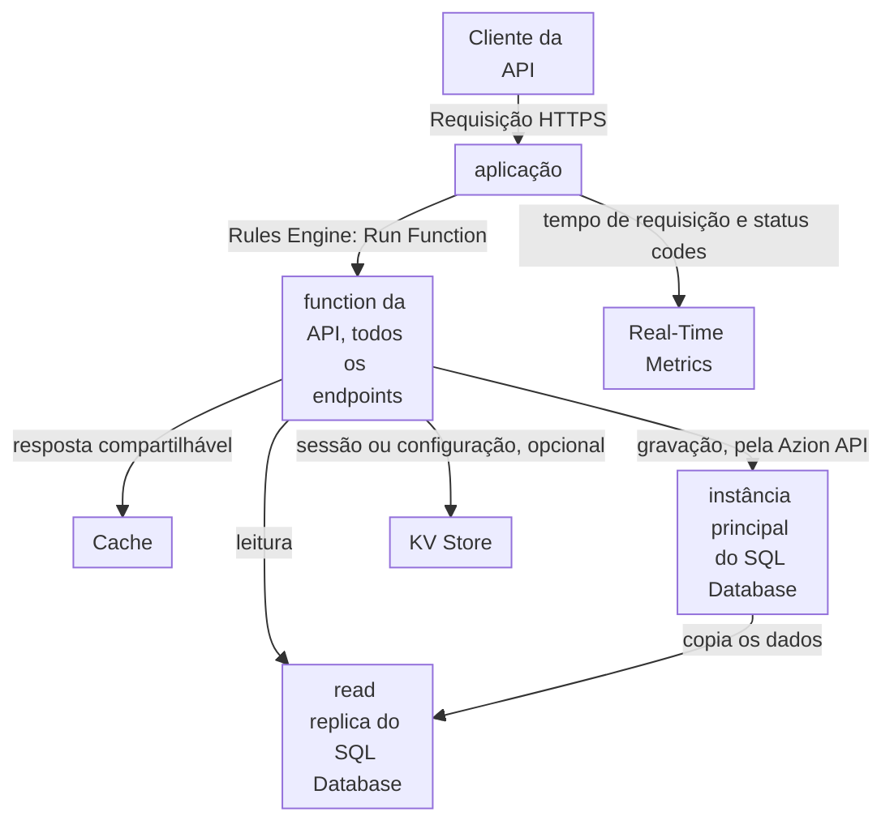

import DocCardGroup from '@aziontech/webkit/doc-card-group'
import DocCard from '@aziontech/webkit/doc-card'

Um time de desenvolvimento constrói o backend REST ou GraphQL que os clientes web e mobile dele chamam, com usuários em várias regiões e sem nenhum servidor que ele queira operar. A API guarda os registros em um banco de dados relacional, a maioria das chamadas lê e algumas chamadas gravam. Esta página implanta uma function que implementa todos os endpoints de uma API REST, lê os registros do SQL Database, grava-os pela Azion API e mantém a resposta de lista em cache por pouco tempo. O resultado é medido pelo tempo de resposta da API por região, pela taxa de erros sob carga e pelo tempo entre uma mudança de código e a produção.

Este caso de uso não cobre APIs que reagem a eventos em vez de chamadores, que [Criar APIs orientadas a eventos](/pt-br/documentacao/casos-de-uso/construir-e-executar-aplicacoes/criar-apis-orientadas-a-eventos/) cobre, nem controles de segurança na frente de uma API que roda em outro lugar, que [Proteger APIs públicas contra abuso](/pt-br/documentacao/casos-de-uso/proteger-aplicacoes-e-redes/proteger-apis-publicas-contra-abuso/) cobre.

## Pré-requisitos

- Uma conta Azion. Se você ainda não tem uma, [crie uma conta](https://console.azion.com/signup).
- SQL Database habilitado na sua conta e a permissão **Edit SQL Database**. O produto está em Preview, então solicite acesso pelo [Technical Support](/pt-br/documentacao/suporte/).

---

## Produtos necessários

| A API precisa de | O que significa | Produto | Documentado em |
| --- | --- | --- | --- |
| Endpoints que rodam sem nenhum servidor para operar | Uma function, implantada com a Azion CLI, que a aplicação executa em toda requisição | Functions | [Faça o deploy de uma function com a Azion CLI](/pt-br/documentacao/guias/desenvolvimento-de-aplicacoes/functions-e-runtime/deploy-function-with-cli/) |
| Registros que todos os endpoints leem e gravam | Leituras de uma read replica do banco de dados dentro da function, e gravações pela Azion API | SQL Database | [Grave linhas no SQL Database a partir de uma function](/pt-br/documentacao/guias/desenvolvimento-de-aplicacoes/dados/gravar-linhas-no-sql-database-a-partir-de-uma-function/) |
| Uma resposta de lista que não é reconstruída a cada chamada | Uma resposta que a function guarda com a Cache API do runtime, sob um `max-age` | Cache | [Armazene em cache a resposta de uma function com a Cache API](/pt-br/documentacao/guias/desenvolvimento-de-aplicacoes/functions-e-runtime/armazenar-em-cache-a-resposta-de-uma-function-com-a-cache-api/) |
| Latência e erros no domínio da API | Os dashboards **Requests** e **Status Codes** filtrados pelo domínio, e as invocações de **Functions** | Real-Time Metrics | [Dashboards de Build](/pt-br/documentacao/plataforma/real-time-metrics/dashboards-build/) |

---

## Arquitetura de referência

Esta página constrói a *API de serviço único sobre o SQL Database*: uma function implementa todos os endpoints e lê e grava um banco de dados no SQL Database.

Leia o diagrama da function para fora. Toda requisição que a aplicação recebe executa a mesma function, então a function é o único lugar que conhece todos os endpoints. A partir dela, os caminhos se dividem pelo que o endpoint faz: uma resposta que todo cliente pode compartilhar vai para o Cache, uma leitura vai para uma réplica do banco de dados e uma gravação vai para a instância principal. O KV Store fica ao lado do banco de dados para valores lidos por chave, como uma sessão, e o design funciona sem ele. O Real-Time Metrics lê o que a aplicação registra e não muda nada no caminho da requisição.

### Fluxo de dados

1. A requisição de um cliente chega ao workload no domínio da API, que a entrega à aplicação, e uma regra da aplicação executa a function da API.
2. A function compara o método e o caminho. Um caminho fora de `/api/tasks` responde `404`.
3. Um `GET` da lista de tarefas é respondido pela cópia que a function guardou no Cache. Quando não existe cópia, a function lê as linhas e guarda a nova resposta por 60 segundos.
4. Um `GET` de uma tarefa abre uma conexão com uma read replica do banco de dados com `Database.open`, que recebe o nome do banco de dados e nenhum token, então os dados de que uma leitura precisa ficam dentro da Azion.
5. Um `POST` ou um `DELETE` envia o statement ao endpoint de query do banco de dados na Azion API, com o personal token que a function lê de uma variável de ambiente, porque a instância principal é a única que aplica gravações. As réplicas passam a ter a mudança em seguida.
6. Depois de uma gravação, a function apaga a resposta de lista guardada, para que a requisição de lista seguinte leia as linhas de novo.

### Recursos de Plataforma

- **aplicação**: o Platform Resource que recebe as requisições da API no domínio dela e as encaminha para a function com uma regra do Rules Engine.
- **Functions**: uma function implementa todos os endpoints. Um deploy substitui o código de todos os endpoints juntos, e é isso que faz da API uma unidade, então um deploy, um rollback ou uma mudança de schema chega a todos os endpoints no mesmo momento.
- **SQL Database**: guarda os dados relacionais da API. Uma function lê por uma read replica sem token, e as gravações vão para a instância principal pela Azion API com um personal token.
- **KV Store**: guarda sessões e configurações lidas por chave, uma opção de design. Ele tem consistência eventual e não tem compare-and-set, então carrega valores que toleram um atraso curto, não os registros da API.
- **Cache**: guarda as respostas que todo cliente pode compartilhar, como uma lista ou uma consulta, para que uma chamada repetida pule a leitura no banco de dados.
- **Real-Time Metrics**: reporta o tempo de requisição e os status codes da API por domínio e o número de vezes que a function rodou.

### Outros designs para este caso de uso

- *API de serviço único sobre um banco de dados externo*: para times cujos dados já estão em um banco de dados gerenciado como Neon, MongoDB Atlas, TiDB ou Turso, que uma function consulta pelo driver serverless ou pela API HTTP dele. Toda chamada fora do cache chega ao banco de dados externo, então a latência e a disponibilidade dele entram nos fluxos de requisição e de falha.
- *API de microsserviços sobre Functions*: para times que dividem uma API em serviços de times diferentes, cada um uma function com o seu próprio armazenamento, implantada e versionada de forma independente. Uma regra do Rules Engine encaminha cada prefixo de caminho para o seu serviço e os serviços chamam uns aos outros por HTTP pelas mesmas regras, então um deploy muda um serviço e deixa os outros na versão que tinham.

---

## Como o design funciona

Esta seção explica como o banco de dados, as credenciais de gravação e a function da API dividem as leituras e as gravações.

### Banco de dados de tarefas

A API de tarefas guarda os registros em uma tabela de um banco de dados chamado `tasks-api`. A function lê o banco de dados pelo nome e grava nele pelo identificador, então o banco de dados é criado pela API, cuja resposta de criação retorna esse identificador.

### Credenciais de gravação da function

Uma function lê um banco de dados por uma réplica somente leitura, e um statement que grava falha nela com ``attempt to write a readonly database``. Por isso, a function da API envia as gravações para a Azion API e precisa de dois valores para isso: o identificador do banco de dados e um personal token.

### Function da API

A function da API é um handler ES Modules que implementa todos os endpoints sob `/api/tasks`. Ela lê com a classe `Database` do global `Azion.Sql`.

A resposta de lista fica em cache sob `max-age=60`. Todo `POST` e todo `DELETE` apaga essa cópia depois da gravação, então os 60 segundos só limitam por quanto tempo uma lista fica desatualizada quando essa exclusão não roda.

O código toma mais três decisões:

- **As leituras ficam dentro da Azion.** `Database.open` não precisa de token, e o parâmetro `?` carrega o ID da tarefa como inteiro, que a réplica vincula. Passar uma string JavaScript como parâmetro falha com ``unknown variant `String` ``.
- **A exclusão reporta uma tarefa inexistente.** `rows_written` conta as linhas que o statement gravou, então `0` significa que nenhuma tarefa tinha aquele ID.
- **A cópia da lista carrega o próprio timestamp.** `x-tasks-cached-at` é definido uma única vez, quando a function guarda a resposta, então duas respostas com o mesmo valor vieram da mesma cópia guardada.

---

## Medindo resultados

| Métrica | Onde ler | Como fica quando funciona |
| --- | --- | --- |
| Tempo de resposta da API por região | **Average Request Time** no dashboard **Requests** do Real-Time Metrics, filtrado por **Host** pelo domínio da API e por **Country**. Consulte [Filtre um dashboard de Real-Time Metrics](/pt-br/documentacao/guias/plataforma/observabilidade/adicionar-filtros-metrics/) | Comparável entre os países de onde os seus clientes chamam e estável conforme o tráfego cresce |
| Taxa de erros sob carga | **HTTP Status Codes 5XX** no dashboard **Status Codes**, filtrado pelo domínio da API. Consulte [Dashboards de Build](/pt-br/documentacao/plataforma/real-time-metrics/dashboards-build/#status-codes) | Nenhuma série de `500` subindo com o volume de requisições; uma subida aponta para gravações que falharam, que a function registra no log |
| Com que frequência o código da API roda | **Total Invocations** na aba **Functions**, série **Edge Application Invocations**. Consulte [Dashboards de Build](/pt-br/documentacao/plataforma/real-time-metrics/dashboards-build/#functions) | Acompanha o número de requisições da API, já que toda requisição executa a function |
| Tempo entre uma mudança de código e a produção | O log de deploy que `azion deploy` indica no Azion Console. Consulte [Como a Azion CLI funciona](/pt-br/documentacao/devtools/cli/como-funciona/#de-um-projeto-a-um-deployment) | Cada deploy termina, e o novo código responde assim que se propaga, em cerca de dois minutos para um deploy depois do primeiro |

---

## Boas práticas

- **Leia pela réplica e grave pela API.** `Database.open` chega a uma read replica sem token e recusa gravações. Enviar as leituras para a API gasta o personal token em toda chamada e adiciona uma requisição que a réplica responde diretamente. Para como a instância principal e as réplicas dividem o trabalho, consulte [Como o SQL Database funciona](/pt-br/documentacao/plataforma/sql-database/como-funciona/).
- **Verifique cada statement, não o status HTTP.** Um statement que falha retorna `200` com `error` na entrada dele. Um cliente que lê só o status reporta um insert que falhou como sucesso, e o registro nunca é gravado.
- **Dê à function um token só dela, com uma expiração planejada.** Um personal token expira na data escolhida quando ele é criado, e todas as gravações falham a partir desse momento. Um token usado só pela function pode ser substituído e implantado de novo sem mexer no token da CLI. Para as opções de expiração, consulte [Personal tokens](/pt-br/documentacao/guias/plataforma/conta-e-billing/personal-tokens/).
- **Nunca monte um statement a partir do texto bruto da requisição.** O endpoint de query recebe strings SQL, então um título que carrega uma aspa muda o statement que o banco de dados executa. Coloque os valores de texto entre aspas e duplique as aspas deles, como `sqlText` faz, e valide cada campo antes que ele chegue a um statement.
- **Guarde em cache só o que todo cliente pode ler.** Uma resposta guardada com a Cache API é devolvida a qualquer requisição seguinte com a mesma chave. Guarde em cache respostas de lista e de consulta que são as mesmas para todo cliente, e nunca uma resposta construída a partir das credenciais de um cliente.

---

## Guias deste caso de uso

<DocCardGroup cols={2}>
  <DocCard title="Sirva uma API REST de uma function apoiada no SQL Database" href="/pt-br/documentacao/guias/desenvolvimento-de-aplicacoes/dados/servir-uma-api-rest-de-uma-function-apoiada-no-sql-database/" label="Cria o projeto tasks-api, guarda o código da function da API, implanta-a e executa todas as verificações deste caso de uso." />
  <DocCard title="Crie e gerencie bancos de dados" href="/pt-br/documentacao/guias/desenvolvimento-de-aplicacoes/dados/gerenciar-bancos-dados-edge-sql/" label="Cria o banco de dados tasks-api e retorna o identificador em que a function grava." />
  <DocCard title="Crie tabelas e consulte dados" href="/pt-br/documentacao/guias/desenvolvimento-de-aplicacoes/dados/criar-tabelas-edge-sql/" label="Cria a tabela tasks e insere as duas linhas que o endpoint de lista lê de volta." />
  <DocCard title="Grave linhas no SQL Database a partir de uma function" href="/pt-br/documentacao/guias/desenvolvimento-de-aplicacoes/dados/gravar-linhas-no-sql-database-a-partir-de-uma-function/" label="Armazena as credenciais do banco de dados como variáveis de ambiente e envia as gravações que a function da API faz." />
  <DocCard title="Armazene em cache a resposta de uma function com a Cache API" href="/pt-br/documentacao/guias/desenvolvimento-de-aplicacoes/functions-e-runtime/armazenar-em-cache-a-resposta-de-uma-function-com-a-cache-api/" label="Guarda a resposta de lista sob um max-age e a apaga depois de cada gravação." />
</DocCardGroup>
