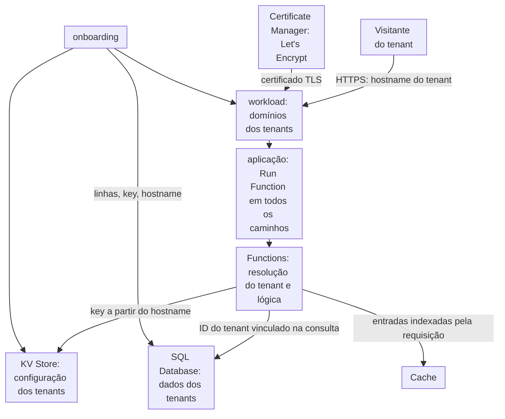

import DocCardGroup from '@aziontech/webkit/doc-card-group'
import DocCard from '@aziontech/webkit/doc-card'

Uma equipe de produto SaaS atende muitos clientes, cada um no próprio hostname, e precisa fazer o onboarding de tenants sem um deployment por tenant. Todos os tenants compartilham um deployment, então a configuração e os dados de um tenant nunca podem chegar aos visitantes de outro tenant. Esta página executa o produto como uma função que resolve o tenant pelo hostname de cada requisição, lê a configuração do tenant no KV Store e lê apenas as linhas desse tenant no SQL Database. Os tenants ficam em subdomínios do domínio do produto, sob um certificado wildcard do Let's Encrypt, então fazer o onboarding de um tenant é uma mudança de dados e uma mudança de domínio. O resultado é medido pelo tempo para fazer o onboarding de um tenant com o hostname dele, por zero exposição de dados entre tenants e pelo tempo de resposta por tenant.

Este caso de uso não cobre a execução de código fornecido pelos tenants.

## Pré-requisitos

- Uma conta Azion. Se você ainda não tem uma, [crie uma conta](https://console.azion.com/signup).
- Uma aplicação com Application Accelerator ativado, servida por um workload na infraestrutura de produção. Para criá-los, consulte [Primeiros passos com Applications](/pt-br/documentacao/plataforma/applications/primeiros-passos/), e para ativar Application Accelerator, consulte [Ative Application Accelerator](/pt-br/documentacao/guias/performance-e-confiabilidade/cache-e-purge/cache-settings/#ative-application-accelerator). A regra deste design responde todos os caminhos com a função.
- O domínio do produto como uma zona ativa no [Edge DNS](/pt-br/documentacao/plataforma/edge-dns/), de que o certificado wildcard precisa para a emissão automática.
- Um namespace do KV Store para a configuração dos tenants. Para criar um, consulte [Namespaces](/pt-br/documentacao/plataforma/kv-store/namespaces/#criar-um-namespace).
- Um banco de dados do SQL Database para os dados dos tenants. Para criar um, consulte [Bancos de dados e consultas](/pt-br/documentacao/plataforma/sql-database/bancos-de-dados-e-consultas/#criar-um-banco-de-dados).

---

## Produtos necessários

| O produto precisa de | O que significa | Produto | Documentado em |
| --- | --- | --- | --- |
| HTTPS em todo hostname de tenant, sem um certificado por tenant | Um certificado wildcard do Let's Encrypt para `*.app.example.com`, vinculado ao workload | Certificate Manager | [Solicite um certificado wildcard](/pt-br/documentacao/guias/seguranca-de-aplicacoes/tls-e-certificados/como-gerar-um-certificado-lets-encrypt-via-api/#solicite-um-certificado-wildcard) |
| O tenant resolvido em toda requisição | Uma função que lê o hostname da requisição e é executada em todos os caminhos | Functions | [Primeiros passos com Functions](/pt-br/documentacao/plataforma/functions/primeiros-passos/) |
| Configuração de tenant que o onboarding escreve sem deployment | Uma key por hostname de tenant em um namespace | KV Store | [KV Store API](/pt-br/documentacao/devtools/runtime/api-reference/kv-store/) |
| Dados de tenant que nenhum outro tenant pode ler | Linhas indexadas por um ID de tenant inteiro, lidas com esse ID vinculado em toda consulta | SQL Database | [SQL Database API](/pt-br/documentacao/devtools/runtime/api-reference/sql-database/) |
| Uma regra que envia todos os caminhos à função | O behavior **Run Function**, que exige Application Accelerator | Application Accelerator | [Execute uma função em uma aplicação](/pt-br/documentacao/guias/desenvolvimento-de-aplicacoes/functions-e-runtime/funcoes-serverless/) |

---

## Arquitetura de referência

Esta página monta a *Aplicação multi-tenant compartilhada*: todo hostname de tenant chega ao mesmo workload e à mesma função, e o isolamento fica no código e nas keys dos dados.

Leia o diagrama do visitante para baixo. Todo tenant chega ao mesmo workload, à mesma aplicação e à mesma função, então nada no caminho da requisição nomeia um tenant até que a função leia o hostname. A partir daí, o isolamento é uma cadeia de keys: o hostname seleciona a configuração no KV Store, a configuração carrega o ID do tenant, e o ID do tenant é vinculado em toda consulta ao SQL Database. O onboarding, na parte de baixo, escreve dados e um domínio, e não toca em código nem em deployment.

### Fluxo de dados

1. Um visitante requisita um hostname de tenant, e o workload conclui o handshake TLS com o certificado wildcard que Certificate Manager emitiu para ele.
2. A regra da aplicação executa a função `tenant-app` em todos os caminhos.
3. A função lê o hostname da requisição e busca a key `tenant:<hostname>` no namespace `saas-tenants`. Um hostname sem key responde `404`.
4. A configuração do tenant carrega o ID inteiro dele, e a função vincula esse ID na consulta a `saas-data`, então o resultado traz apenas as linhas desse tenant.
5. A função responde com os dados do tenant. Uma resposta em cache é indexada pela requisição, que carrega o hostname, então ela nunca responde outro tenant.
6. Fazer o onboarding de um tenant escreve as linhas e a key dele, adiciona o hostname dele ao workload e aponta o hostname para o workload. O tenant responde quando a mudança se propaga, sem deployment.

### Recursos de Plataforma

- **workload**: o Platform Resource que carrega os domínios dos tenants. Todo hostname de tenant é listado nele por completo, porque um workload recusa uma entrada wildcard, e o único deployment dele envia todos para a mesma aplicação.
- **Certificate Manager**: o Platform Resource que emite e renova os certificados do Let's Encrypt para os hostnames dos tenants. Um certificado wildcard para o domínio pai dos tenants, validado por DNS-01 no Edge DNS, cobre um novo hostname de tenant sem um novo certificado.
- **Functions**: resolvem o tenant pelo hostname e executam a lógica do produto. O isolamento fica nesse código, então toda consulta pega o ID do tenant da configuração, nunca da requisição.
- **KV Store**: guarda a configuração dos tenants, uma key por hostname, que uma função escreve e lê. Uma key nova fica visível em todos os lugares em até 60 segundos.
- **SQL Database**: guarda os dados dos tenants, isolados por uma key de tenant inteira vinculada em toda consulta, ou por um banco de dados por tenant como opção de design. Uma função o lê na réplica de leitura dele, e as escritas passam pela API da Azion.
- **Cache**: armazena respostas indexadas por tenant. A cache key padrão carrega o host, e uma entrada da Cache API de uma função é indexada pela requisição, então uma resposta em cache fica com o tenant dela.
- **aplicação**: o Platform Resource que roteia todos os caminhos para a função dos tenants. O behavior **Run Function** precisa do Application Accelerator na aplicação.

### Outros designs para este caso de uso

- *Aplicação multi-tenant isolada*: para produtos SaaS cujos tenants precisam de recursos dedicados, por compliance ou por configuração personalizada. Um pipeline de provisionamento cria o workload, a aplicação, as funções e os stores de cada tenant a partir de um template, pela API da Azion ou pelo Terraform Provider, então o isolamento vem da separação em vez do código, e as atualizações são distribuídas tenant por tenant.

---

## Como o design funciona

Esta seção explica o certificado que cobre todos os tenants, a função que resolve cada um e o que o onboarding de um tenant muda.

### Certificado dos tenants

Todo hostname de tenant é um subdomínio de `app.example.com`, então um certificado wildcard cobre todos eles, e um novo tenant não precisa de um certificado próprio. A Azion emite um certificado wildcard apenas pelo desafio DNS-01, e ela mesma insere o registro do desafio quando a zona está ativa no Edge DNS. O formulário de um workload solicita certificados apenas para os hostnames que ele lista, e não pode listar um wildcard, então a solicitação passa pela API.

- **Corpo da requisição**: a zona `example.com` está ativa no Edge DNS, então o desafio DNS-01 não precisa de nenhum registro seu.
- **Vínculo**: `tenants-wildcard`, selecionado em **My certificates** no campo **Digital Certificate** do workload que serve a aplicação.
- **Domínios do workload**: cada hostname de tenant, como `acme.app.example.com`, listado por completo, porque um workload recusa uma entrada wildcard. Um workload lista até 50 domínios, a menos que a Azion aumente o limite.

### Aplicação dos tenants

A aplicação dos tenants é uma função, `tenant-app`, executada em todos os caminhos. Ela faz dois trabalhos. Em um hostname de tenant, ela resolve o tenant e responde com os projetos desse tenant. Em `PUT /_admin/tenants/<hostname>`, ela escreve a configuração de um tenant, que é como o onboarding chega ao KV Store: uma key só é escrita a partir de uma função. O caminho de administração verifica um token guardado em uma variável de ambiente, então o token nunca entra no código.

Uma função só lê o novo valor de uma variável depois de um novo deploy, então a variável existe antes da função.

O ID do tenant precisa ser um inteiro, porque uma consulta recusa uma string JavaScript como parâmetro. A key de busca é o hostname, que a requisição sempre carrega, porque KV Store não tem nenhuma operação que liste keys.

### Onboarding de tenants

Fazer o onboarding de um tenant são quatro mudanças, e nenhuma delas é um deployment: as linhas do tenant, a key de configuração dele, o hostname dele no workload e o registro DNS dele.

---

## Medindo resultados

| Métrica | Onde ler | Como é o funcionamento correto |
| --- | --- | --- |
| Tempo para fazer o onboarding de um tenant com o hostname dele | O tempo entre a primeira chamada de onboarding e a primeira resposta do hostname do tenant que nomeia o tenant | Limitado pela propagação da mudança de hostname no workload, sem deployment no caminho |
| Exposição de dados entre tenants | Uma requisição a cada hostname de tenant, executada em uma programação, comparada com o tenant a que o hostname pertence | Toda resposta nomeia o próprio tenant, e nenhum ID de tenant aparece sob outro hostname |
| Tempo de resposta por tenant | O `requestTime` e o `requests` de `workloadMetrics` agrupados por `host`. Consulte [Campos do Real-Time Metrics](/pt-br/documentacao/devtools/graphql/campos-gql-real-time-metrics/#workloadmetrics) | Próximo entre os tenants, já que todo tenant executa a mesma função |

---

## Boas práticas

- **Pegue o ID do tenant do KV Store, nunca da requisição.** O hostname seleciona a key, e a key guarda o ID que toda consulta vincula. Um ID de tenant lido de um header, de um cookie ou de um segmento de caminho permite que um visitante peça as linhas de outro tenant.
- **Mantenha a key do tenant derivável da requisição.** Nenhuma interface lista as keys de um namespace, então `tenant:<hostname>` é o único caminho de volta para a configuração de um tenant. Para a convenção, consulte [Derive o nome de uma key do que a requisição já carrega](/pt-br/documentacao/plataforma/kv-store/boas-praticas/#derive-o-nome-de-uma-key-do-que-a-requisicao-ja-carrega).
- **Faça cache pela requisição completa, nunca apenas pelo caminho.** A cache key padrão carrega o host, e uma função que faz cache pela Cache API indexa a entrada pela requisição, que também carrega o hostname. Uma key montada apenas a partir do caminho entregaria a página de um tenant a outro. Para o formato da key, consulte [Cache keys](/pt-br/documentacao/plataforma/applications/cache/cache-keys/).
- **Dê nome a um namespace uma única vez.** Um namespace não pode ser renomeado nem excluído, e os nomes diferenciam maiúsculas de minúsculas. Para a regra de nomes, consulte [Nomeie um namespace como se você nunca pudesse alterá-lo](/pt-br/documentacao/plataforma/kv-store/boas-praticas/#nomeie-um-namespace-como-se-voce-nunca-pudesse-altera-lo).
- **Troque o token de administração fazendo um novo deploy da função.** Uma função só lê uma variável alterada depois de um novo deploy, então uma troca é uma mudança de variável seguida de um deploy.

---

## Guias deste caso de uso

<DocCardGroup cols={2}>
  <DocCard title="Solicite um certificado Let's Encrypt com a API" href="/pt-br/documentacao/guias/seguranca-de-aplicacoes/tls-e-certificados/como-gerar-um-certificado-lets-encrypt-via-api/" label="Solicita o certificado wildcard para os hostnames dos tenants pelo desafio DNS-01 e o vincula ao workload." />
  <DocCard title="Resolva tenants pelo hostname em uma função" href="/pt-br/documentacao/guias/desenvolvimento-de-aplicacoes/functions-e-runtime/resolver-tenants-pelo-hostname-em-uma-funcao/" label="Armazena o token de administração, cria a função tenant-app, faz o onboarding de um tenant e executa as verificações deste caso de uso." />
  <DocCard title="Execute uma função em uma aplicação" href="/pt-br/documentacao/guias/desenvolvimento-de-aplicacoes/functions-e-runtime/funcoes-serverless/" label="Adiciona a regra que executa a instância tenant-app em todos os caminhos de todos os hostnames de tenant." />
</DocCardGroup>
