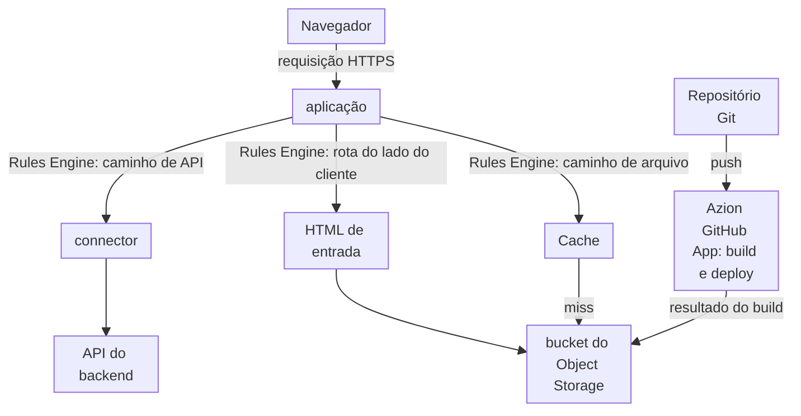

import DocCardGroup from '@aziontech/webkit/doc-card-group'
import DocCard from '@aziontech/webkit/doc-card'

Uma equipe de front-end desenvolve a interface web de um produto cujo backend já é executado em outro lugar, em uma região de nuvem, em um data center ou em uma API SaaS. A interface é uma single-page application criada com um framework como React, Vue ou Angular, e o backend fica onde está. Esta página serve a interface compilada pela Azion, recorre ao HTML de entrada para as rotas do lado do cliente e envia toda requisição sob `/api/` por um connector até o backend existente, no mesmo domínio. O resultado é medido pelo tempo de carregamento da interface por região, pelo tempo entre um commit e uma mudança no ar e pela latência que o roteamento adiciona às chamadas de API.

Este caso de uso não cobre aplicações cujo backend também é executado na Azion. Para isso, consulte [Implantar aplicações full-stack globalmente](/pt-br/documentacao/casos-de-uso/construir-e-executar-aplicacoes/implantar-aplicacoes-full-stack-globalmente/).

## Pré-requisitos

- Uma single-page application implantada na Azion com Azion CLI e o preset do framework dela, a partir de uma pasta de projeto que contém o arquivo `azion.config.cjs`. O deploy cria o bucket, a aplicação e o workload que servem a interface. Para o caminho com React, consulte [Desenvolva com React](/pt-br/documentacao/guias/desenvolvimento-de-aplicacoes/frameworks/react/). Vue e Angular seguem o mesmo caminho com o próprio preset.
- A [Azion CLI](/pt-br/documentacao/devtools/cli/primeiros-passos/), instalada e autenticada, nessa pasta de projeto.
- Um backend que responde HTTPS na porta `443` sob o próprio hostname.
- Os valores da sua interface. Esta página usa `api.example.com` para o backend, `/api/` para o prefixo de caminho de toda chamada de API que a interface faz, `/api/health` para um caminho do backend que as verificações requisitam e `<workload-domain>` para o domínio que o deploy exibiu. Substitua cada valor pelo seu em todas as etapas.

---

## Produtos necessários

| A interface precisa de | O que significa | Produto | Documentado em |
| --- | --- | --- | --- |
| Arquivos da interface armazenados na Azion | O resultado do build, enviado pelo `azion deploy` a um bucket que os workloads só podem ler | Object Storage | [Desenvolva com React](/pt-br/documentacao/guias/desenvolvimento-de-aplicacoes/frameworks/react/) |
| Arquivos da interface servidos do cache | A cache setting que a regra `Deliver Static Assets and Set Cache Policy` do preset aplica | Cache | [Azion CLI deploy](/pt-br/documentacao/devtools/cli/deploy/) |
| Rotas do lado do cliente que carregam a interface | A regra `Redirect to index.html` do preset, que reescreve as requisições de rotas para `/index.html` | Application Accelerator | [Rewrite Request](/pt-br/documentacao/plataforma/applications/rules-engine/#rewrite-request) |
| Chamadas de API que chegam ao backend existente | Um connector para o backend e uma regra que envia `/api/` a ele antes que qualquer outra regra seja executada | Connectors | [Roteie um caminho de API para um backend pelo azion.config](/pt-br/documentacao/guias/desenvolvimento-de-aplicacoes/automacao/rotear-um-caminho-de-api-para-um-backend/) |

---

## Arquitetura de referência

Esta página monta o *Front-end renderizado no cliente sobre APIs de origem*: o navegador renderiza a interface a partir de arquivos estáticos, e toda chamada de dados atravessa a Azion até o backend existente.



O diagrama traz dois fluxos. O fluxo de publicação vai do repositório até o bucket, e só se move quando a equipe faz o deploy de uma mudança. O fluxo de requisições começa no navegador, e as regras da aplicação o dividem em três: os caminhos de API atravessam até o backend, os arquivos do build vêm do Cache ou do bucket, e toda rota do lado do cliente retorna o HTML de entrada. Só o primeiro caminho sai da Azion, então um carregamento de página lê arquivos estáticos, e toda chamada de dados chega à origem do backend.

### Fluxo de dados

1. Um push para o repositório, ou um `azion deploy` a partir da pasta do projeto, faz o build da interface e envia o resultado do build ao bucket.
2. A requisição de um navegador chega ao workload no domínio da interface, e a aplicação executa as regras de requisição em ordem.
3. Uma requisição sob `/api/` corresponde à primeira regra, que a envia pelo connector do backend e encerra a request phase, então nenhuma regra posterior a reescreve nem faz cache dela.
4. O backend responde a chamada de API, e o navegador renderiza os dados na interface.
5. Uma requisição de um arquivo do build, como um script ou uma folha de estilo, é respondida pelo Cache. Em um miss, a aplicação lê o arquivo do bucket e faz cache dele.
6. Uma requisição de uma rota do lado do cliente, como `/orders/42`, é reescrita para `/index.html`, e o roteador no navegador renderiza essa rota.

### Componentes

- **Object Storage**: guarda a interface compilada em um bucket que os workloads só podem ler. A interface não tem servidor próprio, então o bucket é a origem dela.
- **Cache**: mantém os arquivos do build perto dos navegadores que os requisitam, então carregamentos repetidos de página leem os arquivos do Cache em vez do bucket.
- **aplicação**: o Platform Resource que serve o domínio da interface e guarda as regras que separam arquivos, rotas e chamadas de API.
- **Rules Engine**: a Feature da aplicação que roteia os caminhos de API para o connector e reescreve as rotas do lado do cliente para o HTML de entrada. A regra de API é executada primeiro e encerra a Request Phase, porque toda regra que corresponde é executada em ordem, e uma regra posterior poderia reescrever uma chamada de API.
- **connector**: o Platform Resource que alcança o backend. Ele envia o nome do próprio backend no header `Host`, então um backend que serve vários sites responde por ele.
- **API do backend**: a integração que é a origem existente. Ela fica onde é executada, e toda chamada de dados da interface chega a ela.
- **Azion GitHub App**: a integração que importa o repositório e faz o deploy de cada push nele, então a interface na Azion acompanha o repositório.

### Outros designs para este caso de uso

- *Front-end renderizado no servidor sobre APIs de origem*: para interfaces que precisam de renderização no servidor, como páginas indexadas por buscadores ou personalizadas. Functions renderizam cada página na requisição com um framework como Next.js ou Nuxt e chamam as APIs do backend, então o backend fica no fluxo de requisições e no fluxo de falhas de toda página que Cache não guarda.

---

## Configure a rota de API

A rota de API é um connector para o backend e uma regra que envia toda requisição `/api/` a ele. Os dois ficam no `azion.config.cjs` do projeto, o arquivo que o `azion deploy` aplica à aplicação, então a rota é enviada com cada deploy da interface.

A regra é a primeira entrada das regras de requisição e encerra a request phase. A regra `Redirect to index.html` do preset reescreve as requisições de rotas para `/index.html`, e toda regra da fase que corresponde é executada, em ordem. Sem uma parada, uma regra posterior poderia reescrever o caminho de uma chamada de API ou aplicar a ela a cache setting dos arquivos da interface. **Finish Request Phase** encerra a fase, então as regras depois dela nunca veem uma chamada de API.

O `azion.config.cjs` do projeto declara a rota como [Roteie um caminho de API para um backend pelo azion.config](/pt-br/documentacao/guias/desenvolvimento-de-aplicacoes/automacao/rotear-um-caminho-de-api-para-um-backend/) descreve, com estes valores, e o `azion deploy` na pasta do projeto a aplica:

| Entrada | Valor | Por quê |
| --- | --- | --- |
| `name` do connector | `api-backend` | O nome que o behavior `set_connector` da regra nomeia. O connector fica ao lado do connector de storage que o preset declarou |
| Endereço do connector | `api.example.com` | O próprio hostname do backend |
| `connectionOptions.transportPolicy` | `force_https` | O backend responde HTTPS apenas na porta `443` |
| `connectionOptions.host` | `api.example.com` | O `${host}` padrão enviaria o domínio da interface, pelo qual um backend que roteia requisições por nome pode não responder |
| Posição da regra | A primeira entrada de `rules.request`, antes das regras que o preset gerou | Para que a regra `Redirect to index.html` do preset nunca veja uma chamada de API |
| Critério da regra | `${uri}` `starts_with` `/api/` | Toda chamada de API que a interface faz |
| Behaviors da regra | `set_connector` com `api-backend`, depois `finish_request_phase` | O backend recebe a chamada, e nenhuma regra posterior a reescreve nem faz cache dela |

As requisições sob `/api/` chegam a `api.example.com` com o próprio caminho, e todas as outras requisições mantêm o comportamento do preset. Uma regra nova leva alguns minutos para chegar a todos os data centers.

---

## Verifique a configuração

- **A interface carrega.** Requisite a raiz do domínio:

  ```bash
  curl -s -D - -o /dev/null https://<workload-domain>/
  ```

  A resposta traz `200`. Até que o deploy chegue a uma localidade, o domínio responde `404` com uma página que diz `There's nothing here yet`. Espere e requisite de novo.

- **Uma rota do lado do cliente carrega a interface.** Requisite uma rota que a interface trata, como `/orders/42`:

  ```bash
  curl -s https://<workload-domain>/orders/42
  ```

  O corpo é o mesmo HTML de entrada que `/` retorna. O roteador no navegador então renderiza a rota.

- **Os arquivos da interface vêm do cache.** Requisite um script do build duas vezes, com o header de debug. Pegue o caminho dele de uma tag `<script>` do HTML de entrada:

  ```bash
  curl -sI -H "Pragma: azion-debug-cache" https://<workload-domain>/<script-path>
  ```

  A segunda resposta traz `x-cache: HIT`. Para saber como ler o header, consulte [Verifique o status de cache de uma resposta](/pt-br/documentacao/guias/performance-e-confiabilidade/cache-e-purge/verificar-tempo-de-cache-da-pagina/).

- **As chamadas de API chegam ao backend.** Requisite um caminho do backend:

  ```bash
  curl -s -D - https://<workload-domain>/api/health
  ```

  A resposta é a do próprio backend para `/api/health`, não o HTML de entrada. Quando for o HTML de entrada, a regra de API não é a primeira regra de requisição, ou ainda não se propagou.

Para ver quais regras foram executadas em uma requisição, ative [Debug Rules](/pt-br/documentacao/plataforma/applications/main-settings/#debug-rules).

---

## Medindo resultados

| Métrica | Onde ler | Como é o funcionamento correto |
| --- | --- | --- |
| Tempo de carregamento da interface por região | O campo `pageloadtime` das medições do Edge Pulse, coletadas nos navegadores dos visitantes, consulte [Primeiros passos com Edge Pulse](/pt-br/documentacao/plataforma/edge-pulse/primeiros-passos/). Para a parcela que a Azion serve, o `requestTime` de `workloadMetrics` agrupado por `geolocCountryName`, consulte [Campos do Real-Time Metrics](/pt-br/documentacao/devtools/graphql/campos-gql-real-time-metrics/#workloadmetrics) | Os carregamentos de página ficam próximos entre as regiões, porque toda localidade serve os mesmos arquivos em cache |
| Tempo entre um commit e uma mudança no ar | A página do Console que acompanha cada deploy, que o `azion deploy` abre. Consulte [Azion CLI deploy](/pt-br/documentacao/devtools/cli/deploy/) | Um deploy posterior responde em cerca de dois minutos, depois que o primeiro chegou a todas as localidades |
| Latência que o roteamento adiciona às chamadas de API | O **Request Time** e o **Upstream Response Time** dos registros de HTTP Requests no Real-Time Events, filtrados com `request_uri like '/api/%'`. Consulte [Fontes de dados](/pt-br/documentacao/plataforma/real-time-events/fontes-de-dados/#http-requests) | A diferença entre os dois valores fica pequena perto do tempo de resposta do próprio backend |

---

## Boas práticas

- **Chame a API com caminhos relativos.** Uma interface que chama `/api/orders` chega ao backend pelo mesmo domínio que a serviu, então o hostname do backend aparece apenas no connector, e mover o backend altera um connector em vez do código da interface.
- **Mantenha a regra de API em primeiro lugar e encerre a request phase nela.** Uma regra posterior ainda pode reescrever ou fazer cache do que uma regra anterior roteou, porque toda regra que corresponde é executada. **Finish Request Phase** é o que mantém a reescrita e o cache da interface fora do caminho de API. Para saber como as regras são executadas em ordem, consulte [Como Applications funciona](/pt-br/documentacao/plataforma/applications/como-funciona/#como-as-regras-sao-executadas).
- **Declare a rota no arquivo de configuração.** O `azion deploy` aplica à aplicação as regras que o arquivo declara. Uma regra mantida em um só lugar é enviada com cada deploy da interface.
- **Envie o nome do próprio backend no header Host.** Um backend que serve vários sites escolhe o site pelo `Host`. Para saber quando enviar `${host}` e quando um nome literal, consulte [Defina o header Host como um nome ao qual a sua origem responde](/pt-br/documentacao/plataforma/connectors/boas-praticas/#defina-o-header-host-como-um-nome-ao-qual-a-sua-origem-responde).

---

## Guias deste caso de uso

<DocCardGroup cols={2}>
  <DocCard title="Roteie um caminho de API para um backend pelo azion.config" href="/pt-br/documentacao/guias/desenvolvimento-de-aplicacoes/automacao/rotear-um-caminho-de-api-para-um-backend/" label="Declara o connector api-backend e a primeira regra de requisição, que envia toda chamada /api/ ao backend." />
  <DocCard title="Desenvolva com React" href="/pt-br/documentacao/guias/desenvolvimento-de-aplicacoes/frameworks/react/" label="Implanta a interface com azion deploy e o preset React, que cria o bucket, a aplicação e a regra Redirect to index.html." />
</DocCardGroup>
