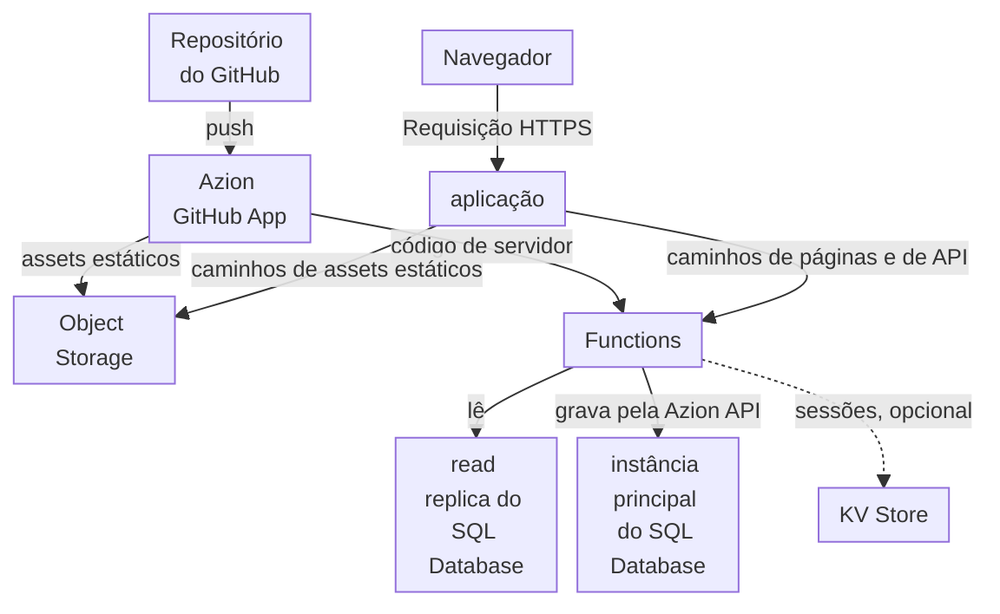

import DocCardGroup from '@aziontech/webkit/doc-card-group'
import DocCard from '@aziontech/webkit/doc-card'

Um time de engenharia de produto constrói uma aplicação web com interface de usuário, lógica de servidor e dados próprios, como um portal de clientes ou um dashboard, para usuários em várias regiões. A interface e a lógica de servidor são entregues juntas a partir de um único repositório Next.js, e os dados são relacionais. Esta página implanta esse repositório a partir do GitHub para que os assets do build sejam servidos de um bucket, as páginas sejam renderizadas a cada requisição por uma function que lê o SQL Database e as gravações passem pela Azion API. Cada push seguinte implanta a aplicação de novo. O resultado é medido pelo tempo de resposta das páginas e da API por região, pela taxa de erros sob carga e pelo tempo entre um commit e a produção.

Este caso de uso não cobre APIs sem interface de usuário, que [Criar APIs REST e GraphQL](/pt-br/documentacao/casos-de-uso/construir-e-executar-aplicacoes/criar-apis-rest-e-graphql/) cobre, nem frontends cujo backend continua em uma origem existente, que [Implantar aplicações front-end](/pt-br/documentacao/casos-de-uso/construir-e-executar-aplicacoes/implantar-aplicacoes-front-end/) cobre.

## Pré-requisitos

- Uma conta Azion. Se você ainda não tem uma, [crie uma conta](https://console.azion.com/signup).
- Um repositório do GitHub com um projeto Next.js na raiz, em uma versão que a Azion suporta. Para as versões e as funcionalidades, consulte [Versões do Next.js](/pt-br/documentacao/devtools/runtime/frameworks/nextjs-compatibility/).
- SQL Database habilitado na sua conta e a permissão **Edit SQL Database**. O produto está em Preview, então solicite acesso pelo [Technical Support](/pt-br/documentacao/suporte/).

---

## Produtos necessários

| A aplicação precisa de | O que significa | Produto | Documentado em |
| --- | --- | --- | --- |
| Páginas renderizadas a cada requisição e rotas de API no mesmo projeto | O código de servidor do build Next.js, implantado como uma function que uma regra executa em todo caminho que não é um asset estático | Functions | [Desenvolva com Next.js](/pt-br/documentacao/guias/desenvolvimento-de-aplicacoes/frameworks/next/) |
| Dados relacionais que as páginas leem e as rotas gravam | Leituras de uma read replica do banco de dados dentro da function, e gravações pela Azion API | SQL Database | [Grave linhas no SQL Database a partir de uma function](/pt-br/documentacao/guias/desenvolvimento-de-aplicacoes/dados/gravar-linhas-no-sql-database-a-partir-de-uma-function/) |
| Assets do build servidos sem executar a function | O resultado estático do build, enviado a um bucket que regras entregam para `/_next/static/` e para tipos de arquivo estático | Object Storage | [Desenvolva com Next.js](/pt-br/documentacao/guias/desenvolvimento-de-aplicacoes/frameworks/next/) |
| Um deploy a cada commit | O repositório importado pelo Azion GitHub App, que implanta cada push | Azion GitHub App (integração) | [Importe um projeto do GitHub](/pt-br/documentacao/guias/desenvolvimento-de-aplicacoes/automacao/importar-um-projeto-existente-do-github/) |

---

## Arquitetura de referência

Esta página constrói a *Aplicação full-stack renderizada no servidor sobre o SQL Database*: um framework de renderização no servidor cujo build se divide em assets estáticos no Object Storage e código de servidor em uma function que lê os armazenamentos da Azion.

Leia o diagrama como dois fluxos. O fluxo de publicação vai do repositório pelo Azion GitHub App, que coloca os assets estáticos do build no Object Storage e o código de servidor em uma function. O fluxo de requisição começa na aplicação, que envia os caminhos de assets estáticos para o bucket e todos os outros caminhos para a function. Toda visualização de página inclui, portanto, uma execução da function e uma leitura de dados, então o banco de dados fica dentro do fluxo de requisição e do fluxo de falha, enquanto os assets estáticos não dependem de nenhum dos dois.

### Fluxo de dados

1. Um push no repositório faz o Azion GitHub App construir o projeto. O build envia os assets estáticos para um bucket do Object Storage e implanta o código de servidor como uma function.
2. A requisição de um navegador chega à aplicação. As regras dela entregam os caminhos sob `/_next/static/` e os tipos de arquivo estático a partir do bucket, sem executar a function.
3. Uma regra executa a function em todos os outros caminhos. A function renderiza a página, ou responde à rota de API, a cada requisição.
4. Para renderizar uma página, a function lê o banco de dados por uma read replica com `Database.open`, que recebe o nome do banco de dados e nenhum token. Uma resposta que é a mesma para todo visitante pode ser guardada com a Cache API do runtime e devolvida em requisições seguintes.
5. Uma rota de API que grava envia o statement ao endpoint de query da Azion API, com o personal token que lê de uma variável de ambiente, e a instância principal aplica a gravação. Um statement que falha ainda responde `200`, com o erro dentro da entrada dele.
6. Quando uma leitura ou uma gravação falha, a function responde o erro para aquela página ou rota, enquanto as requisições pelos assets do build continuam sendo respondidas pelo bucket.

### Recursos de Plataforma

- **Functions**: executam o código de servidor do build. Elas renderizam cada página sob demanda, respondem às rotas de API e são o único caminho até os dados.
- **SQL Database**: guarda os dados relacionais. A instância principal recebe todas as gravações, e as read replicas respondem às leituras que uma function envia com `Database.open`, que é somente leitura.
- **KV Store**: guarda sessões, uma opção de design. Ele tem consistência eventual, então uma sessão gravada em uma localidade pode levar até 60 segundos para ficar visível em todas as outras.
- **Object Storage**: guarda os assets estáticos do build, em um bucket que a aplicação lê, para que eles sejam entregues sem uma execução de function.
- **aplicação**: o Platform Resource cujas regras dividem cada requisição entre o bucket e a function, por caminho.
- **Cache**: guarda as respostas que são as mesmas para todo visitante, para que uma requisição repetida pule a renderização. Uma function guarda uma resposta com a Cache API do runtime, e um `max-age` nela limita por quanto tempo as requisições seguintes a recebem.
- **Azion GitHub App**: a integração que constrói o repositório a cada push e implanta os assets estáticos e a function, para que um commit chegue à produção sem nenhum passo manual.

### Outros designs para este caso de uso

- *Aplicação full-stack renderizada no servidor sobre um banco de dados externo*: para times cujos dados já estão em um banco de dados gerenciado como Neon, MongoDB Atlas, TiDB ou Turso, que as functions de renderização consultam pelo driver serverless ou pela API HTTP dele. Toda visualização de página fora do cache chega ao banco de dados externo, então a latência e a disponibilidade dele entram nos fluxos de requisição e de falha, e o cache e o agrupamento de consultas passam a ser decisões de design.
- *Aplicação full-stack renderizada no cliente sobre o SQL Database*: para times que constroem uma single-page application, cuja interface compilada é servida como arquivos estáticos do Object Storage pelo Cache. O navegador renderiza a interface e chama rotas de API que functions respondem a partir do SQL Database, então os carregamentos de página leem só arquivos estáticos, e a interface e a API são implantadas e falham de forma independente.
- *Aplicação full-stack renderizada no cliente sobre um banco de dados externo*: para single-page applications cujos dados ficam em um banco de dados gerenciado fora da Azion. Os carregamentos de página continuam estáticos, mas toda chamada de dados das functions de API chega ao banco de dados externo, que entra nos fluxos de requisição e de falha da API.

---

## Como o design funciona

Esta seção explica as quatro partes do design do portal: o banco de dados, as credenciais que as gravações usam, o código de servidor e o deploy a partir do GitHub.

### Banco de dados do portal

O portal guarda os registros em um banco de dados chamado `portal-app`. O código de servidor o lê pelo nome e grava nele pelo identificador, então ele é criado pela API, cuja resposta de criação retorna esse identificador. O Azion Console também pode criar o banco de dados e executar statements na aba **Editor**.

### Credenciais do banco de dados

O código de servidor do portal lê por uma read replica, que recusa um statement que grava com ``attempt to write a readonly database``. Por isso, a rota de API dele grava pela Azion API e precisa do identificador do banco de dados e de um personal token. Os dois ficam em variáveis de ambiente com os nomes de chave do portal, para que nenhum deles entre no repositório.

### Código de servidor

O código de servidor do portal são dois arquivos do App Router do Next.js: uma página que lista os projetos e um route handler que cria um projeto. Os dois rodam na function que o build implanta. Os dois exportam `dynamic = 'force-dynamic'`, para que o Next.js os renderize a cada requisição em vez de uma única vez no momento do build, quando o banco de dados está fora de alcance.

### Deploy a partir do GitHub

O portal é implantado pelo Azion GitHub App: a importação constrói o repositório uma vez, e cada push seguinte o implanta de novo. O preset _Next.js_ divide o build. Os assets estáticos vão para um bucket que os workloads só podem ler, e o resto roda como uma function. As regras entregam `/_next/static/` e os tipos de arquivo estático a partir do bucket e executam a function em todos os outros caminhos.

---

## Medindo resultados

| Métrica | Onde ler | Como fica quando funciona |
| --- | --- | --- |
| Tempo de resposta das páginas e da API por região | **Average Request Time** no dashboard **Requests** do Real-Time Metrics, filtrado por **Host** pelo domínio da aplicação e por **Country**. Consulte [Filtre um dashboard de Real-Time Metrics](/pt-br/documentacao/guias/plataforma/observabilidade/adicionar-filtros-metrics/) | Comparável entre os países de onde os seus usuários acessam e estável conforme o tráfego cresce |
| Time to first byte nos navegadores dos seus usuários | O campo `ttfb` do dataset `pulseEvents`, agrupado por `locationhref`, depois que a tag do Edge Pulse está no layout do portal. Consulte [Primeiros passos com Edge Pulse](/pt-br/documentacao/plataforma/edge-pulse/primeiros-passos/) | Estável nas páginas que leem o banco de dados e sem subir depois de um deploy |
| Taxa de erros sob carga | **HTTP Status Codes 5XX** no dashboard **Status Codes**, filtrado pelo domínio da aplicação. Consulte [Dashboards de Build](/pt-br/documentacao/plataforma/real-time-metrics/dashboards-build/#status-codes) | Nenhuma série de `500` subindo com o volume de requisições; uma subida aponta para uma leitura ou gravação que falhou, que a function registra no log |
| Tempo entre um commit e a produção | O tempo entre um push e a primeira requisição que retorna a mudança, como mostra a verificação de push em [Confirme que a página lê e que a rota grava](/pt-br/documentacao/guias/desenvolvimento-de-aplicacoes/dados/ler-e-gravar-no-sql-database-a-partir-de-um-app-nextjs/#confirme-que-a-pagina-le-e-que-a-rota-grava) | Cada push responde com a mudança, em cerca de dois minutos para um deploy depois do primeiro |

---

## Boas práticas

- **Renderize a cada requisição só o que lê o banco de dados.** Uma página exportada com `dynamic = 'force-dynamic'` executa a function e lê uma réplica a cada visualização. Deixe as páginas que não leem nada com os padrões do Next.js, para que o build as grave como resultado estático.
- **Verifique cada statement, não o status HTTP.** O endpoint de query responde `200` quando um statement falha, com `error` na entrada dele. Uma rota que lê só o status reporta um insert que falhou como criado.

- **Mantenha o token de gravação fora do repositório.** Cada push é construído a partir do repositório, então um token commitado nele chega a todos que o leem. Uma variável de ambiente da conta chega só à function, e uma variável secreta nunca é exibida pela CLI.
- **Dê ao token de gravação uma expiração planejada.** Um personal token expira na data escolhida quando ele é criado, e todas as gravações falham a partir desse momento. Substitua-o antes disso e implante de novo, já que um novo valor de variável só chega à function em um deploy. Para as opções de expiração, consulte [Personal tokens](/pt-br/documentacao/guias/plataforma/conta-e-billing/personal-tokens/).
- **Mantenha as sessões fora de um armazenamento que precisa estar atualizado em todos os lugares ao mesmo tempo.** O KV Store, o lugar habitual para sessões neste design, tem consistência eventual: uma gravação pode levar até 60 segundos para ficar visível em todas as localidades. Para o que isso significa para uma sessão, consulte [Como o KV Store funciona](/pt-br/documentacao/plataforma/kv-store/como-funciona/).

---

## Guias deste caso de uso

<DocCardGroup cols={2}>
  <DocCard title="Crie e gerencie bancos de dados" href="/pt-br/documentacao/guias/desenvolvimento-de-aplicacoes/dados/gerenciar-bancos-dados-edge-sql/" label="Cria o banco de dados portal-app pela API, cuja resposta retorna o identificador em que a rota grava." />
  <DocCard title="Crie tabelas e consulte dados" href="/pt-br/documentacao/guias/desenvolvimento-de-aplicacoes/dados/criar-tabelas-edge-sql/" label="Cria a tabela projects e insere a primeira linha que a página renderiza." />
  <DocCard title="Grave linhas no SQL Database a partir de uma function" href="/pt-br/documentacao/guias/desenvolvimento-de-aplicacoes/dados/gravar-linhas-no-sql-database-a-partir-de-uma-function/" label="Armazena as credenciais do banco de dados como variáveis de ambiente e envia as gravações que a rota de API faz." />
  <DocCard title="Leia e grave no SQL Database a partir de um app Next.js" href="/pt-br/documentacao/guias/desenvolvimento-de-aplicacoes/dados/ler-e-gravar-no-sql-database-a-partir-de-um-app-nextjs/" label="Adiciona a página que lista os projetos e o route handler que cria um projeto, e executa as verificações deste caso de uso." />
  <DocCard title="Importe um projeto do GitHub" href="/pt-br/documentacao/guias/desenvolvimento-de-aplicacoes/automacao/importar-um-projeto-existente-do-github/" label="Importa o repositório do portal com o preset Next.js, para que cada push implante os assets e a function." />
</DocCardGroup>
