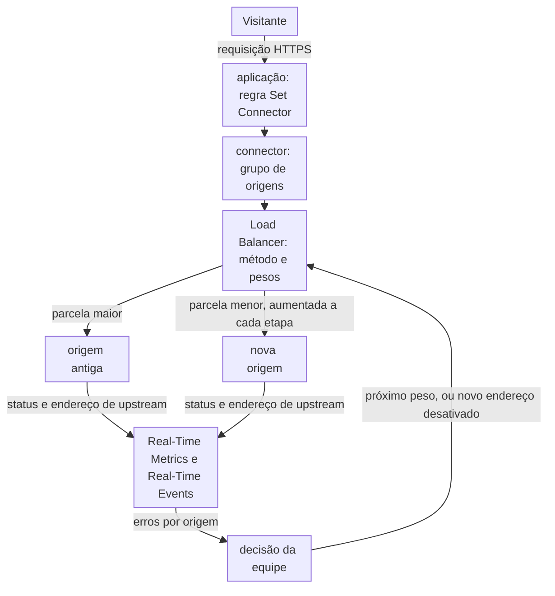
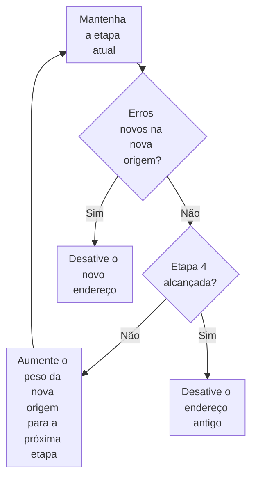

import DocCardGroup from '@aziontech/webkit/doc-card-group'
import DocCard from '@aziontech/webkit/doc-card'

Uma equipe de plataforma ou de SRE está movendo uma aplicação de uma origem para outra, como de um data center para uma nuvem, ou entre duas nuvens. A aplicação não pode sair do ar, e a equipe não pode trocar todos os usuários de uma vez, porque uma falha na nova origem chegaria então a todos. Esta página coloca as duas origens atrás de um connector com Load Balancer, envia uma pequena parcela das requisições para a nova origem, aumenta essa parcela etapa por etapa enquanto acompanha os erros de cada origem e reverte desativando um endereço. O resultado é medido por zero downtime durante a migração, pela taxa de erros na nova origem em cada etapa e pelo tempo para reverter.

Este caso de uso não cobre reescrever a aplicação em funções na Azion. Para isso, consulte [Modernizar uma aplicação monolítica sem reescrevê-la](/pt-br/documentacao/casos-de-uso/construir-e-executar-aplicacoes/modernizar-uma-aplicacao-monolitica-sem-reescreve-la/). Ele também não cobre manter duas origens ativas para failover. Para isso, consulte [Manter uma aplicação no ar quando uma origem falha](/pt-br/documentacao/casos-de-uso/melhorar-performance-e-confiabilidade/manter-uma-aplicacao-no-ar-quando-uma-origem-falha/).

## Pré-requisitos

- Uma conta Azion. Se você ainda não tem uma, [crie uma conta](https://console.azion.com/signup).
- Uma aplicação que serve o site por um connector para a origem antiga, uma regra que envia toda requisição a esse connector e um workload. Para criar a aplicação e o workload, consulte [Primeiros passos com Applications](/pt-br/documentacao/plataforma/applications/primeiros-passos/). Para criar o connector e a regra, consulte [Conecte uma aplicação a uma origem](/pt-br/documentacao/guias/desenvolvimento-de-aplicacoes/primeiros-passos/definir-origens/).
- Duas origens que guardam a mesma aplicação e respondem HTTPS na porta `443` pelo hostname do site. Todo endereço de um connector recebe o mesmo header `Host`, então as duas origens precisam responder pelo nome que o visitante requisitou.

---

## Produtos necessários

| A migração precisa de | O que significa | Produto | Documentado em |
| --- | --- | --- | --- |
| As duas origens atrás do mesmo site, sem mudança de DNS | Um connector que guarda a origem antiga e a nova como dois endereços | Load Balancer | [Coloque as duas origens no connector](/pt-br/documentacao/guias/performance-e-confiabilidade/disponibilidade/mover-o-trafego-entre-duas-origens-por-peso/#coloque-as-duas-origens-no-connector) |
| Uma parcela de requisições que passa para a nova origem etapa por etapa | O método _Round Robin_ e um peso em cada endereço | Load Balancer | [Altere os pesos](/pt-br/documentacao/guias/performance-e-confiabilidade/disponibilidade/mover-o-trafego-entre-duas-origens-por-peso/#altere-os-pesos) |
| Uma reversão que é uma mudança de configuração | O switch **Active** do novo endereço | Load Balancer | [Tire uma origem da rotação](/pt-br/documentacao/guias/performance-e-confiabilidade/disponibilidade/mover-o-trafego-entre-duas-origens-por-peso/#tire-uma-origem-da-rotacao) |
| A parcela do tráfego que cada origem recebe | As requisições do dataset `workloadBreakdownMetrics` agrupadas por endereço de upstream | Real-Time Metrics | [Campos do Real-Time Metrics](/pt-br/documentacao/devtools/graphql/campos-gql-real-time-metrics/#workloadbreakdownmetrics) |
| As requisições com falha da nova origem | A fonte de dados HTTP Requests filtrada por endereço de upstream e status de upstream | Real-Time Events | [Fontes de dados](/pt-br/documentacao/plataforma/real-time-events/fontes-de-dados/#http-requests) |

---

## Arquitetura de referência

Esta página monta o *Pool de origens canário ponderado*: um connector agrupa a origem antiga e a nova, e os pesos do Load Balancer decidem a parcela que cada uma recebe.

Leia o diagrama como dois loops. O loop de requisições vai do visitante, por uma regra, até um connector, onde Load Balancer escolhe uma origem para cada requisição. O loop de controle vai das observações de volta ao Load Balancer: a equipe lê os erros de cada origem e então aumenta o peso da nova origem ou desativa o endereço dela. Nada no loop de requisições muda durante a migração além dos pesos e do switch **Active** de cada endereço, então a aplicação, as regras dela e o DNS continuam como estão.

### Fluxo de dados

1. A requisição de um visitante chega ao workload no domínio do site, e a regra da aplicação, com o behavior _Set Connector_, a envia ao connector que guarda as duas origens.
2. Load Balancer escolhe um endereço ativo do connector na proporção do peso dele sob _Round Robin_, ou pelo endereço IP do cliente sob _IP Hash_. Cada data center balanceia por conta própria, então a divisão é uma proporção, não uma contagem exata.
3. O connector envia a requisição à origem escolhida com o mesmo header `Host`, o mesmo caminho e o mesmo protocolo para os dois endereços.
4. Real-Time Metrics conta as requisições por endereço de upstream, e Real-Time Events registra o endereço e o status da origem que respondeu cada requisição.
5. Enquanto a nova origem não mostra erros novos, a equipe aumenta o peso dela na próxima etapa. Quando aparecem erros, a equipe desativa o novo endereço, e toda requisição volta para a origem antiga quando a mudança chega a cada data center.
6. Quando a nova origem carrega o tráfego sem erros novos, a equipe desativa o endereço antigo, e toda requisição chega à nova origem.

### Recursos de Plataforma

- **connector**: o Platform Resource que agrupa a origem antiga e a nova como endereços. Um connector mantém inalterada, durante a migração, a regra que o nomeia, e a única configuração `Host` dele significa que as duas origens precisam responder pelo mesmo nome.
- **Load Balancer**: escolhe o endereço de cada requisição. Pesos de 1 a 100 definem a parcela de cada origem sob _Round Robin_, o switch **Active** tira um endereço da rotação para uma reversão ou para o cutover, e _IP Hash_ mantém um endereço IP de cliente em uma origem quando as sessões ficam na memória de um servidor.
- **aplicação**: o Platform Resource cuja regra envia toda requisição ao connector. É o roteamento que fica constante enquanto os pesos mudam.
- **Real-Time Metrics**: mostra a parcela de requisições que cada origem recebe, agrupada por endereço de upstream no dataset `workloadBreakdownMetrics`, e os status codes da aplicação. Os datasets dele não combinam o endereço de upstream com um status, então os erros de uma origem vêm do Real-Time Events.
- **Real-Time Events**: guarda um registro por requisição, com o endereço de upstream e o status de upstream, então um filtro lista as requisições com falha da nova origem em cada etapa.

### Outros designs para este caso de uso

- *Cutover de origem por caminho*: para migrações feitas seção por seção, como um site que se move área por área para uma nova plataforma. Rules Engine envia cada caminho migrado a um connector para a nova origem e todos os outros caminhos para a antiga, então o tráfego se move por caminho em vez de por parcela de requisições, e uma seção é revertida apontando a regra dela de volta para o connector antigo.

---

## Como o design funciona

Esta seção explica como o pool de origens, a programação de pesos e a reversão e o cutover movem o tráfego para a nova origem sem downtime.

### Pool de origens

O pool de origens é o connector existente, com Load Balancer ativado e a nova origem adicionada como um segundo endereço. A regra que envia as requisições ao connector fica como está, então a migração nunca toca na aplicação nem no DNS.

A primeira etapa envia cerca de uma requisição em cem para a nova origem: peso `99` no endereço antigo e `1` no novo. Um peso é um número inteiro de 1 a 100, e uma parcela é o peso do endereço em relação à soma de todos os pesos. A parcela é uma proporção, não uma divisão exata, porque cada data center balanceia por conta própria.

O **Host** passa a ser `${host}`, o host que o visitante requisitou, porque um connector envia o mesmo header `Host` aos dois endereços. Um hostname literal da origem antiga chegaria à nova origem sob um nome pelo qual ela pode não responder. **Max Retries**, **Connection Timeout** e **Read/Write Timeout** recebem os valores que o Console preenche, `3`, `30` e `60`, para que as duas interfaces produzam o mesmo connector. Os padrões da API são `0`, `60` e `120` quando o corpo os omite.

### Programação de pesos

A programação de pesos move o tráfego em etapas, e cada etapa altera apenas os dois pesos. Mantenha cada etapa por tempo suficiente para que a nova origem atenda as requisições que expõem as falhas dela, como um intervalo de uma hora completo no Real-Time Metrics, antes de passar para a próxima.

Os pesos de cada etapa somam 100, então cada peso se lê como uma porcentagem. A programação para em `10` para a origem antiga, porque um peso não pode ser `0`. A última passagem para a nova origem é uma mudança no switch **Active**, descrita na próxima seção.

1. Mantenha cada etapa e leia os erros da nova origem.
2. Quando nenhum erro novo aparecer, defina os pesos da próxima etapa.
3. Quando aparecerem erros, reverta desativando o novo endereço.
4. Depois que a etapa 4 se mantiver sem erros novos, desative o endereço antigo para concluir.

### Reversão e cutover

Tanto a reversão quanto o cutover desativam um endereço com o switch **Active** dele. Um endereço desativado fica no connector com o papel e o peso dele, então reativá-lo restaura a etapa que ele deixou.

- **Reversão** desativa `new-origin.example.com`. Toda requisição então chega à origem antiga, e a nova origem mantém o peso dela para a próxima tentativa.
- **Cutover** desativa `old-origin.example.com` depois da etapa 4. Toda requisição então chega à nova origem, e o endereço antigo fica no connector como um caminho de volta até que você o remova.

A mudança leva vários minutos para se propagar, e os data centers a aplicam em momentos diferentes. Mantenha a origem que você desativou respondendo até que nenhuma requisição chegue a ela, o que os registros do Real-Time Events do endereço dela mostram.

---

## Medindo resultados

| Métrica | Onde ler | Como é o funcionamento correto |
| --- | --- | --- |
| Downtime durante a migração | O dashboard **Status Codes** do Real-Time Metrics, filtrado pelo workload, com a tabela **Requests by Status and Upstream Status**. Consulte [Detalhe as requisições por status code](/pt-br/documentacao/guias/plataforma/observabilidade/detalhar-requisicoes-por-status-code/) | O gráfico **HTTP Status Codes 5XX** fica no nível de antes da migração em todas as etapas |
| Taxa de erros na nova origem em cada etapa | Real-Time Events, HTTP Requests, filtrado por `upstream_addr` e `upstream_status`. Consulte [Filtrar eventos](/pt-br/documentacao/guias/plataforma/observabilidade/adicionar-filtros-events/) | As requisições com falha na nova origem ficam na taxa que a origem antiga mostra na mesma etapa |
| Parcela do tráfego por origem | `workloadBreakdownMetrics` agrupado por `upstreamAddr`, em intervalos de uma hora | A parcela da nova origem corresponde à etapa, dentro da variação do balanceamento por data center |
| Tempo para reverter | O tempo entre a mudança em **Active** e o último registro de HTTP Requests com o `upstream_addr` da nova origem | Os registros param dentro do tempo de propagação do connector |

---

## Boas práticas

- **Mantenha Round Robin, a menos que as sessões fiquem na memória de uma origem.** _Round Robin_ distribui as requisições na proporção dos pesos, o que faz de uma etapa uma parcela conhecida. Quando as origens guardam a sessão de cada visitante na memória de um servidor, _IP Hash_ associa cada endereço IP de cliente a um endereço, então um visitante fica em uma origem entre as requisições. Um visitante cujo endereço IP muda, como um celular que passa de uma rede para outra, ainda pode chegar à outra origem, e _IP Hash_ recusa endereços _Backup_. Para os dois métodos, consulte [Métodos de balanceamento](/pt-br/documentacao/plataforma/connectors/load-balancer/metodos-de-balanceamento/).
- **Desative um endereço em vez de excluí-lo.** Um endereço com **Active** desativado mantém o peso e o papel dele, então desfazer uma reversão é um switch. Um endereço excluído precisa ser adicionado de novo com todos os campos, enquanto o tráfego espera.
- **Avalie uma etapa só depois que ela se propagar.** Cada data center aplica uma mudança no connector no próprio momento, então os primeiros minutos depois de uma mudança misturam os pesos antigos e os novos. Para saber como uma mudança se propaga, consulte [Espere a propagação de uma alteração no connector antes de avaliá-la](/pt-br/documentacao/plataforma/connectors/boas-praticas/#espere-a-propagacao-de-uma-alteracao-no-connector-antes-de-avalia-la).
- **Mantenha a origem antiga respondendo depois do cutover.** Alguns data centers enviam requisições ao endereço antigo até receberem a mudança. Desative a origem antiga de vez só depois que o filtro de eventos não mostrar nenhuma requisição chegando a ela.

---

## Guias deste caso de uso

<DocCardGroup cols={2}>
  <DocCard title="Mova o tráfego entre duas origens por peso" href="/pt-br/documentacao/guias/performance-e-confiabilidade/disponibilidade/mover-o-trafego-entre-duas-origens-por-peso/" label="Coloca as duas origens no connector, altera os pesos em cada etapa, tira uma origem da rotação para a reversão ou para o cutover e acompanha a parcela e os erros de cada origem." />
  <DocCard title="Conecte uma aplicação a uma origem" href="/pt-br/documentacao/guias/desenvolvimento-de-aplicacoes/primeiros-passos/definir-origens/" label="Cria o connector para a origem antiga e a regra que envia toda requisição a ele, antes de a migração começar." />
</DocCardGroup>
