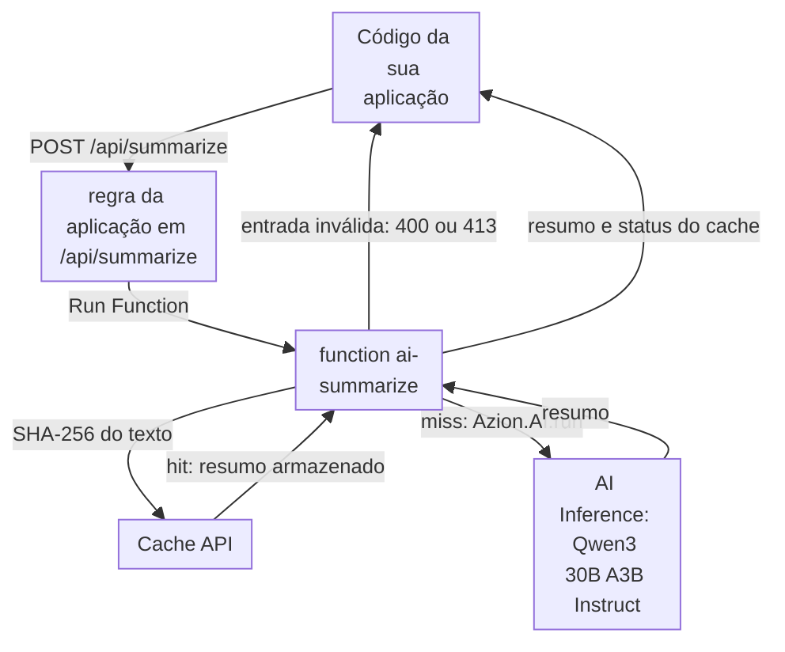

import DocCardGroup from '@aziontech/webkit/doc-card-group'
import DocCard from '@aziontech/webkit/doc-card'

Uma equipe de produto quer funcionalidades de IA, como resumo, classificação, moderação ou compreensão de imagens, em uma aplicação que ela já executa, sem operar infraestrutura de GPU. A aplicação já fica atrás da Azion, e a equipe quer mais uma rota de API que possa chamar a partir do seu código como qualquer outra. Esta página adiciona uma rota de resumo a essa aplicação: uma function valida a requisição, chama um modelo do catálogo do AI Inference, armazena o resultado em cache para textos idênticos e retorna o resumo. O resultado é medido pela latência de inferência por requisição, pelo consumo a cada mil requisições e pela precisão da tarefa em um conjunto de teste.

Este caso de uso não cobre assistentes conversacionais fundamentados em conteúdo da empresa nem o treinamento de modelos do zero. Para assistentes, consulte [Criar e executar assistentes de IA para suporte ao cliente](/pt-br/documentacao/casos-de-uso/construir-e-executar-workloads-de-ai/criar-e-executar-assistentes-de-ia-para-suporte-ao-cliente/).

## Pré-requisitos

- Uma conta Azion. Se você ainda não tem uma, [crie uma conta](https://console.azion.com/signup).
- Uma aplicação e um workload que já servem a sua aplicação, com o **Application Accelerator** ativado, que o behavior **Run Function** exige. Para criá-los, consulte [Primeiros passos com Applications](/pt-br/documentacao/plataforma/applications/primeiros-passos/).

---

## Produtos necessários

| A funcionalidade precisa de | O que significa | Produto | Documentado em |
| --- | --- | --- | --- |
| Um modelo que resume, sem servidor de inferência para operar | Um modelo do catálogo chamado com `Azion.AI.run` | AI Inference | [Chame um modelo no AI Inference a partir de uma function](/pt-br/documentacao/guias/ai/inferencia/chamar-um-modelo-no-ai-inference-a-partir-de-uma-function/) |
| Uma rota de API que valida a entrada e formata a saída | Uma function que a aplicação executa em `/api/summarize` | Functions | [Primeiros passos com Functions](/pt-br/documentacao/plataforma/functions/primeiros-passos/) |
| O mesmo texto resumido uma vez, não a cada requisição | Resultados armazenados e encontrados com a Cache API, pela key de um hash do texto | Cache | [Armazene em cache a resposta de uma function com a Cache API](/pt-br/documentacao/guias/desenvolvimento-de-aplicacoes/functions-e-runtime/armazenar-em-cache-a-resposta-de-uma-function-com-a-cache-api/) |
| Uma visão da frequência com que a rota é executada | O dashboard **Invocations** da aba **Functions** | Real-Time Metrics | [Crie dashboards](/pt-br/documentacao/plataforma/real-time-metrics/dashboards-build/#functions) |
| Uma regra que executa a function na rota | O behavior **Run Function**, que exige o Application Accelerator na aplicação | Application Accelerator | [Execute uma função em uma aplicação](/pt-br/documentacao/guias/desenvolvimento-de-aplicacoes/functions-e-runtime/funcoes-serverless/) |

---

## Arquitetura de referência

Esta página constrói o *Catalog-model inference API*: o modelo é usado como o AI Inference o publica, atrás de uma function que a sua aplicação chama.

Leia o diagrama a partir da function. As setas que chegam à function vêm de uma rota de uma aplicação que já serve o seu tráfego, então o código da sua aplicação alcança o modelo por mais um caminho em um domínio que ele já chama. As setas que saem da function são uma única execução: a function mantém a requisição aberta enquanto o modelo gera, e nenhuma seta leva a um servidor de inferência, porque a function indica um id de modelo e a Azion executa o modelo. O modelo é usado como publicado, então o design não tem etapa de treinamento nem versão de modelo para escolher além do id.

### Fluxo de dados

1. O código da sua aplicação envia `POST /api/summarize` com o texto a resumir, e a regra da aplicação executa a function `ai-summarize`. Todos os outros caminhos mantêm as suas próprias regras.
2. A function valida o corpo antes de qualquer chamada ao modelo e recusa um texto ausente com `400` e um texto com mais de 20.000 caracteres com `413`.
3. A function calcula o hash do texto e procura esse hash no cache. Uma correspondência retorna o resumo armazenado sem chamar o modelo.
4. Em um miss, a function envia o texto ao modelo do catálogo com `Azion.AI.run`, com uma instrução para resumi-lo, e o AI Inference executa o modelo e retorna o resumo.
5. A function armazena o resumo no cache sob o hash, por um dia.
6. A function retorna o resumo e se ele veio do cache.

### Recursos de Plataforma

- **aplicação**: o Platform Resource que encaminha `/api/summarize` para a function. A rota é uma regra na aplicação que já serve o seu tráfego, então o domínio, o certificado TLS e qualquer autenticação na frente dela são os que a aplicação já tem. A Azion não emite credencial para uma chamada de modelo, então uma rota sem verificação própria responde a qualquer um que a alcance.
- **Functions**: trata cada requisição. A function `ai-summarize` guarda o prompt, o id do modelo, os limites de entrada e o formato da resposta, então cada decisão sobre o que o modelo recebe é código que a sua equipe controla.
- **AI Inference**: executa o modelo do catálogo, `Qwen/Qwen3-30B-A3B-Instruct-2507-FP8`. A sua equipe não carrega nenhum modelo nem dimensiona nenhum cluster, e o id da página do modelo é o único endereço de que a function precisa.
- **Cache**: armazena resultados para entradas repetidas, uma opção de design. A function usa como key de um resultado um hash da sua entrada pela Cache API, e só o usa para tarefas cuja saída é a mesma para toda entrada idêntica.
- **Real-Time Metrics**: mostra a latência e o volume da rota. Um design sem servidor de inferência próprio ainda precisa de uma visão do que a rota transportou.

### Outros designs para este caso de uso

- *Fine-tuned inference API with LoRA adapters*: para equipes cuja tarefa precisa de um modelo especializado. A equipe treina um adaptador LoRA com o seu próprio conjunto de dados no LoRA Fine-Tune, avalia o adaptador e serve o modelo base com ele no AI Inference atrás do mesmo tipo de API em uma function, o que acrescenta um fluxo de controle de treinamento e avaliação e uma decisão de versão de modelo antes de servir.

---

## Como o design funciona

Esta seção explica a function de resumo e a rota que a executa, e o motivo de cada escolha.

### Function de resumo

A function é a funcionalidade inteira: ela decide o que é pedido ao modelo, o que ele pode receber e o que quem chama recebe de volta.

- **O modelo é `Qwen/Qwen3-30B-A3B-Instruct-2507-FP8`.** A página dele lista o resumo entre os seus usos, ele serve uma janela de contexto de 64k tokens e é o modelo que o AI Inference Starter Kit chama. A function o chama como [Chame um modelo no AI Inference a partir de uma function](/pt-br/documentacao/guias/ai/inferencia/chamar-um-modelo-no-ai-inference-a-partir-de-uma-function/) descreve, com `stream` definido como `false` e a instrução de resumo como a mensagem `system`.
- **Um texto tem no máximo 20.000 caracteres.** O modelo lê cada caractere que recebe, e a function espera enquanto ele lê, então um limite na entrada é um limite na espera. O campo `usage.prompt_tokens` da resposta mostra quanto um texto consumiu, que é como ajustar o limite.
- **`max_tokens` é `300`.** Um resumo é curto por definição, e o limite encerra uma geração que se estende demais.
- **Um resultado fica em cache por um dia sob o SHA-256 do texto.** O mesmo texto gera um resumo que quem chama pode reutilizar, então um texto repetido não custa nenhuma chamada ao modelo. A function armazena em cache como [Armazene em cache a resposta de uma function com a Cache API](/pt-br/documentacao/guias/desenvolvimento-de-aplicacoes/functions-e-runtime/armazenar-em-cache-a-resposta-de-uma-function-com-a-cache-api/) descreve, com o cache `ai-summarize`, a key `https://ai-summarize.cache/<sha-256 of the text>` e `max-age=86400`.
- **O texto do modelo é lido com optional chaining.** Uma resposta sem um dos níveis gera um resumo vazio, que a function informa como `502`, em vez de uma exceção.

### Rota de API

A rota é uma regra na aplicação que já serve a sua aplicação. Ela corresponde exatamente a `/api/summarize`, então nenhum outro caminho da sua aplicação executa a function, e é executada na Request Phase, porque a function produz a resposta inteira.

---

## Medindo resultados

| Métrica | Onde ler | Como é quando funciona |
| --- | --- | --- |
| Latência de inferência por requisição | O **Request Time** das requisições para `/api/summarize`, na fonte de dados **HTTP Requests** do [Real-Time Events](/pt-br/documentacao/plataforma/real-time-events/fontes-de-dados/#http-requests) | As requisições respondidas a partir do cache são mais rápidas que os misses, e os misses ficam estáveis à medida que o volume cresce |
| Volume de requisições | **Total Invocations** no dashboard **Invocations** da aba **Functions** no [Real-Time Metrics](/pt-br/documentacao/plataforma/real-time-metrics/dashboards-build/#functions) | Acompanha o próprio tráfego da sua aplicação para a funcionalidade |
| Consumo a cada mil requisições | `compute_time` sobre `invocations`, vezes 1.000, a partir do dataset de consumo em [Consulte dados de uso de Functions](/pt-br/documentacao/guias/plataforma/observabilidade/consultar-dados-de-uso-edge-functions-com-graphql/). Functions e AI Inference são cobrados cada um pela sua própria tarifa, em [Preços](/pt-br/documentacao/fundamentos/precos/) | Cai à medida que a parcela de respostas em cache sobe |
| Precisão da tarefa em um conjunto de teste | Um conjunto fixo de textos com resumos de referência, enviado para `/api/summarize` depois de cada mudança no prompt ou no modelo | Se mantém ou sobe de uma execução para a outra |

---

## Boas práticas

- **Valide na function, antes da chamada ao modelo.** A function é o único lugar em que uma requisição pode ser recusada antes de um modelo ser executado, e cada chamada ao modelo consome Compute Time. Para o raciocínio, consulte [Boas práticas do AI Inference](/pt-br/documentacao/plataforma/ai-inference/boas-praticas/).
- **Armazene em cache apenas tarefas cuja saída pode ser reutilizada.** Um resumo de um texto idêntico pode valer para toda requisição que o envia. Uma tarefa cuja resposta precisa ser diferente por usuário ou por momento, como uma que lê a hora atual, não pode passar pelo cache.
- **Copie o id do modelo da página dele.** Os ids de modelo não seguem um único formato, então um id derivado do nome do modelo pode estar errado para outro modelo. Para mudar o modelo, copie o id de [Modelos de AI](/pt-br/documentacao/plataforma/ai-inference/modelos/) e mude o nome do cache, para que resumos do modelo antigo não sejam retornados para o novo.
- **Adicione autenticação quando a rota for pública.** A rota responde a qualquer um que alcance o seu domínio, e cada miss executa um modelo. Quando a sua aplicação tem uma sessão ou uma API key, verifique-a na function antes da busca no cache.

---

## Guias deste caso de uso

<DocCardGroup cols={2}>
  <DocCard title="Resuma texto com AI Inference e armazene o resumo em cache" href="/pt-br/documentacao/guias/ai/inferencia/resumir-texto-com-ai-inference-e-armazenar-o-resumo-em-cache/" label="Guarda o código da function ai-summarize, cria a sua instância e executa as verificações deste caso de uso." />
  <DocCard title="Execute uma função em uma aplicação" href="/pt-br/documentacao/guias/desenvolvimento-de-aplicacoes/functions-e-runtime/funcoes-serverless/" label="Cria a regra que executa a function em /api/summarize, no Azion Console ou pela API." />
  <DocCard title="Armazene em cache a resposta de uma function com a Cache API" href="/pt-br/documentacao/guias/desenvolvimento-de-aplicacoes/functions-e-runtime/armazenar-em-cache-a-resposta-de-uma-function-com-a-cache-api/" label="Armazena cada resumo sob o hash do seu texto e o retorna para o mesmo texto." />
  <DocCard title="Chame um modelo no AI Inference a partir de uma function" href="/pt-br/documentacao/guias/ai/inferencia/chamar-um-modelo-no-ai-inference-a-partir-de-uma-function/" label="Envia o texto ao modelo do catálogo com Azion.AI.run e lê o resumo na resposta." />
</DocCardGroup>
