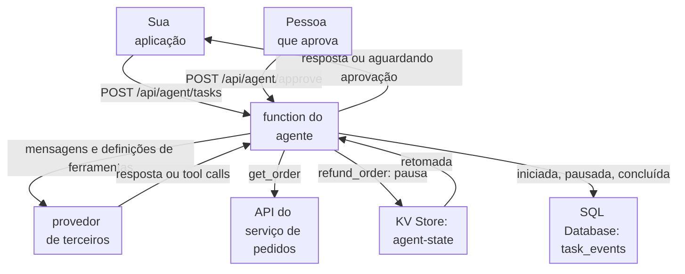

import DocCardGroup from '@aziontech/webkit/doc-card-group'
import DocCard from '@aziontech/webkit/doc-card'

Uma equipe de produto ou de operações cria agentes que concluem tarefas em vez de apenas responder: eles chamam APIs internas e ferramentas SaaS, mantêm o estado entre etapas e passam a vez a uma pessoa para aprovação quando necessário. Um modelo que pode chamar ferramentas ainda não decide nada sozinho. Algo precisa executar o loop, executar cada ferramenta que o modelo pede, parar antes de uma ação que uma pessoa precisa aprovar e lembrar onde a tarefa parou. Esta página executa esse loop como uma function na Azion com um modelo com tool calling de um provedor de terceiros, mantém as tarefas pausadas no KV Store e registra cada tarefa no SQL Database. O resultado é medido pela taxa de conclusão de tarefas, pelas etapas e pela latência por tarefa e pela parcela de ações que precisaram de aprovação humana.

Este caso de uso não cobre assistentes que apenas respondem a partir de conteúdo da empresa nem a exposição de ferramentas a agentes externos. Para esses, consulte [Criar e executar assistentes de IA para suporte ao cliente](/pt-br/documentacao/casos-de-uso/construir-e-executar-workloads-de-ai/criar-e-executar-assistentes-de-ia-para-suporte-ao-cliente/) e [Implantar servidores MCP remotos](/pt-br/documentacao/casos-de-uso/construir-e-executar-workloads-de-ai/implantar-servidores-mcp-remotos/).

## Pré-requisitos

- Uma conta Azion. Se você ainda não tem uma, [crie uma conta](https://console.azion.com/signup).
- Uma aplicação e um workload que servem o seu domínio, com o **Application Accelerator** ativado, que o behavior **Run Function** exige. Para criá-los, consulte [Primeiros passos com Applications](/pt-br/documentacao/plataforma/applications/primeiros-passos/).
- KV Store e SQL Database habilitados na conta. Os dois estão em Preview e não vêm habilitados por padrão, então solicite acesso pelo [Technical Support](/pt-br/documentacao/suporte/).
- Um provedor de terceiros cujo endpoint de chat aceite o formato de chat completions da OpenAI com definições de ferramentas, com a URL dele, o nome de um modelo que suporte tool calling e uma API key.

---

## Produtos necessários

| O agente precisa de | O que significa | Produto | Documentado em |
| --- | --- | --- | --- |
| Um loop que envia a tarefa ao modelo, executa as ferramentas que ele pede e para quando ele responde | Uma function que chama o provedor e as APIs internas com `fetch()` | Functions | [Primeiros passos com Functions](/pt-br/documentacao/plataforma/functions/primeiros-passos/) |
| Uma tarefa pausada que retoma de onde parou | As mensagens da tarefa e a ação pendente, armazenadas sob o ID da tarefa até que uma pessoa decida | KV Store | [KV Store API](/pt-br/documentacao/devtools/runtime/api-reference/kv-store/) |
| Um registro de cada tarefa, das suas etapas e das suas aprovações | Uma tabela `task_events` gravada pela API da Azion | SQL Database | [Grave linhas no SQL Database a partir de uma function](/pt-br/documentacao/guias/desenvolvimento-de-aplicacoes/dados/gravar-linhas-no-sql-database-a-partir-de-uma-function/) |
| Regras que executam a function nos caminhos do agente | O behavior **Run Function**, que exige o Application Accelerator na aplicação | Application Accelerator | [Execute uma função em um caminho e reverta-o](/pt-br/documentacao/guias/desenvolvimento-de-aplicacoes/functions-e-runtime/executar-uma-funcao-em-um-caminho-e-reverter/) |

O modelo vem do provedor de terceiros. Uma equipe que executa o modelo no AI Inference chama um modelo cuja capacidade Tool calling é Yes em [Modelos de AI](/pt-br/documentacao/plataforma/ai-inference/modelos/), com o mesmo array `tools`.

---

## Arquitetura de referência

Esta página constrói o *Tool-calling agent over third-party LLMs*: cada etapa do loop chama a API do provedor, e as ferramentas são executadas na function.

Leia o diagrama a partir da function. O loop fica na function, e cada volta dele passa pelo provedor: a seta para o provedor é percorrida uma vez por etapa, então a latência do provedor se multiplica pelo número de etapas, e as falhas dele podem encerrar uma tarefa em qualquer etapa. A seta para o serviço de pedidos só sai da Azion quando a ferramenta é um serviço externo. O KV Store e o SQL Database guardam o que precisa sobreviver a uma requisição: o estado de uma tarefa que espera por uma pessoa e o registro do que cada tarefa fez.

### Fluxo de dados

1. A sua aplicação envia uma tarefa para `POST /api/agent/tasks`, e a regra da aplicação executa a function do agente. A function dá um ID à tarefa, a registra como iniciada e envia a tarefa e as definições de ferramentas ao provedor com a chave do provedor.
2. Quando o modelo pede `get_order`, a function chama o serviço de pedidos com o token do backend e envia o resultado de volta ao modelo como a próxima mensagem.
3. Quando o modelo pede `refund_order`, a function armazena as mensagens da tarefa e o reembolso pendente no KV Store, registra a pausa e responde `awaiting_approval`.
4. Uma pessoa envia a decisão para `POST /api/agent/approve`. A function lê a tarefa do KV Store, executa o reembolso apenas quando aprovado e retoma o loop.
5. Quando o modelo responde com texto e sem tool call, a function registra a tarefa como concluída e retorna a resposta.
6. Uma chamada ao provedor que falha encerra a tarefa com `502`, e a function grava essa falha no seu log. Um design que acrescenta um segundo provedor move a tarefa para ele, então as chaves dos provedores, a latência e o fallback são decididos na function. Uma tarefa que chega a seis etapas para com `step_limit`.

### Recursos de Plataforma

- **Functions**: executa o loop do agente e a execução das ferramentas. O loop, o limite de etapas, a regra de aprovação e a decisão de fallback são código na function `ops-agent`, e a chave do provedor é uma variável de ambiente que a function lê.
- **provedor de LLM de terceiros**: a integração que raciocina a cada etapa e escolhe as ferramentas. É a única parte que a Azion não opera, então a disponibilidade, os rate limits e a cobrança dele ficam com o provedor.
- **LangGraph**: o framework de agentes, uma opção de design. Ele é executado dentro da function no lugar de um loop escrito à mão, como faz o LangGraph AI Agent Boilerplate.
- **KV Store**: guarda o estado das etapas entre requisições, no namespace `agent-state`, lido e gravado por uma key por tarefa. Uma tarefa pausada retoma a partir dele, e uma expiração na key descarta uma tarefa sobre a qual ninguém decide.
- **SQL Database**: guarda o histórico das tarefas na tabela `task_events`, uma linha por evento, então a taxa de conclusão, as etapas por tarefa e as aprovações são contadas com SQL. Uma function o abre por uma réplica de leitura, então o histórico é gravado pela API da Azion.
- **APIs internas e ferramentas SaaS**: as integrações sobre as quais as ferramentas agem, aqui o serviço de pedidos em `https://api.example.com/v1`. Cada ferramenta é uma chamada da function, com credenciais que a function lê de variáveis de ambiente.
- **aplicação**: o Platform Resource que serve a API do agente. As regras dela executam a function nos caminhos do agente.

### Outros designs para este caso de uso

- *Tool-calling agent on platform-hosted models*: para equipes que mantêm o agente inteiro na Azion. A function envia a tarefa e as definições de ferramentas a um modelo com tool calling no AI Inference em vez de um provedor, então o raciocínio e a execução das ferramentas ficam dentro da Azion e apenas as tool calls saem dela.

---

## Como o design funciona

Esta seção explica onde o agente guarda os seus dados e como a function do agente executa, pausa e registra uma tarefa.

### Armazenamentos do agente

O agente guarda dois tipos de dados, e cada um vai para onde o seu padrão de acesso se encaixa:

- **Uma tarefa pausada vai para o KV Store.** A function a lê e grava por uma key, `task:<task-id>`, e apenas quando uma tarefa pausa ou retoma, muito abaixo da uma gravação por segundo que o KV Store aceita em uma key. Cada gravação define `expirationTtl` como `86400`, então uma tarefa sobre a qual ninguém decide é descartada depois de um dia.
- **O histórico das tarefas vai para o SQL Database.** Uma linha por evento permite contar conclusões, etapas e aprovações com SQL. Uma function abre o SQL Database por uma réplica de leitura, então o agente grava as linhas pela API da Azion, com um personal token.

### Function do agente

A function do agente executa o loop em `/api/agent/tasks` e o retoma em `/api/agent/approve`. As decisões que ela aplica:

- **O loop para em seis etapas.** Uma etapa é uma chamada ao provedor mais as ferramentas que ela pede. Seis etapas limitam o tempo em que uma tarefa mantém uma requisição e mantêm uma invocação bem dentro das 50 chamadas `fetch()` de saída que uma function pode fazer.
- **O resultado de uma ferramenta volta como uma mensagem `user`.** A mensagem diz `Result of <tool>: <JSON>`, e o pedido de ferramenta do modelo volta como uma mensagem `assistant` que indica as ferramentas que ele chamou. As duas usam apenas os papéis `system`, `user` e `assistant` que [Invocação de modelos](/pt-br/documentacao/plataforma/ai-inference/invocacao-de-modelos/#objetos-de-mensagem) documenta para o formato de chat.
- **`refund_order` pausa a tarefa.** Uma ferramenta em `APPROVAL_TOOLS` nunca é executada a partir do loop. A function armazena a tarefa e retorna a ação para uma pessoa decidir, e o caminho de aprovação a executa apenas quando a decisão é `approved`.
- **O caminho de aprovação verifica um segredo, e uma ação pendente é executada uma vez.** A function limpa a ação pendente no KV Store antes de executar a ferramenta, então uma segunda aprovação da mesma tarefa responde `404`.
- **Cada ID de tarefa é validado.** O ID é um UUID que a function gerou, e o caminho de aprovação recusa qualquer outro valor antes que o ID chegue a uma instrução SQL.
- **As chaves ficam fora do código.** A chave do provedor, o token do backend, o segredo de quem aprova e o personal token são variáveis de ambiente.
- **Cada evento é uma linha do histórico.** `record()` a grava como [Grave linhas no SQL Database a partir de uma function](/pt-br/documentacao/guias/desenvolvimento-de-aplicacoes/dados/gravar-linhas-no-sql-database-a-partir-de-uma-function/) descreve, com `SQL_DATABASE_ID` e `AZION_TOKEN`. Uma gravação que falha é registrada no log como `history_write_failed` e não interrompe a tarefa.

---

## Medindo resultados

| Métrica | Onde ler | Como é quando funciona |
| --- | --- | --- |
| Taxa de conclusão de tarefas | `SELECT COUNT(DISTINCT task_id) FROM task_events WHERE event = 'completed';` sobre a mesma contagem para `started`, pela API do SQL Database | A maioria das tarefas é concluída. Um aumento de `step_limit` ou `failed` aponta para um prompt, uma ferramenta ou o provedor |
| Etapas por tarefa | O campo `steps` dos eventos `completed` em `task_events` | Estável por tipo de tarefa. Uma tarefa que continua chegando a seis etapas precisa de uma descrição de ferramenta melhor ou de uma tarefa mais restrita |
| Latência por tarefa | O **Request Time** das requisições para `/api/agent/tasks`, na fonte de dados **HTTP Requests** do [Real-Time Events](/pt-br/documentacao/plataforma/real-time-events/fontes-de-dados/#http-requests) | Cresce com as etapas e se mantém estável para o mesmo tipo de tarefa |
| Parcela de ações que precisaram de aprovação humana | A contagem de eventos `awaiting_approval` sobre a contagem de eventos `started` | Corresponde à parcela de tarefas que pedem um reembolso, e os eventos `rejected` continuam raros |

---

## Boas práticas

- **Coloque toda ação que altera dados atrás de aprovação até que o histórico dela esteja limpo.** O modelo decide quando chamar uma ferramenta, então uma ferramenta que movimenta dinheiro ou exclui dados só é executada depois que uma pessoa a aprova. Tire uma ferramenta de `APPROVAL_TOOLS` apenas quando `task_events` mostrar que as aprovações dela são rotineiras.
- **Descreva cada ferramenta para o modelo, não para um desenvolvedor.** O modelo escolhe uma ferramenta pela `description` dela e preenche os `parameters` a partir do schema. Uma descrição que diz quando usar a ferramenta e um schema que marca cada campo como `required` reduzem as etapas que uma tarefa leva.
- **Mantenha o limite de etapas e leia as tarefas que chegam a ele.** Um loop sem limite é executado até que o limite de 5 minutos de tempo de execução da function ou as 50 chamadas de saída dela o interrompam. O evento `step_limit` indica as tarefas a examinar.
- **Grave o histórico das tarefas pela API e verifique cada entrada.** A API do SQL Database responde `200` mesmo quando uma instrução falha, com `error` na entrada dessa instrução, então a function lê cada entrada e registra no log uma gravação que falhou. Para os formatos de erro, consulte [Boas práticas do SQL Database](/pt-br/documentacao/plataforma/sql-database/boas-praticas/).

---

## Guias deste caso de uso

<DocCardGroup cols={2}>
  <DocCard title="Pause um agente para aprovação com KV Store" href="/pt-br/documentacao/guias/ai/agentes-e-rag/pausar-um-agente-para-aprovacao-com-kv-store/" label="Armazena as variáveis de ambiente, guarda o código da function ops-agent e executa as verificações deste caso de uso." />
  <DocCard title="Deduplique entregas de webhook com KV Store" href="/pt-br/documentacao/guias/desenvolvimento-de-aplicacoes/dados/deduplicar-entregas-de-webhook-com-kv-store/" label="Cria o namespace agent-state pela API do KV Store." />
  <DocCard title="Crie e gerencie bancos de dados" href="/pt-br/documentacao/guias/desenvolvimento-de-aplicacoes/dados/gerenciar-bancos-dados-edge-sql/" label="Cria o banco de dados agent-history pela API." />
  <DocCard title="Crie tabelas e consulte dados" href="/pt-br/documentacao/guias/desenvolvimento-de-aplicacoes/dados/criar-tabelas-edge-sql/" label="Cria a tabela task_events pela API." />
  <DocCard title="Grave linhas no SQL Database a partir de uma function" href="/pt-br/documentacao/guias/desenvolvimento-de-aplicacoes/dados/gravar-linhas-no-sql-database-a-partir-de-uma-function/" label="Grava uma linha de task_events por evento e verifica cada entrada de instrução." />
  <DocCard title="Execute uma função em um caminho e reverta-o" href="/pt-br/documentacao/guias/desenvolvimento-de-aplicacoes/functions-e-runtime/executar-uma-funcao-em-um-caminho-e-reverter/" label="Cria a regra que executa a function do agente em /api/agent/ e a desativa para reverter." />
</DocCardGroup>
