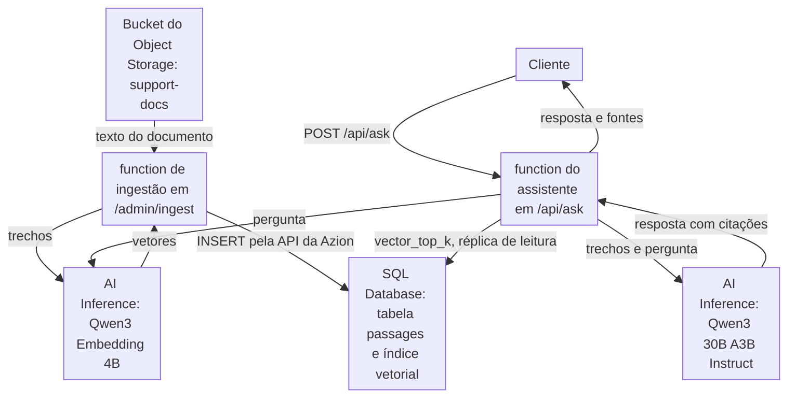

import DocCardGroup from '@aziontech/webkit/doc-card-group'
import DocCard from '@aziontech/webkit/doc-card'

Uma equipe de suporte ou de produto quer um assistente que responda aos clientes a partir da documentação, da central de ajuda ou dos dados de produto da empresa, e não do conhecimento geral de um modelo. Um modelo sozinho responde a partir do que aprendeu no treinamento, então ele não tem como conhecer uma política de devolução ou um limite de plano que só os seus documentos informam. Esta página configura o assistente inteiro na Azion: uma function divide os documentos armazenados no Object Storage, gera o embedding de cada trecho com um modelo do AI Inference e armazena os trechos no SQL Database para vector search. Uma segunda function gera o embedding de cada pergunta, recupera os trechos mais próximos e pede a um modelo do AI Inference que responda a partir deles e os cite. O resultado é medido pela latência das respostas, pela parcela de respostas que citam fontes recuperadas e pela precisão das respostas em um conjunto de teste.

Este caso de uso não cobre funcionalidades de IA que não são conversacionais. Para essas, consulte [Adicionar funcionalidades de IA a aplicações existentes](/pt-br/documentacao/casos-de-uso/construir-e-executar-workloads-de-ai/adicionar-funcionalidades-de-ia-a-aplicacoes-existentes/).

## Pré-requisitos

- Uma conta Azion. Se você ainda não tem uma, [crie uma conta](https://console.azion.com/signup).
- Uma aplicação e um workload que servem o seu domínio, com o **Application Accelerator** ativado, que o behavior **Run Function** exige. Para criá-los, consulte [Primeiros passos com Applications](/pt-br/documentacao/plataforma/applications/primeiros-passos/).
- SQL Database habilitado na conta. O produto está em Preview e não vem habilitado por padrão, então solicite acesso pelo [Technical Support](/pt-br/documentacao/suporte/).
- Um bucket do Object Storage com `workloads_access` definido como `read_only`, que guarda os documentos como arquivos de texto UTF-8 ou Markdown. Para criar o bucket e enviar os arquivos, consulte [Primeiros passos com Object Storage](/pt-br/documentacao/plataforma/object-storage/primeiros-passos/).

---

## Produtos necessários

| O assistente precisa de | O que significa | Produto | Documentado em |
| --- | --- | --- | --- |
| Os documentos da empresa em um único lugar de onde o assistente lê | Um bucket que a function de ingestão lê com o módulo `azion:storage` | Object Storage | [Object Storage API](/pt-br/documentacao/devtools/runtime/api-reference/storage/) |
| Trechos que podem ser encontrados pelo significado, não por palavra-chave | Uma tabela com uma coluna vetorial e um índice vetorial, consultada com `vector_top_k` | SQL Database | [Vector search](/pt-br/documentacao/plataforma/sql-database/vector-search/) |
| Um vetor para cada trecho e cada pergunta, e uma resposta escrita a partir dos trechos | Um modelo de embedding e um modelo de chat chamados com `Azion.AI.run` | AI Inference | [Gere embeddings de documentos em uma tabela vetorial com AI Inference](/pt-br/documentacao/guias/ai/agentes-e-rag/gerar-embeddings-de-documentos-em-uma-tabela-vetorial/) |
| Código que divide, gera embeddings, recupera e monta o prompt | Duas functions, cada uma executada por uma regra no seu próprio caminho | Functions | [Primeiros passos com Functions](/pt-br/documentacao/plataforma/functions/primeiros-passos/) |
| Regras que executam uma function em um caminho | O behavior **Run Function**, que exige o Application Accelerator na aplicação | Application Accelerator | [Como Functions funciona](/pt-br/documentacao/plataforma/functions/como-funciona/#fases-de-execucao-e-criterios) |

---

## Arquitetura de referência

Esta página constrói o *Retrieval-augmented assistant on platform-hosted models*: os documentos, os vetores, a recuperação e os dois modelos ficam na Azion.

O diagrama tem dois fluxos que se encontram no banco de dados. O fluxo de ingestão, no topo, é executado quando um documento muda: ele transforma um documento em trechos e vetores e os grava na tabela `passages`. O fluxo de requisição é executado a cada pergunta: a function do assistente gera o embedding da pergunta, recupera trechos pela distância vetorial e pede ao modelo de chat que responda a partir deles. Os dois modelos são executados no AI Inference, então nenhum dos fluxos sai da Azion. Uma chamada ao modelo que falha termina dentro da function, e a function decide o que o cliente recebe.

### Fluxo de dados

1. Um operador envia `POST /admin/ingest` com a key de um documento, e a function de ingestão lê esse documento do bucket `support-docs` no Object Storage.
2. A function divide o documento em trechos, gera o embedding de todos eles em uma chamada ao modelo de embedding do AI Inference e os grava na tabela `passages` pela API da Azion, porque a conexão do runtime com um banco de dados é somente leitura.
3. Um cliente envia uma pergunta para `POST /api/ask`. A regra da aplicação executa a function do assistente, que gera o embedding da pergunta com o mesmo modelo de embedding.
4. A function do assistente pede ao índice vetorial de `passages` os quatro trechos mais próximos da pergunta, por uma réplica de leitura do banco de dados.
5. A function envia os trechos, os turnos anteriores da conversa e a pergunta ao modelo de chat do AI Inference, que responde e cita os trechos que usou.
6. A function retorna ao cliente a resposta e a lista das suas fontes. Uma chamada ao modelo que falha termina dentro da function, então o fluxo de falha fica dentro da Azion.

### Recursos de Plataforma

- **Functions**: executa a ingestão e a recuperação. A function `support-ingest` divide os documentos e gera os embeddings deles, e a function `support-assistant` gera o embedding da pergunta, recupera os trechos, monta o prompt e chama o modelo de chat. Os dois modelos são acessados com `Azion.AI.run`, então o código não indica nenhum host e não guarda nenhuma credencial de modelo.
- **AI Inference**: executa o modelo de embedding, `Qwen/Qwen3-Embedding-4B`, que transforma trechos e perguntas em vetores, e o modelo de chat, `Qwen/Qwen3-30B-A3B-Instruct-2507-FP8`, que escreve a resposta. Os dois são executados na infraestrutura da Azion, o que mantém o fluxo de requisição e as suas falhas dentro da Azion.
- **SQL Database**: armazena os trechos, os documentos de origem e os vetores em uma tabela, `passages`, no banco de dados `support-kb`. O assistente os lê por uma réplica de leitura, e a ingestão os grava pela API da Azion.
- **Vector Search**: a Feature do SQL Database que ordena os trechos pela distância vetorial. O índice vetorial `passages_idx` responde a `vector_top_k` sem comparar a pergunta com cada linha, então a recuperação lê um número fixo de trechos, por maior que a tabela fique.
- **Object Storage**: guarda os documentos de origem no bucket `support-docs`. A function de ingestão os lê pela key, então os documentos continuam sendo a única cópia da qual os trechos derivam.
- **aplicação**: o Platform Resource que recebe as perguntas e serve o front-end. As regras dela decidem qual caminho executa qual function, e são executadas antes da function.

### Outros designs para este caso de uso

- *Retrieval-augmented assistant over third-party LLMs*: para equipes comprometidas com um provedor de modelos, como OpenAI ou Anthropic. Uma function na Azion continua recuperando os trechos do SQL Database, mas os envia com a pergunta à API do provedor e mantém o estado da conversa entre os turnos, então a geração passa por um provedor externo e acrescenta as chaves do provedor, a latência do provedor e as decisões de fallback ao fluxo de requisição.

---

## Como o design funciona

Esta seção explica a tabela de trechos e as duas functions que a gravam e a leem, e o motivo de cada escolha.

### Tabela de trechos

A tabela de trechos guarda cada trecho, o documento de onde ele veio e o seu vetor. A coluna vetorial declara `F32_BLOB(1024)` porque as functions pedem vetores de 1.024 dimensões ao `Qwen/Qwen3-Embedding-4B`, uma das cinco larguras que o modelo retorna. A coluna e a requisição precisam informar o mesmo número, e um vetor mais estreito armazena menos por trecho. O índice usa a métrica de cosseno, e a tabela tem `INTEGER PRIMARY KEY AUTOINCREMENT`, porque um índice vetorial exige um `ROWID` ou uma chave primária de coluna única.

### Function de ingestão

A function de ingestão transforma um documento em linhas de `passages`. Ela lê, divide e gera os embeddings do documento como [Gere embeddings de documentos em uma tabela vetorial com AI Inference](/pt-br/documentacao/guias/ai/agentes-e-rag/gerar-embeddings-de-documentos-em-uma-tabela-vetorial/) descreve, e grava as linhas como [Grave linhas no SQL Database a partir de uma function](/pt-br/documentacao/guias/desenvolvimento-de-aplicacoes/dados/gravar-linhas-no-sql-database-a-partir-de-uma-function/) descreve, com os valores do assistente:

- **Caminho**: `POST /admin/ingest?key=<object-key>`, um documento por requisição. A rota grava no banco de dados, então ela recusa uma requisição sem o segredo de ingestão.
- **Trechos**: sequências de parágrafos de até 1.500 caracteres. Um trecho curto aponta a resposta para uma seção de um documento, e quatro deles ainda cabem no prompt com espaço para a conversa. Um único parágrafo maior que isso continua sendo um trecho, que a janela de contexto de 32k tokens do modelo de embedding lê inteiro.
- **Trechos por documento**: no máximo 99, para que o `DELETE` das linhas antigas do documento e um `INSERT` por trecho caibam em uma chamada de 100 instruções. Um documento mais longo é recusado com `413`, então divida-o em dois arquivos.
- **Vetores**: `Qwen/Qwen3-Embedding-4B` em 1.024 dimensões, a largura da coluna `embedding`.

### Function do assistente

A function do assistente responde a uma pergunta por requisição. Ela gera o embedding da pergunta com o mesmo modelo e a mesma largura dos trechos, porque um vetor de consulta só pode ser comparado com vetores que esse modelo produziu. Ela recupera os quatro trechos mais próximos: quatro trechos de até 1.500 caracteres fundamentam a resposta em mais de uma seção e mantêm o prompt muito abaixo da janela de contexto de 64k tokens do modelo de chat.

Mais três decisões estão no código:

- **O vetor de consulta é escrito no texto SQL.** O runtime recusa uma string JavaScript como valor de parâmetro, então o vetor vai dentro de `vector('[...]')`, como faz a referência de vector search. Ele guarda apenas números que o modelo de embedding retornou.
- **O cliente carrega a conversa.** O corpo da requisição guarda `history`, as mensagens anteriores de `user` e `assistant`, e a function mantém as seis últimas, que são três turnos. A function não armazena nada entre requisições, e um histórico limitado impede que o prompt cresça a cada turno.
- **`max_tokens` é `800`.** A function espera enquanto o modelo gera, então um limite no tamanho da resposta também é um limite no tempo que o cliente espera.

A function grava uma linha de log por resposta, registrando se a resposta cita um trecho. Essa linha é a origem da métrica de citação em [Medindo resultados](#medindo-resultados).

---

## Medindo resultados

| Métrica | Onde ler | Como é quando funciona |
| --- | --- | --- |
| Latência das respostas | O **Request Time** das requisições para `/api/ask`, na fonte de dados **HTTP Requests** do [Real-Time Events](/pt-br/documentacao/plataforma/real-time-events/fontes-de-dados/#http-requests) | Estável à medida que o número de documentos cresce, porque cada resposta lê quatro trechos, qualquer que seja o tamanho da tabela |
| Parcela de respostas que citam fontes recuperadas | As linhas `"event":"answer"` que a function do assistente grava, na fonte de dados **Functions Console** do [Real-Time Events](/pt-br/documentacao/plataforma/real-time-events/fontes-de-dados/#functions-console): as linhas com `"cited":true` sobre o total delas | Perto de todas as respostas. Uma queda aponta para uma pergunta que os documentos não cobrem, ou para trechos que não correspondem mais aos documentos |
| Precisão das respostas em um conjunto de teste | Uma lista fixa de perguntas com respostas conhecidas a partir dos seus documentos, enviada para `/api/ask` depois de cada mudança nos documentos, no prompt ou nos modelos | A parcela de respostas corretas se mantém ou sobe de uma execução para a outra |

---

## Boas práticas

- **Gere os embeddings de perguntas e trechos com o mesmo modelo e a mesma largura.** A distância vetorial compara dois vetores apenas quando um único modelo produziu os dois em uma única largura. Mudar o modelo ou `dimensions` significa uma nova declaração de coluna e uma nova ingestão completa, então mantenha os dois valores em uma constante compartilhada pelas duas functions.
- **Faça uma nova ingestão de um documento quando ele mudar.** O `DELETE` antes das instruções `INSERT` substitui os trechos de um documento, então a tabela nunca responde a partir de uma versão superada. Um documento retirado precisa do seu próprio `DELETE FROM passages WHERE source = '<key>';`.
- **Verifique cada entrada de instrução, além do status.** A API do SQL Database responde `200` mesmo quando uma instrução falha, com `error` na entrada dessa instrução. A function de ingestão lê cada entrada, e qualquer script que grava trechos deve fazer o mesmo. Para os formatos de erro, consulte [Boas práticas do SQL Database](/pt-br/documentacao/plataforma/sql-database/boas-praticas/).
- **Leia o texto do modelo com optional chaining.** A function lê `modelResponse?.choices?.[0]?.message?.content`, então uma resposta sem um desses níveis gera uma resposta vazia em vez de uma exceção. Para o raciocínio, consulte [Boas práticas do AI Inference](/pt-br/documentacao/plataforma/ai-inference/boas-praticas/).

---

## Guias deste caso de uso

<DocCardGroup cols={2}>
  <DocCard title="Responda perguntas a partir de uma tabela vetorial" href="/pt-br/documentacao/guias/ai/agentes-e-rag/responder-perguntas-a-partir-de-uma-tabela-vetorial/" label="Guarda o código das functions support-ingest e support-assistant, armazena as variáveis delas e executa todas as verificações deste caso de uso." />
  <DocCard title="Crie e gerencie bancos de dados" href="/pt-br/documentacao/guias/desenvolvimento-de-aplicacoes/dados/gerenciar-bancos-dados-edge-sql/" label="Cria o banco de dados support-kb pela API." />
  <DocCard title="Execute uma função em uma aplicação" href="/pt-br/documentacao/guias/desenvolvimento-de-aplicacoes/functions-e-runtime/funcoes-serverless/" label="Cria as regras que executam as duas functions em /admin/ingest e /api/ask, no Azion Console ou pela API." />
  <DocCard title="Gere embeddings de documentos em uma tabela vetorial com AI Inference" href="/pt-br/documentacao/guias/ai/agentes-e-rag/gerar-embeddings-de-documentos-em-uma-tabela-vetorial/" label="Lê, divide e gera os embeddings de cada documento, o padrão que a function de ingestão segue." />
  <DocCard title="Grave linhas no SQL Database a partir de uma function" href="/pt-br/documentacao/guias/desenvolvimento-de-aplicacoes/dados/gravar-linhas-no-sql-database-a-partir-de-uma-function/" label="Grava os trechos pela API da Azion e verifica cada entrada de instrução." />
</DocCardGroup>
