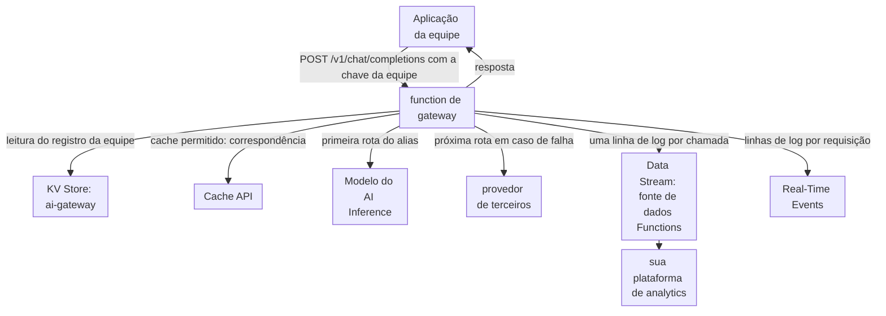

import DocCardGroup from '@aziontech/webkit/doc-card-group'
import DocCard from '@aziontech/webkit/doc-card'

Uma equipe de plataforma apoia equipes de produto que chamam modelos de IA de vários provedores e do AI Inference. Cada equipe guarda as suas próprias chaves de provedor e o seu próprio código de fallback, então ninguém consegue rotear uma requisição para outro modelo quando um provedor falha, parar uma equipe que gasta além do seu orçamento ou dizer qual modelo respondeu a uma requisição. Esta página coloca um gateway criado com Functions na frente de todos os modelos. As aplicações chamam um único endpoint com uma chave de equipe, e o gateway autentica a equipe, escolhe um modelo por política, faz fallback para o próximo modelo quando uma chamada falha, armazena em cache as respostas que quem chama permite e registra cada chamada. O resultado é medido pelas requisições respondidas apesar de uma falha de provedor, pelo gasto por equipe dentro do orçamento, pela parcela de requisições respondidas a partir do cache e pela cobertura de auditoria das chamadas de modelo.

Este caso de uso não cobre a criação das aplicações ou dos agentes que chamam os modelos. Para isso, consulte [Criar agentes de IA](/pt-br/documentacao/casos-de-uso/construir-e-executar-workloads-de-ai/criar-agentes-de-ia/).

## Pré-requisitos

- Uma conta Azion. Se você ainda não tem uma, [crie uma conta](https://console.azion.com/signup).
- Uma aplicação e um workload que servem o domínio do gateway, com o **Application Accelerator** ativado, que o behavior **Run Function** exige. Para criá-los, consulte [Primeiros passos com Applications](/pt-br/documentacao/plataforma/applications/primeiros-passos/).
- KV Store habilitado na conta. O produto está em Preview e não vem habilitado por padrão, então solicite acesso pelo [Technical Support](/pt-br/documentacao/suporte/).
- Um provedor de terceiros cujo endpoint de chat aceite o formato de chat completions da OpenAI, com a URL dele, um nome de modelo e uma API key.
- Um endpoint HTTPS da sua plataforma de analytics ou de logs que aceite requisições `POST`, para os logs de uso e de auditoria.

---

## Produtos necessários

| O gateway precisa de | O que significa | Produto | Documentado em |
| --- | --- | --- | --- |
| Um endpoint que guarda a lógica de roteamento, de fallback e de autenticação | Uma function na aplicação do gateway, executada em todos os caminhos por uma regra | Functions | [Primeiros passos com Functions](/pt-br/documentacao/plataforma/functions/primeiros-passos/) |
| Modelos hospedados na plataforma entre as rotas | `Azion.AI.run` com um id de modelo do catálogo de modelos do AI Inference | AI Inference | [Chame um modelo no AI Inference a partir de uma function](/pt-br/documentacao/guias/ai/inferencia/chamar-um-modelo-no-ai-inference-a-partir-de-uma-function/) |
| Chaves das equipes, os modelos que cada equipe pode chamar e se uma equipe ainda está dentro do orçamento | Um registro por equipe, lido pela key a cada requisição | KV Store | [KV Store API](/pt-br/documentacao/devtools/runtime/api-reference/kv-store/) |
| Prompts repetidos respondidos sem chamada ao modelo, onde quem chama permite | Respostas armazenadas e encontradas com a Cache API | Cache | [Armazene em cache a resposta de uma function com a Cache API](/pt-br/documentacao/guias/desenvolvimento-de-aplicacoes/functions-e-runtime/armazenar-em-cache-a-resposta-de-uma-function-com-a-cache-api/) |
| Um registro de uso e de auditoria de cada chamada de modelo | Uma linha de log por chamada, enviada da fonte de dados Functions | Data Stream | [Envie logs para um endpoint HTTP](/pt-br/documentacao/guias/plataforma/observabilidade/conector-standard-https-post/) |
| Uma requisição investigada depois do fato | As linhas de log da function para essa requisição | Real-Time Events | [Fontes de dados do Real-Time Events](/pt-br/documentacao/plataforma/real-time-events/fontes-de-dados/#functions-console) |
| Uma regra que executa a function | O behavior **Run Function**, que exige o Application Accelerator na aplicação | Application Accelerator | [Como Functions funciona](/pt-br/documentacao/plataforma/functions/como-funciona/#fases-de-execucao-e-criterios) |

---

## Arquitetura de referência

Esta página constrói o *Multi-model AI gateway*: uma function na frente de todos os modelos, com a política, as chaves e o log em um único lugar.

Leia o diagrama a partir da function. Cada chamada de modelo passa por ela, então ela é o único lugar em que uma equipe é identificada, um modelo é escolhido e uma chamada é registrada. As setas para os modelos são ordenadas: a política indica uma primeira rota e as rotas depois dela, e a function passa para a próxima apenas quando uma chamada falha. As setas para o KV Store e a Cache API são leituras que vêm antes de qualquer chamada de modelo, então uma equipe recusada ou uma resposta armazenada não custa nenhuma chamada de modelo.

### Fluxo de dados

1. Uma aplicação de equipe envia uma requisição compatível com a OpenAI para `/v1/chat/completions`, com a sua chave de equipe como bearer token e um alias de modelo em `model`, em vez de um id de modelo.
2. O gateway calcula o hash da chave e lê o registro da equipe no KV Store. Uma chave desconhecida responde `401`, uma equipe acima do orçamento responde `429`, e um alias que a equipe não pode chamar responde `403`.
3. Quando quem chama permite cache, o gateway procura a requisição no cache e retorna uma resposta armazenada quando há correspondência.
4. Caso contrário, o gateway chama as rotas do alias em ordem: primeiro um modelo do AI Inference, depois o provedor de terceiros quando a primeira chamada falha.
5. O gateway grava uma linha de log com a equipe, o alias, o modelo que respondeu, se houve fallback, o resultado do cache e os tokens usados. O Data Stream a envia para a sua plataforma de analytics, e o Real-Time Events guarda as linhas de cada requisição para investigação.
6. O gateway retorna a resposta do modelo e a armazena no cache quando quem chama permitiu.

### Recursos de Plataforma

- **Functions**: executa a autenticação, o roteamento e o fallback. A política é código na function `ai-gateway`, então uma mudança em uma rota chega a todas as equipes de uma vez, e nenhuma equipe guarda uma chave de provedor ou uma lógica de fallback própria.
- **AI Inference**: executa os modelos hospedados na plataforma, chamados com `Azion.AI.run` e um id de modelo. Uma chamada a ele fica dentro da Azion e não precisa de chave de provedor.
- **provedores de LLM de terceiros**: as integrações que executam modelos externos. A function os chama com chaves que lê de variáveis de ambiente, então a latência e as falhas deles entram apenas nas rotas que os indicam.
- **Cache**: guarda respostas a prompts repetidos, pela Cache API da function. Uma resposta armazenada é retornada sem chamada de modelo, apenas para requisições cujo chamador permite.
- **KV Store**: guarda as chaves, as cotas e os orçamentos: um registro por equipe no namespace `ai-gateway`, com a key formada por um hash da chave da equipe, com os modelos que a equipe pode chamar e se ela está dentro do orçamento. A function o lê a cada requisição.
- **Data Stream**: envia as linhas de log de uso e de auditoria que a function grava, da fonte de dados Functions, para a sua plataforma de analytics, onde o gasto por equipe é somado.
- **Real-Time Events**: guarda as linhas de log da function agrupadas por requisição, para investigar uma chamada depois do fato.
- **aplicação**: o Platform Resource que é o endpoint do gateway. Uma regra executa a function nos caminhos dela, então todas as aplicações apontam para um único domínio.

---

## Como o design funciona

Esta seção explica como a function de gateway aplica a política, como os registros das equipes admitem ou recusam uma equipe e como as chamadas de modelo viram um registro de uso e de auditoria.

### Function de gateway

O gateway é uma única function. Cada decisão que ele aplica está no código, então uma mudança de política é uma mudança de código que todas as equipes recebem de uma vez.

- **As equipes enviam um alias, não um id de modelo.** `general` roteia para `Qwen/Qwen3-30B-A3B-Instruct-2507-FP8` no AI Inference, e `long-context` para `gpt-oss-20b`, cuja janela de contexto de 131k tokens é a mais longa entre os modelos que o AI Inference executa. Os dois fazem fallback para o provedor. Um alias permite que a equipe de plataforma mude o modelo por trás dele sem mudança no código de nenhuma equipe. O gateway chama uma rota do AI Inference como [Chame um modelo no AI Inference a partir de uma function](/pt-br/documentacao/guias/ai/inferencia/chamar-um-modelo-no-ai-inference-a-partir-de-uma-function/) descreve, com estes valores: o id de modelo da rota e o body da requisição da equipe com `stream` definido como `false`.
- **A chave é armazenada como hash.** A key do registro é `team:` seguida do SHA-256 da chave da equipe, então o KV Store nunca guarda uma chave utilizável. SHA-256 é um dos digests que `crypto.subtle.digest` suporta.
- **Uma chamada que falha passa para a próxima rota.** Uma chamada que lança uma exceção, não retorna `choices`, responde com um status de erro ou passa de 30 segundos conta como falha. Trinta segundos limitam o tempo que uma equipe espera em uma rota antes que a próxima seja executada, dentro do limite de 5 minutos de tempo de execução de uma function.
- **O cache é decisão de quem chama.** O gateway armazena em cache apenas requisições que trazem `x-gateway-cache: allow`, porque só a equipe sabe se uma resposta pode valer para todo prompt idêntico. O gateway armazena em cache como [Armazene em cache a resposta de uma function com a Cache API](/pt-br/documentacao/guias/desenvolvimento-de-aplicacoes/functions-e-runtime/armazenar-em-cache-a-resposta-de-uma-function-com-a-cache-api/) descreve, com o cache `ai-gateway`, a key `https://ai-gateway.cache/<sha-256 of the alias and the request body>` e `max-age=3600`, uma hora.
- **Cada chamada grava uma linha de log.** A linha é o registro de uso e de auditoria: o gasto de uma equipe é a soma dos seus `total_tokens`, e a linha indica o modelo que respondeu.
- **O alias `fallback-test` comprova o fallback.** A primeira rota dele indica um id de modelo que não existe, então toda chamada a ele faz fallback. Remova-o depois que o fallback for confirmado.

### Registros das equipes

Um registro de equipe é um objeto JSON sob `team:<sha256 of the team key>` no namespace `ai-gateway`: o nome da equipe, os aliases que ela pode chamar e o seu status. O gateway lê o registro a cada requisição e admite uma requisição apenas enquanto `status` for `active`.

A aplicação do orçamento lê esse status em vez de contar cada chamada. O KV Store aceita uma gravação por segundo na mesma key e não oferece incremento atômico, então um contador gravado a cada requisição perderia atualizações sob tráfego concorrente. Em vez disso, o gasto é calculado na sua plataforma de analytics a partir dos `total_tokens` das linhas de log de cada equipe. Quando uma equipe chega ao seu orçamento, um operador define o `status` dela como `blocked`, e o gateway passa a responder `429` a essa equipe.

As keys são gravadas a partir de uma function, e não pela API, então o caminho `/admin/teams` do gateway grava cada registro.

### Stream de uso e de auditoria

Cada linha `model_call` é um registro de uso e de auditoria, e o Data Stream entrega as linhas da fonte de dados *Functions* para a sua plataforma de analytics, onde o gasto e os fallbacks são somados por equipe.

Um filtro impede que este stream desative os outros streams da conta, o que salvar um stream ativo com amostragem faz.

---

## Medindo resultados

| Métrica | Onde ler | Como é quando funciona |
| --- | --- | --- |
| Requisições respondidas apesar de uma falha de provedor | As linhas `model_call` com `"ok":true` e `"fallback":true`, na sua plataforma de analytics | Cada falha de rota em uma linha `route_failed` é seguida de um `model_call` bem-sucedido para a mesma requisição, a menos que todas as rotas tenham falhado |
| Gasto por equipe dentro do orçamento | A soma de `total_tokens` por `team` no período do orçamento, na sua plataforma de analytics | A soma de cada equipe fica abaixo do seu orçamento, e uma equipe que chega a ele tem `status` definido como `blocked` |
| Parcela de requisições respondidas a partir do cache | As linhas `model_call` com `"cache":"hit"` sobre as linhas com `"cache":"hit"` ou `"cache":"miss"` | Sobe para equipes que permitem cache em prompts que se repetem |
| Cobertura de auditoria das chamadas de modelo | A contagem de linhas `model_call` contra as invocações do gateway na aba **Functions** do [Real-Time Metrics](/pt-br/documentacao/plataforma/real-time-metrics/dashboards-build/#functions), descontadas as chamadas a `/admin/teams` e as requisições recusadas | As duas contagens coincidem, então cada chamada de modelo tem um registro |

---

## Boas práticas

- **Dê a cada equipe a sua própria chave e faça a rotação dela substituindo o registro.** A key do registro é o hash da chave da equipe, então uma nova chave é um novo registro. Defina o registro antigo como `blocked` assim que a equipe trocar, porque uma key do KV Store não pode ser listada e um registro esquecido continua legível.
- **Mantenha a chave do provedor em uma variável de ambiente.** A function lê `PROVIDER_API_KEY` com `Azion.env.get()`, então a chave nunca aparece no código, e as equipes nunca a guardam. Uma variável alterada só chega à function depois de um novo deploy.
- **Deixe as equipes optarem pelo cache por requisição.** Uma resposta em cache é retornada para todo prompt idêntico, qualquer que seja a equipe que o envia. Armazenar em cache um prompt cuja resposta precisa mudar, como um que pergunta sobre o estado atual de uma conta, retorna uma resposta desatualizada por uma hora.
- **Considere as leituras do KV Store na taxa de requisições do gateway.** Cada requisição lê um registro de equipe, e o KV Store inclui 100.000 keys lidas por dia antes que uma cobrança se aplique. Para as quantidades incluídas e a tarifa acima delas, consulte [Limites do KV Store](/pt-br/documentacao/plataforma/kv-store/limites/).

---

## Guias deste caso de uso

<DocCardGroup cols={2}>
  <DocCard title="Roteie chamadas de modelo por uma function de gateway" href="/pt-br/documentacao/guias/ai/inferencia/rotear-chamadas-de-modelo-por-uma-function-de-gateway/" label="Cria o namespace ai-gateway, armazena as variáveis, guarda o código do gateway, adiciona o registro da equipe e executa as verificações deste caso de uso." />
  <DocCard title="Execute uma função em uma aplicação" href="/pt-br/documentacao/guias/desenvolvimento-de-aplicacoes/functions-e-runtime/funcoes-serverless/" label="Cria a regra que executa o gateway em todos os caminhos, no Azion Console ou pela API." />
  <DocCard title="Depure functions com o Data Stream" href="/pt-br/documentacao/guias/plataforma/observabilidade/debugging-functions-data-stream/" label="Cria o stream da fonte de dados Functions com um filtro de workload e confirma a entrega." />
  <DocCard title="Armazene em cache a resposta de uma function com a Cache API" href="/pt-br/documentacao/guias/desenvolvimento-de-aplicacoes/functions-e-runtime/armazenar-em-cache-a-resposta-de-uma-function-com-a-cache-api/" label="Armazena e encontra as respostas que quem chama permite que o gateway armazene em cache." />
  <DocCard title="Chame um modelo no AI Inference a partir de uma function" href="/pt-br/documentacao/guias/ai/inferencia/chamar-um-modelo-no-ai-inference-a-partir-de-uma-function/" label="Chama a primeira rota de um alias, um modelo no AI Inference, com Azion.AI.run." />
</DocCardGroup>
