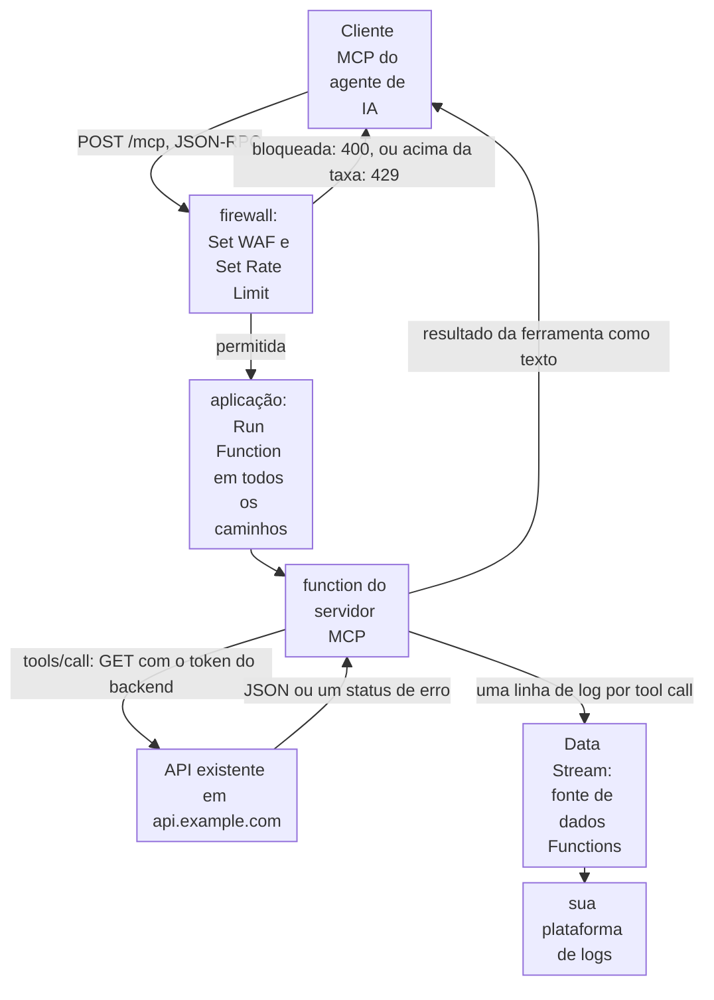

import DocCardGroup from '@aziontech/webkit/doc-card-group'
import DocCard from '@aziontech/webkit/doc-card'

Uma equipe de plataforma ou de produto quer que agentes de IA, os seus ou os dos seus clientes, usem os seus serviços pelo Model Context Protocol (MCP). Os serviços já existem como uma API HTTP, e um agente não consegue chamar essa API como ferramenta até que algo descreva cada operação em termos de MCP. Esta página implanta um servidor MCP como uma function na Azion sobre o transporte streamable HTTP, mapeia cada ferramenta para uma chamada à API existente, coloca na frente dele um firewall com WAF e um rate limit e envia uma linha de log por tool call. O resultado é medido pela latência das tool calls, pela taxa de erro por ferramenta e pelas chamadas que o firewall recusa.

Este caso de uso não cobre a criação dos agentes que chamam os servidores. Para isso, consulte [Criar agentes de IA](/pt-br/documentacao/casos-de-uso/construir-e-executar-workloads-de-ai/criar-agentes-de-ia/).

## Pré-requisitos

- Uma conta Azion. Se você ainda não tem uma, [crie uma conta](https://console.azion.com/signup).
- Um firewall com WAF ativado nas suas configurações principais, vinculado ao workload que o `azion deploy` cria. Para ativar o WAF, consulte [Defina as configurações principais de um firewall](/pt-br/documentacao/guias/seguranca-de-aplicacoes/firewall-e-waf/firewall-definir-main-settings/). Para vincular o firewall, consulte [Vincule um firewall a um workload](/pt-br/documentacao/guias/seguranca-de-aplicacoes/firewall-e-waf/proteja-seu-dominio/).
- Um rule set do WAF chamado `mcp-waf`, com todas as famílias de ameaças em sensibilidade média. Para criá-lo, consulte [Crie um rule set em sensibilidade média](/pt-br/documentacao/guias/seguranca-de-aplicacoes/firewall-e-waf/rule-set-medio/).
- Um endpoint HTTPS da sua plataforma de logs que aceite requisições `POST`, para os logs das tool calls.

---

## Produtos necessários

| O servidor MCP precisa de | O que significa | Produto | Documentado em |
| --- | --- | --- | --- |
| Um servidor que os agentes alcançam pelo transporte streamable HTTP | Uma function criada com o MCP SDK, que responde a `POST /mcp` | Functions | [Execute um MCP server na Azion](/pt-br/documentacao/guias/desenvolvimento-de-aplicacoes/automacao/executar-mcp-server/) |
| Cada ferramenta mapeada para uma operação da API existente | Um handler de ferramenta que traduz os seus argumentos em uma chamada `fetch()` e a resposta em saída da ferramenta | Functions | [Fetch API](/pt-br/documentacao/devtools/runtime/api-reference/fetch/) |
| Payloads de ataque filtrados antes de chegarem ao servidor | Uma regra de firewall em `/mcp` com o behavior **Set WAF** em modo de bloqueio | WAF | [Aplique um rule set a toda requisição](/pt-br/documentacao/guias/seguranca-de-aplicacoes/firewall-e-waf/aplicar-rule-set/) |
| Um agente em loop não consegue sobrecarregar o servidor nem a API atrás dele | O behavior **Set Rate Limit** na mesma regra, contado por endereço IP do cliente | Firewall | [Aplique WAF e um rate limit a um caminho](/pt-br/documentacao/guias/seguranca-de-aplicacoes/firewall-e-waf/aplicar-waf-e-rate-limit-a-um-caminho/) |
| Um registro de cada tool call | Uma linha de log por chamada, enviada da fonte de dados Functions para a sua plataforma de logs | Data Stream | [Envie logs para um endpoint HTTP](/pt-br/documentacao/guias/plataforma/observabilidade/conector-standard-https-post/) |

---

## Arquitetura de referência

Esta página constrói o *MCP gateway over existing APIs*: cada ferramenta encaminha para a API que já executa o serviço, então nenhuma lógica de negócio passa para a function.

Leia o diagrama da function até a API existente. Cada tool call passa por essa seta, então a API está no fluxo de requisição de cada chamada e no seu fluxo de falha: uma API lenta ou com falha é uma ferramenta lenta ou com falha. Cada lado da seta fala o seu próprio schema. Um agente vê o nome de uma ferramenta, uma descrição e um schema de entrada tipado. A API vê um método, um caminho e os seus próprios campos. A function traduz entre os dois, e esse mapeamento é a principal decisão de design. O firewall na frente decide quais requisições chegam à function.

### Fluxo de dados

1. O cliente MCP de um agente envia uma requisição JSON-RPC como um `POST` para `/mcp` no domínio do workload.
2. O firewall aplica o rule set `mcp-waf` e o rate limit. Uma requisição que o rule set bloqueia responde `400`, e uma requisição acima da taxa responde `429`.
3. Uma requisição permitida chega à aplicação, cuja regra executa a function do servidor MCP. A function responde `initialize` e `tools/list` ela mesma, a partir das ferramentas que registra.
4. Em `tools/call`, a function valida os argumentos contra o schema de entrada da ferramenta, monta a requisição à API a partir do método, do caminho e da query e chama a API existente com o token do backend. A chamada é limitada por um timeout.
5. A function retorna os campos de que o agente precisa como resultado da ferramenta, ou uma mensagem que diz o que falhou quando a API responde com um erro ou não responde a tempo.
6. A function grava uma linha de log por tool call, e o Data Stream envia as linhas para a sua plataforma de logs.

### Recursos de Plataforma

- **Functions**: executa a tradução de MCP para API. O servidor é criado com o MCP SDK sobre o transporte streamable HTTP, registra uma ferramenta por operação da API e chama a API com `fetch()`. Toda decisão de schema fica aqui: quais operações viram ferramentas, como os argumentos se mapeiam para uma requisição e quais campos da resposta chegam ao agente.
- **API de backend**: a integração que é o serviço existente, aqui o serviço de pedidos em `https://api.example.com`. Ela mantém a sua própria lógica, os seus dados e as suas credenciais, e cada tool call chega a ela, então a latência e os erros dela são a latência e os erros da ferramenta.
- **firewall**: o Platform Resource que é o ponto de aplicação. Uma regra em `/mcp` recebe cada requisição antes da aplicação, então uma requisição recusada nunca executa a function nem chega à API.
- **WAF**: filtra o tráfego de agentes em busca de payloads de ataque, pelo behavior **Set WAF** da regra, com o rule set `mcp-waf`. O behavior **Set Rate Limit** da mesma regra limita a velocidade com que um cliente pode chamar, o que limita a carga que um agente preso em um loop coloca sobre a API.
- **KV Store**: guarda sessões, para um servidor que mantém estado entre as requisições de uma conexão de agente. Um servidor criado sem ID de sessão não mantém nenhuma, e cada requisição carrega tudo de que precisa.
- **Data Stream**: envia os logs das tool calls que a function grava, da fonte de dados Functions, para a sua plataforma de logs. A taxa de erro e a latência por ferramenta são calculadas lá.
- **aplicação**: o Platform Resource que encaminha as requisições para a function. A regra dela executa a function, e o workload que serve a aplicação também vincula o firewall.

### Outros designs para este caso de uso

- *Remote MCP server on Functions*: para ferramentas cuja lógica pode ser executada na Azion. A function implementa cada ferramenta ela mesma em vez de encaminhá-la a uma API existente e mantém o estado das sessões no KV Store atrás do mesmo firewall, então uma tool call só sai da Azion quando a própria ferramenta chama algo externo.

---

## Como o design funciona

Esta seção explica como o servidor mapeia ferramentas para a API, como o firewall filtra o tráfego de agentes e como as tool calls chegam à sua plataforma de logs.

### Mapeamentos de ferramentas

Os mapeamentos de ferramentas são o `src/index.ts` do servidor: uma ferramenta registrada por operação da API.

As decisões de mapeamento, cada uma tomada uma vez aqui:

- **Duas ferramentas, nomeadas com verbo e substantivo.** `get_order` mapeia `GET /v1/orders/{id}`, e `list_customer_orders` mapeia `GET /v1/orders?customer_id={id}&limit={n}`. Um agente escolhe uma ferramenta pelo nome e pela descrição, então cada descrição diz quando usá-la.
- **Os argumentos são tipados e limitados.** `limit` é um inteiro de 1 a 20, então um agente não consegue pedir à API uma página sem limite. Cada segmento de caminho e valor de query é codificado antes de entrar na URL.
- **O resultado traz apenas os campos de que um agente precisa.** O handler retorna o ID, o status, o total e a data de criação do pedido e descarta todos os outros campos que a API retorna, então dados internos não chegam a um agente.
- **Uma falha é uma mensagem, não uma exceção.** Um status de erro ou uma chamada que passa de 8 segundos vira um resultado de ferramenta que diz o que falhou. Oito segundos deixam ao agente tempo para tentar de novo dentro do seu próprio timeout, e o limite de tempo de execução da function é de 5 minutos.
- **O token do backend fica fora do código.** A function o lê da variável de ambiente `BACKEND_API_TOKEN`.

### Firewall para o tráfego de agentes

Uma regra de firewall carrega as duas proteções, porque **Set WAF** é um dos dois behaviors que outro behavior pode seguir. O critério é `${request_uri}` _starts with_ `/mcp`. Toda requisição MCP é um `POST` cujo payload fica no corpo, e um critério na query string a ignoraria.

O rate limit conta por endereço IP do cliente: uma média de `10` requisições por segundo com um burst de `20`. Um agente abre uma conexão com `initialize`, `notifications/initialized` e `tools/list` em sequência rápida e depois envia uma requisição por tool call. O burst admite essa abertura, e a média para um agente preso em um loop antes que ele sobrecarregue a API atrás das ferramentas.

### Stream de logs das tool calls

A function grava uma linha JSON por tool call, com o nome da ferramenta, o status da API, se ela teve sucesso e o tempo que levou. O Data Stream envia essas linhas da fonte de dados *Functions* para a sua plataforma de logs, onde a taxa de erro e a latência são calculadas por ferramenta.

Um filtro impede que este stream desative os outros streams da conta, o que salvar um stream ativo com amostragem faz.

---

## Medindo resultados

| Métrica | Onde ler | Como é quando funciona |
| --- | --- | --- |
| Latência das tool calls | O campo `ms` das linhas `tool_call` na sua plataforma de logs, por `tool` | Estável por ferramenta. Um aumento em uma ferramenta aponta para a operação da API dela, não para o servidor |
| Taxa de erro por ferramenta | As linhas `tool_call` com `"ok":false` sobre o total de linhas, por `tool` | Baixa e estável. `status` `0` conta timeouts, e qualquer outro valor é o status que a API respondeu |
| Chamadas que o firewall recusa | Requisições para `/mcp` com status `400` ou `429`, na fonte de dados **HTTP Requests** do [Real-Time Events](/pt-br/documentacao/plataforma/real-time-events/fontes-de-dados/#http-requests) | `429` apenas de agentes em loop, e `400` apenas em payloads que o rule set sinaliza |

---

## Boas práticas

- **Retorne apenas os campos de que um agente precisa.** Um agente passa cada campo de um resultado de ferramenta a um modelo, e o modelo pode repeti-lo a um usuário. `pickOrder` é onde essa decisão é tomada, um lugar por ferramenta.
- **Trate cada ferramenta como segura para ser chamada duas vezes.** Um agente repete uma chamada que acredita ter falhado, inclusive uma chamada que expirou depois que a API agiu. Mapeie primeiro as operações de leitura e dê a uma operação de escrita um ID de requisição que a API possa deduplicar antes de expô-la como ferramenta.
- **Dimensione o rate limit para agentes atrás de um único endereço.** O limite conta por endereço IP do cliente, então vários agentes atrás de um único endereço de rede compartilham uma única cota. Aumente a média quando a contagem de `429` subir sem nenhum loop nos logs.
- **Adicione autenticação antes de compartilhar a URL.** O servidor desta página não verifica nenhuma credencial, então qualquer um que conheça a URL pode chamar as suas ferramentas. Decida como os agentes provam quem são e verifique isso na function ou no firewall antes de publicar a URL. Para as verificações de que um servidor precisa antes que outros o usem, consulte [Prepare o servidor para agentes](/pt-br/documentacao/guias/desenvolvimento-de-aplicacoes/automacao/executar-mcp-server/#prepare-o-servidor-para-agentes).

---

## Guias deste caso de uso

<DocCardGroup cols={2}>
  <DocCard title="Aplique WAF e um rate limit a um caminho" href="/pt-br/documentacao/guias/seguranca-de-aplicacoes/firewall-e-waf/aplicar-waf-e-rate-limit-a-um-caminho/" label="Cria a regra em /mcp que carrega o WAF e o rate limit." />
  <DocCard title="Execute um MCP server na Azion" href="/pt-br/documentacao/guias/desenvolvimento-de-aplicacoes/automacao/executar-mcp-server/" label="Cria e faz o deploy do projeto Hono com o MCP SDK, mapeia as duas ferramentas para o serviço de pedidos e executa as verificações MCP deste caso de uso." />
  <DocCard title="Depure functions com o Data Stream" href="/pt-br/documentacao/guias/plataforma/observabilidade/debugging-functions-data-stream/" label="Cria o stream da fonte de dados Functions com um filtro de workload e confirma a entrega." />
</DocCardGroup>
