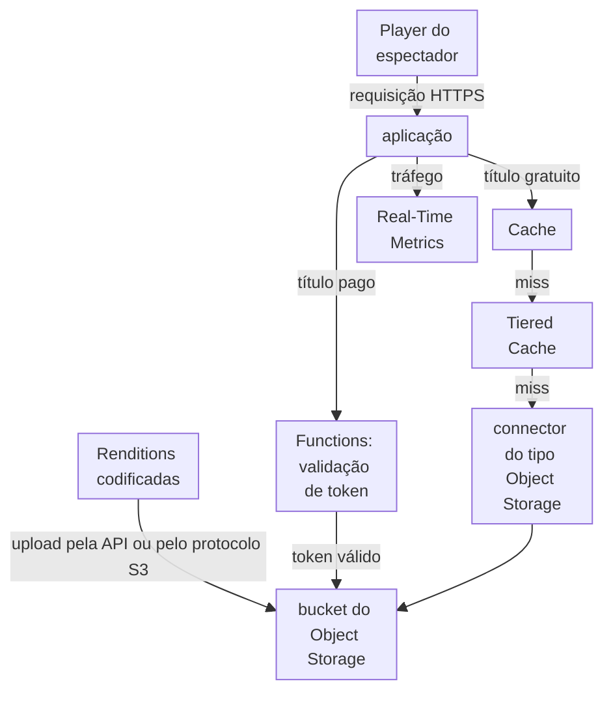
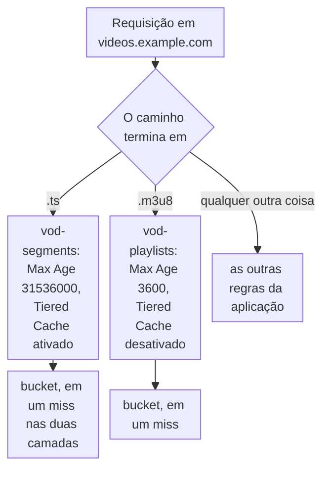

import DocCardGroup from '@aziontech/webkit/doc-card-group'
import DocCard from '@aziontech/webkit/doc-card'

Uma equipe de mídia, de e-learning ou de streaming serve uma biblioteca de vídeos sob demanda, já codificados em HLS. Todo título é um conjunto de playlists e milhares de segmentos, os mesmos arquivos para todo espectador, e um título em alta é requisitado por muitos espectadores ao mesmo tempo. Um segmento nunca muda depois de codificado, enquanto uma playlist pode ser reescrita quando um título é republicado. Esta página armazena a biblioteca codificada no Object Storage e configura uma aplicação que faz cache dos segmentos por muito tempo, com Tiered Cache, e das playlists por um tempo menor. O resultado é medido pela parcela de requisições de playlists e de segmentos respondidas pelo cache e pela parcela de misses que a camada do Tiered Cache responde sem ler o bucket.

Este caso de uso não cobre a codificação dos vídeos, que acontece antes da entrega.

## Pré-requisitos

- Uma conta Azion. Se você ainda não tem uma, [crie uma conta](https://console.azion.com/signup).
- Um bucket para a biblioteca, com **Workloads Access** definido como _Read Only_. Para criar um, consulte [Criar um bucket](/pt-br/documentacao/guias/desenvolvimento-de-aplicacoes/dados/criar-e-modificar-um-bucket/).
- Uma aplicação que serve o bucket por um connector do tipo Object Storage com o prefixo `/vod`, e uma regra que envia todos os caminhos a ele. Para criar os dois, consulte [Use um bucket como origem de uma aplicação](/pt-br/documentacao/guias/desenvolvimento-de-aplicacoes/dados/bucket-como-connector/).
- Um hostname para a biblioteca que aponta para o workload da aplicação. Para criar o registro, consulte [Aponte um domínio para um workload](/pt-br/documentacao/guias/plataforma/migracao/apontar-dominio-para-a-azion/).
- Os arquivos HLS codificados de cada título, como o seu packager os escreveu: uma playlist principal, uma playlist por rendition e os segmentos.

---

## Produtos necessários

| A biblioteca de vídeos precisa de | O que significa | Produto | Documentado em |
| --- | --- | --- | --- |
| As renditions codificadas armazenadas na Azion, sem uma origem própria da equipe | Um bucket que guarda toda playlist e todo segmento sob um prefixo, lido pela aplicação por um connector | Object Storage | [Upload e download de objetos](/pt-br/documentacao/guias/desenvolvimento-de-aplicacoes/dados/upload-e-download-de-objetos-do-bucket/) |
| Segmentos que respondem pelo cache perto dos espectadores | Uma cache setting com um Max Age longo e Tiered Cache, aplicada por uma regra na extensão `.ts` | Cache | [Faça cache de uma biblioteca HLS sob demanda por extensão de arquivo](/pt-br/documentacao/guias/midia-e-streaming/streaming/fazer-cache-de-uma-biblioteca-hls-sob-demanda-por-extensao-de-arquivo/) |
| Playlists que respondem pelo cache e ainda pegam um título republicado | Uma cache setting com um Max Age menor, aplicada por uma regra na extensão `.m3u8` | Cache | [Real-Time Purge](/pt-br/documentacao/plataforma/applications/cache/real-time-purge/) |
| Títulos pagos que apenas um espectador com um token válido recebe | Uma função na frente do bucket que valida um JSON Web Token nos caminhos pagos | Functions | [Autentique requisições com Functions](/pt-br/documentacao/guias/desenvolvimento-de-aplicacoes/dados/camada-autenticacao-object-storage-functions/) |
| A parcela de requisições respondidas pelo cache | Os gráficos **Requests Offloaded** e **Tiered Cache Offload**, filtrados pelo hostname da biblioteca | Real-Time Metrics | [Meça o offload de cache de um domínio](/pt-br/documentacao/guias/plataforma/observabilidade/medir-offload-de-cache/) |

---

## Arquitetura de referência

Esta página monta a *Biblioteca de vídeos hospedada no Object Storage*: a biblioteca codificada passa para Object Storage, e uma aplicação a serve pelo Cache e pelo Tiered Cache.

O diagrama traz dois fluxos. O fluxo de upload vai da equipe até o bucket, e só se move quando um título é adicionado ou recodificado: a biblioteca fica na Azion, então o fluxo de controle carrega essa etapa em vez de uma origem do cliente. O fluxo de requisições vai do player do espectador pela aplicação, onde as camadas de cache respondem a maioria das requisições, e apenas um miss nas duas camadas lê o bucket. Um título pago segue o caminho da função, que lê o bucket apenas para uma requisição com um token válido.

### Fluxo de dados

1. A equipe envia as playlists e os segmentos codificados de cada título ao bucket, sob o prefixo `vod/`, com o content type de cada arquivo.
2. O player de um espectador requisita a playlist principal de um título ao workload em `videos.example.com`, que entrega a requisição à aplicação.
3. Uma regra corresponde à extensão do arquivo e aplica uma cache setting: um Max Age longo com Tiered Cache para os segmentos, um menor para as playlists.
4. Cache responde com a cópia dele. Um segmento ausente no Cache é pedido à camada do Tiered Cache, e apenas um miss em todas as camadas é lido do bucket pelo connector e colocado em cache para o próximo espectador.
5. Para um título pago, uma função valida o token do espectador e lê o objeto do bucket apenas quando o token é válido.
6. O player lê a playlist da rendition e busca os segmentos dela da mesma forma, e Real-Time Metrics informa as requisições e os dados que cada camada de cache respondeu.

### Recursos de Plataforma

- **Object Storage**: guarda a biblioteca, toda playlist e todo segmento sob um prefixo de um bucket. O bucket dá à plataforma acesso somente leitura, e a equipe escreve nele pela API ou pelo protocolo S3.
- **aplicação**: o Platform Resource que entrega a biblioteca. Um connector para o bucket e uma regra com _Set Connector_ fazem do bucket a fonte dela, e regras por extensão de arquivo aplicam uma cache setting a cada tipo de arquivo.
- **Cache**: mantém os segmentos e as playlists perto dos espectadores. Um segmento sob a key dele nunca muda, então pode ficar em cache por muito tempo, enquanto uma playlist que pode ser reescrita recebe um Max Age menor.
- **Tiered Cache**: a Feature que adiciona uma segunda camada de cache, compartilhada por todos os data centers, entre Cache e o bucket. Ela concentra os misses de todos os data centers, então o bucket é lido raramente para cada segmento.
- **Functions**: validam um token de acesso antes que um título pago saia do bucket, uma opção de design para conteúdo restrito. Uma requisição sem um token válido nunca lê o bucket.
- **Real-Time Metrics**: informa as requisições e os dados que Cache e a camada do Tiered Cache responderam, filtrados pelo hostname da biblioteca.

### Outros designs para este caso de uso

- *Biblioteca de vídeos hospedada na origem*: para equipes que mantêm a biblioteca no próprio bucket de nuvem ou na própria origem de mídia. A aplicação busca cada segmento por um connector em um miss e faz cache dele com um TTL longo e Tiered Cache, então a origem serve cada segmento raramente, enquanto o egress e a disponibilidade dela permanecem no fluxo de dados e no fluxo de falhas.

---

## Como o design funciona

Esta seção explica as duas partes do design que guardam a biblioteca e a mantêm em cache: o upload da biblioteca e o cache para playlists e segmentos.

### Upload da biblioteca

O upload da biblioteca coloca cada título no bucket sob keys que o connector serve sem alteração. O prefixo do connector é `/vod`, então o objeto `vod/course-101/master.m3u8` responde em `/course-101/master.m3u8`. Envie cada arquivo sob o mesmo caminho relativo que o packager escreveu, para que os caminhos dentro de cada playlist continuem apontando para os arquivos que ela lista.

Cada upload envia `Content-Type`, porque o tipo armazenado é o que esse header carrega, e ele é retornado em toda leitura. Sem o header, a Azion detecta o tipo, o que não é garantido para todo arquivo. Esta página usa `application/vnd.apple.mpegurl` para as playlists, o tipo que a [especificação do HLS](https://datatracker.ietf.org/doc/html/rfc8216#section-4) define para elas, e `video/mp2t` para os segmentos MPEG-2 transport stream.

Para uma biblioteca com muitos arquivos, um cliente S3 como o s3cmd os envia com uma credencial limitada a `video-library`, como [Use ferramentas compatíveis com S3 com Object Storage](/pt-br/documentacao/guias/desenvolvimento-de-aplicacoes/dados/protocolo-s3-para-object-storage/) mostra. Azion Console recusa um único arquivo maior que 300 MB, um limite que a API e o protocolo S3 não têm.

Quando um título for recodificado, envie-o sob uma nova key, como `vod/course-101-v2/`, em vez de substituir os arquivos no lugar. Um upload para uma key em uso substitui o objeto sem histórico de versões, e uma key que nunca serve um conteúdo diferente é o que permite que os segmentos dela fiquem em cache por muito tempo.

### Cache para playlists e segmentos

O cache da biblioteca são duas cache settings e duas regras que as aplicam por extensão de arquivo, porque um segmento e uma playlist mudam em ritmos diferentes.

- **Segmentos**: **Max Age** é `31536000` segundos, o maior valor que o campo aceita. Um segmento sob a key dele nunca muda, já que um título recodificado recebe novas keys, então nada o força a sair do cache. Tiered Cache fica ativado, com a topologia `nearest-region`, então um segmento ausente em um data center é respondido pela segunda camada em vez do bucket.
- **Playlists**: **Max Age** é `3600` segundos. Uma playlist principal pode ser reescrita no lugar para apontar para um título recodificado, então uma hora limita por quanto tempo um espectador pode receber a antiga. Tiered Cache fica desativado para as playlists, porque um purge por URL não chega à camada do Tiered Cache, e uma playlist reescrita deve sair do cache com um purge por URL.
- **Os dois**: o cache do navegador é sobrescrito para `0` segundos. Uma cópia no cache do navegador do espectador não pode ser purgada, então um título retirado continuaria reproduzível ali até expirar.

1. Um caminho que termina em `.ts` recebe a cache setting `vod-segments`.
2. Um caminho que termina em `.m3u8` recebe a cache setting `vod-playlists`.
3. Qualquer outro caminho fica com as outras regras da aplicação.
4. Um miss chega ao bucket pelo connector, e a resposta é colocada em cache sob a configuração que o caminho dela recebeu.

---

## Medindo resultados

| Métrica | Onde ler | Como é o funcionamento correto |
| --- | --- | --- |
| Parcela de requisições respondidas pelo cache | **Requests Offloaded** no Real-Time Metrics, filtrado por `videos.example.com`. Consulte [Meça o offload de cache de um domínio](/pt-br/documentacao/guias/plataforma/observabilidade/medir-offload-de-cache/) | Aumenta conforme cada título é assistido, porque um segmento só é lido do bucket quando nenhuma camada de cache o guarda |
| Parcela de dados entregues pelo cache | **Edge Offload** no dashboard **Data Transferred**, filtrado por `videos.example.com` | Acompanha o Requests Offloaded, ponderado pelo tamanho dos segmentos |
| Misses respondidos pela camada do Tiered Cache | O gráfico **Tiered Cache Offload** da aba **Tiered Cache**. Consulte [Descubra o que chegou à origem](/pt-br/documentacao/guias/plataforma/observabilidade/medir-offload-de-cache/#descubra-o-que-chegou-a-origem) | A maioria dos misses de segmentos em um data center é respondida pela segunda camada, não pelo bucket |

---

## Boas práticas

- **Versione um título recodificado em vez de substituí-lo.** Uma key que nunca serve um conteúdo diferente pode ficar em cache pelo **Max Age** completo, e as duas versões existem enquanto os espectadores passam para a nova. Apenas a playlist principal, que o site incorpora, é reescrita no lugar, como `vod/course-101/master.m3u8`, enquanto um segmento recodificado recebe uma nova key, como `vod/course-101-v2/720p/segment-00001.ts` ao lado de `vod/course-101/720p/segment-00001.ts`. O custo é que as keys antigas se acumulam, então remova as que nenhuma playlist referencia.
- **Faça o purge do Tiered Cache primeiro quando retirar um título.** Excluir um objeto do bucket não remove as cópias em cache dele. Faça o purge de cada segmento da camada do Tiered Cache pela cache key, depois do Cache, ou a primeira camada se reabastece a partir da segunda. Para a ordem do purge, consulte [Tiered Cache](/pt-br/documentacao/plataforma/applications/cache/tiered-cache/#purge).
- **Mantenha os espectadores fora do endpoint S3.** Uma URL pré-assinada entregue a um player envia toda requisição a uma interface de gerenciamento, sem cache, e as requisições que chegam aos objetos sem uma aplicação estão sujeitas a rate limits. Sirva a biblioteca apenas pela aplicação. Para o raciocínio, consulte [Sirva objetos aos usuários finais por meio de uma aplicação](/pt-br/documentacao/plataforma/object-storage/boas-praticas/#sirva-objetos-aos-usuarios-finais-por-meio-de-uma-aplicacao).
- **Limite a credencial de upload ao bucket da biblioteca.** Uma credencial criada sem `buckets` alcança todos os buckets da conta, e a secret key dela é retornada apenas uma vez. Nomeie `video-library` em `buckets` e conceda apenas as capabilities que o upload usa. Para os campos, consulte [Limite uma credencial S3 aos buckets e às capabilities de que ela precisa](/pt-br/documentacao/plataforma/object-storage/boas-praticas/#limite-uma-credencial-s3-aos-buckets-e-as-capabilities-de-que-ela-precisa).

---

## Guias deste caso de uso

<DocCardGroup cols={2}>
  <DocCard title="Faça cache de uma biblioteca HLS sob demanda por extensão de arquivo" href="/pt-br/documentacao/guias/midia-e-streaming/streaming/fazer-cache-de-uma-biblioteca-hls-sob-demanda-por-extensao-de-arquivo/" label="Cria as cache settings vod-segments e vod-playlists e as regras que as aplicam por extensão de arquivo." />
  <DocCard title="Upload e download de objetos" href="/pt-br/documentacao/guias/desenvolvimento-de-aplicacoes/dados/upload-e-download-de-objetos-do-bucket/" label="Envia cada playlist e cada segmento de um título a video-library sob o prefixo vod/, com o content type dele." />
  <DocCard title="Use ferramentas compatíveis com S3 com o Object Storage" href="/pt-br/documentacao/guias/desenvolvimento-de-aplicacoes/dados/protocolo-s3-para-object-storage/" label="Envia uma biblioteca de muitos arquivos com o s3cmd e uma credencial limitada a video-library." />
  <DocCard title="Use um bucket como origem de uma aplicação" href="/pt-br/documentacao/guias/desenvolvimento-de-aplicacoes/dados/bucket-como-connector/" label="Confirma que a aplicação serve um título pelo bucket com o content type armazenado no upload." />
  <DocCard title="Purgue conteúdo em cache" href="/pt-br/documentacao/guias/performance-e-confiabilidade/cache-e-purge/purgar-conteudo-em-cache/" label="Envia o purge por URL de uma playlist reescrita e o confirma no histórico de purge." />
  <DocCard title="Autentique requisições com Functions" href="/pt-br/documentacao/guias/desenvolvimento-de-aplicacoes/dados/camada-autenticacao-object-storage-functions/" label="Protege os títulos pagos com uma função que recusa uma requisição sem token." />
</DocCardGroup>
