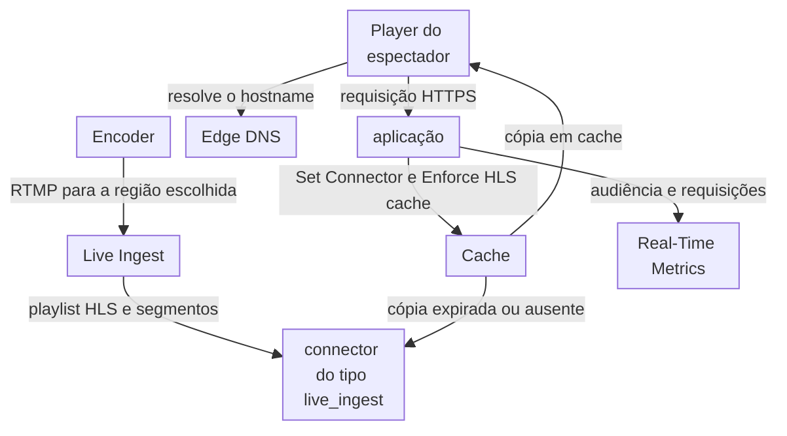
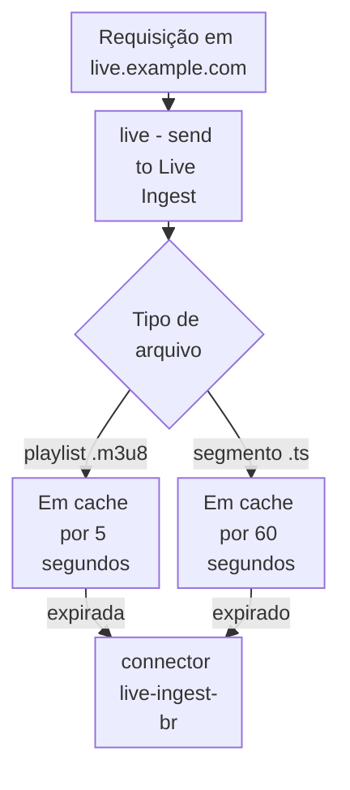

import DocCardGroup from '@aziontech/webkit/doc-card-group'
import DocCard from '@aziontech/webkit/doc-card'

Uma equipe de broadcast, de esportes ou de eventos transmite um evento ao vivo para uma audiência que cresce de milhares para milhões de espectadores em minutos, como exemplo. A equipe tem um encoder no local do evento e nenhuma origem de streaming própria. Todo espectador busca a mesma playlist e os mesmos segmentos quase no mesmo momento, e a playlist muda a cada poucos segundos, enquanto cada segmento nunca muda. Esta página conecta o encoder ao Live Ingest, que converte a transmissão em HLS, e configura uma aplicação que serve a playlist e os segmentos do cache para todos os espectadores. O resultado é medido pelas requisições que chegam ao Live Ingest por espectador conectado durante o pico e pela parcela de requisições respondidas pelo cache.

Este caso de uso não cobre bibliotecas sob demanda, inserção de anúncios nem DRM. Para vídeo sob demanda, consulte [Entregar uma biblioteca de vídeos sob demanda](/pt-br/documentacao/casos-de-uso/entregar-midia-e-streaming/entregar-uma-biblioteca-de-videos-sob-demanda/).

## Pré-requisitos

- Uma conta Azion. Se você ainda não tem uma, [crie uma conta](https://console.azion.com/signup).
- Uma aplicação que serve apenas a transmissão, atrás de um workload. Para criar os dois, consulte [Primeiros passos com Applications](/pt-br/documentacao/plataforma/applications/primeiros-passos/).
- Um hostname para a transmissão que aponta para o workload. Para criar o registro, no Edge DNS ou no seu provedor de DNS, consulte [Aponte um domínio para um workload](/pt-br/documentacao/guias/plataforma/migracao/apontar-dominio-para-a-azion/).
- Um encoder que envia RTMP com autenticação por usuário e senha, e as URLs de ingestão e as credenciais que a Azion fornece para um endpoint primário e um de backup. Para o requisito, consulte [Ingestão](/pt-br/documentacao/plataforma/connectors/live-ingest/ingestao-e-entrega/#ingestao).

---

## Produtos necessários

| O evento ao vivo precisa de | O que significa | Produto | Documentado em |
| --- | --- | --- | --- |
| A transmissão chega à Azion a partir do encoder e se torna HLS | Um connector do tipo `live_ingest` na região mais próxima do encoder, que recebe a transmissão por RTMP e a converte em HLS | Live Ingest | [Entregue uma transmissão ao vivo a partir do Live Ingest](/pt-br/documentacao/guias/midia-e-streaming/streaming/entregar-uma-transmissao-ao-vivo-do-live-ingest/) |
| Playlists e segmentos que respondem todos os espectadores pelo cache | Uma regra cujo behavior _Set Connector_ nomeia o connector, ao qual a Azion dá o behavior _Enforce HLS cache_ | Cache | [Enforce HLS cache](/pt-br/documentacao/plataforma/applications/rules-engine/#enforce-hls-cache) |
| Os espectadores chegam à transmissão pelo hostname do evento | Um registro que aponta o hostname para o workload, em uma zona do Edge DNS ou no seu provedor de DNS | Edge DNS | [Aponte um domínio para um workload](/pt-br/documentacao/guias/plataforma/migracao/apontar-dominio-para-a-azion/) |
| O tamanho da audiência e as requisições que chegam ao Live Ingest | Os datasets `connectedUsersMetrics` e `httpMetrics` da API GraphQL | Real-Time Metrics | [Consulte os usuários conectados do Live Ingest](/pt-br/documentacao/guias/plataforma/observabilidade/query-dados-connected-users-com-graphql/) |

---

## Arquitetura de referência

Esta página monta a *Transmissão ao vivo ingerida na Azion*: o encoder envia a transmissão ao Live Ingest, e uma aplicação a entrega, sem nenhuma origem de streaming sua.

Leia o diagrama como dois fluxos que se encontram no connector. O fluxo de ingestão começa no encoder, não em uma origem: a ingestão e o empacotamento acontecem na Azion, então nenhum servidor da equipe fica no caminho. O fluxo de requisições começa no player do espectador e termina no Cache sempre que existe uma cópia válida. Apenas uma cópia expirada ou ausente passa pelo connector até Live Ingest.

### Fluxo de dados

1. O encoder envia a transmissão por RTMP ao Live Ingest, na região do connector do tipo `live_ingest`, que é `br-east-1` nesta página.
2. Live Ingest converte a transmissão em HLS: uma playlist, `.m3u8`, e os segmentos que ela lista, `.ts`.
3. O player de um espectador resolve `live.example.com` pelo Edge DNS e requisita a playlist ao workload, que entrega a requisição à aplicação.
4. A regra da aplicação nomeia o connector do Live Ingest com _Set Connector_, e a Azion adiciona o behavior _Enforce HLS cache_, que faz cache de cada playlist por 5 segundos e de cada segmento por 60 segundos.
5. Enquanto uma cópia em cache é válida, Cache responde todos os espectadores com ela, e apenas uma cópia expirada ou ausente é buscada pelo connector. O player lê a playlist de novo para encontrar os novos segmentos e busca cada um da mesma forma.
6. Real-Time Metrics conta os usuários conectados da transmissão e as requisições que a aplicação respondeu.

### Recursos de Plataforma

- **Live Ingest**: o Produto que recebe a transmissão RTMP do encoder em uma região e a converte em HLS. A região é o atributo de um connector do tipo `live_ingest` e decide onde a transmissão entra na Azion, não onde os espectadores se conectam.
- **aplicação**: o Platform Resource que entrega a transmissão. A regra dela com _Set Connector_ envia as requisições dos espectadores ao connector do Live Ingest, e ela é alcançada pelo hostname de um workload.
- **Cache**: mantém a playlist e os segmentos sob a política de cache ao vivo do _Enforce HLS cache_, que ignora as cache settings da própria aplicação. A playlist muda conforme a transmissão avança, então a cópia dela dura segundos; um segmento nunca muda, então a cópia dele dura mais.
- **Edge DNS**: resolve o hostname da transmissão para o workload, incluindo um domínio apex por um registro `ANAME`.
- **Real-Time Metrics**: traz a audiência no dataset `connectedUsersMetrics` e a parcela de requisições respondidas pelo cache no dataset `httpMetrics`.

### Outros designs para este caso de uso

- *Transmissão ao vivo a partir de uma origem de empacotamento do cliente*: para equipes que já executam um servidor de mídia ou um packager. A aplicação busca os manifestos e os segmentos dessa origem por um connector e faz cache deles, com Tiered Cache, então o empacotamento fica na origem do cliente, que permanece no fluxo de requisições e no fluxo de falhas, e as regras de cache por manifesto e por segmento se tornam decisões de design.

---

## Como o design funciona

Esta seção explica as três partes do design que levam a transmissão do encoder aos espectadores: o connector do Live Ingest, a entrega a partir do Live Ingest e o encoder.

### Connector do Live Ingest

O connector do Live Ingest é onde a transmissão entra na Azion. Ele carrega uma configuração, a região, e a região decide para onde o encoder envia a transmissão, não onde os espectadores se conectam. Esta página usa `br-east-1` porque o encoder está em um local de evento no Brasil: a região mais próxima do encoder encurta o caminho que a transmissão percorre antes que a Azion a receba. A região aceita `us-east-1`, `us-east-2`, `br-east-1`, `br-east-2` e `br-east-3`.

### Entrega a partir do Live Ingest

A regra de entrega envia as requisições dos espectadores ao connector do Live Ingest. A aplicação em `live.example.com` serve apenas a transmissão, então a regra corresponde a todos os caminhos. Quando a regra nomeia um connector do Live Ingest, a Azion adiciona a ela o behavior _Enforce HLS cache_. Esse behavior ignora as cache settings da aplicação e aplica a política de cache que a Azion define para HLS ao vivo: a playlist e os segmentos recebem tempos de cache diferentes, porque um muda e o outro não.

1. Toda requisição em `live.example.com` corresponde à regra `live - send to Live Ingest`.
2. Uma playlist fica em cache por 5 segundos, então todo espectador fica a segundos do que o encoder escreveu.
3. Um segmento fica em cache por 60 segundos, porque é escrito uma vez e nunca muda.
4. Quando uma cópia expira, a próxima requisição busca o arquivo pelo connector, e uma cópia volta a responder todos os espectadores.

### Encoder

As configurações do encoder decidem quais players podem reproduzir a transmissão e como a saída HLS é cortada em segmentos. Live Ingest recebe a transmissão por RTMP com autenticação por usuário e senha, então apenas um encoder que tem as credenciais publica no endpoint. A transmissão que o encoder envia é a fonte de todo arquivo que os espectadores buscam.

Cada configuração do encoder tem o seu motivo:

- **Protocolo**: RTMP, com autenticação por usuário e senha, o único protocolo que Live Ingest recebe.
- **URL de ingestão e credenciais primárias**: as que a Azion fornece para o endpoint primário, o endpoint que recebe a transmissão.
- **URL de ingestão e credenciais de backup**: as que a Azion fornece para o endpoint de backup, que assume a transmissão se o primário falhar.
- **Codec de vídeo**: H.264, para ampla compatibilidade com players.
- **Codec de áudio**: AAC, para ampla reprodução.
- **Intervalo de keyframes**: 2 segundos, adequado à saída HLS que os espectadores recebem.
- **Bitrate**: o bitrate que as conexões da sua audiência conseguem sustentar, que equilibra a qualidade e os espectadores que conseguem reproduzir a transmissão.

Para o raciocínio por trás de cada configuração, consulte [Configure o encoder para a entrega em HLS](/pt-br/documentacao/plataforma/connectors/boas-praticas/#configure-o-encoder-para-a-entrega-em-hls).

A Azion pode exigir um encoder, uma configuração e um endpoint suportados ou aprovados. Confirme com o [suporte da Azion](/pt-br/documentacao/suporte/) que o seu encoder se qualifica antes do evento.

Quando o encoder inicia, a transmissão entra no Live Ingest em `br-east-1`, e a aplicação em `live.example.com` serve a playlist e os segmentos dela aos espectadores.

---

## Medindo resultados

| Métrica | Onde ler | Como é o funcionamento correto |
| --- | --- | --- |
| Requisições que chegam ao Live Ingest por espectador conectado | `missedRequests` do dataset `httpMetrics`, filtrado por `live.example.com`, como [Meça o offload de cache de um domínio](/pt-br/documentacao/guias/plataforma/observabilidade/medir-offload-de-cache/) mostra, dividido pelas sessões únicas de `connectedUsersMetrics` no mesmo intervalo | Cai conforme a audiência cresce, porque uma cópia em cache responde mais espectadores |
| Parcela de requisições respondidas pelo cache | **Requests Offloaded** no Real-Time Metrics, filtrado por `live.example.com`. Consulte [Meça o offload de cache de um domínio](/pt-br/documentacao/guias/plataforma/observabilidade/medir-offload-de-cache/) | Fica alta durante o pico, com os misses de playlist que o tempo de cache de 5 segundos dela causa |
| Tamanho da audiência | As sessões únicas de `connectedUsersMetrics`, por host. Consulte [Consulte os usuários conectados do Live Ingest](/pt-br/documentacao/guias/plataforma/observabilidade/query-dados-connected-users-com-graphql/) | Acompanha a audiência que você espera, sem uma queda repentina |

---

## Boas práticas

- **Envie a transmissão para um endpoint primário e um de backup em regiões diferentes.** Uma transmissão com um endpoint para quando esse endpoint falha, e dois endpoints em uma região compartilham uma falha localizada. Coloque o primário na região mais próxima do local do evento e o backup em outra região com conectividade equivalente. Antes do evento, envie uma transmissão de teste para cada endpoint e confirme que cada um a aceita. Para o raciocínio, consulte [Boas práticas de Connectors](/pt-br/documentacao/plataforma/connectors/boas-praticas/#envie-a-transmissao-para-um-endpoint-primario-e-um-de-backup-em-regioes-diferentes).
- **Deixe o cache da transmissão para o Enforce HLS cache.** O behavior ignora as cache settings da aplicação, então uma cache setting com um TTL diferente nos caminhos da transmissão não muda nada e confunde a próxima pessoa que ler as regras.
- **Dê ao player um fallback para erros de carregamento.** O player é o último elo da cadeia de entrega, e um espectador vê toda falha que ele não trata. Configure-o para tentar de novo um carregamento de playlist ou de segmento com falha, com backoff exponencial, como o exemplo de hls.js em [Boas práticas de Connectors](/pt-br/documentacao/plataforma/connectors/boas-praticas/#de-ao-player-um-fallback-para-erros-de-carregamento) faz.
- **Crie um alerta para uma queda de usuários conectados.** Uma queda repentina em `connectedUsersMetrics` pode significar que a transmissão falhou, e um alerta costuma ser o primeiro sinal disso. Ajuste o limite à sua audiência, para que o alerta dispare em uma falha e não na variação normal.
- **Faça um teste de carga da configuração antes de um evento de alta demanda.** A audiência chega ao pico de uma vez, sem tempo para corrigir uma configuração. Inicie uma transmissão de teste e simule o número esperado de espectadores com uma ferramenta de teste de carga. Uma transmissão de teste é ingerida como uma real, e Live Ingest é cobrado por Data Ingestion, como [Limites de Connectors](/pt-br/documentacao/plataforma/connectors/limites/#live-ingest) indica.

---

## Guias deste caso de uso

<DocCardGroup cols={2}>
  <DocCard title="Entregue uma transmissão ao vivo a partir do Live Ingest" href="/pt-br/documentacao/guias/midia-e-streaming/streaming/entregar-uma-transmissao-ao-vivo-do-live-ingest/" label="Cria o connector live-ingest-br e a regra que envia as requisições dos espectadores a ele." />
  <DocCard title="Aponte um domínio para um workload" href="/pt-br/documentacao/guias/plataforma/migracao/apontar-dominio-para-a-azion/" label="Cria o registro que envia live.example.com ao workload e confirma que o hostname resolve." />
  <DocCard title="Consulte os usuários conectados do Live Ingest" href="/pt-br/documentacao/guias/plataforma/observabilidade/query-dados-connected-users-com-graphql/" label="Conta as sessões únicas de live.example.com, que confirmam que a audiência é contada." />
</DocCardGroup>
